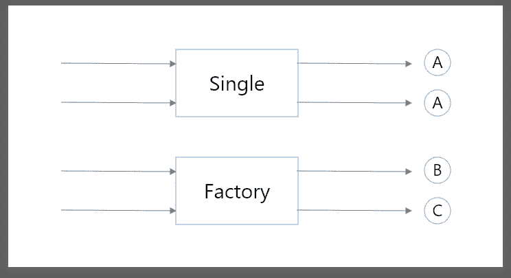

# koin——一个 Kotlin 本地依赖注入库

> 原文：<https://betterprogramming.pub/koin-a-kotlin-native-dependency-injection-library-8e13b81bd48e>

## 如何确定依赖关系的范围


由 [Pakata Goh](https://unsplash.com/@pakata?utm_source=medium&utm_medium=referral) 在 [Unsplash](https://unsplash.com?utm_source=medium&utm_medium=referral) 上拍摄的照片

# 这篇文章的要点

您将学习如何使用 Koin 模块来确定特定组件的依赖范围。您还将了解默认 Koin 范围以及如何使用自定义范围。

# 介绍

正如 Android 团队建议的那样，如果你的应用包含三个或更少的屏幕，你可以不使用 DI。但是三屏以上的，总是推荐用 DI。

在 Android 应用中实现 DI 的一种流行方式是通过 Dagger 框架。但是实现 Dagger 需要很深的学习曲线。最好的替代方案之一是 Koin，它原生于科特林。

如果您使用过 Dagger 或任何 DI 库，您可能知道作用域的重要性。它使我们能够确定我们得到的是同一个依赖对象还是一个新的对象。它还有助于释放不必要的资源和释放内存。

# Koin 中的范围

Koin 中的作用域类似于 Android 中的作用域，比如将视图模型作用于特定的活动，并在该活动中膨胀的片段中使用它。

开箱即用，Koin 有三种范围:

*   `single` : 创建一个在整个容器生命周期内持久的对象(类似于 Singleton)。
*   `factory`:每次创建一个新对象——容器中没有持久性(不能共享)。
*   `scoped`:创建一个持久绑定到相关作用域生存期的对象。



Single 每次都返回相同的实例，而 factory 每次请求都返回新的实例。

# 自定义范围

单个和工厂是 Koin 模块生命周期中 Koin 的默认作用域。然而，在实时用例中，我们的需求并不相同。

通常，我们只需要特定时间范围的依赖关系。例如，在 Android 应用程序中，`OnBoardRepository`仅在用户登机时需要。一旦用户登录，将它保存在内存中是一种资源浪费。

为了在 Koin 中实现这种行为，我们可以使用 scope API。在 Koin 模块中，我们可以创建一个**字符串限定的作用域**，并用唯一限定符声明作用域内部的依赖关系。让我们一步一步来:

## 第一步

首先，创建一个模块，声明一个空的作用域并给它命名。在这种情况下，它是`CustomeScope`，你可以根据你的要求来命名。看一看:

创建自定义 koin 范围

## 第二步

下一步是根据需求使用 single 和 factory 声明必要的依赖关系。这里关键的一点是用唯一的限定符来命名它们。看一看:

自定义范围内的依赖项

## 第三步

我们已经完成了 Koin 模块的设置。在这一步中，我们需要从导入这些依赖项的地方创建范围。通常是在类似`Activity`、`Fragment`等安卓组件里。

要创建一个作用域，首先，我们需要获得 Koin 组件的现有实例，然后通过传递 ScopeID 和作用域名称来调用`createScope`函数。看一看:

```
val stringQualifiedScope = getKoin().createScope(
    "ScopeNameID", named("CustomeScope"))
```

通过给定`CustomeScope`作为名称，Koin 搜索我们在其模块中用这个名称声明的作用域。`ScopeNameID`是一个 ScopeID，我们可以用它来区分不同的范围。它在内部用作查找该范围的键(ID)。

如果您从多个 Android 组件访问或创建范围，建议使用`getOrCreateScope`函数，而不是`createScope`。没有必要解释，因为我们看到他们的名字就知道他们。

## 第四步

最后，在这一步中，我们必须创建一个我们想要使用的依赖项的实例。我们已经使用我们创建的范围完成了它。看一看:

```
val sampleClass = stringQualifiedScope.get<SampleClass>(
        qualifier = named("scopedName"))
```

`scopedName`和`factoryName`是我们在步骤 2 中在 koin 模块中声明的限定符。

## 第五步

为了处理使用`stringQualifiedScope`创建的依赖关系，比如`sampleclass`，我们需要调用`close`函数。例如，如果您想在活动被销毁时处置在此范围下创建的依赖项，我们需要调用`onDestroy`函数中的 close。看一看:

摧毁 koin 示波器

# Koin-Android

上述将依赖关系限制在特定范围的方法是通用的，可以在 Koin 支持的任何平台上使用。但是现在，作为一个 Android，我想把 Koin 作用域和 lifecycle 作用域混合起来，以尽量减少每次创建新活动时我必须做的工作。

为此，您需要导入 Koin-Android 库。在应用程序级 build.gradle 文件的“依赖项”节点下包含以下行:

Koin-Android 模块

现在，我们想要减少样板代码，比如关闭 Android 组件的`onDestry`函数中的作用域。我们可以通过使用`lifecyclescope`链接导入 Koin 依赖项来做到这一点。

首先，我们需要在 Koin 模块中创建 android 组件的依赖范围。看一看:

android 活动的范围依赖性

然后在活动中，我们需要使用一个`lifecyclescope`注入依赖关系。看一看:

```
val sampleClass : SampleClass by **lifecycleScope**.inject()
```

这样做的目的是，当活动被销毁时，它会关闭作用域，而不需要手动操作。看一下代码:

这种方法将自动创建范围、鉴定和销毁它们。这看起来很简单，但是自动化重复工作是至关重要的，一旦应用程序开始增长，你就会意识到这一点。

# 奖金

*   要了解更多关于依赖注入的知识，请阅读:[“Koin-kot Lin 原生依赖注入库”](https://medium.com/android-dev-hacks/koin-kotlin-native-dependency-injection-library-f1daddc1ef99)
*   要了解更多关于 Kotlin 的知识，请阅读 Kotlin 高级编程系列的前几部分:[kot Lin 高级编程—第 2 部分](https://medium.com/android-dev-hacks/advanced-android-programming-with-kotlin-part-2-aae2a15258b0)
*   要了解更多关于 Kotlin 协同程序和 Kotlin 的其他高级特性，请阅读:[“了解如何组合 Kotlin 流](https://medium.com/@sgkantamani/learn-how-to-combine-kotlin-flows-317849a71d3e)”

目前就这些。希望你学到了有用的东西，感谢阅读！