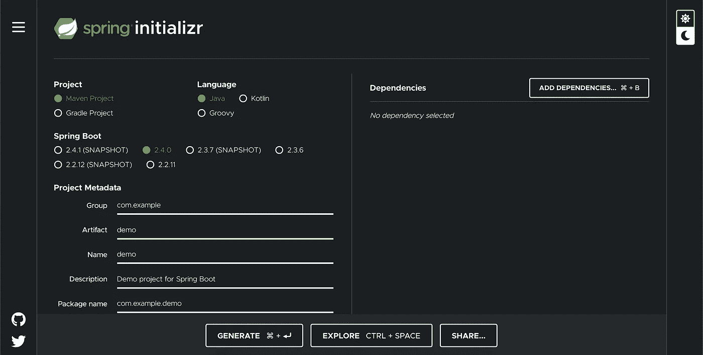
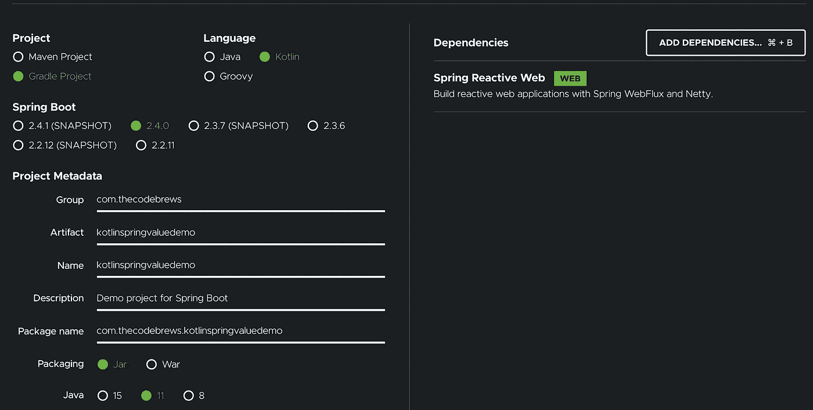
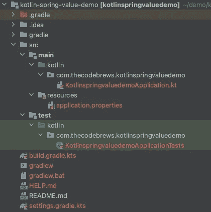
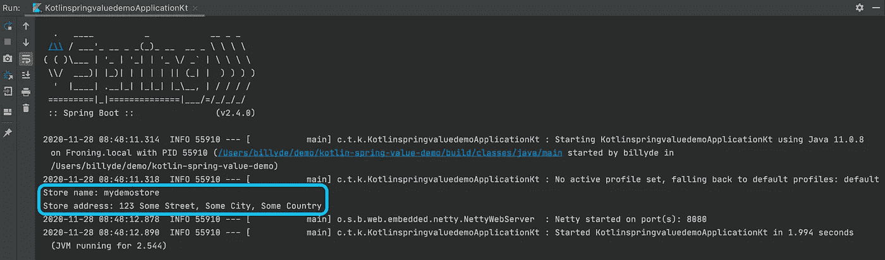
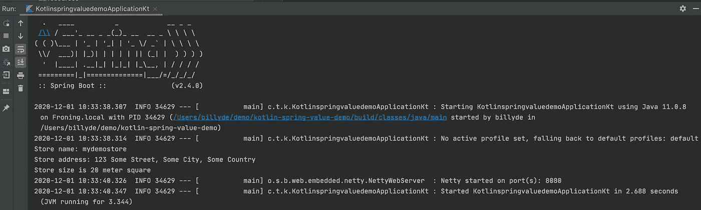
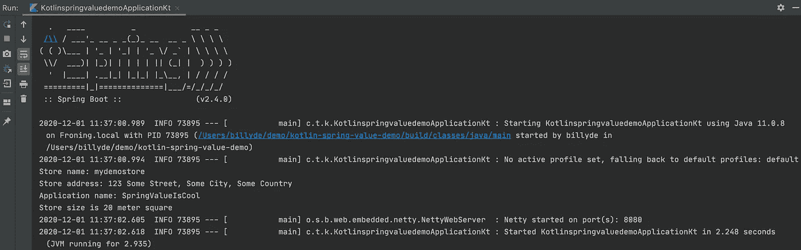
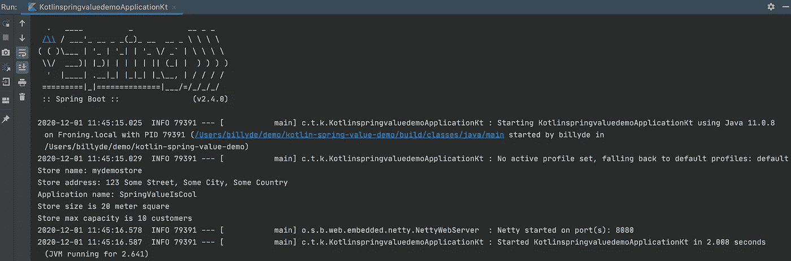

# 使用 Spring 值注释的 Kotlin 和依赖注入

> 原文：<https://betterprogramming.pub/kotlin-and-dependency-injection-using-spring-value-annotation-4e5adf60daf6>

## 看看字段注入和构造函数注入

在 [Unsplash](https://unsplash.com?utm_source=medium&utm_medium=referral) 上由 [Kelly Sikkema](https://unsplash.com/@kellysikkema?utm_source=medium&utm_medium=referral) 拍摄的照片。

Spring 是 Java 世界中非常流行的框架，其流行和高使用率背后的原因之一是其依赖注入机制。

另一方面，Kotlin 是 JetBrains 团队开发的一种 JVM 语言，被认为是 Java 的现代版本，与 Scala 齐名。

将现代语言与坚实、健壮、经过时间考验的 Spring 框架结合使用会有多好？

好在 2017 年 1 月[宣布](https://spring.io/blog/2017/01/04/introducing-kotlin-support-in-spring-framework-5-0)Spring 5.0 版本将提供对 Kotlin 的支持。所以，从 Spring Boot 版本 2.x 开始，科特林将会得到他们一流的支持。这太棒了！

# Spring @Value 注释

本教程将带你了解如何在你的科特林 Spring Boot 应用程序中使用 Spring `@Value`注释。

TL；DR:请看 [GitHub 回购](https://github.com/billydh/kotlin-spring-value-demo)。

## 什么是@值标注？

Spring `@Value`注释允许您将值注入到 Spring 应用程序的字段或组件中——换句话说，就是 Spring 管理的 beans 中。它可以在构造函数、字段或方法参数级别注入值。

## @Value 注释的替代

如果您已经熟悉了`@Value`注释，我建议您查看一下`[@ConfigurationProperties](https://towardsdatascience.com/a-guide-to-use-spring-boots-configurationproperties-annotation-in-kotlin-s-dataclass-1341c63110f4)` [注释](https://towardsdatascience.com/a-guide-to-use-spring-boots-configurationproperties-annotation-in-kotlin-s-dataclass-1341c63110f4)，以获得注入配置值的不同方式。`@ConfigurationProperties`是为结构化对象设计的(如`data class`)。

# 创建一个基本的科特林 Spring Boot 项目

启动科特林 Spring Boot 项目最简单的方法是通过[春季启动](https://start.spring.io/)。我个人喜欢 UI 的简洁设计，只是想强调他们提供了黑暗模式选项。

这是你访问[网站](https://start.spring.io/)时的样子:

弹簧初始化 r

好了，让我们选择将为我们的科特林 Spring Boot 项目创建基础的选项。下面的屏幕截图显示了为了遵循本教程您应该选择的选项(除了组、工件和名称之外，您可以选择您喜欢的任何名称)。

春天的开始——科特林 Spring

完成后，单击生成按钮。这将要求您保存一个包含项目基本框架的`.zip`文件。选择您想要保存它的位置。然后，将其解压缩并在您的 IDE 中打开项目(我个人使用 IntelliJ 用于 Kotlin 项目)。

这是项目框架的样子:

科特林·Spring Boot 骨架

# Spring 应用程序属性

默认情况下，Spring Boot 会自动加载`application.properties`和/或`application.yaml`文件，如[文档](https://docs.spring.io/spring-boot/docs/current/reference/html/spring-boot-features.html#boot-features-external-config-files)所示。使用这些文件中定义的任何属性值的一种方法是通过`@Value`注释。

打开`application.properties`文件，添加以下属性:

应用程序.属性

# 现场注射

一旦你有了以上内容，就去打开`KotlinspringvaluedemoApplication.kt`文件。这个类有启动 Spring 应用程序的`main`函数。我们将向该类添加一些字段和一个方法，如下所示:

kotlinspringvaluedemo application . kt—现场注射

好吧，让我们讨论一下我们在这里做了什么。因此，我们添加了两个字段(`storeName`和`storeAddress`)，它们的值将通过`@Value`注释从`application.properties`注入。

你可以看到我们将`store.name`和`store.address`作为注释的`value`参数。这告诉 Spring 将关键字为`application.properties`文件中的`store.name`和`store.address`的值注入到它们各自的字段中。

如果您是 Java 开发人员，您可能会注意到`$`字符在这里被转义为`\`，并想知道为什么。原因是在 Kotlin 中，`$`是保留字符，用于字符串插值。

最后，我们还添加了一个用`@PostConstruct`标注的方法。这个注释本质上是在依赖注入完成后向 Spring 发送一个信号来执行带注释的方法。本练习中这种方法的目的是证明注射是有效的。

让我们继续运行`main`功能:

运行`main`功能的结果

哒哒！我们可以看到 Spring 注入了值，我们的`getStoreInfo`按照预期打印了它们。

## 弹簧部件现场注射

我们通常不会将值注入到主类中，而是注入到应用程序中的其他类中。本质上，只要该类是 Spring 管理的 bean，我们就可以利用`@Value`注释进行注入。让我们来看一个例子。

继续创建一个名为`StoreConfiguration`的新类。该文件的内容如下:

这里，我们用`@Component`来注释这个类。通过这样做，我们告诉 Spring，当它执行类路径扫描时，这个类将被认为是自动检测的候选者。换句话说，这个类将由 Spring 作为一个 Spring bean 来管理。

类似于我们对 main 类所做的，我们用`@Value`注释字段`size`，这样它的值将从具有键`store.size-in-meter-square`的属性中注入。

让我们运行`main`函数，看看`size`的值是否与`application.properties`中的`store.size-in-meter-square`相对应:

Main 函数打印 StoreConfiguration 大小值

完美。我们可以看到存储值`size`被打印出来，这意味着注入成功了。

还有其他注释可用于此注射模式(如`@Service`、`@Repository`和`@Configuration`)。你应该试一试。

# 构造函数注入

使用`@Value`注释注入值的另一种方法是在类构造函数级别。让我们看看如何从我们的`KotlinspringvaluedemoApplication`类中做到这一点:

kotlinspringvaluedemoaction . kt—构造函数注入

现在，让我们运行我们的 main 方法，看看上面的构造函数注入是否有效:

主函数打印应用程序名称

很好。我们在主类中的构造函数注入成功了！

## Spring 组件构造器注入

就像 Spring 组件的字段注入一样，我们也可以对构造函数注入做同样的事情。让我们来看看如何做到这一点。

我们将在`StoreConfiguration`类的构造函数中添加一个字段:

StoreConfiguration.kt —带有构造函数注入

让我们运行`main`方法来检查构造函数注入是否有效:

主要功能打印商店配置容量

事实上，它确实奏效了。

# 摘要

在本教程中，我们探索了用于值注入的强大的 Spring 注释`@Value`。我们讨论了两种类型的注入:字段注入和构造函数注入。两者都有自己的用例。

我们演练了如何在主类和 Spring 组件上使用`@Value`注释。对于弹簧组件，可以应用各种注释，包括但不限于:`@Component`、`@Service`、`@Repository`和`@Configuration`。本质上，如果一个类被标记为 Spring bean，值注入就可以工作。

供您参考，这个 [GitHub repo](https://github.com/billydh/kotlin-spring-value-demo) 包含了本教程中使用的代码。请随意将其克隆或分支到您的 GitHub。

下一步，您可以探索另一个强大的 Spring 注释，称为`@ConfigurationProperties`，它通常用于将值注入到结构化对象中(例如`data class`)。你可以遵循我不久前写的这个教程。

# 参考

*   [科特林弹簧支架](https://docs.spring.io/spring-framework/docs/5.0.0.RELEASE/spring-framework-reference/kotlin.html)
*   [Spring Boot 外在化配置](https://docs.spring.io/spring-boot/docs/current/reference/html/spring-boot-features.html#boot-features-external-config)