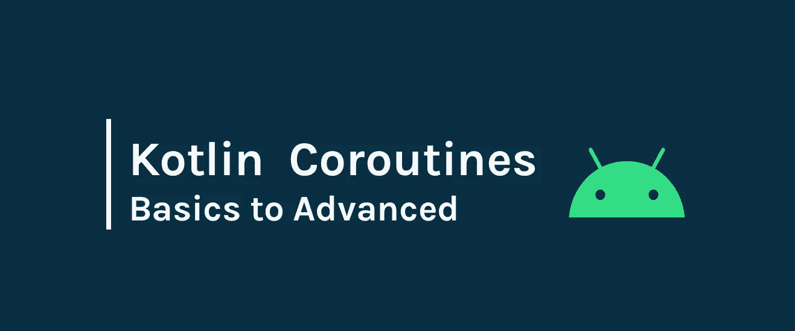
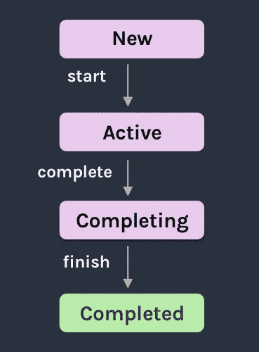
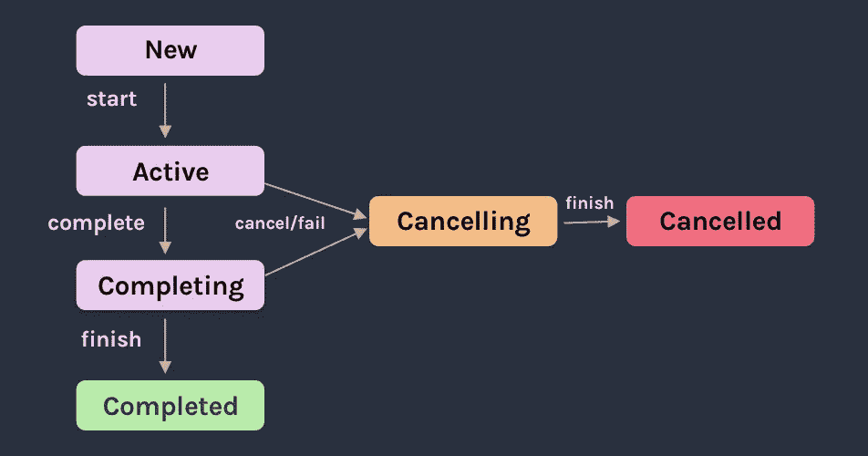

# 科特林协程，从基础到高级

> 原文：<https://betterprogramming.pub/kotlin-coroutines-from-basics-to-advanced-ad3eb1421006>

## 是时候了:协程在这里



图片来源:Siva Ganesh Kantamani

# 1.为什么我们需要协程？

假设您必须从服务器的列表中获取一批客户。您必须进行服务调用来获取数据并在`RecyclerView`中显示它们。

假设您有一个从服务器获取数据的函数`fetchCustomers()` ，如下所示。

```
fun fetchCustomers(){
     val array = **api.fetchCustomersList**()
     updateUI(array)
}
```

如果你这样做，当你在主线程上操作时，你的应用程序将会崩溃。您可能会找到一种替代方法，通过在线程中包装来调用它。下一个问题是生命周期管理。所以您将切换到带有订阅和取消的回调来解决这个问题。很快你就会像下面这样结束。

```
fun onDestroy(){
    **subscription1**.cancel()
    **subscription2**.cancel()
    **subscription3**.cancel()
    **subscription4**.cancel()
}
```

协程将帮助你逃离这个回调的地狱。您可能会在 RxJava 中使用一次性工具来解决这个问题，但是这可能会使事情变得复杂。RxJava 既有用又让人头疼。

那么解决办法是什么呢？接下来是协程，简单而全面。

# 2.协程的基础

协程不过是轻量级线程，我们可以在其上根据您选择的上下文执行与后台或 UI 更改相关的任务。

让我们用一个 Kotlin 协程来写上面的`fetchCustomers()`。

```
**suspend** fun fetchCustomers(){
     val array = **api.fetchCustomersList**()
     updateUI(array)
}
```

为了展示这个函数在协程上运行，我们使用了一个`suspend`修饰符。它的工作方式类似于回调方式，但是在没有订阅的情况下使用较少的代码。就这样，它很容易实现，也很容易使用。你不需要学习任何新的执行风格。协同程序以顺序的方式提供`async` 执行。

它的作用是，当你开始执行一个协程时，它暂停执行，当它得到响应时，它从暂停的地方继续执行。这就是`suspend`和`resume`如何取代回调。

协程的美妙之处在于它在许多高级库中都得到了很好的确立，比如[翻新](https://github.com/square/retrofit)、[房间](https://developer.android.com/training/data-storage/room/index.html)等等。现在，您可以在您的 Android 项目中使用协程，并通过使用 retreate 2.6 及更高版本来简化所有网络调用，如上所示。

回归基础。我们只能从另一个`suspend`函数中调用一个`suspend`函数。这是否意味着您需要将项目中的每个函数都写成一个`suspend`函数？不，没必要。

我们可以使用`withContext` 生成器启动一个新的协程，并使用常规函数中的`Dispatchers`指定协程应该在哪个线程上执行，如下所示

## 调度员

`Dispatchers`只不过是一串关键字，用来告诉协程应该在哪个线程上运行。Kotlin 提供了三种类型的调度程序:

**默认:**任何在主线程上运行时间过长的东西都应该在默认的调度程序上运行，比如执行`DiffUtil`。

**IO:** 像写文件或进行 API 调用这样的任务应该发生在 IO dispatcher 上，它阻塞了 UI。

**Main:** 这是主线程，Android 中的所有任务通常都在这里执行。默认情况下，您可以在这个线程上启动，并在任何需要的地方更改调度程序。

使用`withContext`是一个主要的安全调用。现在你可以使用`withContext`在 Android 的任何地方编写`async` work，通过使用`Dispatchers`，你可以控制它应该在哪个线程上运行。

# 3.术语

当然，当我们开始学习一项新技术时，我们应该了解一些术语:协程没有什么不同。这里有一些术语，我认为每个开始使用协程的人都应该知道。

`**CoroutineScope**` **:** 定义新协程的范围

`**Job**` **:** 可以父子层次结构安排的后台作业。任何父作业的取消都会导致其所有子作业立即被取消，除`CancellationException` 之外的任何子作业的失败或取消都会导致其父作业*被取消。*

`**SupervisorJob**` : 管理程序作业只是一个作业，但是它的子作业可以独立失败，而不需要关闭它的父作业。

`**Suspend**` : `Suspend`是一个修饰符，用在函数上，表示这是一个协程函数。

`**Launch**` : `Launch`是`CoroutineScope`中的一个方法，它在不阻塞当前线程的情况下启动一个协程，并返回一个对协程的引用作为`Job`(可以取消 T5 来停止那个协程的执行)。

`**Async**` : `Async`是`CoroutineScope`中的一个方法，它启动一个协程并返回其未来结果作为`[Deferred]`的实现。

# 4.用协程简化复杂的任务

因为协程实现起来更简单，也更容易理解，所以许多高级库，如 Retrofit，Room， [WorkManager](https://developer.android.com/topic/libraries/architecture/workmanager) 已经在支持它们了。

## 加装

retrieval 是一个著名的使用`OkHttp`客户端进行网络调用的库。让我们看看如何使用 coroutines 的翻新，并比较我们可以减少的工作，如果我们实现它与其他库，如 RxJava。

您所需要做的就是将您的回购服务函数更改为`suspend`并从`withContext`调用它们。

首先，将您的改装`annotate`服务呼叫功能更改为`suspend`功能，如下所示。

现在从`ViewModel`调用它，从服务器获取数据。这里我们可以使用两种模式。一种是将`ViewModel`中的函数标记为`suspend` **、**，另一种是使用`withContext`启动协程，如上所示。

我将用`withContext` 来解释，因为用`suspend` 来标记一个函数是最简单的，但是在某些地方我们必须使用`withContext` 来从一个普通函数开始一个协程。

这就是在 Android 中使用协程进行服务调用是多么简单。现在让我们将相同的服务与 RxJava 进行比较，看看我们在协程方面取得了多大的进步。

您使用 RxJava 编写的行数更多，但这还不是全部。要实现 RxJava 你得知道更多，比如`observeOn`和`SubscribeOn`是什么。你还必须了解`disposables`:它们为什么被使用，当我们忘记处理时会发生什么，以及一百多种其他事情。

但是使用协程，你只需要知道`Dispatchers`和`scope`是什么。剩下的事情会处理好的。

## 房间

Room 是一个 Jetpack 库，能够在没有样板代码的情况下执行 SQLite 复杂操作。它充当 SQLite 的抽象层，节省了编写所有样板代码的时间。

让我们看看如何通过协同例程使使用 Room 和 RxJava 的 SQL 查询更加简单。

与使用改型类似，您需要将您的`Dao` 函数标记为`suspend`函数，并通过使用`suspend`函数或启动协程作用域在`viewModel`中使用它们。

现在让我们从`viewModel`中调用它

这就是你需要做的。现在你的应用程序有了网络和本地数据库的协程支持。

## 工作管理器

您也可以在 WorkManager 中使用协程。

# 5.取消政策

取消协程非常重要，因为取消会因为不必要的套接字连接或昂贵的操作(如读取文件)而耗尽用户资源。

在学习如何取消一个协程之前，重要的是要知道一个协程将如何执行，以及如果我们取消一个请求，它将经历哪些阶段。

首先，让我们看看协程的生命周期。



一般来说，一个协程将从一个活动的状态开始，而新的状态只有在你开始一个协程懒惰的状态，然后在你启动或加入协程时转移到活动的状态时才会出现。一旦一个协程开始执行，它将处于完成状态。

现在，你说的完成状态是什么意思？在上面的例子中，我已经向您展示了下面的代码来创建一个协程作用域，我们在其中进行网络和数据库操作。

```
val viewModelJob = **SupervisorJob**()                       
val viewmodelCoroutineScope = **CoroutineScope**(Dispatchers.IO + viewModelJob)
```

每次你调用`viewmodelCoroutineScope`上的`launch`函数，它都会返回一个任务。这就像父作业和子作业一样:这里的`viewModelJob`是父作业，调用`launch`时创建的作业是子作业。

在所有子进程完成之前，协程将处于完成状态。一旦协程中的所有作业都完成了，它将进入一个完成的状态。

这里我们有三个标志来验证协程的状态:

*   `**isActive**` —在协程的活动和完成状态下都成立。
*   `**isCompleted**` —这是默认的`false`。一旦所有父作业和子作业完成，该值变为`true`。
*   `**isCancelled**` —这是默认的`false`。如果出现任何异常或您取消了协程，该值将更改为`true`。

到目前为止，您已经看到了成功执行的协程的生命周期，没有任何异常或取消。是时候看看如果一个协程被取消会经历什么阶段了，不管是因为异常还是因为你故意取消了它。

只有当协程进入活动或完成状态时，才能取消协程。当这种情况发生时，协程将进入取消状态，一旦所有的作业被取消，它将进入取消状态。看一看。



# 6.协程的有效使用

当用户导航离开一个地方时，会有一些作业需要取消。继续那些不必要的任务只会耗尽用户的资源，例如带宽、电池、CPU 使用率。

让我们看看如何在不必要的时候取消一个任务或一系列任务。

正如我在上面几节中已经说过的，当您在协程作用域上调用`launch`时，将会返回一个作业，如果我们想要结束那个特定的任务，我们可以在那个作业上调用 cancel。

我们知道如何取消特定的任务。是时候了解一下`Job`和`SupervisorJob` **的区别了。**

作业和主管作业之间的唯一区别是，当在主管作业下取消子作业时，父作业或其他子作业不会受到影响。另一方面，当一个孩子在`Job`下被取消时，父孩子和所有的孩子都将被取消。

```
val scope = CoroutineScope(parentJob)
val job1 = scope.launch{ ... }
val job2 = scope.launch{ ... }
```

我们可以在不需要的时候单独取消任务。如果`parentJob`是主管作业，那么只有特定的`Job`会被取消。否则，所有作业都将被取消。

通过上面的示例，我们学习了如何取消特定的作业。如果我不想取消某个特定的工作怎么办？或者我不想跟踪所有的作业，而只是在需要时取消所有的作业？您可以在协程作用域上调用`cancel`函数，以便取消该作用域下的所有子作用域。

```
scope.cancel()
or
scope.coroutineContext.cancelChildren()
```

# 7.错误和异常处理

我们在上述章节中留下的一件事是错误和异常处理。这是网络和数据库事务期间的基本任务之一。与 RxJava 不同，Kotlin 协程有一种非常干净的方式来处理它们。

## 合作取消

检查作业中的`isActive`或`ensureActive` 以确保当前作业不会因异常或故意取消。

```
viewmodelCoroutineScope.launch **{
     ensureActive()
         or
     if(isActive){ ... }
}**
```

如果作业被取消，那么它不会通过这些条件。

如果你不习惯在每个作业**、**中使用`isActive`，那么你可以用`try` / `catch`将代码括起来，在最后一个块中，你可以做任何你需要做的工作，比如当一个协程被取消时进行清理。

## 取消的协同作用域

如果一个`CoroutineScope`用`Job`创建，并且它的一个子作业被取消，那么它的所有子作业也被取消，包括父作业。与此同时，`CoroutineScope`也将被取消，这意味着您不能用那个作用域启动一个新的协程。

为了克服这一点，我们可以使用`SupervisorJob`创建一个`CoroutineScope`，它不会在取消任何子作业时影响父作业或范围。

## 用协程程序尝试/捕捉

与 RxJava 不同，我们可以通过用`try` / `catch`块包围代码来处理错误和异常。不需要像在 RxJava 中那样分别实现错误块和成功块。

## 奔跑捕捉

除了传统的`try` / `catch`，Kotlin 还提供了`runCatching` **，**，它返回一个结果，该结果包含输出信息以及执行状态，就像`isSucess`一样。如果是失败的情况，在结果`exceptionOrNull`中有一个属性，通过这个属性我们可以获得关于异常的详细信息。在我看来，它更灵活，提供了更干净的接口来处理异常和错误。看一看。

```
viewmodelCoroutineScope.launch **{** val result = kotlin.**runCatching {** repository.getData(inputs)
    **}
}**
```

# 8.有用的链接

如果您想了解更多关于 Kotlin 高级开发的内容，请阅读以下文章:

[](https://medium.com/better-programming/advanced-android-programming-with-kotlin-5e40b1be22bb) [## 使用 Kotlin 进行高级 Android 编程

### kot Lin-您应该使用的独有功能

medium.com](https://medium.com/better-programming/advanced-android-programming-with-kotlin-5e40b1be22bb) [](https://medium.com/@sgkantamani/advanced-android-programming-with-kotlin-part-2-aae2a15258b0) [## 使用 Kotlin 进行高级 Android 编程-第 2 部分

### kot Lin-您应该使用的独有功能

medium.com](https://medium.com/@sgkantamani/advanced-android-programming-with-kotlin-part-2-aae2a15258b0) 

感谢您阅读我的文章。