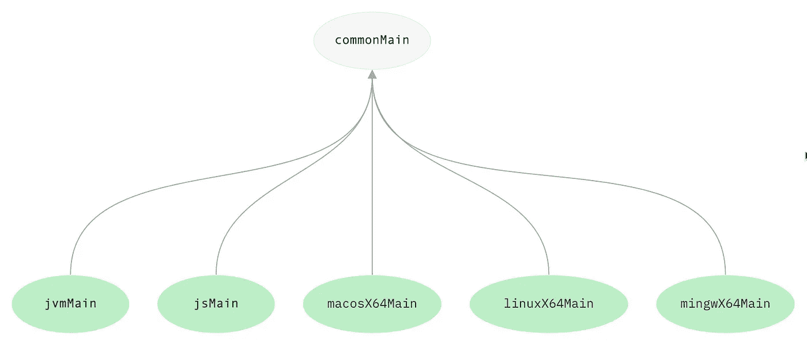
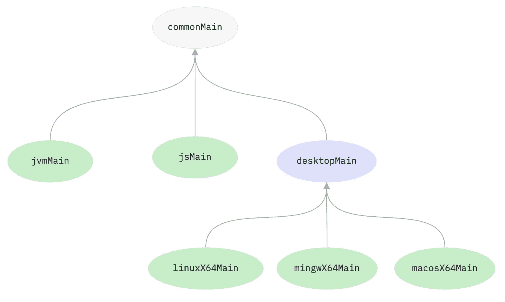
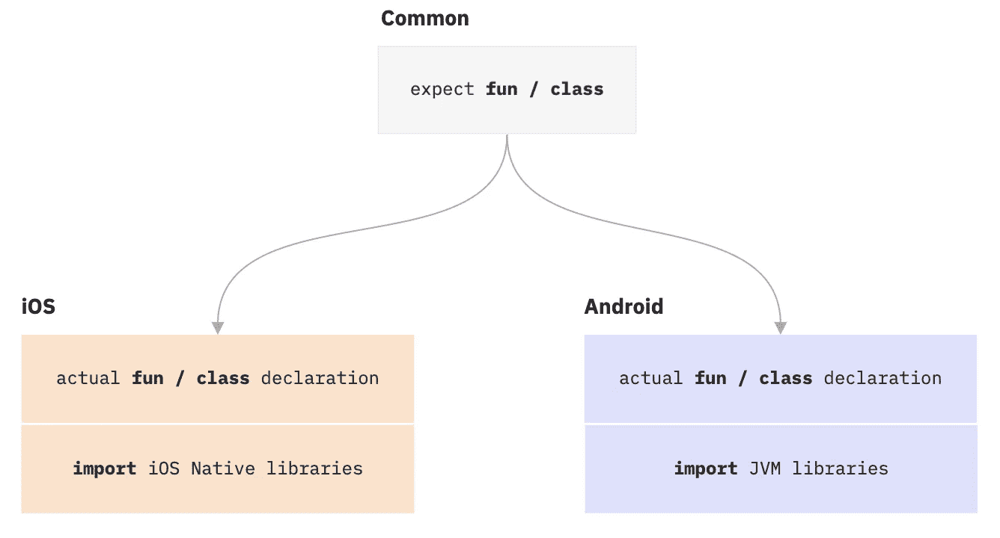

# Kotlin 多平台:游戏规则的改变者？

> 原文：<https://betterprogramming.pub/kotlin-multiplatform-a-game-changer-on-the-horizon-4cae10bb62a2>

## 一种编程语言来管理它们

## 对抗颤振的比赛已经开始

斯特凡诺·法拉帝在 [Unsplash](https://unsplash.com?utm_source=medium&utm_medium=referral) 上的照片

Kotlin Multiplatform 是 JetBrains 开发的相对较新的 SDK，旨在革新编程世界。

有了 Kotlin 多平台，今天有可能为后端、web、iOS 和 Android 共享一个代码库。甚至支持 watchOS 和桌面应用。基本思想是重用代码和开发资源，为不同平台编写代码。

想象一下，只雇佣 Kotlin 开发人员来满足项目中的任何编程需求。或者想象一下，一个开发人员只需要学习一种编程语言就可以成为一名全栈开发人员。

听起来好得难以置信？如果这已经是今天的现实了呢？

# 灵活性是关键

让我们先来看看 Kotlin 多平台 SDK 的兼容目标平台的令人印象深刻的列表。

想象一下，只需更改一行代码，就能为所有这些平台提供更新。这种方式可以节省的时间和金钱值得我们深入了解当前支持的平台:

*   JVM (Java 虚拟机):将 Kotlin 编译成 Java 字节码。这是默认目标，例如，用于后端编程。像 Spring Boot 和 Ktor 这样流行的服务器框架可以无缝地在 Kotlin 中使用。
*   JavaScript:允许将 Kotlin 代码编译成面向 NodeJS 或在浏览器中运行的 JavaScript 代码。Kotlin 使用的浏览器默认框架是 React。
*   android:代码将被编译成 Android 平台的 Java 字节码。写 app 和库都支持。
*   Android NDK:允许的架构是 ARM32/64 和 X86/64。
*   iOS:编译成支持 ARM32 (iPhone 5 及更早版本)、ARM64 (iPhone 5S 及更新版本)以及 iOS 模拟器(X64 和 ARM64)的原生 iOS 代码。
*   watchOS:这里和 iOS 一样。代码被编译成 ARM32 (Apple Watch Series 3 和更早版本)、ARM64 (Apple Watch Series 4 和更新版本)的本机代码，当然还有 32 位和 64 位版本的 watchOS，包括 watchOS 模拟器。
*   tvOS:kot Lin 代码被编译成针对 ARM64 (Apple TV 第 4 代及更新版本)的原生 tvOS 应用程序代码。
*   OSX:支持 ARM64 和 X64 架构。
*   Linux:基于 Linux 的系统的目标架构包括 ARM64(例如 Raspberry Pi)、ARM32、MIPS、little-endian MIPS (mipsel)和 X64。
*   Windows: Kotlin 多平台支持 64 位和 32 位 Windows 桌面应用程序。
*   WebAssembly:对 WebAssembly 的早期支持使 Kotlin 走在了许多其他交叉编译 SDK 和框架的前面。Kotlin 多平台目前支持 32 位内存模型的 WebAssembly。

这个庞大的平台目录使 Kotlin Multiplatform 成为潜在的游戏改变者，不仅对于未来的开发项目，而且对于需要转移到更现代的编码设置中的遗留项目。

# 神奇之处在于可重用性

尽管 Kotlin 多平台的目标目录令人印象深刻，但真正的挑战在于使这个目录易于开发人员访问。

当您的目标是一个以上的平台时，以实现最大的可重用性的方式组织项目代码并为开发人员维护一个概览可能会变得具有挑战性。科特林团队用一种简单的方法来解决这个问题。

Kotlin 多平台项目遵循整体原则，将所有内容放在一个地方。最终的单存储库项目包含每个目标平台的子模块和一个共享的“超级模块”,该模块包含所有可以在所有其他模块中重用的 Kotlin 代码。

科特林多平台示例架构——作者[Kotlinlang.org](https://kotlinlang.org/docs/multiplatform-share-on-platforms.html#share-code-on-similar-platforms)

例如，dto、公共接口或服务等公共代码可以放入`commonMain`模块，然后由后端和 iOS 应用程序代码重用。

子模块可以再次充当父模块。如果您计划共享类，例如，只共享桌面应用程序的类，而不共享 Java 或 web 模块的类，这将非常有用。

子模块充当父模块的科特林多平台示例架构——作者[Kotlinlang.org](https://kotlinlang.org/docs/multiplatform-share-on-platforms.html#share-code-on-similar-platforms)

Kotlin 多平台 SDK 中一个特别强大的特性是`expect`和`actual`关键字。这两个关键字允许程序员在一个模块中定义一个预期的函数或类，然后在另一个模块中编写该函数或类的实际实现。

预期的和实际的函数和类如何在模块边界上协同工作——作者[Kotlinlang.org](https://kotlinlang.org/docs/multiplatform-connect-to-apis.html)

这对于在 Android 和 iOS 中编写您希望从通用应用程序代码中调用的原生函数非常有用。预期功能的实际实现将能够访问本地库和本地 OS 功能。

可能性几乎是无穷无尽的。

# 科特林能打败颤振吗？

一个已经在互联网上被问了很多的问题是，Kotlin 是否能够在标准多平台框架/SDK 的竞赛中战胜其当前最大的对手 Flutter。

如果您打算从头开始创建一个新项目，那么尝试 Kotlin 多平台可能是最好的方法，也可以看看什么最适合您的需求。创建一个原型，看看什么更适合你的项目。

当然，这也是你拥有的发展资源和在就业市场上有什么技能的问题。

由于这两种技术本质上是不同的，Flutter 是一个框架，Kotlin 是一个 SDK，只有时间才能告诉我们哪种技术将赢得这场比赛。关于这两种技术的一个有趣的事实是，在撰写本文时，它们都得到 Google 的支持。

> 为什么今天不试试 Kotlin 多平台呢？

# 来源和延伸阅读

*   科特林:[https://kotlinlang.org](https://kotlinlang.org/)
*   科特林多平台:【https://kotlinlang.org/docs/multiplatform.html】T2
*   Kotlin 目标平台:[https://kot linlang . org/docs/multi platform-DSL-reference . html # targets](https://kotlinlang.org/docs/multiplatform-dsl-reference.html#targets)
*   flutter:[https://flutter . dev](https://flutter.dev/)
*   https://spring.io/projects/spring-boot Spring Boot
*   ktor:[https://ktor.io/](https://ktor.io/)
*   Kotlin 多平台项目的一个很好的例子，后端使用 Spring Boot，前端使用 React:[https://github.com/OlegDokuka/collaborative-todo-list](https://github.com/OlegDokuka/collaborative-todo-list)
*   Kotlin 多平台网站还提供了如何与现有团队一起解决这项新技术的指南:[https://kot linlang . org/docs/multi platform-mobile-introduce-your-team . html # prepare-for-questions](https://kotlinlang.org/docs/multiplatform-mobile-introduce-your-team.html#prepare-for-questions)
*   [https://insta bug . com/blog/flutter-vs-kot Lin-mutliplatform-guide/](https://instabug.com/blog/flutter-vs-kotlin-mutliplatform-guide/)