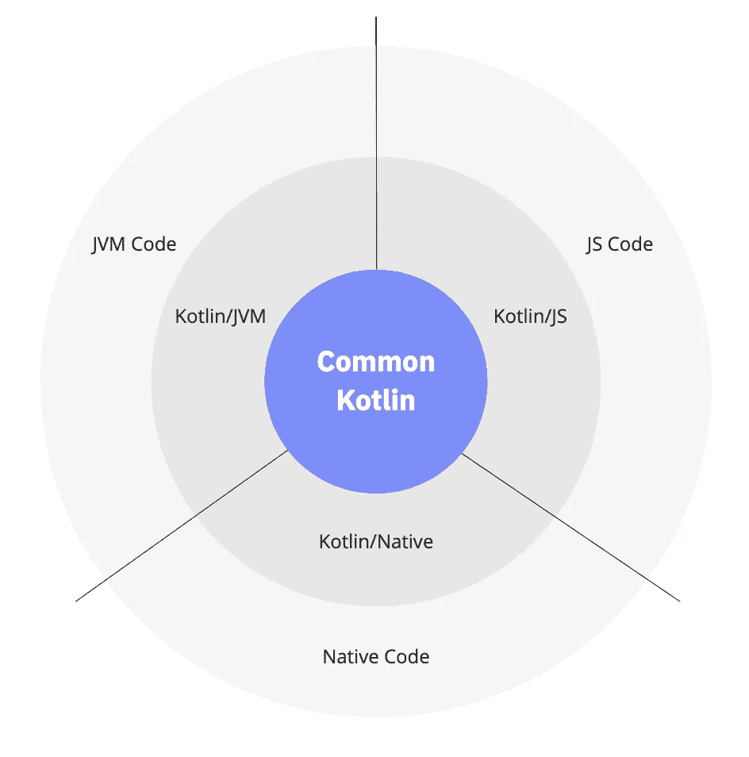
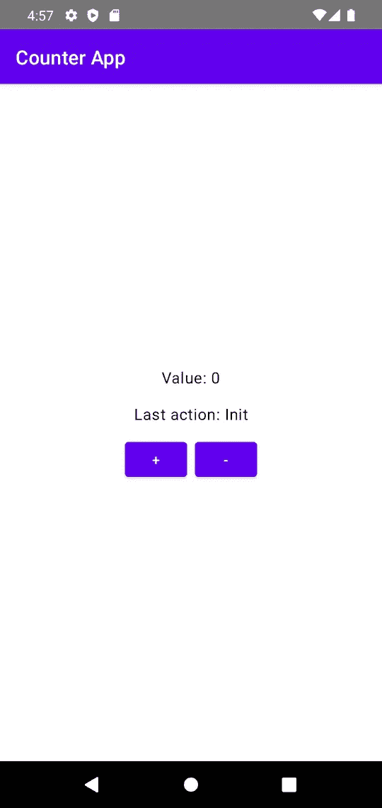
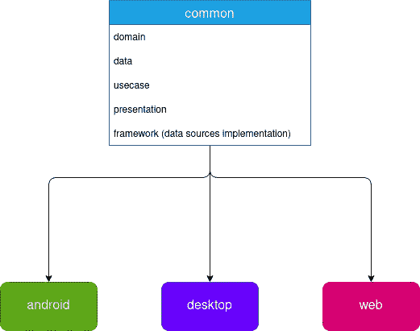
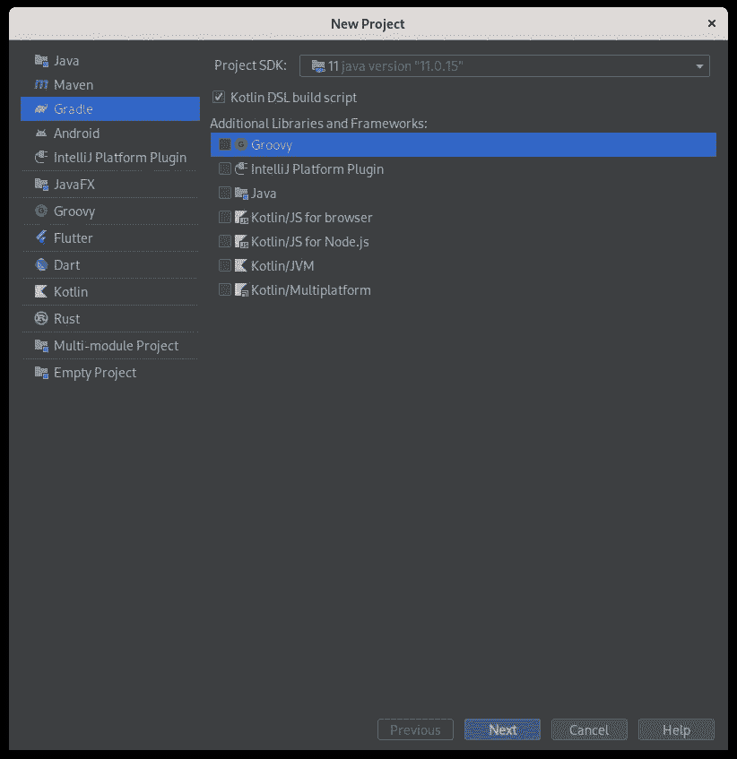
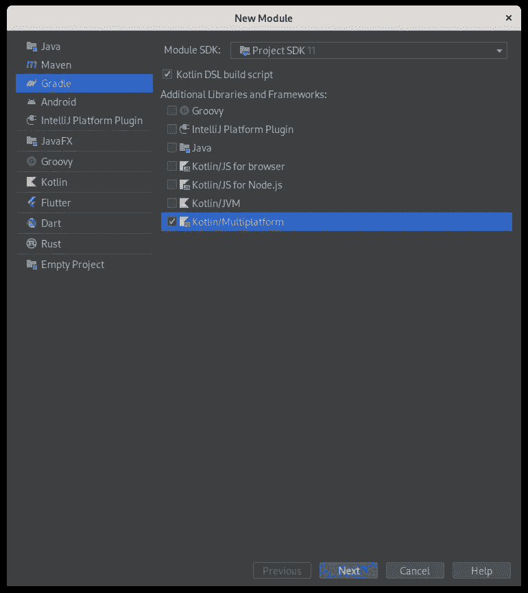
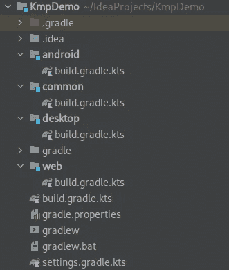
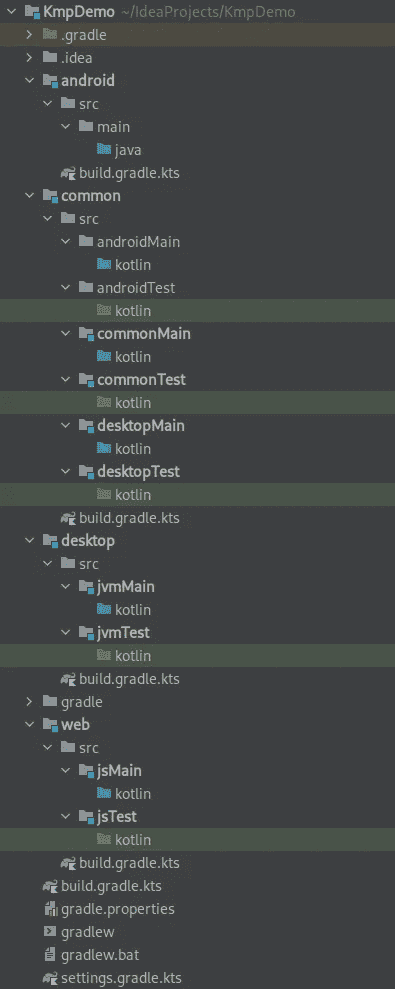
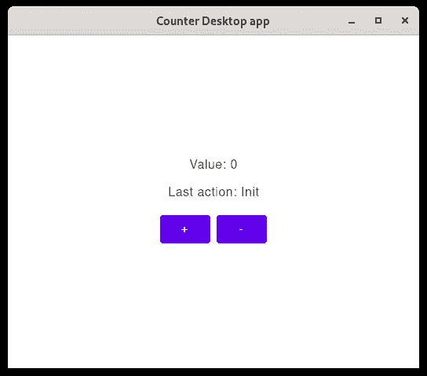
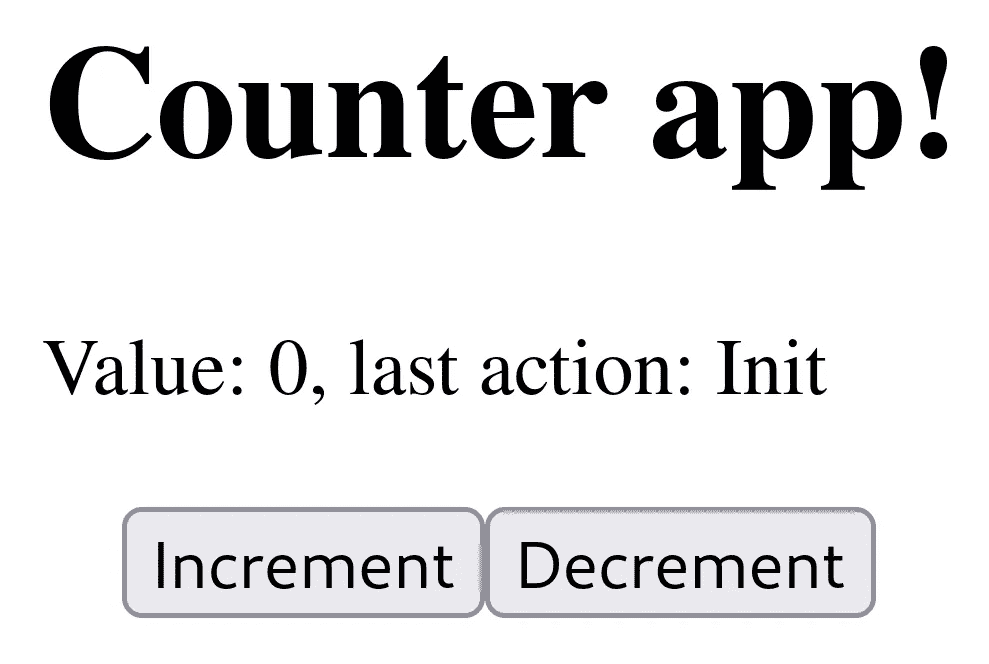

# Kotlin 多平台——如何用 Kotlin 在一个代码库中创建一个适用于 Android、桌面和 Web 的应用程序

> 原文：<https://betterprogramming.pub/kotlin-multiplatform-how-to-create-an-app-for-android-desktop-and-web-with-kotlin-in-one-10bbb565f477>

## JetBrains 的 Compose Multiplatform 去年达到了测试版，使他们提供跨平台 UI 框架的雄心更近了一步



科特林多平台总体原则(来源:[kotlinlang.org](https://kotlinlang.org/docs/multiplatform.html#how-kotlin-multiplatform-works)

如果你还不知道什么是 Compose Multiplatform，这里有一个直接从 [JetBrains 网站](https://www.jetbrains.com/lp/compose-mpp/)复制的 TLDR:

> Kotlin 的快速反应桌面和 Web UI 框架，基于谷歌的[现代工具包](https://developer.android.com/jetpack/compose)，由 JetBrains 带给你。

当与 Jetpack Compose 结合使用时，这意味着我们现在可以只使用 Kotlin 来制作针对移动、桌面和 web 的应用程序。

你是说像扑扑一样，但是和科特林在一起？

除了 Dart 和 Kotlin 的事情之外，Kotlin 多平台(KMP)和 Flutter 之间有相当显著的区别。我发现最有趣的是他们如何处理跨平台架构。

在 Flutter 中，你编写你的业务逻辑，你的 UI，它可以在任何地方运行。您仍然可以编写一些调整逻辑来调整 UI 以适应平台，但最终，无论您将其构建到移动、桌面还是 web 应用程序中，您的应用程序都是通过 Flutter 引擎(基于 Skia 图形库构建)呈现的。这对于可移植性来说很好，但是不容易提供原生 UI 体验。

在 KMP，您只需编写一次业务逻辑并将其放入共享库中，然后使用针对每个目标平台的本地库编写您的 UI，例如针对 Android 的 Jetpack Compose、针对 iOS 的 Swift、针对桌面的 Compose Multiplatform 等。因此，你的应用程序最终会有一种更自然的感觉——以用户界面的平台适应性为代价。

底线是这两种方法提供了不同的方法，您选择哪一种取决于您的用例。

实际上，KMP 听起来很棒，帮我报名吧！

嗯，在花了相当多的时间进行试验后，我理解并分享你的热情！但是让我们暂时把理论放在一边，把注意力放在“如何”上

# 我们的演示应用

嗯，我们需要决定开发什么，这样我就可以向您展示所有的操作了。让我们从 Flutter“Hello World”应用程序中获得灵感，制作一个计数器应用程序，允许用户增加和减少一个数值，并记录最近注册的动作。



看起来够简单！

那么我们现在用什么架构呢？

## 体系结构

我们将使用模型-视图-视图模型(MVVM)的干净架构，这是构建 GUI 应用程序(尤其是在 Android 上)的常见解决方案。对于本教程的其余部分，我将假设您对此很熟悉。如果你不是，你可以离开这一页和[阅读这个](https://www.raywenderlich.com/3595916-clean-architecture-tutorial-for-android-getting-started)之前。是的，我允许你这么做！:)

好吧，那我们开始吧。这是我们构建应用的方式:

*   域:这将包含我们的应用程序的模型，在本例中只是我们的计数器的一个数据类(值和最后的动作消息)
*   数据:存储该计数器的抽象数据源
*   用例:我们的应用程序的所有用例类，即:递增计数器，递减它并获取它的值
*   演示:该计数器视图的视图模型
*   框架:数据源实现以及每个平台的 UI

上面的每个元素都可以跨所有平台共享，除了 UI，它是“框架”的一部分。



我们不同的模块

# 让我们编码这个

好吧，我们现在开始研究代码。我正在使用 IntelliJ IDEA 社区，所以请记住这一点。但是我相信你，因为你会在我们进行的过程中根据你最喜欢的 IDE 对它进行调整。

我们应该从创建一个新项目开始，项目结构如上所述，然后一个接一个地创建每个类，直到我们覆盖所有平台。IDEA 为我们可以使用的 KMP 应用程序提供了预制模板，但出于学习目的，让我们从头开始做吧。

打开 IDEA，然后导航到“文件”>“新建项目”选择“Gradle”，然后在右边的面板上，除了“Kotlin DSL build script”之外，将所有内容留空。在这之后，我们用 Kotlin DSL 代替 Gradle 作为构建脚本。



创建一个新项目，我将我的命名为“KmpDemo”。

然后命名项目并创建它。

## 模块

第一步是创建不同的模块:`common`、`android`、`desktop`和`web`。我们从`common`开始，因为所有其他模块都将依赖于它。

右键单击项目根目录，然后单击“新建>模块…”。你会看到一个熟悉的对话框。这一次，除了其他选项之外，请确保选中“kot Lin/多平台”。



通用的新模块

确保将其命名为“common”创建后，您将收到一个构建同步错误:

> 请在“common (:common)”中至少初始化一个 Kotlin 目标。

暂时忽略它；我们稍后会修理它。

使用相同的方法，创建`desktop`、`android`和`web`模块。

在根目录下创建一个新文件，命名为`gradle.properties`，内容如下:

```
kotlin.code.style=official
android.useAndroidX=true
kotlin.mpp.enableGranularSourceSetsMetadata=true
kotlin.native.enableDependencyPropagation=false
android.enableJetifier=true
```

项目结构现在应该如下所示:



我们的顶级模块

我们还有一些工作要做，以最终确定项目结构；我们应该创建源集。

## 源集

一个 KMP 项目通常根据其目标性质将其源文件组织在不同的集合中:common、JVM 和 JS。我们将遵循官方文件中详述的推荐结构[。](https://kotlinlang.org/docs/multiplatform-discover-project.html#source-sets)

在`common`下创建以下目录:

*   `src/androidMain/kotlin`
*   `src/androidTest/kotlin`
*   `src/commonMain/kotlin`
*   `src/commonTest/kotlin`
*   `src/desktopMain/kotlin`
*   `src/desktopTest/kotlin`

在`desktop`下:

*   `src/jvmMain/kotlin`
*   `src/jvmTest/kotlin`

在`web`下:

*   `src/jsMain/kotlin`
*   `src/jsTest/kotlin`

在`android`下:

*   `src/main/java`

*等等，我以为通用模块将是独立于平台的？为什么我们有这些* `*desktopMain*` *和* `*androidMain*` *的东西在那里？*

好问题！

让我们考虑这个(虚构的)用例:您正在开发一个多平台应用程序，但是您还需要访问一些特定于平台的 API。这可能是检索某个操作系统版本，连接到某个日志系统，或者生成一个随机 UUID。

通常，您会利用[依赖倒置](https://en.wikipedia.org/wiki/Dependency_inversion_principle)在公共模块中创建一个接口，并在特定于平台的模块中创建它的实现。然而，当功能非常简单时，例如生成 UUID，这会导致一些样板代码。

KMP 允许一种更简单的方法来实现这一点，使用[](https://kotlinlang.org/docs/multiplatform-connect-to-apis.html)**机制和上面的结构。因此，您可以执行如下操作:**

```
**// Under Common
expect fun randomUUID(): String// Under Android
import java.util.*

actual fun randomUUID() = UUID.randomUUID().toString()// And so on for all other platforms**
```

**这不会用于我们的计数器应用程序，但我们最好为未来做好准备。:)**

**回到我们的应用程序，您现在应该有以下结构:**

****

**别担心，漂亮的颜色很快就会出现**

**是时候实现构建脚本了！**

## **构建脚本**

**每个模块加上根包含一个名为`build.gradle.kts`的构建脚本，有时包含名为`settings.gradle.kts`的设置。这些文件定义了我们的项目是如何构建的:模块、依赖项、框架等等。**

**在`settings.gradle.kts`里，写着:**

**这简单地定义了哪些存储库将用于获取外部依赖项以及项目模块。**

**在`build.gradle.kts`中，写下:**

**更多的是相同的，但是这次我们对构建脚本和所有模块都这样做。**

**在`common/build.gradle.kts`里，写着:**

**这里有很多东西。让我们打开这个。**

**首先，指定模块的`plugins`定义是一个 Compose 模块和一个 Android 库。然后，我们用一些选项指定 JS 和 JVM 目标。这是允许其他模块导入公共数据所必需的。这些选项是默认选项。**

**然后我们定义源集，即 Kotlin 源文件的位置，以及它们的类型和依赖关系。注意`commonMain`依赖于`kotlinx-coroutines-core`和`kodein-di-framework-compose`。最后，如果你以前使用过 Android，我们以一种熟悉的方式定义 Android 目标选项。**

**如您所见，我们为 Android 定义了一个清单，所以让我们将它添加到`common/src/androidMain/AndroidManifest.xml`中提到的路径:**

```
**<?xml version="1.0" encoding="utf-8"?>
<manifest xmlns:android="http://schemas.android.com/apk/res/android" package="org.example.kmpdemo"/>**
```

**现在，让我们来关注一下`desktop/build.gradle.kts`:**

**更多的是相同的，但是注意我们明确定义了对`common`的依赖。**

**网络时间！写入`web/build.gradle.kts`:**

**更多的相同，但再次注意，我们明确定义了对 common 的依赖。**

**现在是`android/build.gradle.kts`:**

**我们已经完成了构建脚本，现在让我们转到应用程序源代码！**

## **公共源代码**

**在`commonMain/kotlin`目录下，创建一个包`org.example.kmpdemo`。**

**在这个包中，用文件`Counter.kt`创建一个域包:**

```
**package org.example.kmpdemo.domain

/**
 * Model for the number counter
 * @param value The counter value
 * @param message Additional context attached to the counter
 */
data class Counter (
    val value: Int = 0,
    val message: String = "Init"
)**
```

**这是我们柜台的模型。够简单！**

**现在在`org.example.kmpdemo`中，用文件创建一个`data`包:**

**`CounterDataSource.kt`**

**`CounterRepository.kt`**

**注意，我们将使用流来观察计数器值，为了同步的灵活性，递增和递减的方法被定义为`suspend`。**

**现在，让我们来关注用例。在`org.example.kmpdemo`中，用文件创建一个`usecase`包:**

**`GetCounter.kt`**

**`DecrementCounter.kt`**

**`IncrementCounter.kt`**

**现在，让我们来关注一下视图模型。在`org.example.kmpdemo`中，用文件`CounterViewModel.kt`创建一个演示包:**

**注意，递增和递减操作是在协程中实现的。**

**快到了！在`org.example.kmpdemo`中，用文件`InMemoryCounterDataSource.kt`创建一个框架包:**

**这是我们数据源的实际(基本)实现，我们的计数器是存储在这个类中的一个单例。这意味着它的值将在每次应用程序重新启动时被重置，但现在这已经足够了！**

**依赖注入的时间。在`org.example.kmpdemo`下创建一个`file di/ServicesModule.kt`。**

**这意味着视图模型现在可以在所有平台的应用视图中注入。整洁！**

**我们现在已经完成了`common`模块！**

## **桌面源代码**

**让我们实现桌面应用程序。我只在 Linux 上测试过，但这应该可以在 Windows 和 Mac 上以同样的方式工作。创建一个文件，`desktop/src/jvmMain/kotlin/Main.kt`:**

**感谢我们对`common`的依赖；我们可以简单地检索我们的 DI 模块并将视图模型注入到我们的应用程序中。逆向流被转换成一种可以很好地处理 Compose 的状态，剩下的就很简单了。**

**点击主函数旁边的运行图标，这应该是你的奖励:**

****

**点击按钮就可以了，耶！**

# **Android 源代码**

**创建包含`MainActivity.kt`的包`org.example.kmpdemo.android`:**

**感觉很熟悉？是时候运行它了:**

****

**安卓:检查！**

## ****网页源代码****

**首先，我们应该在`web/src/jsMain/resources/index.html`创建基础`index.html`文件:**

```
**<!DOCTYPE html>
<html lang="en">
<head>
    <meta charset="UTF-8">
    <title>Counter app</title>
</head>
<body>
<div id="root"></div>
<script src="web.js"></script>
</body>
</html>**
```

**现在，创建`web/src/jsMain/kotlin/Main.kt`文件:**

**点击主函数旁边的运行图标，这应该是你的奖励:**

****

**Web 应用程序。如你所见，CSS 是我的激情所在…**

***等等，这看起来很不一样。还有 div，H1…我在写 HTML 吗？！***

**遗憾的是，Compose for Web 在这方面略落后于其他平台:**

> **“Compose for Web 目前不允许您直接重用现有的小部件(不像 Jetpack Compose 的 Android 和桌面目标，允许直接共享大多数开箱即用的小部件的代码)。”[来源](https://blog.jetbrains.com/kotlin/2021/05/technology-preview-jetpack-compose-for-web/)**

**然而，DOM API 是功能性的，并且当涉及到生成的 HTML 和 CSS 时，它具有相当可预测的优点。**

# **遗言**

**谢谢你一直跟着我到最后！**

**希望这个小例子能让你对 KMP 有更多的了解，并愿意在这种情况下尝试。该项目的完整代码可在这个 [GitHub repo](https://github.com/fcuringa/Compose-Multiplatform-Demo) 中获得。请随意尝试，并寻求问题和反馈！**