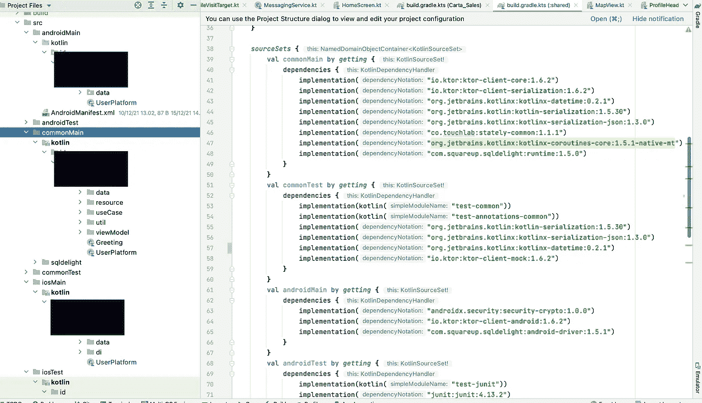
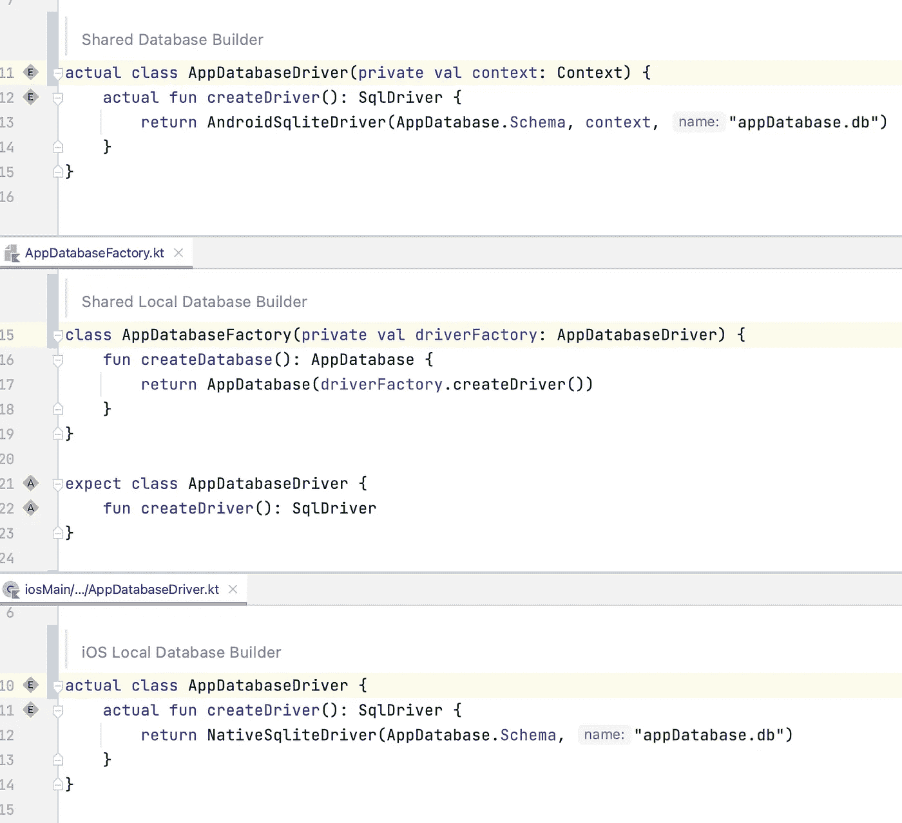
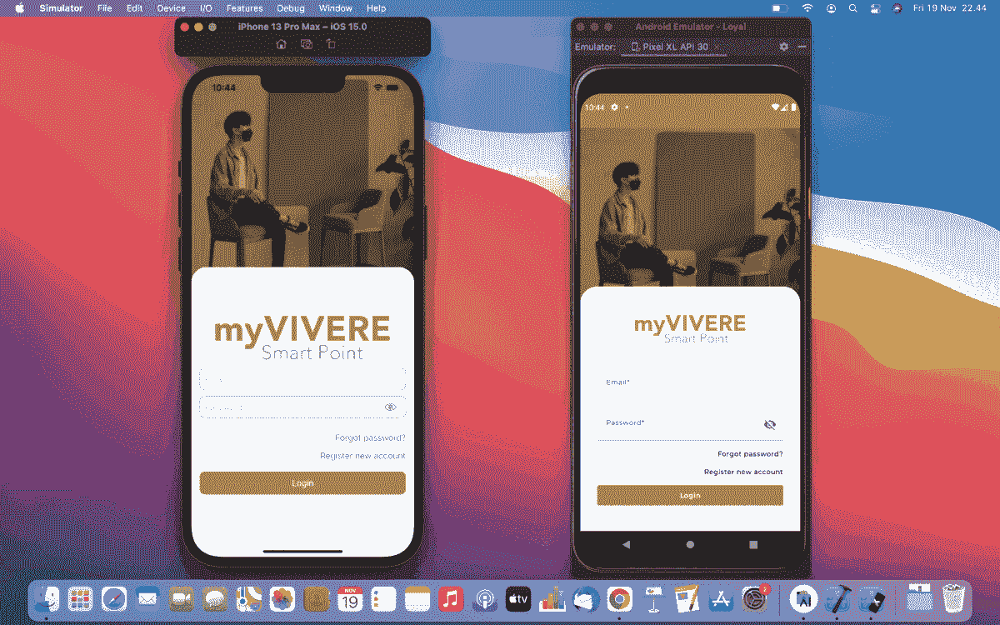
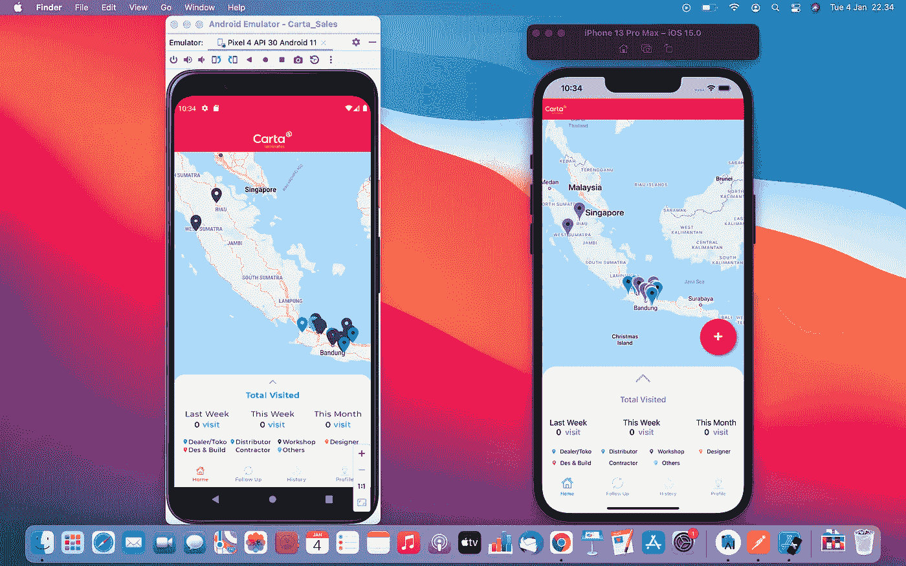

# Kotlin 多平台手机:权威的跨平台桥梁

> 原文：<https://betterprogramming.pub/kotlin-multiplatform-mobile-is-it-a-comfortable-bridge-fb724a9f3a0c>

## 我使用 KMM 构建 Android 和 iOS 的最初印象


照片由[埃琳娜·科劳彭伯格](https://unsplash.com/@elli19?utm_source=medium&utm_medium=referral)在 [Unsplash](https://unsplash.com?utm_source=medium&utm_medium=referral) 拍摄

考虑一下:你是一名 Android 开发者，没有 Swift、Dart、Xamarin 和 React 原生背景。你介意在 3 个月内为 Android 和 iOS 平台开发一款应用吗？

当然，如果应用程序只包含 Hello World 屏幕，你不会介意。但是，如果您希望构建一个真实世界的应用程序，事情会变得棘手。本文讨论了一个完全非多平台的软件工程师如何在两个平台之间架起桥梁。

多年来，已经有一些有希望的替代方法来构建多平台应用程序，如 Flutter、React Native 等。Net 毛伊岛，本地脚本，科特林多平台移动等。这些框架中的每一个对于多平台应用程序开发都是可靠的——并且提供了一个构造良好的桥梁，让您可以无缝地跨平台切换。

然而，原生 android 开发者必须熟悉 Kotlin 或 Java。目前，为了遵循推荐的 Android 开发最佳实践，Android 开发人员从 Java 迁移到 Kotlin 至关重要。Kotlin 不仅使用起来简单高效，而且有着光明的前景。换句话说，我们可以说，它确实是一种为“步行者”提供多种用途的桥梁。

好吧，我不打算在这里谈论 Kotlin 对 Android 开发的好处。相反，我们将把重点放在 Kotlin 为多平台开发提供的产品上，这些产品目前处于 Alpha 状态。尽管如此，我对 Kotlin 多平台移动平台的探索还是带来了一些惊人的结果。

# 共享逻辑

首先，共享逻辑的能力是我们需要关注 Kotlin 多平台移动未来的原因。

为具有相同逻辑的不同平台构建一个应用程序而工作两次，这当然很烦人。此外，对于那些可能是 SwiftUI 编码新手的人来说，考虑到新的学习曲线，构建端到端 iOS 应用可能需要一段时间。

幸运的是，提供的共享逻辑非常有用，因为所需的业务逻辑只需创建和测试一次，如下图所示。

`commonMain`文件夹是创建共享逻辑的地方，而`androidMain`和`iosMain`文件夹用于每个平台的`actual`逻辑。



Ktor 和 SQLDelight 是目前用来接触 app API 和本地数据库的主要武器。

因为两个依赖项对于每个平台都有不同的构建配置，所以它们是内置的`androidMain`和`iosMain`。因此，如下图所示，用于创建本地数据库的`createDriver()`的`actual`函数没有方法体。他们将为每个平台运行不同的方法体，使用`expect`函数调用。

一旦调用其实际方法(在本例中为`createDriver()` ) `shared` database builder，就会触发以下`expect`函数。



# 声明式用户界面

提供基于 Kotlin 的 Jetpack Compose 作为声明性 UI 是一个非常酷的想法。

这里很酷的是，那些使用 Jetpack Compose 开发 Android UI 的人天生就在学习如何使用 SwiftUI 编码。

因此，基于 Kotlin 的开发人员不会花太多时间来学习 SwiftUI 和开发 iOS UI，因为他们已经处理了声明性 UI 的基本工作流。令人惊奇不是吗？

```
//Jetpack Compose (Android)
@Composable
fun MainScreen(){
    Text("Hello World")
}//SwiftUI (iOS)
struct MainScreen: View{
    var body: some View{
        Text("Hello Wrold")
    }
}
```

上面的代码示例简单地展示了如何为两个平台设计类似的声明性方法。

下面是我在不到 3 个月的时间内开发的 Kotlin 多平台移动项目 UI 的预览，注意，我没有任何 Swift 经验。



iOS (SwiftUI)和 Android (Jetpack Compose) — Kotlin 多平台移动项目

在上面的预览图中，我们可以看到尽管框架不同，但两个平台的 UI 看起来很像。关键是，只要 UI 区域是可设计的，Jetpack Compose 或 SwiftUI 的声明式 UI 开发就可以使它们彼此相似。

两者都仍然缺乏必要的组件，但我们仍然可以使用旧式的 UI 开发，使用 XML for Android 和 UIKit for iOS 来弥补这些差距。

下图是在声明式 UI (Jetpack Compose 和 SwiftUI)方法中实现 Google Map API 的结果。



iOS (SwiftUI)和 Android (Jetpack Compose)中的 Google 地图 API—kot Lin 多平台移动项目

这就是 UIKit 如何帮助在 SwiftUI 中实现 Google Map API 的。UIKit 的 UI 表示可以是多种多样的，这取决于我们将要显示的视图类型。

换句话说，它在 Android View 如何帮助 Jetpack Compose 显示当前不支持的视图方面发挥了作用。

在下面的代码中，Android 视图在 UIKit 的 UI 可表示性如何帮助 SwiftUI 显示 Google Map API 方面发挥了作用。

这只是一个例子，说明 Jetpack Compose 如何提供一种替代方案来支持任何不支持的视图配置，比如基于 XML 的视图。

# 结论

最后，令人兴奋的是使用共享逻辑，我们只需要利用 Kotlin 多平台移动作为桥梁，让每个平台调用它们必要的代码。

然而，这种桥梁仍在改进中，一些实验方法仍然令人担忧，因为它可以突然拆除。

总而言之，作为一名 Kotlin 开发人员，我的观点是，使用这种多平台方法就像踢足球一样，规则只是有一点不同，但踢球的方式并没有太大的不同。希望你喜欢这篇文章。感谢阅读和快乐编码。