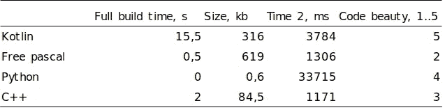

# kot Lin/Native vs . c++ vs . free Pascal vs . Python:比较

> 原文：<https://betterprogramming.pub/kotlin-native-vs-c-freepascal-python-c1dba39752cf>

## 测量构建时间、运行时间、跨代码库编译的可执行文件的大小

克里斯·利维拉尼在 [Unsplash](https://unsplash.com?utm_source=medium&utm_medium=referral) 上的照片

大家好！自从 Google 宣布 Kotlin 作为 Android 开发以及 Google 自己的名为 Jetpack-family 的库的主要编程语言以来，这种语言的采用正在飞速增长。

但是 Kotlin 不仅仅是针对 Android 的。它也适用于后端、多平台桌面应用、数据科学，甚至游戏、前端和机器学习。

有了科特林，你可以实现非常广泛的目标。只有一个小的美中不足:您需要用您的代码获取整个 Java 虚拟机来部署这个版本。但是 Kotlin/Native 配什么呢？它准备好构建不同的应用程序了吗？它的性能与其他语言如 C++相当吗？

在这一系列的博客文章中，我将试图找出真相，并将 Kotlin/Native 与 C++、古代 Freepascal 和 Python 进行比较。

但是等等..为什么是 Python？Python 代码不会编译成原生应用，那为什么会在这里？嗯，可能只是为了好玩，或者因为我比较熟悉)。

# 内容

1.  简单的数学与原生应用程序，或今晚谁这么聪明？ *—你在这里—*
2.  [用 SDL2 进行图形测试，或者用 Norton Commander 进行跨宇宙测试。](/kotlin-native-vs-c-vs-freepascal-vs-python-a-comparison-part-2-1be9007ecf41)

## 科特林

维基说厄拉多塞筛是一种测试计算机性能的流行方法。这正是我们所需要的。Python 先生，让我们开始一场不同编程语言的竞赛，这些语言可以产生本地代码，并与天生的数学计算者进行比较。

我用 Kotlin 编写了以下代码，作为其他人的模式:

我在这里使用了`require`函数来定义一个前提条件。我们在 Kotlin 中还有`*contracts*`来指定函数的一些行为。当然，我们有`*assertions*`，但我认为它更适合在测试套件中使用。

看，Kotlin 扩展函数有多有用。我在这里使用了带有谓词的`mapIndexedNotNull`作为`takeIf`扩展。从字面上看，函数式风格的一行代码用列表构建和条件语句代替了循环。

出于速度和节省内存的目的，我在这里使用了`Array`而不是`mutableList`:数组的值在 *while* 循环的每次迭代中都在变化，这就是为什么数组在这里更好，它不会在每一步分配一个新的内存段，而是非常快速地就地改变值。这个结构没有超出*函数作用域*，使用数组是完全安全的。

哦，别忘了上面的樱桃！盒子里的`measuredTimeMills`功能。谢谢，科特林/土人。

## 计算机编程语言

到目前为止一切顺利。下一个让我们激动的是 Python。让我们比较一下他们的语法糖:

如你所见，Python 代码和 Kotlin 代码的逻辑和语法几乎相同。我使用了`**assert**` 作为前置条件，列出了构建初始布尔数组的理解，并返回了一个素数列表。Python 没有开箱计时的功能，但是我们用奴婢`**decorator**`T5 得到了更好的方法。

我喜欢哪种糖？一方面，Kotlin 对任何类型都有强大的扩展，您可以随意组合它们，并在结果中获得漂亮的函数链。

另一方面，Python 有最简洁的列表理解语法，但也有最繁琐的条件:我讨厌为 if… else… if… else…if… else 输入所有这些行。顺便说一下，Python 3.10 中呈现的全新模式匹配甚至与 Kotlin 中的`when`语法都不接近。

## **C++**

我不得不到达我思想殿堂的最底层，去回忆如何让同样的算法在最可怕的 C++中工作:

当然，算法本身仍然是相同的，甚至具有与任何其他类似 C 语言的编程语言相似的语法。

但是你必须注意内存分配、内存释放以及所有这些指针、链接等等的所有细节。

你仍然可以用 C++模板和 lambdas 自己开发高阶函数，但是这非常痛苦，而且会破坏 C++的所有性能。

例如，作为函数的结果，使用列表而不是指针作为值参数，每一百万个素数会增加一百毫秒。

很久以前…在遥远的银河系…全世界的每个学生都在学习帕斯卡。我觉得我们应该向帕斯卡致敬，他在目前拥有数百万维护 Delphi 的大胡子编码员(现在叫什么名字？)和拉撒路·伊德斯。记事本的业余爱好者，以及 vim'ers，应该在没有任何现代自动完成或代码建议的情况下，欣赏 Lazarus IDE 的斯巴达式优势。

Pascal 代码是最长的一个。它有泛型，但是，如你所见，他们设法把它复杂化了。(*为什么* `specialize` *？这个单词是什么意思？)*

Pascal 还是没有任何高阶函数和 lambdas 的机会。是的，它有一个用于参数的函数类型，但是…你应该自己通过这种方式。

你认为这次比赛我们会取得什么样的结果？我测量了构建时间、运行时间和编译后的可执行文件的大小，得到了计算第一个 100，000，000 个素数的如下结果:

с++无愧于运行速度最快、应用程序最小的称号。但是帕斯卡正紧紧盯着它！

Kotlin/Native 文件只有 Pascal 文件的一半大小，但也落后于 Pascal 文件的一半。Python 会发生什么？为什么这么慢？因为它不使用预编译库，只解释每一行代码。

我给 Kotlin code 打 5 分，因为它加入了函数式编程能力俱乐部，拥有富有表现力的简洁代码。

第二名是 Python。C++代码在我看来比 Pascal 漂亮，但别忘了，我用了很多年，非常愉快。

在我们比赛的第二部分，我将在图形测试中比较这些语言:我们将使用`SDL2`库，并用诺顿指挥官的 starfield 制作一个旧的屏幕保护程序。这个测试的灵感来自维亚切斯拉夫·阿尔希波夫的这篇文章。

别走开，我会回来的。