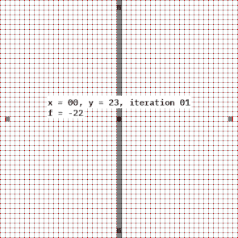
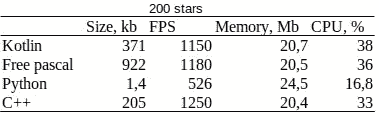
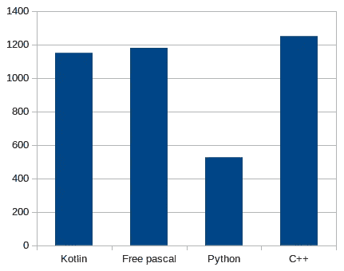
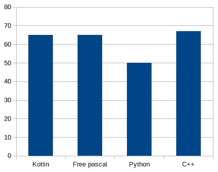

# kot Lin/Native vs . c++ vs . free Pascal vs . Python:测量 FPS、RAM 和 CPU 使用情况、编译后可执行文件的大小

> 原文：<https://betterprogramming.pub/kotlin-native-vs-c-vs-freepascal-vs-python-a-comparison-part-2-1be9007ecf41>

## 代码库之间的比较


Python 应用程序的 Starfield 动画

大家好！正如我在这个博客系列的第一部分中所承诺的，我很高兴欢迎你进入我们旅程的第二部分，在这里我试图通过 Kotlin/Native 与 C++、Freepascal 和 Python 的性能以及 openGL 图形和编码的乐趣来找到比较的真相。

## 内容

1.  [原生应用的简单数学，或者今晚谁这么聪明？](/kotlin-native-vs-c-freepascal-python-c1dba39752cf)
2.  使用 SDL2 进行图形测试，或使用 Norton Commander 进行跨宇宙测试。 *—你在这里—*

## 动机

维亚切斯拉夫·阿尔希波夫的这篇文章启发我开始了这项研究。如果你是老极客，你应该记得旧的电脑 CRT 显示器有老化效应。

> *Wiki:* [烧屏](https://en.wikipedia.org/wiki/Cathode-ray_tube#Burn-in)是图像被物理“烧”入 CRT 的屏幕；这是由于磷光体的长时间电子轰击导致磷光体退化而发生的，并且当固定的图像或标志在屏幕上停留太长时间时发生，导致它作为“重影”图像出现，或者在严重的情况下，当 CRT 关闭时也发生。为了解决这个问题，电脑中使用了屏保来减少老化。老化不仅仅发生在 CRT 上，等离子显示器和有机发光二极管显示器也会发生老化。

其中一个著名的 PC 屏保是 Starfield，你可以在这篇文章的标题下面看到。想象你是眼镜蛇 MK3 中的指挥官詹姆森，你正在宇宙中搜寻塔戈伊德飞船。星星在四处奔忙，你比闪电快一百倍…

## 从 Python 开始

我对原始源代码做了一些更新，在窗口标题中打印 FPS，使用其他绘图函数来获得反走样效果，并为星星添加可变半径属性，这样星星就获得了平滑的生长效果:

这是 Python 中的完整代码，但是如果你想在你的机器上重现这个，不要忘记安装`[Pygame](https://www.pygame.org/news)`库。

最难的是把它翻译成其他语言。`Pygame`库本身使用`[SDL](https://www.libsdl.org/)`图形库封装与`openGL`(或者 Windows 上的`DirectX`)的底层接口。我们所需要的就是为每种语言编写我们自己的`xxGame`引擎……Uuh。我们走吧。

## C++极点位置

我认为，开始的简单方法是在 SDL 的原生平台上实现 Starfield is，即 C++语言，然后将其转换为 Kotlin 或 Freepascal 变体。

> *免责声明:*因为我不太熟悉 C++上的直接 SDL 编程，所以我从 YouTube 上 Carl Birch 的视频系列中学习了它的基础知识[这里](https://www.youtube.com/playlist?list=PLhfAbcv9cehhkG7ZQK0nfIGJC_C-wSLrx)我推荐它们作为一个完美的开始。

让我们远离上面的 Python 代码，使用语言的++优势。C++有两种类可供我们使用:`**class**`本身和`**struct**`。它们之间的区别在于默认情况下类成员是如何声明的，是私有成员还是公共成员。否则，类和结构都是相似的。

我声明了`struct **Star**`并封装了它的创建、更新和恢复行为:

它有一个默认的构造函数来调用`newStar`函数，当这个星星离开屏幕时也会发生类似的情况。我们将使用一个`Star`对象的数组(C++ STL 中的 vector ),而不是 Python 中的带有未命名参数的全局列表。

当然，我们可以在普通的 C++中使用静态数组来代替动态向量，因为我们已经知道它的大小，但是我更喜欢用一些未来增强的机会来编写代码。例如，我们可以在运行时用 vector 动态地增加或减少星星的数量。

在 C++程序中我们的`main`函数开始时，我们应该准备 SDL 引擎来绘图:

这里将为 SDL 窗口和渲染上下文创建两个指针。是的，我们可以用 SDL 创建任意数量的窗口和渲染上下文。接下来使用的所有执行绘图的 SDL 函数都应该使用渲染上下文，其他一些函数需要一个窗口指针来执行。

但是有一个小问题… SDL 没有从盒子里画一个实心或空心圆的功能！多亏了 Github，我在几秒钟内就找到了必要的算法。[那个代码](https://gist.github.com/Gumichan01/332c26f6197a432db91cc4327fcabb1c)使用 [Bresenham 的圆算法](https://en.wikipedia.org/wiki/Midpoint_circle_algorithm)，由 [Gumichan01](https://gumichan01.github.io/) 在麻省理工学院许可下提供给我们。太棒了——就是！看，画一个光栅化的圆有多简单:



所以，现在我们准备好了主代码:

我跳过了部分代码，但是你可以从我的[库](https://github.com/alexmaryin/sdl-test)中克隆整个项目。

因此，正如你所看到的，我用 C++写了一个非常简单的代码，它几乎类似于 Python 代码，唯一的区别是使用了 struct 并封装了一些行为。这段代码应该是下一段代码的起点。让我们看看，如何在不影响性能的情况下增强这段代码。

# 科特林式的

在普通的 openGL 和 SDL 上编程是一个坚固的函数结构序列，内部没有任何逻辑块或函数作用域。下面的伪代码从字面上说明了我的意思:

```
init all;
clear screen; // suppose, 1st frame
draw point;
swap buffers;
clear screen; // 2nd frame
draw lines;
draw triangles;
draw anything else;
swap buffers;
clear screen; // 3rd frame, etc.
```

这是一个可以在任何 C/C++程序中运行的标准流程。当然，您可以自己使用逻辑块和组织绘图框架，但是框架不会强迫您这样做。

Kotlin 带来了使用 DSL 以声明式风格构建代码的机会。使用 DSL，您可以将一个逻辑块包装到另一个逻辑块中，并使用清晰简洁的语法为逻辑块的调用范围或顺序指定限制。如果你已经熟悉了`[Ktor](https://ktor.io/)`或者另一个用 DSL 风格构建的 Kotlin 框架，你就明白我的意思了。顺便说一下，JVM 世界中著名的 2D 游戏引擎`[LibGDX](https://libgdx.com/)`有一个叫做`[LibKTX](https://libktx.github.io/)`的 Kotlin 增强功能，它可以使用 DSL 风格，用清晰的自动解释代码更快地开发游戏。

我一直在研究如何在 Quillraven 的一系列视频中使用这个框架，直到我创建了我的第一个简单的多平台游戏。现在 Quillraven 正在使用 Kotlin DSL 在 LibGDX 的基础上构建自己的轻量级引擎`ECS ([entity component system](https://en.wikipedia.org/wiki/Entity_component_system))`,名为`[Fleks](https://github.com/Quillraven/Fleks)`。

但是，没话说！让代码来说明我的意思:

```
SDL Engine {
    init Engine()
    init Environment()
    add Event Listener **{** for quit event -> stop engine and close app
    **}** start Infinite Loop **{** on Each Frame **{** draw magic
            show FPS        
        **}
    }** }
```

我就是这么想象科特林变种星域的主要代码的！您可能会惊讶于 DSL 允许将 Kotlin 中的伪代码变成一对一的形式:

很漂亮，不是吗？这是一个完整的主要功能。`**SDLEngine**`是一个带有`**Engine**`类接收方的函数。在 lambda(函数的最后一个参数)内部，这个类的实例作为`*this*`变量可用，如果它不干扰任何其他向上作用域的接收器，您可以在码字`*this*` 中排除它。

我把引擎初始化参数移到了`**SDLEngine**`函数中——窗口的宽度和高度。`**addEventListener**`是引擎范围内的一个函数，将在引擎的每个事件上被调用。

`**startInfiniteLoop**`也是引擎范围内打开图形渲染器的功能。在我的简单引擎中，这个函数将一直运行，直到窗口关闭。`**onEachFrame**`是带有`SDL Renderer`指针接收器的函数，需要任何 SDL 绘图功能。我将`*renderer*`声明为`**Engine**`类的私有成员，你不会在`**onEachFrame**`函数之外得到它，所以你不能在框架之外画任何东西。

在我看来，声明式风格可以让你避免错误，并带来更多的清晰和简单。但是第一次…

## 如何在 Kotlin/Native 中包含 SDL 库

这是我发现中非常复杂的一部分，但是我现在的知识可以让你更快地通过这条路。首先，你应该把它安装到你的机器上。我用的是 Ubuntu，我需要的是`sudo apt install libsdl2-dev`。[其他平台的安装更加不同](https://www.libsdl.org/download-2.0.php)。

然后，您应该仔细研究 Kotlin 官方文档的后续教程和文章:

1.  [IntelliJ IDEA 中的 Kotlin/Native 入门。](https://kotlinlang.org/docs/native-get-started.html)本教程介绍了使用 IDEA 在 Kotlin 中构建本地应用程序的基础知识。
2.  [与 c 的互操作性](https://kotlinlang.org/docs/native-c-interop.html)这是最重要的部分！它描述了如何将第三方动态库包含到您的项目中。每个图书馆都有许多具体的事情只与它有关。不要跳过绑定的部分！如果你打算使用 C++类型，比如指针、枚举、类/结构和回调，这是非常非常重要的。
3.  [从 C 语言映射原始数据类型](https://kotlinlang.org/docs/mapping-primitive-data-types-from-c.html)。我没有说过这也是非常重要的一部分？

因此，考虑到这些教程，我在项目中创建了下一个目录:`project/src/nativeInterop/citerop`并将文件`sdl2.def`放入其中。该文件包含以下内容:

```
package = platform.SDL2
headers = SDL2/SDL.h
compilerOpts = -I/usr/include -I/usr/include/x86_64-linux-gnu -I/usr/include/SDL2 -D_POSIX_SOURCE
compilerOpts.linux = -D_REENTRANT
linkerOpts = -L/usr/lib/x86_64-linux-gnu/ -L/usr/lib64 -lSDL2
```

然后，我编辑了`build.gradle.kts`项目文件，添加到`kotlin/nativeTarget`扩展名如下:

```
compilations.getByName("main") **{** cinterops **{** val sdl2 by *creating* **}
}**
```

之后(当然还有 Gradle sync)我在 Gradle tasks 工具窗口中发现了一个名为`cinteropSdl2Native`的新任务。在尝试使用*中的任何标题之前，有必要运行此任务。def 文件。

还没完呢！完成所有这些之后，是时候重建项目了。现在我们可以导入新的包`platform.SDL2`(名称在`.def`文件中定义)。

# 科特林 DSL 中的 SDL 引擎

所以，现在我们可以把 DSL 转向 SDL 了！那是一个漂亮的变位词。以下是我的 SDL 引擎的完整代码文件:

它和他的 C++兄弟做着同样的事情，但是把它封装在远离用户(SDL)的地方。我定义的类是一个普通的类，而不是数据类，因为它允许避免不必要的代码生成，这些代码在数据类相互比较时是有用的。我的程序不需要这个。

你可以在我的 Github 上找到包含其他代码的库[。](https://github.com/alexmaryin/StarfieldKt)

## 自由帕斯卡 SDL 用法

从版本 2.2.2 开始，Freepascal i [包含了来自盒子](https://wiki.lazarus.freepascal.org/FPC_and_SDL)的 SDL 头文件。但是我们需要 SDL2 报头。https://www.freepascal-meets-sdl.net/网站可以帮助我们。此外，如果您对 Pascal 不熟悉，这也是开始学习 SDL2 的绝佳地方。

从这个 Github repo 的[中下载`SDL2`的 Pascal 头文件，并将其放入首选目录(我总是设置 Lazarus 在`/home/user/.lazarus`中创建的默认目录)。](https://github.com/PascalGameDevelopment/SDL2-for-Pascal)

那么请仔细阅读来自上述网站的教程和来自存储库的 read.me，因为 Pascal 互操作模块还有其他与 C++类型不相似的类型名。以及科特林 c-interop 准备，不是吗？

下面是 Freepascal 中从 C++转换来的用于画圆的函数:

这是 Freepascal 的完整代码，类似于 C++变体:

## 竞赛和结果

最后，我们可以从我们最初的想法开始。让我们为每一种语言(我知道，我知道，Python，你不会)建立一个发布，看看它有多快，有多小。

这是我用来编码和测试的笔记本电脑的规格:宏碁 Aspire 3，8 Gb RAM，CPU Intel Core i3–1005 G1，240 Gb NVME m.2 磁盘，Ubuntu 22.04 x64，OpenGL 4.6，SDL2，以及 Intellij IDEA 的最新版本，VS Code，Lazarus 和 PyCharm，用于屏幕捕捉的 OBS。

我已经测量了可执行文件的大小，FPS 为 200 星，并使用了内存和 CPU 负载。我用 OBS 捕捉了所有程序的运行情况，但 OBS 吃掉了几乎一半的资源，这就是为什么视频中的 FPS 比纯测试中的要小:

我用星域 200 颗星得到了以下纯结果:



200 颗星的 FPS

结果是所有证明的证明。但是想想，如果说 C++、Freepascal、Kotlin 之间的一点点差别只是统计上的，我也不会走这么远。

说到 Python，我想，`PyGame`有自己的优化策略，FPS 小于 500 不是悲剧的理由。还有，我也不知道`PyGame`到底用的是什么圆算法，不过好像和我们给别人定制的有点不一样。

不过还是抖机吧，远离幼稚的东西。谁需要 200 颗星星？让它抽 5000！

在屏幕截图中，当 OBS 再次吃掉一半的资源时(我的膝盖被笔记本电脑的热量灼伤了),我们所有参赛者的 FPS 几乎是一样的！对我来说太棒了。但是纯测试的结果更让我吃惊:



5000 颗星星的 FPS

你看到了吗？纯 C++程序、纯 Freepascal 程序和纯 Kotlin/Native 程序使用完全相同的资源并给出完全相同的 FPS。但是如果你向上滚动，就会发现 Kotlin 程序的代码比 C++和 Freepascal one 的代码更复杂。为了方便起见，我们后来编写了一个复杂的 DSL 逻辑，但它不会影响运行时性能——它需要与较小的低级代码相同的 RAM 和 CPU 负载。甚至 exe 文件的大小也比 Freepascal 文件小 3 倍(没有调试信息)。

当然，作为一种年轻的语言，Kotlin 没有像 C#的 Unity3D 或 C++的 UnrealEngine 这样的大型商业图形引擎，但它有很大的机会在这个世界上找到自己的位置。我相信这只是一个伟大而漫长的故事的开始！

对我来说，我有所有的证据证明选择 Kotlin 是我近年来的正确决定:Android 移动、后端、桌面应用、2D 和 3D 游戏——所有这些道路都为 Kotlin 敞开。

感谢您完整阅读到此终点线！