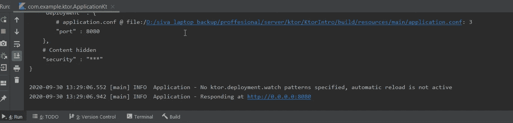
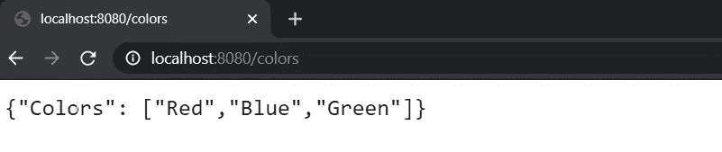

# 服务器端开发中的 Ktor:基础知识

> 原文：<https://betterprogramming.pub/ktor-in-server-side-development-the-basics-81ce4bbba878>

## 服务器端 Kotlin 入门


图片来源:作者

# 从文章中摘录

在本文中，您将学习如何使用 Ktor 实现具有基本路由的端点。之后，我们将在本地托管并测试它。然后，我们将使用 Kotlin 独有的特性(如扩展)优化代码，使其可扩展到大型项目。您还可以找到 GitHub 资源库的链接，并在本文末尾提供一个示例。

# Ktor 是什么？

据其官方网站称，“Ktor 是一个开源框架，使用强大的 Kotlin 编程语言在互联系统中构建异步服务器和客户端。”Ktor 使用协程来执行异步操作，由 [JetBrains](https://www.jetbrains.com/) 制造。

我们可以使用 Ktor 做的一件有趣的事情是使用 Kotlin 编写 web 服务。有兴趣的话，Ktor 也有安卓专用神器；你可以从这篇[文章](https://medium.com/better-programming/how-to-use-ktor-in-your-android-app-a99f50cc9444)中了解一下。

# 项目设置

要开始使用，需要安装并打开[Intellij IDEA](https://www.jetbrains.com/idea/download/#section=windows)；我用的是社区版。安装完成后，打开 IDEA 并点击 Create New Project 选项。然后你会看到下面的弹出窗口。


首先，在左侧面板中选择 Ktor 选项；如果它没有显示在您的工具中，请单击“取消”返回。这将带您回到主屏幕，然后您可以如下所示进行导航:

**配置>插件>搜索 Ktor >安装**


一旦你完成了 Ktor 插件的安装并点击创建新项目，你将会看到之前的弹出窗口。让我们看看弹出窗口中的一些选项:

*   **项目:**通过这个选项，我们可以选择 Gradle、Maven 或 GradleKotlinDSL 项目。现在，我们将使用默认选项(Gradle)。
*   **Ktor 版本:**选择最新的版本，在我写这篇博客的时候是 1.4.1。
*   **服务器&客户端标签:**这是我们可以导入某些功能的地方，比如认证类型、序列化库，比如 Jackson、Gson 等。这些是一些高级特性，所以我们将它们保留为默认值。

然后单击弹出窗口底部的“下一步”按钮，这将带您进入下一步。在这里，我们必须输入我们的 GroupId、ArtifactId 和版本号。看一看:


单击“下一步”按钮，将带您进入下一步，我们可以在本地磁盘中输入项目和位置。完成后，单击 Finish，Intellij 将开始构建项目。

# 探索项目

一旦项目成功同步，我们就可以开始使用 Ktor 构建 Rest 端点了。在开始编码之前，让我们看一下项目结构。

我们需要注意的第一件事是包含项目全部配置的`build.gradle`文件。在这里你可以看到某些已经集成的插件、源集和 Ktor 依赖项；这是因为我们一开始用的是 Ktor 插件。

然后我们可以看到项目下的两个主目录，`resources[main]`和`src[main]`。`src[main]`是我们主要用来编写 Kotlin 代码的目录。

在`src`目录中，你可以看到一个`Application` Kotlin 文件，其中我们有一个关于 Ktor `Application`类的模块扩展函数。看一看:

Ktor 应用程序是一个监听一个或多个端口并包含已安装功能的模块的程序；在这种情况下，是 [Netty](https://netty.io/) 。

接下来，为了理解本地的工作方式，请转到`resources[main]`目录中的配置文件，在其中您可以找到我们要连接的端口和要部署的模块(除了`src[main]`中的 Ktor 应用程序模块之外，什么也不是)。看一看:

# 开始编码

在应用程序模块中，我们需要实现身份验证、登录、安全性等功能，定义路由，就像我们在本例中要做的那样，以简化端点处理等。

我们需要开始使用 routing lambda 函数向模块函数内部的服务添加路由，以定义端点的行为。路由只是简化请求处理的一个特性。看一看:

Ktor 路由声明

## 获取请求

为了简单起见，我们将使用 lambda 的`get`函数在根路径添加一条路由。在 lambda 块中作出回应，我们可以使用 Ktor `ApplicationCall`。

在`get`函数内部，我们将通过调用 call 对象上的`respondText` 函数，用一个简单的文本进行响应。我们需要传递消息和内容类型，如下所示:

Ktor 获取请求

要测试这个实现，点击 main 函数旁边的 run 按钮，然后您会在 Intellij 底部面板的 run 选项卡中看到下面的日志。看一看:



现在，点击网址( [http://0.0.0.0:8080](http://0.0.0.0:8080) )或者在浏览器中输入 localhost:8080；它应该显示“来自 Ktor”的消息。看一看:


## 发布请求

现在我们已经成功地实现了 get request，让我们构建一个简单的`post`请求，在这个请求中，我们将读取请求体，并用请求体和“received data”字符串进行响应。看一看:

Ktor 发布请求

这里我们必须在 Kotr `ApplicationCall`对象上使用带有期望类型的`receive function`。我们必须将响应与“已接收数据”标签连接起来，并使用*`respondText`*函数*将其发送回去。***

**要对此进行测试，请单击 main 函数旁边的 run 按钮。成功执行后，打开 IDE 底部面板中的“终端”选项卡，并运行以下命令:**

```
**curl -X POST -d “sample data” localhost:8080**
```

**如果您遇到任何问题，请尝试将 URL 从 localhost:8080 更改为 http://[http://0 . 0 . 0 . 0:8080/](http://0.0.0.0:8080/)。这显示了下面一行的输出。**

# **创建一个端点**

**现在我们已经在根级别完成了基本的`get`和`post`请求，让我们用名称颜色创建一个端点，然后作为响应，我们将发送一个颜色数组。**

**第一步是创建颜色数组作为 JSON 对象。看一看:**

```
**private val *colors* = "{\"Colors\": [\"Red\",\"Blue\",\"Green\"]}"**
```

**然后我们需要像以前一样创建一个`get`函数，并将端点称为`colors`。在里面我们得到了一个颜色数组的响应。看一看:**

```
**private val *colors* = "{\"Colors\": [\"Red\",\"Blue\",\"Green\"]}"
get("/colors")**{** *call*.*respondText*(*colors*)
**}****
```

**为了检查输出，我们需要运行应用程序并将“/colors”添加到浏览器的现有 URL 中。看一看:**

****

# **代码优化**

**如果看到模块功能，路由块会增长；最终，我们将在端点中添加更多的逻辑，这将导致无法维护的巨大路由块。**

**克服这个问题的一个方法是利用 Kotlin 中扩展的功能来封装逻辑部分。看一看:**

**路由扩展**

**现在可以在路由块中使用这些扩展功能。看一看:**

**在路由块中使用扩展名**

# **GitHub 项目**

**您可以随意使用 GitHub 资源库中我们在这里探索的所有功能。**

**[](https://github.com/SG-K/KtorServerSideIntro) [## SG-K/KtorServerSideIntro

### 在 GitHub 上创建一个帐户，为 SG-K/KtorServerSideIntro 的开发做出贡献。

github.com](https://github.com/SG-K/KtorServerSideIntro)** 

# **奖金**

**要了解更多关于 Kotlin 的信息，请阅读 Kotlin 高级编程系列:**

*   **[“使用 Kotlin 进行高级编程—第二部分](https://medium.com/android-dev-hacks/advanced-android-programming-with-kotlin-part-2-aae2a15258b0)”**

**就这些了，希望你能学到一些有用的东西，感谢阅读。**