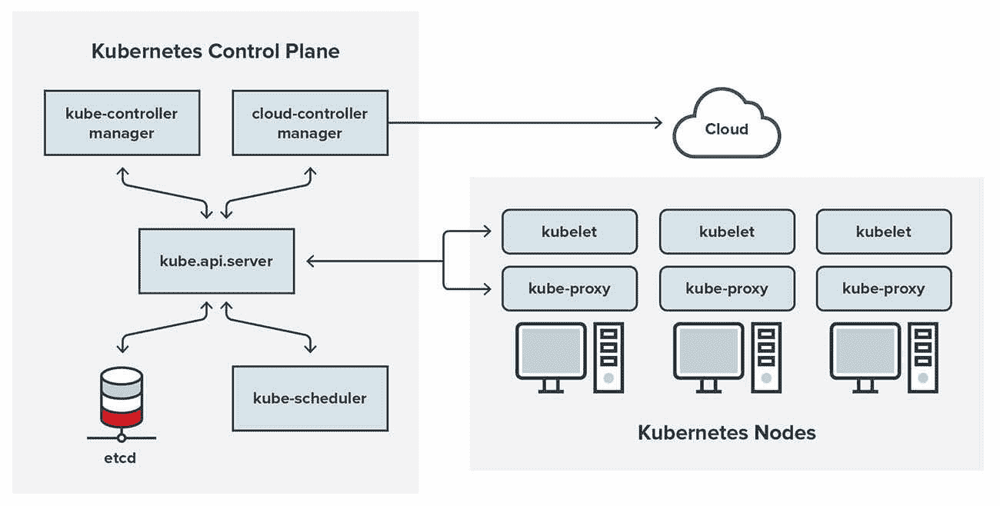
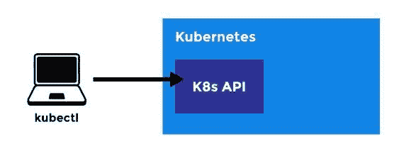

# Kubectl 命令是所有初学者必须知道的

> 原文：<https://betterprogramming.pub/kubectl-commands-all-beginners-must-know-e504349fcec9>

## **像专家一样控制 Kubernetes 集群**


由 [Domenico Loia](https://unsplash.com/@domenicoloia?utm_source=medium&utm_medium=referral) 在 [Unsplash](https://unsplash.com?utm_source=medium&utm_medium=referral) 上拍摄的照片

Kubernetes 是一个容器编排系统，用于自动化容器化应用程序(如“Docker”)的部署、管理和扩展。人们过度依赖云基础设施，Kubernetes 被用来在云上部署和管理软件等。

许多进程和程序可以合并到一个容器中，以提高处理能力和安全性，并且在处理多个容器时，管理一个容器要简单得多。

当一个新的容器在 Kubernetes 中启动时，它会自动作为一个节点添加到相应的集群中；这就是它以集群模式运行的原因。因此，您的集群中只有一台机器，称为节点。

节点作为一个抽象层。它们可以以缓存的形式存储永久或临时数据，并执行其他功能。因此，Kubernetes 实现了集装箱化和管理的自动化。

与虚拟机相比，Kubernetes 中的监控和扩展要简单得多。它为运行应用程序提供了更大的灵活性。使用容器，开发人员可以在各种平台上部署应用程序，包括虚拟化私有云、本地服务器和基于云的基础设施。

由于 Kubernetes 为消费者和组织提供了如此高水平的灵活性，许多组织都想使用它。

# Kubernetes 中的基本命令



[图像来源](https://www.trendmicro.com/vinfo/us/security/news/virtualization-and-cloud/the-basics-of-keeping-your-kubernetes-cluster-secure-part-1)

在 Kubernetes 上执行命令需要使用一个名为 Kubectl 的命令行工具。Kubectl 运行在工作站或任何其他安装了它的机器上。

通过使用命令，开发人员可以执行广泛的任务，例如检查或控制集群、部署应用程序或读取分布式系统中的日志。看看下面对 Kubernetes 有用的命令。

# Kubectl 描述

用户可以使用 kubectl describe 命令来获取属于特定组的某个资源的更多信息。

```
kubectl describe (-f FILENAME | TYPE [NAME_PREFIX | -l label] | TYPE/NAME)
```

使用此字段，您可以描述文件的名称、类型和标签。可能会收到一条错误消息，指示 [kubelet 停止发布节点状态](https://komodor.com/learn/the-ultimate-kubectl-cheat-sheet/)，这可能是由于节点上的 kubelet 进程运行不正常造成的。

# Kubectl 创建

要从 [YAML 文件](https://www.redhat.com/en/topics/automation/what-is-yaml)创建资源，用户必须使用下面列出的命令。-f 选项指定该命令中的文件名。

```
kubectl create -f Test.yaml
```

# Kubectl 运行

想要在 Kubernetes 中创建特定类型图像的用户可以使用该命令。创建部署或作业是为了管理新生成的容器实例的子集。

```
kubectl run Name — image=nginx
```

由于我们为实例提供了名称“nginx new ”,该命令将启动一个 nginx 实例，实例名称为“nginx_new ”,看起来有点像这样:

```
kubectl run ngnix_new — image=nginx
```

在这个命令中，如果需要，用户可以指定额外的细节，例如端口号。这些参数可以很容易地传递，产生的命令将类似于以下内容:

```
kubectl run hazelcast — image=hazelcast — port=1111
```

当我们将图像的名称更改为“ [hazelcast](https://hazelcast.com/) ”时，它创建了一个 hazelcast 的实例，允许容器在端口 1111 上公开。

因此，如果最终用户希望复制任何映像的实例，可以利用“副本”功能来实现。在下面的命令中，将复制或部署三个“nginx”实例:

```
kubectl run nginx –image=nginx –replicas=3
```

因此，“kubectl run”可用于执行各种任务，例如修改环境变量并输出相应的 API 对象，而不必创建它们，这在运行该命令时使用“--dry-run”参数是可行的。此外，用户可以通过使用语法“— arg1> arg2>…argn >”来传递自定义参数。



[图像来源](https://unixadminguide.blogspot.com/2018/12/kubectl-commands-kubernetes.html)

# Kubectl 应用

如果用户希望根据文件名对资源应用配置，用户可以使用以下命令来实现:

```
Kubectl apply -f test.yaml
```

f 参数指定要使用的文件，文件名“test.yaml”表示要使用它。

如果资源尚不存在，系统将创建一个资源，然后将策略应用到新创建的资源。它接受 JSON 和 YAML 格式的文件。

如果用户没有绝对 URL，则可以提供用户希望应用配置更改的文件的相对 URL 来代替绝对 URL。

# Kubectl attach

如果用户想要附加到已经在现有容器中执行的进程，可以使用以下命令:

```
Kubectl attach <Pod> -c <Container>
```

“-c”选项用于指示容器名称，如果用户没有指定-c 选项，默认情况下将在该命令中使用第一个容器名称。

基本命令如上所示，用户可以根据自己的需求对其进行定制。例如，如果用户想要从 pod“100–1000”中附加“python-container”，以下命令将是

```
Kubectl attach 100–10000 -c python-container
```

# Kubectl 集群信息

当用户想要查看关于 Kubernetes 集群的信息时，可以使用下面的命令。

```
Kubectl cluster-info
```

该命令将只显示标签“kubernetes.io/cluster-service”已被用户设置为“true”的集群的服务地址和主信息。

如果用户希望转储集群信息，以便对集群进行故障排除和诊断，他或她可以对基本命令进行一点修改。更新后的命令如下所示:

```
Kubectl cluster-info dump
```

使用上面的命令，所有内容都被转储到" [stdout](https://www.computerhope.com/jargon/s/stdout.htm) "中。如果用户想把它转储到一个特定的目录中，他可以用路径指定“output-directory”参数，路径可以是绝对的，也可以是相对的。以下是一个命令示例:

```
Kubectl cluster-info dump –output-directory=/path/to/cluster-state
```

“Kubectl cluster-info”也能够处理名称空间。默认情况下，“-all-namespace”参数的值为 false。如果“–all-namespaces”参数设置为 true，它将转储所有名称空间；否则，它将只转储下面列出的名称空间。

```
Kubectl cluster-info dump –all-namespaces
```

# Kubectl 配置

如果用户想对 kubeconfig 文件进行修改，可以使用下面显示的命令。

```
Kubectl config <SUBCOMMAND> –<Kubeconfig>
```

它使用“子命令”参数修改 Kubeconfig 文件。诸如

```
Kubectl config set current contect MY
```

该命令使用 kubeconfig 标志，每个命令只能设置一次。如果未设置该标志，则无法加载该文件。接下来，它确定是否设置了环境变量。

如果是，则使用路径；否则，就不是。它作为第一行添加到现有文件的开头。如果文件不存在，列表将被扩展以包括最近添加的文件。

如果用户希望对某个 kubeconfig 文件使用“kubeconfig”选项，该参数就是这样指定的。

# 结论

随着 Kubernetes 在云计算领域越来越受欢迎，Kubectl 命令行工具也越来越受欢迎，它允许用户进行各种各样的操作。

它使用简单，用户理解起来没有困难，因为有大量关于这一主题的材料。许多用户更喜欢使用命令，因为它们更有效，并且允许他们更频繁地接收输出。