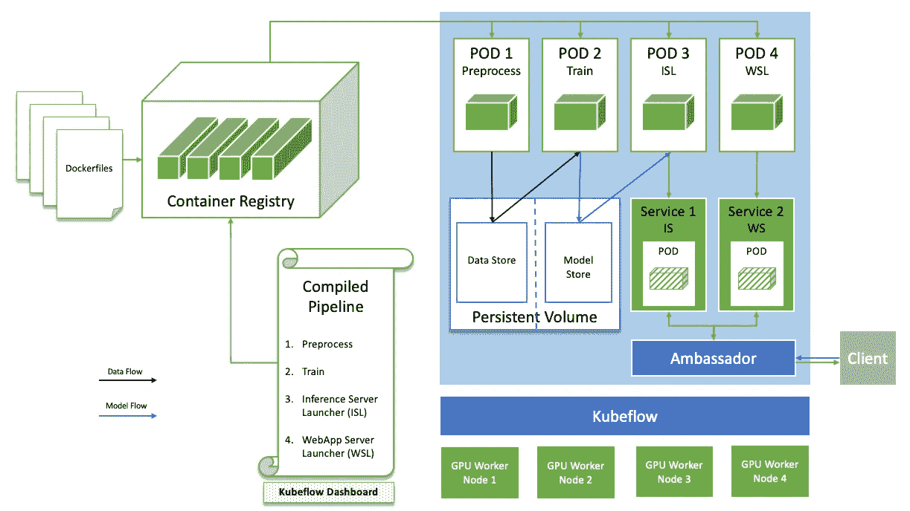
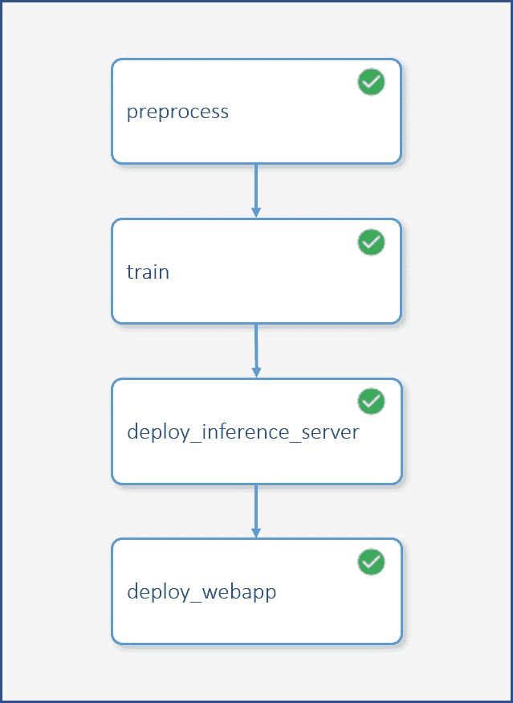

# 带 GPU 的 Kubeflow 管道

> 原文：<https://betterprogramming.pub/kubeflow-pipelines-with-gpus-1af6a74ec2a>

由 [Unsplash](https://unsplash.com/search/photos/pipelines?utm_source=unsplash&utm_medium=referral&utm_content=creditCopyText) 上的 [Isak Combrinck](https://unsplash.com/@isak_combrinck?utm_source=unsplash&utm_medium=referral&utm_content=creditCopyText) 拍摄的照片

计算密集型 DL 和 ML 工作负载，从银行欺诈检测到流媒体服务的视频推荐，都需要频繁的大规模训练和推理。 [Kubeflow](https://www.kubeflow.org/) 是一个基于 Kubernetes 构建的端到端平台，用于机器学习和深度学习模型训练和部署。Kubeflow 于 2018 年作为谷歌的开源项目推出，迅速成为各行各业最受欢迎的混合云 ML 工具包之一，贡献者群体不断增长。

*Kubeflow 寻求实现以下目标:*

*   扩展底层 Kubernetes 基础设施，使 ML/DL 部署变得简单、可重复和可移植。
*   允许研究人员专注于共享笔记本电脑和数据的快速实验，而无需担心底层基础架构。
*   提供在本地或云中运行训练和推理的能力，只需对代码库进行最小的更改。

## 库伯弗洛管道公司

典型的数据科学工作流通常包括数据验证、功能工程、模型训练和可扩展部署等阶段。容器使得部署更加容易，因为数据科学家和 ML 工程师可以很好地打包他们的代码并在计算环境中移植，而不用担心依赖性。Kubernetes 支持可重复的批量作业创建、高效的节点跟踪和监控，以及直观的横向扩展方式。

但是，我们如何才能使工作流模块化、可重复、可移植并与数据科学团队中的其他成员共享呢？进入 [Kubeflow 管道](https://www.kubeflow.org/docs/pipelines/pipelines-overview/)。

容器构成了 Kubeflow 管道的基本构件。每个都包含一个与管道中的步骤对应的脚本——如预处理、训练和服务中的步骤——输入和输出路径被指定为命令行参数。用 Python 脚本或 Jupyter 笔记本编写的管道定义文件将各个组件粘合在一起，形成一个图形。具体来说，它定义了管道的参数和每个组件的输入、输出以及与其他组件的关系。

Pipelines UI 是一个仪表板，支持上传已编译的管道，以便可视化和运行图形。可以通过改变管道参数来配置不同的运行，从而允许对训练试验进行深入分析，并对所服务的模型进行有效的版本控制。

## GPU 加速的 Kubeflow 流水线

由于 Kubeflow 已经成为跨企业的此类需求的流行框架，NVIDIA 与社区密切合作，将 GPU 技术集成到生态系统中。

运行 GPU 加速的 Kubeflow 管道并不难。查看[本教程](https://github.com/kubeflow/pipelines/tree/master/samples/nvidia-resnet)关于如何在 CIFAR-10 数据集上训练 Keras 中的 Resnet-50 模型。这应该可以帮助你开始。克隆一个副本，今天就开始实验吧！

下面是一些集成到管道中的组件，使 GPU 的使用更加简单有效:

*   [**TensorFlow**](https://ngc.nvidia.com/catalog/containers/nvidia:tensorflow) 集装箱来自(NGC) **:** 我们都在为发展争取合适的环境。获得所需的 DL 框架、库和 GPU 驱动程序可能是一项挑战，而且非常耗时。因此，在众多解决方案中，NGC 提供了高度优化的专用容器，可以从你的个人电脑、DGX 站或云端运行。
*   [**TensorRT**](https://developer.nvidia.com/tensorrt) :在训练过程之后，为了减少延迟和增加吞吐量，优化模型进行推理是很常见的，尤其是在生产环境中。TensorRT 带来了几项优化，如层&张量融合、精确校准和内核自动调整。
*   [**TensorRT 推理服务器**](https://github.com/NVIDIA/tensorrt-inference-server) **:** 使用 GPU 大规模部署模型需要在处理单元之间灵活、均匀地分配工作负载。TensorRT 推理服务器是一款容器化的生产就绪型软件服务器，用于数据中心部署，支持多模型、多框架。通过对客户端请求进行高效的动态批处理，TensorRT 推理服务器能够处理大量的传入请求，并智能地平衡 GPU 之间的负载。

## Kubeflow 管道教程概述

现在让我们看看上面的技术是如何与我们的 Kubeflow 管道示例集成的。

## 预处理容器:

*   基于来自 NGC 的 [TensorFlow 容器](https://ngc.nvidia.com/catalog/containers/nvidia:tensorflow) (19.03-py3)构建，作为基础映像。
*   entrypoint 脚本加载 Keras 库附带的 CIFAR-10 数据集。
*   图像被旋转、缩放和裁剪，并保存在输出目录中。

## 培训容器:

*   同样构建在 [TensorFlow 容器](https://ngc.nvidia.com/catalog/containers/nvidia:tensorflow) (19.03-py3)之上作为基础映像。
*   entrypoint 脚本在预处理的数据上训练 ResNet-50 模型，该预处理的数据被装载在管道的指定体积参数中。
*   然后，生成的 Keras **h5** 模型文件被转换为 **SavedModel** 文件，并使用 TensorFlow (TF-TRT)中的 TensorRT 集成进行优化，以利用张量核进行加速推理。

## 服务容器

*   该容器启动一个 Kubernetes 服务，然后部署在[NGC tensort 推理服务器容器](https://ngc.nvidia.com/catalog/containers/nvidia:tensorrtserver) (19.03-py3)内运行的 tensort 推理服务器，以服务于训练好的模型。

## Web UI 容器

*   该容器还启动了一个 Kubernetes 服务，该服务部署了一个 Web UI 来对模型进行交互式评估。

## 从这里你能去哪里？

本文研究了 GPU 加速的 Kubeflow 管道，以及它的采用如何极大地提高数据科学工作流的模块化和性能。现在，您可以在本地或云上快速轻松地在计算机视觉、NLP 或推荐中构建和部署强大的模型。

## 参考

[1] [Kubeflow 文档](https://www.kubeflow.org/docs/)

[2] [NVIDIA Resnet Kubeflow 管道](https://github.com/kubeflow/pipelines/tree/master/samples/nvidia-resnet)

[3] [NVIDIA GPU 云](https://ngc.nvidia.com/catalog/landing)

[4] TensorRT [【博客】](https://devblogs.nvidia.com/speed-up-inference-tensorrt/) [【文档】](https://docs.nvidia.com/deeplearning/sdk/tensorrt-developer-guide/index.html)

[5] TensorRT 推理服务器[【博客】](https://devblogs.nvidia.com/nvidia-serves-deep-learning-inference/) [【文档】](https://docs.nvidia.com/deeplearning/sdk/tensorrt-inference-server-guide/docs/)

## 作者

NVIDIA 解决方案架构师 Ananth Sankarasubramanian

NVIDIA 解决方案架构师 Khoa Ho