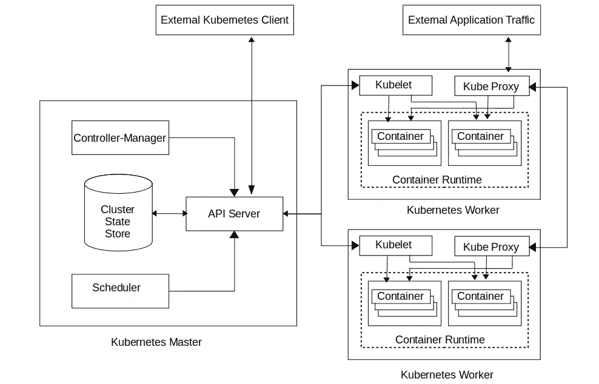
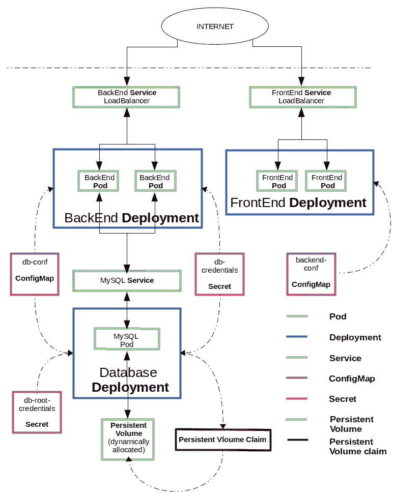

# Kubernetes:部署有状态应用程序的详细示例

> 原文：<https://betterprogramming.pub/kubernetes-a-detailed-example-of-deployment-of-a-stateful-application-de3de33c8632>

## 这篇文章是两部分系列的第二部分

照片由 [Unsplash](https://unsplash.com/photos/sMB8yPFnbAE) 上的 [Ihor Dvoretskyi](https://unsplash.com/@ihor_dvoretskyi) 拍摄

在本系列的[第一部分](https://medium.com/engineering-zemoso/kubernetes-what-is-it-what-problems-does-it-solve-how-does-it-compare-with-its-alternatives-937fe80b754f)中，我们讨论了:

*   什么是 [Kubernetes](https://kubernetes.io/) ？
*   它旨在解决什么问题？
*   什么时候应该选择使用 Kubernetes？有哪些替代方案？

在这篇文章中，我们将探索

*   Kubernetes 的设计原则和架构是什么？
*   如何使用 Kubernetes，还有一个简单的例子。

要理解一个描述如何在 Kubernetes 上部署应用程序的例子，首先应该对 Kubernetes 的体系结构和对象有一个初步的了解。因此，我们将首先概述 Kubernetes 的设计原则和架构，然后简要解释相关的 Kubernetes 对象，最后是示例本身。

# 【Kubernetes 背后的设计原则和架构

Kubernetes 的架构遵循一套设计原则。为了更好地理解为什么 Kubernetes 是这样设计的，我们应该熟悉这些原则。那么，我们就从这里开始讨论吧。

## Kubernetes 的设计原则

*   **便携:** Kubernetes 可以在任何地方跑。Kubernetes 在各种环境中以一致的行为运行，包括公共云、私有云、内部部署或个人笔记本电脑。部署在 Kubernetes 上的应用程序可以轻松地跨不同的环境进行移植。
*   **通用:** Kubernetes 对于可以通过它部署什么类型的应用程序没有任何限制。虽然它侧重于微服务和云原生应用程序的部署和管理，但任何类型的工作负载(批处理作业、无状态或有状态服务、遗留单片单实例应用程序)都可以通过 Kubernetes 部署。应用程序可以用任何语言或框架编写，没有任何限制。
*   **灵活:** Kubernetes 允许用定制的内置解决方案替换其许多功能。这提供了在必要时使用 Kubernetes 和一个专门的解决方案的能力。为了确保这种灵活性，Kubernetes 被构建为一个可插拔组件和层的集合。
*   **可扩展:** Kubernetes 有助于在必要时添加专门的功能。这是通过公开接口来实现的，实现接口可以在现有功能的基础上添加新功能。这允许[为 Kubernetes 开发大量的附加组件](https://github.com/kubernetes/kubernetes/tree/master/cluster/addons)。
*   **可自动化:** Kubernetes 旨在减轻人工操作的负担。配置完成后，通过 Kubernetes 部署的应用将无需任何人工干预即可扩展和自我修复。Kubernetes 可以与持续集成(CI)管道集成，允许开发人员提交的代码更改自动部署到测试环境中。

这些原则都为使用 Kubernetes 的最终用户增加了巨大的价值。可移植性允许在各种环境下对应用程序进行可靠的测试，例如测试和生产，并防止被单一的云提供商或供应商所束缚。

通用目的使开发人员可以自由选择满足业务功能所需的开发工具和框架，而不必担心基础设施或部署。

灵活性和可扩展性允许在内置功能不足的地方添加定制功能。

自动化确保维护大型应用程序所需的人工工作保持在最低水平。这允许相对较小的团队成功地维护部署在云上的大规模分布式应用程序。

现在让我们讨论 Kubernetes 架构，它是在考虑这些原则的基础上开发的

## 库伯内特斯的建筑

高级 Kubernetes 由主系统和工人组成。主系统控制工人并在他们身上运行应用程序。集群的期望状态(计算资源)被表示为抽象对象。这些抽象的 Kubernetes 对象是意图的记录。Kubernetes 将不断地工作，以确保这些抽象对象中表示的状态是集群的实际物理状态。外部客户端可以连接到主服务器，获取关于集群状态的信息，并根据需要发出命令来更改集群状态。

每当人们希望更新集群的物理状态时，他们所要做的就是更新抽象的 Kubernetes 对象，Kubernetes 会处理其余的事情。让我们更深入地讨论一下主系统和工人的组成。

## Kubernetes master 的组件

Kubernetes 主系统，也称为控制面板，设计为一组组件。让我们简单讨论一下它的关键组件。

*   **API 服务器:** Kubernetes 大多使用 REST API 进行内外通信。所有抽象的 Kubernetes 对象都作为 REST 资源公开。API 服务器是负责处理 REST 请求、验证它们并对相应的抽象 Kubernetes 对象执行适当的 CRUD 操作的组件。
*   **集群状态存储:**为了执行 CRUD 操作，API 服务器需要一个后备数据存储。顾名思义，集群状态存储是一个持久性存储实例，它存储系统中配置的所有抽象 Kubernetes 对象的状态。群集状态存储支持监视功能。通过这一功能，每当对象发生变化时，所有协调组件都可以迅速得到通知。
*   **控制器管理器:**这是运行控制器的 master 的组件。控制器运行循环并监控实际的集群状态和抽象 Kubernetes 对象中表示的状态。每当集群状态的改变被通知时，它们负责执行必要的动作，使得实际状态和抽象状态彼此一致。Kubernetes 有许多控制器，每个控制器负责一组不同的 Kubernetes 对象。
*   **调度器:**它是 master 的组件，负责在集群上分配物理资源，以运行添加到抽象数据存储中的应用程序/作业。这些调度决策是在考虑诸如硬件/软件约束等众多因素的情况下做出的。

Kubernetes 主系统可以拥有这些组件的多个副本，以确保高可用性，并且可以与工作节点组件一起部署在单个物理实例上。但是，为了简单起见，安装脚本通常在同一台机器上启动所有主组件，并且不在这台机器上运行任何工作实例。

确切的集群设置取决于最终用户的要求。对于较小的应用程序，同时具有主组件和工作组件的单个实例就足够了。对于较大的应用程序，定制工作对于配置 Kubernetes 集群是必不可少的。

## Kubernetes worker 的组件

工作实例或节点也由多个组件组成。Kubernetes worker 组件的主要功能是处理来自 master 的指令，并在节点上执行。以下是工作节点的关键组件:

*   **Kubelet:** 它是 worker 的组件，负责确保主节点上调度的容器正在运行并且是健康的。
*   **容器运行时:**容器运行时是负责运行容器的软件。Kubernetes 支持几个运行时和任何对 Kubernetes CRI 的实现。每个工作节点使用它来运行由主节点调度的容器化应用程序。Kubernetes 不鼓励也不支持运行非容器化的应用程序。
*   **Kube proxy:** 是 worker 的组件，负责维护 Worker 上的网络规则，执行连接转发。这实质上实现了整个集群中高效和有效的通信。外部应用程序流量将通过这些组件重定向到适当的容器。

## **外部 Kubernetes 客户端**

理论上，外部 Kubernetes 客户机可以是任何能够通过定义良好的 REST API 与 API 服务器通信的应用程序。但是最主要的选择是使用[ku bectl](https://kubernetes.io/docs/tasks/tools/install-kubectl/)。

Kubectl 是一个命令行工具，供负责管理应用程序部署的最终用户使用。Kubectl 用户可以在终端上执行命令。这些命令中的每一个都在后台被转换成一个 API 调用，并发送到 Kubernetes master 上的 API 服务器，在那里执行必要的操作。

高层库伯内特建筑

让我们后退一步，看看 Kubernetes 的整体架构。人们可能会注意到，它被设计成一组松散耦合的组件一起工作，而不是一个单一的整体实例负责所有的功能。我们已经讨论了这种架构风格的各种优势。特别是，这种选择允许 Kubernetes 保持灵活性和延展性。

选择使用`rest` 来创建和更新集群配置可以确保在一个环境中创建的任何配置都可以在任何其他环境中工作。这允许在 Kubernetes 上创建的应用程序部署保持可移植性。

控制器管理器和调度器充当持续监视集群状态存储中抽象对象的变化的组件。它们在必要时向工作节点发送指令，以自动更新集群的实际状态。这种设计选择消除了大量的人工工作，并确保 Kubernetes 是一个自动系统。事实上，这种集群管理的声明式方法是导致 Kubernetes 被迅速采用的主要特性之一。

通过接口与容器运行时交互来选择只运行容器化的应用程序，这确保了任何类型的应用程序都可以在 Kubernetes 上运行，并允许 Kubernetes 保持通用目的。

现在，我们可以看看 Kubernetes 中用于表示和管理集群状态的抽象对象。这些 Kubernetes 对象的知识是我们在深入研究这个例子之前需要理解的最后一块拼图

# **Kubernetes 物件**

Kubernetes 定义了一个[大量的抽象对象](https://kubernetes.io/docs/reference/generated/kubernetes-api/v1.14/)。为了简洁起见，我们将只讨论那些对理解我们的例子绝对必要的 Kubernetes 对象。

*   我们知道，通过 Kubernetes，我们可以运行容器化的应用程序。Kubernetes 没有将单个容器抽象为一个 Kubernetes 对象，而是定义了 *pod，*，它是一组一个或多个容器。这种选择有一个好处。对于更简单的情况，系统中的每个 pod 可以代表单个容器。但是，每当需要部署与容器的核心业务功能不直接相关的附加功能时——比如对日志记录、缓存等的支持——我们可以选择将这些附加功能打包到单独的容器中，并将它们放在单个 pod 中。这确保了它们总是逻辑地在一起。Pods 是可以在 Kubernetes 中创建和管理的最小可部署计算单元。它是最终用户实现的实际应用程序代码运行的地方。每个 pod 都有自己的 IP 地址，并且与主机完全分离。
*   **服务:**在库伯内，豆荚是挥发性的。为了确保高可用性和计算资源的最佳利用，Kubernetes 可以动态地删除和创建 pod。因此，pod 的 IP 地址不是访问 pod 提供的业务功能的可靠方式。相反，Kubernetes 建议使用一个*服务*来访问业务功能。Kubernetes 服务是一种抽象，它定义了一组逻辑单元和访问它们的策略。每个 Kubernetes 服务都有一个 IP 地址，但与 pod 的 IP 地址不同，它是稳定的。Kubernetes 服务持续跟踪系统中的所有 pod，并识别其预期的目标 pod。每当访问特定业务功能的请求到达服务时，它会将该请求重定向到当时系统中活动的一个 pod 的 IP 地址。理想情况下，要从集群外部访问 pod，必须使用 [*入口*](https://kubernetes.io/docs/concepts/services-networking/ingress/) *。*然而，截至目前，Kubernetes *Ingress* 功能仍是测试版。因此，在这个例子中，我们将使用一个服务对外公开流量。
*   **持久卷和持久卷声明:**管理存储与管理计算是截然不同的问题。Kubernetes 定义了两个关键的抽象来处理这个问题，p *持久容量，*和 p *持久容量声明*。在 Kubernetes 中，持久卷是集群中的一块存储，已被提供给集群用于其存储需求。持久卷声明是应用程序请求消耗通过持久卷声明的抽象存储资源。要使持久存储对 Kubernetes 内部运行的应用程序可用，应该首先声明持久卷，然后配置应用程序来声明使用该卷。
*   **config map:***config map*是一个 Kubernetes 抽象，旨在将依赖于环境的应用程序配置数据从容器化的应用程序中分离出来，使它们能够跨环境保持可移植性。
*   **秘密:**秘密*秘密*是包含少量敏感数据的对象，如密码、令牌或密钥。将如此敏感的信息隐藏起来，可以更好地控制其使用方式，并降低意外暴露的风险。
*   **部署:** *部署*是一个抽象概念，表示 Kubernetes 上实际部署的期望状态。部署对象通常包含所需的所有信息——获取和构建容器化应用程序的位置、预期打包和运行这些容器的 pod 的配置、应该维护的每个 pod 的副本数量、容器使用的配置映射和机密方面的应用程序配置的位置、数据存储的配置(如果应用程序需要持久的数据存储)。所有这些都可以在部署内部声明。虽然可以在 Kubernetes 中创建单独的 pod 和服务，但是建议使用部署来管理部署。通过使用部署对象，诸如转出、回滚和监控之类的典型操作得到了极大的简化。

# **如何使用 Kubernetes，以及一个简单的例子**

现在我们已经了解了 Kubernetes 的基础知识，我们将详细了解一个简单的示例。在这个例子中，我们将使用 Kubernetes 部署一个 web 应用程序。我们将使用 [Docker](https://www.docker.com/) 作为我们的容器运行时。我们示例中的应用程序有三个不同的部分:

*   数据库(MySQL 服务器)
*   后端(Java Spring Boot 应用程序)
*   前端(角度应用)

我们将在 Kubernetes 集群上部署所有这些组件。我们将有一个数据库副本，两个后端副本和两个前端副本*。*前端实例将通过 HTTP 与后端通信。后端实例将与数据库通信。为了促进这种交流，我们必须相应地配置 Kubernetes。

我们将通过创建 Kubernetes 对象来配置集群。这些 Kubernetes 对象将包含我们部署的期望状态。一旦这些对象被持久化到集群状态存储中，Kubernetes 的内部架构将采取必要的步骤来确保集群状态存储中的抽象状态与集群的物理状态相同。

我们将使用 [kubectl](https://kubernetes.io/docs/reference/kubectl/overview/) 来创建对象。Kubernetes 支持创建对象的命令式和声明式方式。生产环境通常由声明式方法配置。在这个例子中，我们将使用声明性方法。对于每个对象，我们将首先准备一个清单文件，一个包含与该对象相关的所有信息的`yaml`文件。然后我们将执行 kubectl 命令，`kubectl apply -f <FILE_NAME>`将对象持久化到集群状态存储中。

我们将首先封装我们已经实现的应用程序代码。之后，我们将配置数据库的部署，然后是后端。我们将通过配置前端来结束示例。

## 第一步。将应用程序容器化，并将图像上传到容器图像注册表

第一步是为我们已经实现的应用程序创建一个*容器映像*，并将其上传到*容器注册表*。

容器映像是容器化应用程序的打包形式。它可以跨计算机传输，就像任何普通文件一样。容器运行时环境可以使用容器映像创建容器化应用程序的运行实例。

容器注册表通常是存储容器图像的集中存储库。人们可以将容器图像上传到容器注册中心，并在需要时随时随地下载它们。可用的容器注册服务有很多: [Azure 容器注册](https://azure.microsoft.com/en-us/services/container-registry/)、 [Google 容器](https://cloud.google.com/container-registry/) [注册](https://cloud.google.com/container-registry/)、 [Amazon ECR](https://aws.amazon.com/ecr/) 等。在这个例子中，我们将使用 [Docker hub](https://hub.docker.com/) ,但是可以使用任何适合其用例的图像注册中心(公共的或私有的)。

我们将要部署的应用程序的前端用 [Angular 框架](https://angular.io/)实现，后端用 [Spring Boot 框架](https://spring.io/projects/spring-boot)实现。本文的最后一节提供了包含代码的 GitHub 库的链接。一旦我们按照我们的要求实现了代码，我们将使用构建工具构建可执行文件(在本例中是 Angular CLI 和 [Maven](https://maven.apache.org/) )。

现在我们将通过[使用](https://docs.docker.com/engine/reference/commandline/image_build/)`[Dockerfil](https://docs.docker.com/engine/reference/builder/)e`构建 docker 图像来创建容器图像。本例中使用的前端和后端的 Dockerfile 如下所示。

前端角度应用的 Dockerfile 文件

后端弹簧引导应用程序的 docker 文件

一旦创建了容器映像，我们就可以将它们上传到任何容器映像注册中心。在这里，我们将把这些图像上传到 Docker Hub。我们已经上传了名为`[kubernetesdemo/to-do-app-frontend](https://hub.docker.com/r/kubernetesdemo/to-do-app-frontend)`的前端图像和名为`[kubernetesdemo/to-do-app-backend](https://hub.docker.com/r/kubernetesdemo/to-do-app-backend)`的后端图像。我们将从官方 MySQL docker 库`[mysql](https://hub.docker.com/_/mysql).`获取数据库镜像，官方 docker 镜像一般没有任何前缀，比如`mysql`。非官方的图片需要有一个类似`kubernetesdemo/`的前缀。

我们必须在 Kubernetes 清单文件中提到这些图像的名称，我们将在下面看到。Kubernetes 将在需要时在各自的集群节点上获取并运行这些映像。

## **第二步。设置 Kubernetes 集群和 CLI**

建立 Kubernetes 集群有多种解决方案。不同的 Kubernetes 解决方案满足不同的需求:易维护性、安全性、控制、可用资源以及操作和管理集群所需的专业知识。人们可以参考官方文档[来获得更多关于如何建立集群的细节。这个例子已经在本地(](https://kubernetes.io/docs/setup/) [Minikube](https://kubernetes.io/docs/setup/minikube/) )和云提供商( [GKE](https://cloud.google.com/kubernetes-engine/) )的设置中复制。 [K](https://github.com/kubernetes/kops) [ops](https://github.com/kubernetes/kops) 是一个旨在简化 Kubernetes 集群设置过程的项目。

如前所述，我们将使用 kubectl 作为我们的 CLI。安装说明`kubectl`可在处[找到。一旦安装了`kubectl`,它应该被配置为与我们已经设置的 Kubernetes 集群通信。在 Minikube 的情况下，`minikube start`命令会自动配置`kubectl`。对于云设置，可以在各自的快速入门指南中找到说明(例如:](https://kubernetes.io/docs/tasks/tools/install-kubectl/) [GKE](https://cloud.google.com/kubernetes-engine/docs/quickstart) )。

## 第三步。数据库配置设置

后端实例需要与数据库通信。连接数据库所需的所有配置细节都存储在一个配置文件中。

让我们看看这个例子中的后端 spring 配置文件

后端配置文件

这个配置文件需要一些环境变量，比如`DB_USERNAME`、`DB_PASSWORD`、`DB_HOST`、`DB_NAME`。我们将通过`configMaps`和`secrets`将这些变量的值传递给 Kubernetes。然后我们将配置后端 pod 从`configMaps`和`secrets`中读取环境变量。

MySQL 数据库 docker 映像[需要一些环境变量](https://docs.docker.com/samples/library/mysql/#environment-variables)。我们需要配置以下环境变量`MYSQL_ROOT_PASSWORD`、`MYSQL_USER`、`MYSQL_PASSWORD`、`MYSQL_DATABASE`。

现在我们已经对应用程序所需的配置有了一个概念，我们将在 Kubernetes 集群中用所需的数据创建`configMaps`和`secrets`。

首先，为了保存数据库特定信息，我们将创建一个`configMap`和两个`secrets`。`configMap`将包含关于数据库设置的非敏感信息，如数据库托管位置和数据库名称。我们将定义一个`Kubernetes service`，这将暴露数据库的位置。 [Kuberebetes DNS](https://kubernetes.io/docs/concepts/services-networking/dns-pod-service/) 将在运行时将数据库的`service`名称解析为实际的`ip address`。下面是 configMap，在此示例中，它用于存储与数据库相关的非敏感信息

我们将使用两个`secrets`来存储敏感数据。第一个`secret`将包含数据库根用户凭据，第二个`secret`将包含应用程序用户凭据。下面是这两个文件

数据库根用户凭据

数据库应用程序用户凭据

通过执行`kubectl apply -f <FILE_NAME>`我们将在 Kubernetes 集群状态存储中创建`ConfigMap`和`Secret`对象。我们将`host`、`name`的值保存在该`ConfigMap`对象中，将`username`、`password`的值保存在`Secret`对象中。我们将在后面的步骤中访问这些`secrets`和`ConfigMaps`来配置我们的`deployments`。

类似地，前端的配置需要环境变量`SERVER_URI`来指示后端的宿主位置。我们将在配置后端`Deployment`后创建此`configMap`

## 第四步。为数据库配置聚氯乙烯、服务和部署

我们的下一步是创建数据库设置所需的`services`和`deployments`。下面是为该应用程序中的数据库设置创建相关库本内特`Service`和库本内特`Deployment`的文件。

在 Kubernetes 集群上部署 MySQL 数据库的配置

通过这个文件，我们创建了多个 Kubernetes 对象。首先，我们创建了一个名为`mysql`的 Kubernetes `Service`，用于访问运行 MySQL 容器的 pod。接下来，我们创建了一个 1gb 的`Persistent Volume Claim (PVC)`，这将导致 [Kubernetes 集群为 MySQL 动态分配](https://kubernetes.io/docs/concepts/storage/dynamic-provisioning/)所需的持久存储(启用默认动态存储，如果您的集群中没有启用)。在这之后，我们创建了一个`Deployment`对象，它配置 MySQL 服务器在集群中的部署。在 MySQL 容器中，我们使用上一步中创建的`configMaps`和`services`注入了环境变量，如`MYSQL_ROOT_PASSWORD`、`MYSQL_USER`、`MYSQL_PASSWORD`和`MYSQL_DATABASE`。

## 第五步。为后端配置服务和部署

接下来，我们设置后端应用程序部署。下面是创建所需 Kubernetes 对象的`yaml`文件。

这里，我们首先创建了一个类型为`LoadBalancer`的`Service`(如果您在本地运行 Kubernetes，请使用`NodePort`)，它公开了后端实例。`Loadbalancer` type 提供了一个`External-IP`，通过它可以从外部访问后端服务。(如果使用`minikube`，请将`minikube ip`与`port`一起使用)。接下来，我们创建了被配置为包含后端实例的两个副本的`Deployment`对象。然后从我们之前创建的`configMaps`和`secrets`中注入所需的环境变量。这个部署将使用我们在第一步中创建的映像`kubernetesdemo/to-do-app-backend`。

## 第六步。前端配置设置

前端期望以上步骤生成的后端的`External-IP`的值以环境变量`SERVER_URI`的形式传递。我们现在将创建一个配置映射来存储与后端设置相关的信息。

存储与后端服务器 URI 相关的信息的配置映射

在下一步配置前端部署时，我们将使用这个`configMap`来注入`SERVER_URI`值。

## 第七步。为前端配置服务和部署

接下来，我们设置前端应用程序部署。下面是创建所需 Kubernetes 对象的`yaml`文件。

这里，我们首先创建了一个`LoadBalancer`类型的`Service`(如果您在本地运行 Kubernetes，请使用`NodePort`)，它公开了前端实例。`Loadbalancer`类型提供了一个`External-IP`，通过它可以从外部访问前端服务。(如果使用`minikube`，则使用`minikube ip`和`port`)。接下来，我们创建了被配置为包含前端实例的两个副本的`Deployment`对象。这个部署将使用我们在第一步中创建的映像`kubernetesdemo/to-do-app-frontend`。之后，我们从`configMap`注入环境变量`SERVER_URI`，这是我们在上面的设置中创建的。

就是这样。我们的简单应用程序现在已经完全部署好了。此后，应用程序的前端应该可以从任何浏览器使用前端服务`External-IP`进行访问。Angular 应用程序将通过 HTTP 调用后端，后端将与 MySQL 数据库通信，我们的应用程序数据将保存在该数据库中。下图显示了本例中描述的整体设置

Kubernetes 上待办应用部署设置的高级视图

整个部署现在由 Kubernetes 管理。如果其中一个 pod 因未知原因关闭，Kubernetes 将在没有任何人工干预的情况下启动一个新的 pod。使用 [kubectl，](https://kubernetes.io/docs/reference/kubectl/overview/)我们可以在任何需要的时候监控和更新这个部署。

# 外部链接

*   本文中讨论的包含用于 Kubernetes 集群部署和配置的清单文件的 GitHub 存储库可以在这里找到。
*   包含本文讨论的后端实现的 GitHub 库可以在这里找到[。](https://github.com/shri-kanth/kubernetes-demo-backend)
*   包含本文讨论的前端实现的 GitHub 存储库可以在[这里](https://github.com/shri-kanth/kubernetes-demo-frontend)找到。