# Kubernetes 在树莓 Pi 集群上的应用监控

> 原文：<https://betterprogramming.pub/kubernetes-application-monitoring-on-a-raspberry-pi-cluster-fa8f2762b00c>

## …但不仅仅是树莓派


安德烈斯·达利蒙提在 [Unsplash](https://unsplash.com/s/photos/cockpit?utm_source=unsplash&utm_medium=referral&utm_content=creditCopyText) 的照片

这是“[在 Raspberry Pi 集群](https://medium.com/better-programming/develop-and-deploy-kubernetes-applications-on-a-raspberry-pi-cluster-fbd4d97a904c)上开发和部署 Kubernetes 应用程序”系列的第五篇文章。上一篇文章“在 Raspberry Pi 集群上安装 Kubernetes Ingress”是一个先决条件，必须在执行本文描述的步骤之前完成。

本文是关于监控部署到运行在 Raspberry Pis 上的 Kubernetes 集群的应用程序，特别是监控基础设施。

需要注意的是，虽然本文的重点是 Raspberry Pi 平台，但是除了 ARM 特定的领域之外，本文描述的大部分内容也适用于其他硬件平台。

本文的最后一部分是我认为有用的参考资料列表。

这篇文章不是:

*   关于应用程序监控最佳实践的教程
*   关于普罗米修斯、格拉法纳、弗伦德、弹性搜索和基巴纳的教程

所有这些都是重要的主题，但超出了本文的范围。

这篇文章涉及比较多，看完需要一段时间。带上你喜欢的零食和饮料，我们开始吧！

# 概观

## 监控概述

任何生产级应用都需要一个良好的监控堆栈。对于大多数应用程序，这将包括日志记录和指标的混合。

度量由应用程序记录，以跟踪诸如请求率、错误率和请求持续时间之类的事情，也称为 [RED](https://www.weave.works/blog/the-red-method-key-metrics-for-microservices-architecture/) 。度量有助于快速识别问题—例如，过高的错误率或不可接受的请求持续时间。度量标准不能识别是什么导致了特定的问题，只能识别问题事件的发生。Prometheus 是一个框架，它为应用程序提供了以相对较低的成本记录和存储指标的能力。

日志记录通常包括将记录写入文件或标准输出。日志记录通常包括时间戳和发生事件的详细信息。例如，日志记录可能包含关于格式错误的 HTTP 请求的信息，并且包括关于请求客户端的信息以及关于请求的具体错误的信息。因此，日志对于调查和解决问题非常有用。

度量和日志记录在应用程序监控中都有一席之地。指标相对便宜，并且易于提醒。相对于登录来说，指标有一个缺点，那就是它们不包含上下文，只包含发生了一些事情的信息。相比之下，日志可以提供调查和解决问题所需的上下文。日志记录的缺点是，相对于度量而言，上下文开销很大。指标非常小，通常只是一个标签、一个数字和一个时间戳。日志可能非常庞大，从日志记录中发出警报可能相对困难。

有许多资源涵盖了监视的原理和机制。两个很好的资源是谷歌的 SRE 指南，特别是第 6 章:监控分布式系统。Weaveworks 有一篇关于普罗米修斯和格拉夫纳使用指标的优秀[文章。](https://www.weave.works/docs/cloud/latest/tasks/monitor/best-instrumenting/)我在本文末尾还包括了其他资源。

## 文章概述

本文涵盖了一组常用于度量和日志记录的工具。日志可以通过所谓的 EFK 堆栈来捕获、索引和可视化:Elasticsearch、Fluentd 和 Kibana。EFK 是 ELK 的改型，其中 Logstash 用于转发日志，而不是 Fluentd。可以通过 Prometheus 和 Grafana 对指标进行查询、可视化和警告。

下图说明了 Elasticsearch-Fluentd-Kibana 日志堆栈。

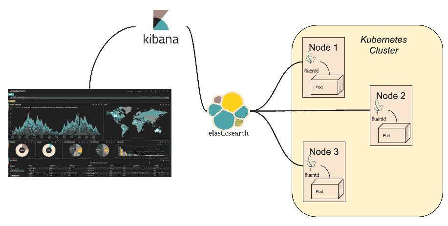

EFK 堆栈

通常，日志消息的流程如下:

1.  容器记录到标准输出。
2.  Fluentd 与 pod/container 运行在同一个节点上，并捕获日志消息流。
3.  Fluentd 可以被配置为将日志消息转发到多个后端，包括 Elasticsearch。
4.  Elasticsearch 尽可能多地存储和索引它从 Fluentd 接收的日志消息。[结构化日志](https://www.kartar.net/2015/12/structured-logging/)显著提高了 Elasticsearch 索引日志消息的能力。
5.  Kibana 能够查询 Elasticsearch 数据库，并能够以可视化方式呈现结果。

下图说明了 Prometheus 和 Grafana 如何适应应用程序架构:

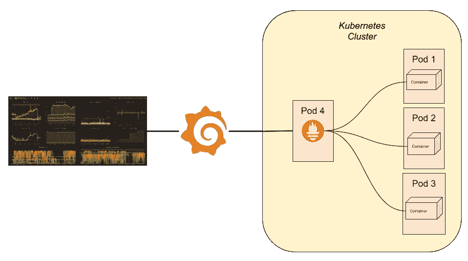

普罗米修斯和格拉夫纳

度量数据的流程如下:

1.  普罗米修斯*从应用程序中抓取*(即*提取*)度量数据。应用程序公开一个`/metrics`端点，通常在端口 5000 上，Prometheus 会定期轮询该端点。Kubernetes 注释的使用使 Prometheus 能够发现用 Prometheus 注释的适当集合注释的 pod。
2.  Prometheus 将度量数据存储在自己的时间序列数据库中。
3.  Grafana 利用 Prometheus 的查询语言 PromQL 来创建可用于可视化指标数据的仪表板。Grafana 也可以用作警报源。可以在 Grafana 中设置阈值，以便在给定指标超出界限时触发警报(例如，请求花费的时间太长)。

敏锐的观察者会注意到 Kibana 和 Grafana 都是数据可视化工具。这就引出了一个问题:为什么我们两者都需要？原因是目前 Grafana 对日志可视化的支持是有限的，并且处于测试阶段，而 Kibana 和 Elasticsearch 可以管理和显示 Prometheus 数据。鉴于 Grafana 的测试性质，我决定它还不适合生产使用。尽管如此，这仍然是一个有趣的问题。我将继续关注这一点，并可能最终只使用其中一种来实现所有的数据可视化。

# 普罗米修斯

[Prometheus 是一个完整的“系统监控和警报工具包”](https://prometheus.io/docs/introduction/overview/)其组成部分包括:

*   从启用的应用程序中抓取指标数据的服务器，也是存储从这些应用程序中获得的时序数据的数据库
*   PromQL，用于查询数据库的 Prometheus 查询语言
*   各种语言的客户端库(支持大多数主要语言)
*   和其他组件([普罗米修斯文档](https://prometheus.io/docs/introduction/overview/)更详细地讨论了这些)

安装 Prometheus 需要 Helm 和 Traefik 入口控制器。如果您完成了我的文章[中关于在 Raspberry Pi 集群上设置 Kubernetes Ingress 的先决条件步骤，](https://medium.com/better-programming/install-kubernetes-ingress-on-a-raspberry-pi-cluster-e8d5086c5009)您就已经安装了 Helm 并部署了 Traefik。如果没有，您需要先完成那篇文章中的步骤。

我有一个 [GitHub 库](https://github.com/youngkin/prometheus-kube)，里面有安装普罗米修斯所需的舵图。详细的安装和部署验证步骤可在[自述文件](https://github.com/youngkin/prometheus-kube/blob/master/README.md)中找到。简而言之，步骤如下:

1.  克隆存储库。
2.  运行`helm install ...`命令部署普罗米修斯。
3.  通过在 web 浏览器中打开 Prometheus 仪表板来验证部署。

普罗米修斯也可以从`[helm/charts/prometheus](https://github.com/helm/charts/tree/master/stable/prometheus)`库获得。这通常是用于将应用程序部署到 Kubernetes 集群的 Helm 图表的良好来源。由于缺乏 ARM 支持，我最初没有使用这个，但图表中当前引用的 [Docker 映像](https://registry.hub.docker.com/r/prom/prometheus)确实包含了[multi cup 架构支持](https://docs.docker.com/docker-for-mac/multi-arch/)，包括`arm`，所以它可能会工作。然而，它并不支持我一直使用的`arm32v7`或`armhf`。

如果你喜欢，可以随意使用这种方法，只是要知道它可能不适用于覆盆子酱。如果你确实使用了这种方法并且有效，请留下你的评论，我会相应地更新这篇文章。

# 格拉夫纳

[Grafana](https://grafana.com/) 是一个平台，让您“查询、可视化、提醒和理解您的指标，无论它们存储在哪里。”该功能包括支持 Prometheus 作为数据源。Grafana 也可以用来对 Telegraf 产生的指标进行同样的操作，如本文后面所述。本节描述如何在树莓 Pi 上安装 Grafana。

首先需要说明的是:我没有将 Grafana 部署到 Kubernetes 中，因为我想保留将其移动到不在 Kubernetes 集群中的专用 Raspberry Pi 的选项，或者将其完全从 Raspberry Pi 集群中移除。这背后的基本原理是，我的群集现在已经达到了最大容量，我希望能够灵活地释放资源。

和以前的文章一样，如果有关于如何完成安装 Kubernetes 这样的事情的好资料，我会参考该资料来获得如何安装参考包的说明。我也会在这里这样做。有一篇名为“[如何在树莓平台](https://www.circuits.dk/install-grafana-influxdb-raspberry/)上安装 Grafana+InfluxDB”的优秀文章，很好地介绍了在树莓平台上安装 Grafana 所需的步骤。正如标题所示，它还涵盖了如何安装 InfluxDB。这是一个可选步骤。如果您打算使用 Telegraf 进行如下所述的机器监控，我建议您现在就这样做。

如果你安装了 InfluxDB，你可能会遇到我遇到的问题。当通过运行`influxd`来验证上面文章中描述的安装时，我得到一个错误消息，说找不到`influxd`。为了解决这个问题，我通过`sudo apt remove influxdb`卸载了它。我再次重新安装了 InfluxDB——非常仔细地按照“[如何在树莓 Pi 上安装 Grafana+InfluxDB](https://www.circuits.dk/install-grafana-influxdb-raspberry/)”中的说明。这解决了问题，但我仍然不确定我是否错过了什么。

在开始之前，有一点需要注意，我的题为“[在 Raspberry Pi 集群上开发和部署 Kubernetes 应用程序](https://medium.com/better-programming/develop-and-deploy-kubernetes-applications-on-a-raspberry-pi-cluster-fbd4d97a904c)”的系列文章假设您要部署的 Raspberry Pi 可以通过外部网络中的浏览器访问。在本系列的第二篇文章[中，介绍了如何创建一个 Raspberry Pi 集群](https://medium.com/better-programming/how-to-set-up-a-raspberry-pi-cluster-ff484a1c6be9)，我设置了一个 Raspberry Pi 作为路由器，将私有集群网络与外部网络连接起来。我在这个 Pi(又名 *Pi 路由器*)上安装了 Grafana，因为我想从集群外部访问 Grafana。我将在后面使用浏览器验证 Grafana 安装的步骤中回到这个问题。

我一字不差地遵循了文章中给出的说明。它们包括安装 Grafana v 6 . 2 . 2。Grafana 现在升级到了 v6.7.2，所以现在有了一个新的 Debian 包，可以用来代替文章中提到的那个包。如果您决定使用较新的版本，请将文章中的步骤 1 替换为:

```
sudo apt-get install -y adduser libfontconfig1
wget [https://dl.grafana.com/oss/release/grafana_6.7.2_armhf.deb](https://dl.grafana.com/oss/release/grafana_6.7.2_armhf.deb)
sudo dpkg -i grafana_6.7.2_armhf.deb
```

这将检索 ARMv7 的 Debian 包，如 [Grafana 下载页面](https://grafana.com/grafana/download?platform=arm)所述。

为了验证 Grafana 的安装，您可以使用之前创建的 Prometheus 部署进行测试。完成此操作的步骤如下:

1.  按照参考文章中的描述打开 Grafana 仪表板并登录。**注意**:您可能需要将 Grafana 仪表板的地址改为类似于`[http://xxx.xxx.xxx.xxx:3000](http://xxx.xxx.xxx.xxx:3000)`的地址，以说明安装 Grafana 的 Raspberry Pi 的 IP 地址。我在上面提到过，您需要将 Grafana 安装在一个可以从 Kubernetes 集群外部访问的 Raspberry Pi 上。在我的部署中，Grafana 仪表板的 URL 是`[http://10.0.0.100:3000](http://10.0.0.100:3000)`。
2.  通过设置 Prometheus 数据源，测试是否可以访问 Prometheus，如下图所示。**注:**第三幅图像中的设置参考`[http://prom.kube](http://prom.kube)`，如前一节参考的[普罗米修斯部署指令](https://github.com/youngkin/prometheus-kube)中所述):

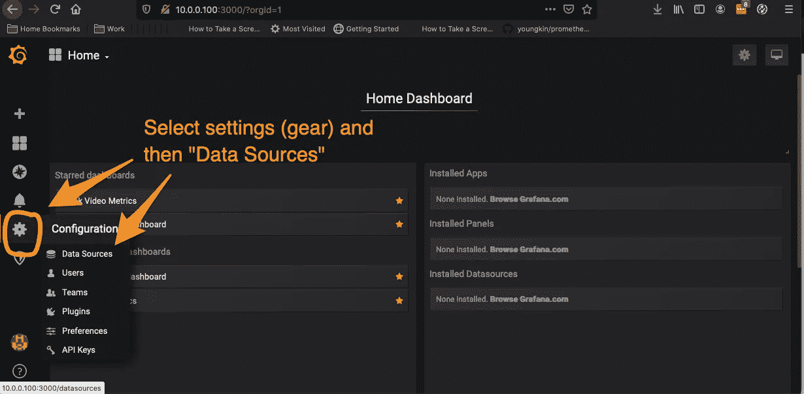

打开数据源屏幕

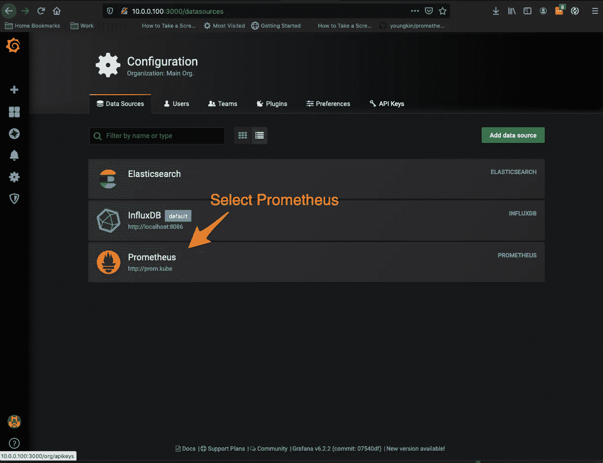

建立一个普罗米修斯数据源

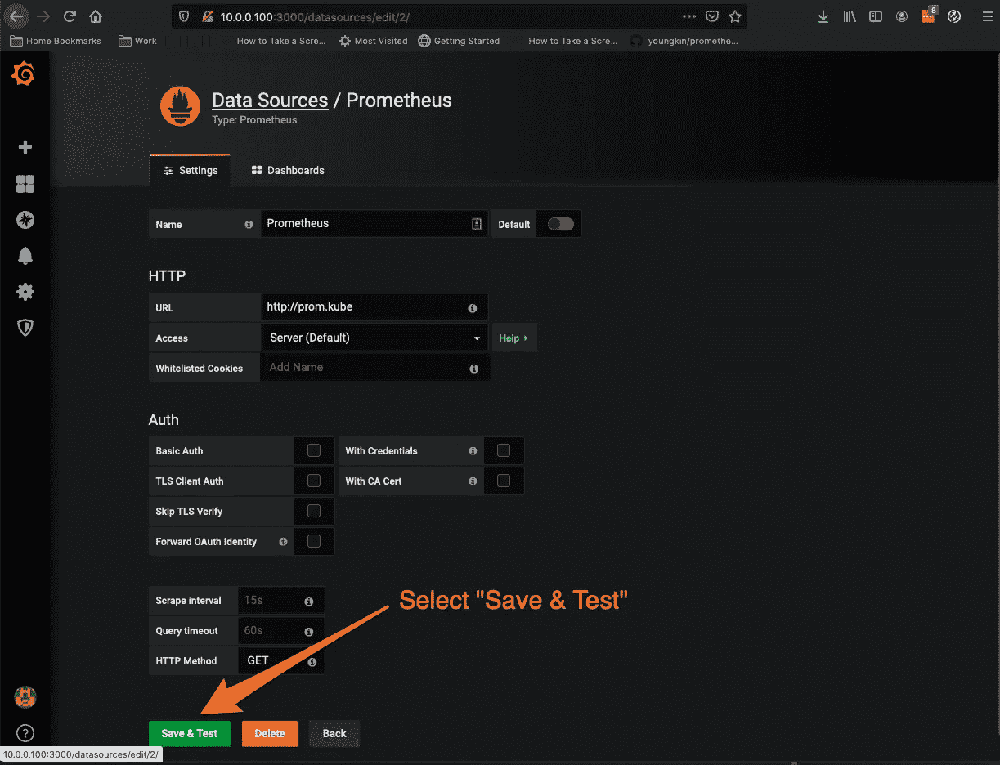

如图所示设置数据源，并进行测试

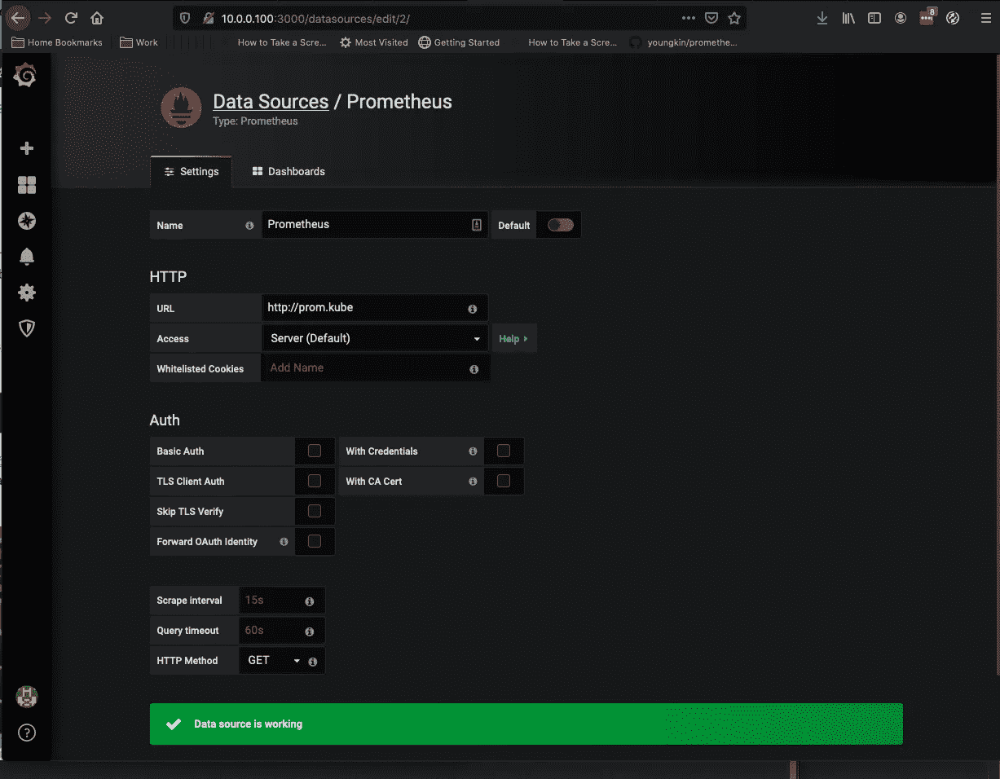

过一会儿，您应该会看到“数据源正在工作”

# Elasticsearch、Fluentd 和 Kibana

你可能对麋鹿栈比较熟悉:Elasticsearch-Logstash-Kibana。在本文中，我们使用 Fluentd 代替 Logstash。根据[一些有限的研究，](https://platform9.com/blog/kubernetes-logging-comparing-fluentd-vs-logstash/) Fluentd 似乎更容易建立，在基础设施方面要求更少，并无缝集成到 Docker 中。

我也选择了 Fluentd 而不是 Fluent Bit。当我开始做这个的时候，我对 Fluent Bit 并不熟悉。回想起来，我希望我已经并且能够做更多的研究，看看哪一个最适合部署 Raspberry Pi/Kubernetes。这是我可能会在以后的文章中或者作为本文的更新回来讨论的内容。

与 Grafana 一样，我选择不将 Elasticsearch 和 Kibana 部署到 Kubernetes 集群中。与 Grafana 不同，我选择将它们安装在我的 MacBook Pro 上。我这样做的原因与 Grafana 相似，但是我不想给 Raspberry Pi 集群增加更多的负载，特别是 Pi 路由器。

## 弹性搜索

许多来源建议使用自制软件安装 Elasticsearch。我最初就是这么做的。当我用 Homebrew 安装 Elasticsearch 时，它安装了 v6.8.7\. [原来我的 Fluentd Docker 镜像需要 v7.x](https://stackoverflow.com/questions/60470888/fluentd-elasticsearch-plugin-not-connecting-to-elasticsearch-from-kubernetes-on) ，所以我最后[从 Elasticsearch 网站](https://www.elastic.co/downloads/elasticsearch)下载了 TAR 文件的 7.6.2 版本。我将文件解压到`/usr/local`中，这样就创建了`user/local/elasticsearch-7.6.0`目录:

```
sudo tar xvf elasticsearch-7.6.0-darwin-x86_64.tar.gz
```

需要注意的是，Elasticsearch 是一个 Java 应用，需要 Java 8。Java 8 可以从[甲骨文 Java 下载网站](https://www.oracle.com/java/technologies/javase-jdk8-downloads.html)下载安装。下载的是一个`.dmg`文件，所以安装起来相当容易。

启动 Elasticsearch 很简单——只需运行`/usr/local/elasticsearch-7.6.0/bin/elasticsearch`(路径可能会根据下载的版本和实际解压到的位置而有所不同)。Elasticsearch 应该会启动，您最终应该会在 stdout 中看到如下内容:

```
OpenJDK 64-Bit Server VM warning: Option UseConcMarkSweepGC was deprecated in version 9.0 and will likely be removed in a future release.
[2020-04-08T15:26:19,746][INFO ][o.e.e.NodeEnvironment    ] [Richs-MacBook.local] using [1] data paths, mounts [[/System/Volumes/Data (/dev/disk1s1)]], net usable_space [156.2gb], net total_space [465.6gb], types [apfs]
[2020-04-08T15:26:19,761][INFO ][o.e.e.NodeEnvironment    ] [Richs-MacBook.local] heap size [989.8mb], compressed ordinary object pointers [true]
[2020-04-08T15:26:19,978][INFO ][o.e.n.Node               ] [Richs-MacBook.local] node name [Richs-MacBook.local], node ID [EQqVfk2TTRSp1I37Yz4ZYg], cluster name [elasticsearch]
[2020-04-08T15:26:19,979][INFO ][o.e.n.Node               ] [Richs-MacBook.local] version[7.6.0], pid[25833], build[default/tar/7f634e9f44834fbc12724506cc1da681b0c3b1e3/2020-02-06T00:09:00.449973Z], OS[Mac OS X/10.15.2/x86_64], JVM[AdoptOpenJDK/OpenJDK 64-Bit Server VM/13.0.2/13.0.2+8]
[2020-04-08T15:26:19,979][INFO ][o.e.n.Node               ] [Richs-MacBook.local] JVM home [/usr/local/elasticsearch/elasticsearch-7.6.0/jdk.app/Contents/Home]
[2020-04-08T15:26:19,979][INFO ][o.e.n.Node               ] [Richs-MacBook.local] JVM arguments [-Des.networkaddress.cache.ttl=60, -Des.networkaddress.cache.negative.ttl=10, -XX:+AlwaysPreTouch, -Xss1m, -Djava.awt.headless=true, -Dfile.encoding=UTF-8, -Djna.nosys=true, -XX:-OmitStackTraceInFastThrow, -Dio.netty.noUnsafe=true, -Dio.netty.noKeySetOptimization=true, -Dio.netty.recycler.maxCapacityPerThread=0, -Dio.netty.allocator.numDirectArenas=0, -Dlog4j.shutdownHookEnabled=false, -Dlog4j2.disable.jmx=true, -Djava.locale.providers=COMPAT, -Xms1g, -Xmx1g, -XX:+UseConcMarkSweepGC, -XX:CMSInitiatingOccupancyFraction=75, -XX:+UseCMSInitiatingOccupancyOnly, -Djava.io.tmpdir=/var/folders/9z/lyfc9l3500b_111_x89br7bh0000gn/T/elasticsearch-16970401582958554317, -XX:+HeapDumpOnOutOfMemoryError, -XX:HeapDumpPath=data, -XX:ErrorFile=logs/hs_err_pid%p.log, -Xlog:gc*,gc+age=trace,safepoint:file=logs/gc.log:utctime,pid,tags:filecount=32,filesize=64m, -XX:MaxDirectMemorySize=536870912, -Des.path.home=/usr/local/elasticsearch/elasticsearch-7.6.0, -Des.path.conf=/usr/local/elasticsearch/elasticsearch-7.6.0/config, -Des.distribution.flavor=default, -Des.distribution.type=tar, -Des.bundled_jdk=true]...[2020-04-08T15:26:26,909][INFO ][o.e.n.Node               ] [Richs-MacBook.local] started
[2020-04-08T15:26:27,129][INFO ][o.e.l.LicenseService     ] [Richs-MacBook.local] license [2b1f4f4b-1c35-4b77-ae7f-6c9c6a590f36] mode [basic] - valid
[2020-04-08T15:26:27,129][INFO ][o.e.x.s.s.SecurityStatusChangeListener] [Richs-MacBook.local] Active license is now [BASIC]; Security is disabled
```

您可以通过`curl`或将浏览器指向`[http://localhost:9200](http://localhost:9200)`来验证安装。您应该会看到弹性搜索状态信息，如:

```
{
  "name": "Richs-MacBook.local",
  "cluster_name": "elasticsearch",
  "cluster_uuid": "OkZ2-Lj2RjW-pVyVl0C7og",
  "version": {
    "number": "7.6.0",
    "build_flavor": "default",
    "build_type": "tar",
    "build_hash": "7f634e9f44834fbc12724506cc1da681b0c3b1e3",
    "build_date": "2020-02-06T00:09:00.449973Z",
    "build_snapshot": false,
    "lucene_version": "8.4.0",
    "minimum_wire_compatibility_version": "6.8.0",
    "minimum_index_compatibility_version": "6.0.0-beta1"
  },
  "tagline": "You Know, for Search"
}
```

## 基巴纳

和 Elasticsearch 一样，许多资料来源也推荐通过自制软件安装 Kibana。和 Elasticsearch 一样，那个版本对我不起作用，所以我最终采用了和 Elasticsearch 一样的方法。我从 [Kibana 下载页面](https://www.elastic.co/downloads/kibana)下载了 7.6.2 版本的 TAR 文件，并将文件解压到`usr/local`中，这样就创建了`user/local/kibana-7.6.0-x86_64`目录。

```
sudo tar xvf kibana-7.6.0-darwin-x86_64.tar.gz
```

启动 Kibana 很简单——只需运行`/usr/local/kibana-7.6.0-x86_64/bin/kibana`(路径可能会有所不同，这取决于下载的版本和实际解压到的位置)。Kibana 应该会启动，您最终应该会看到类似下面的内容记录到 stdout 中:

```
log   [21:26:53.163] [info][plugins-service] Plugin "case" is disabled.
  log   [21:27:08.526] [info][plugins-system] Setting up [37] plugins: [taskManager,siem,infra,licensing,encryptedSavedObjects,code,usageCollection,metrics,canvas,timelion,features,security,apm_oss,translations,reporting,share,uiActions,data,navigation,newsfeed,status_page,home,spaces,cloud,apm,graph,bfetch,kibana_legacy,management,dev_tools,inspector,embeddable,advancedUiActions,dashboard_embeddable_container,expressions,visualizations,eui_utils]...log   [21:27:11.671] [info][status][plugin:reporting@7.6.0] Status changed from uninitialized to green - Ready
  log   [21:27:11.699] [info][listening] Server running at [http://localhost:5601](http://localhost:5601)
  log   [21:27:11.824] [info][server][Kibana][http] http server running at [http://localhost:5601](http://localhost:5601)
```

您可以通过打开浏览器窗口到`[http://localhost:5601/status](http://localhost:5601/status)`来验证安装。您应该会看到类似这样的内容:

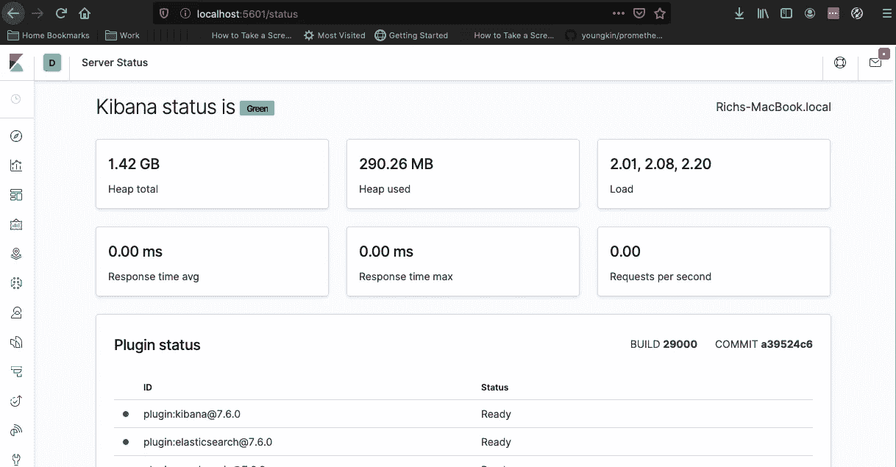

基巴纳状态页面

## 流体 d

Fluentd 结果有点困难。虽然 ARM 有 Fluentd Docker 图像，但它们不是为 Elasticsearch 配置的。虽然 Elasticsearch 有不同的配置，但它们并没有使用 ARM 图像。

我的任务变成了找到一个 ARM Docker 图像的`Dockerfile`，并修改它以添加 Elasticsearch 支持。我最终使用了三种不同的 Fluentd GitHub 回购来完成这一任务，并为我创造的弗兰肯斯坦创建了我自己的 GitHub 回购，`[youngkin/fluentd-armv7-raspbpi](https://github.com/youngkin/fluentd-armv7-raspbpi)` [，](https://github.com/youngkin/fluentd-armv7-raspbpi)。可能有更好的方法来做到这一点，但这确实有效。

第一个任务是找到一个 Fluentd `Dockerfile`，最好是 ARM 的。我在`[fluentd/fluentd-docker-image](https://github.com/fluent/fluentd-docker-image)` GitHub repo 中找到了我需要的东西，特别是在`v1.9/armhf/debian`子目录中。这给了我所需要的基础。这个回购也有我需要的基本`fluentd.conf`文件。

根据我在 Fluentd/Elasticsearch 配置上找到的一些文章，我更改了这个文件中的一些设置。在`fluentd.conf`文件中有这些文章的链接。理想情况下，我会将所有这些信息放入一个`Configmap`中，但那是以后的事了。

我还需要修改由`Dockerfile`引用的`entrypoint.sh`文件。需要更改它来设置 Fluentd 使用的`SIMPLE_SNIFFER`环境变量。它没有被包括在内，这导致了 Fluentd 启动时的初始化问题。

我的第二个任务是为 Fluentd 图像找到一个`Dockerfile`,该图像配置了合适的 Ruby gems 用于 Elasticsearch。Fluentd 是用 Ruby 编写的，使用插件方法来扩展它的功能。Elasticsearch 就是这些插件中的一个(实际上是几个)。

我在 [](https://github.com/fluent/fluentd-kubernetes-daemonset) `[fluentd-kuberentes-daemonset](https://github.com/fluent/fluentd-kubernetes-daemonset)` GitHub repo 里找到了我要找的东西，具体在`docker-image/v1.9/debian-elasticsearch7/Dockerfile`里。我在同一个目录中使用了`Gemfile`中引用的 Ruby Gems 列表，因为这是`Dockerfile`安装的 gem 的来源。我手动将宝石参考复制到我的`[fluentd-docker-image](https://github.com/fluent/fluentd-docker-image)`T5 副本中。我使用这个修改后的 Docker 文件来构建我需要的 Fluentd Docker 映像，并将其推送到 Docker Hub 中的`[ryoungkin/fluentd-kube-daemonset:v1.9-arm32.0.0.20](https://hub.docker.com/repository/docker/ryoungkin/fluentd-kube-daemonset)`。以下是更多相关信息。

最后，我需要/想要一个 Kubernetes 部署文件。如果已经有这样的工具，为什么还要自己编写呢？我从一篇名为“[用 Elasticsearch、Kibana 和 Fluentd](https://mherman.org/blog/logging-in-kubernetes-with-elasticsearch-Kibana-fluentd/#fluentd) 登录 Kubernetes”的文章中发现

虽然目标部署是 Minikube，但是它有我可以使用的 Kubernetes 部署文件，特别是一个`DaemonSet`规范。这些文件在与那篇文章相关的 GitHub repo 中。我修改了文件`efk-kubernetes/kubernetes/fluentd-daemonset.yaml`，以引用我创建并推送到 Docker Hub 的 Docker 映像。我还修改了`fluentd-daemonset.yaml`文件中的一些其他信息。

我将这些修改过的文件创建成一个 GitHub repo，`[fluentd-armv7-raspbpi](https://github.com/youngkin/fluentd-armv7-raspbpi)`，来存放我需要的东西。这些文件及其用法如下:

*   `Dockerfile`:创建 Fluentd 在 ARMv7 处理器上运行所需的 Docker 映像(例如，Raspberry Pi)。运行`docker build <somedockerhubrepo>/<somename>:<sometag>`。在我的例子中，我运行了`docker build ryoungkin/fluentd-kube-daemonset:v1.9-arm32.0.0.2`，引用了我的 Docker 存储库中的 Docker 映像。我用一个`docker push`跟随它，这样它会被更广泛地使用。如果您愿意，您可以克隆 repo 并创建自己的 Docker 映像。
*   `entrypoint.sh`:这是`Dockerfile`中指定的运行目标。如上所述，它被修改为包含一个对`SIMPLE_SNIFFER`环境变量的定义。
*   `fluent.conf`:这是`Dockerfile`中引用的 Fluentd 配置文件
*   `fluentd-daemonset.yaml`:这是将 Fluentd 部署到集群中每个 Kubernetes 节点所需的 Kubernetes 规范。该文件必须根据您的具体环境进行修改，因为它包含了 Elasticsearch 服务器的地址/端口。它还包括一些您可能想要更改的资源限制。

部署 Fluentd 是通过运行`kubectl -n kube-system create -f fluentd-daemonset.yaml`来完成的。如果一切顺利，当 pod 都在运行时，您将看到类似这样的内容(假设您的集群中有五个节点，包括`kubemaster`):

```
kubectl -n kube-system get pods | grep flu
fluentd-4vhv2                         1/1     Running   0          99m
fluentd-8bs9f                         1/1     Running   0          98m
fluentd-b9hbw                         1/1     Running   0          98m
fluentd-dldwp                         1/1     Running   0          98m
fluentd-v7czq                         1/1     Running   0          98m
```

# Telegraf

Telegraf 支持监控机器资源，如 CPU 和磁盘使用情况。因为 Telegraf 需要 InfluxDB，所以您需要安装它。安装说明可在本文[中找到，](https://www.circuits.dk/install-grafana-influxdb-raspberry/)也可在 Grafana 的上述章节中找到。和 Grafana 一样，我基本上一字不差地照着做了。

因为 Telegraf 监视机器资源，所以它没有安装到 Kubernetes 集群中。它应该直接安装在 Raspberry Pi 主机上，就像上面的 Grafana 一样。如果您想监控整个集群的资源利用情况，就需要在集群中的每个节点上安装它。

文章"[使用 Telegraf、InfluxDB 和 Grafana 进行监控](https://angristan.xyz/2018/04/monitoring-telegraf-influxdb-grafana/)"描述了如何安装 Telegraf。本文还介绍了如何安装 InfluxDB 并将其配置为与 Telegraf 一起工作，因此请仔细阅读 InfluxDB 部分以了解一般背景知识。可以忽略关于安装 Grafana 的部分。

我调整了 Telegraf 的配置，使用来自 GitHub repo 的一些文件来捕获 CPU 温度指标。具体来说，我添加了从`[telegraph.conf](https://github.com/TheMickeyMike/raspberrypi-temperature-telegraf/blob/master/telegraf.conf)`到`/etc/telegraf/telegraf.conf`的几行。我有一份我修改过的`/etc/telegraf/telegraf.conf`在[这个要诀](https://gist.github.com/youngkin/f18e0feed7dc8651ad7843f9c5b42c03)里。

## 仪表盘

下图显示了一个 Telegraf 仪表板。我在 [Grafana Dashboards](https://grafana.com/grafana/dashboards/928) 网站上找到了 Telegraf dashboard 的定义。按照该网站上关于导入仪表板的[说明进行安装非常容易。您可以使用上面提到的 Telegraf 仪表板，或者您可以使用我创建的一个仪表板，如下所述。](https://grafana.com/docs/grafana/latest/reference/export_import/)

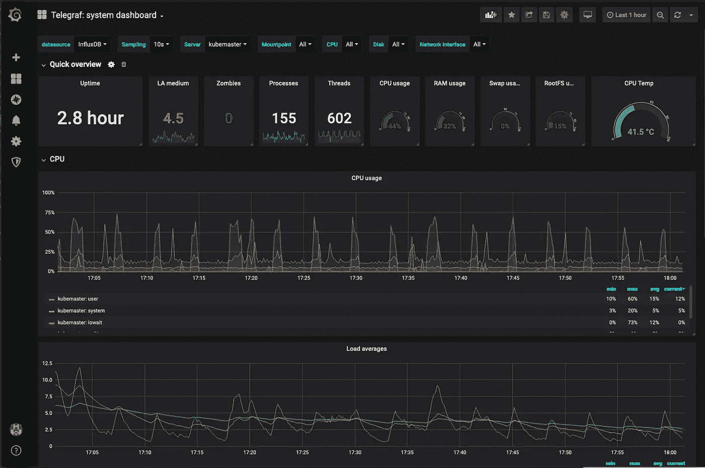

Telegraf 仪表板示例

上面显示的仪表板是我修改的。它利用了我添加到`/etc/telegraf/telegraf.conf`的 CPU 温度指标。它的 JSON 定义可以在 [this gist](https://gist.github.com/youngkin/c82b9ac749cd5884d3a829e68434be86) 中找到。您可以通过导入新的控制面板来根据该要点创建控制面板，如以下屏幕截图所示:

1.  单击左侧导航区域中显示的+号，并从弹出窗口中选择“Import”。

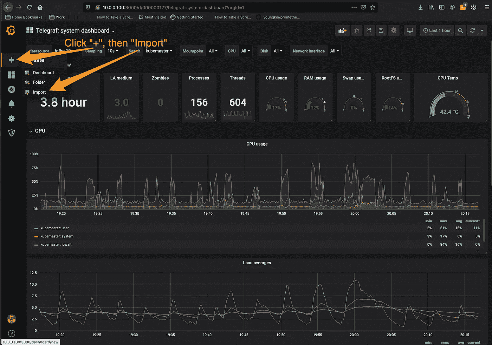

第一步:点击+号，然后点击“导入”

2.将要点中的 [JSON 粘贴到“或粘贴 JSON”文本框中。然后，单击“加载”按钮。](https://gist.github.com/youngkin/c82b9ac749cd5884d3a829e68434be86)

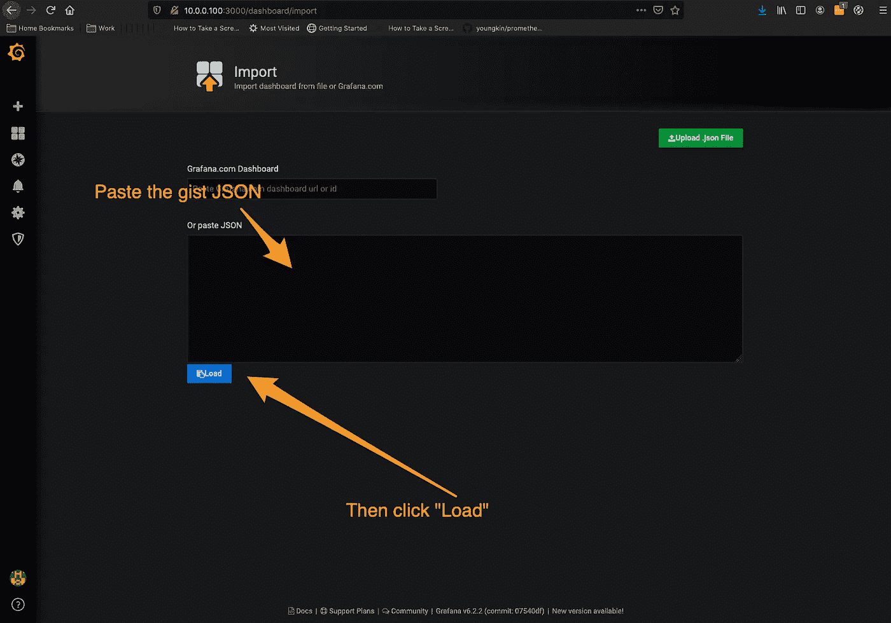

第二步:粘贴上面要点中的 JSON，然后点击“加载”按钮

3.按照提示完成导入过程。

要打开新创建的仪表板，请单击左上角的螺旋太阳图标。如下图所示:

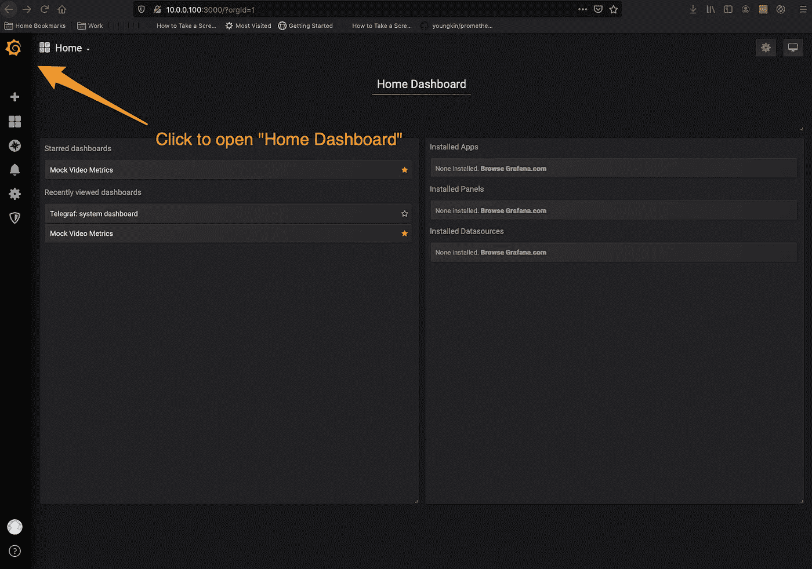

主页仪表板页面

您将看到一个名为“Telegraf:系统仪表板”的仪表板单击该图标，将显示仪表板。

# 摘要

这篇文章我们做了很多。我们用 Grafana 安装并测试了 Prometheus。然后，我们安装了 EFK 堆栈并验证了安装。最后，我们将 Telegraf 部署到托管 Kubernetes 集群的机器上，并安装了 Grafana 仪表板来显示 Telegraf 主机指标。

这就完成了我们在本系列第二篇文章中开始的基础设施设置，“设置一个 Raspberry Pi 集群”现在，我们准备将一个重要的 RESTful 应用程序部署到我们的 Kubernetes 集群中。该应用程序将利用 Helm 部署，公开我们可以在 Grafana 中查看的 Prometheus 指标，并发布我们可以在 Kibana 中查看/查询的日志。

# 参考

## 一般监控资源

*   [红色的监控方法](https://rancher.com/red-method-for-prometheus-3-key-metrics-for-monitoring/)
*   [《测试你的应用:最佳实践》，来自 weaver works](https://www.weave.works/docs/cloud/latest/tasks/monitor/best-instrumenting/)
*   [谷歌 SRE 指南，第 6 章——监控分布式应用](https://landing.google.com/sre/sre-book/chapters/monitoring-distributed-systems/)
*   [“指标与日志的困境—第 2 部分](https://www.wavefront.com/metrics-vs-logs-dilemma-part-2/)”
*   [“指标与日志的困境—第 3 部分](https://www.wavefront.com/metrics-vs-logs-dilemma-series-3-3/)”
*   [“结构化日志记录](https://www.kartar.net/2015/12/structured-logging/)

## 监控包

*   [普罗米修斯概述](https://prometheus.io/docs/introduction/overview/)
*   [普罗米修斯查询语言](https://prometheus.io/docs/prometheus/latest/querying/basics/)
*   [Grafana.com](https://grafana.com/)
*   [弹性搜索和基巴纳](https://www.elastic.co/elastic-stack)
*   [流体](https://www.fluentd.org/)
*   [InfluxDB 和 Telegraf](https://www.influxdata.com/products/)
*   [查询 InfluxDB](https://docs.influxdata.com/influxdb/v1.7/query_language/data_exploration/#the-basic-select-statement)

## 安装资源

*   [普罗米修斯](https://github.com/youngkin/prometheus-kube/blob/master/README.md)
*   [“如何在树莓 Pi 上安装 Grafana+InfluxDB](https://www.circuits.dk/install-grafana-influxdb-raspberry/)”
*   [“使用 Telegraf、InfluxDB 和 Grafana](https://angristan.xyz/2018/04/monitoring-telegraf-influxdb-grafana/) 进行监控”