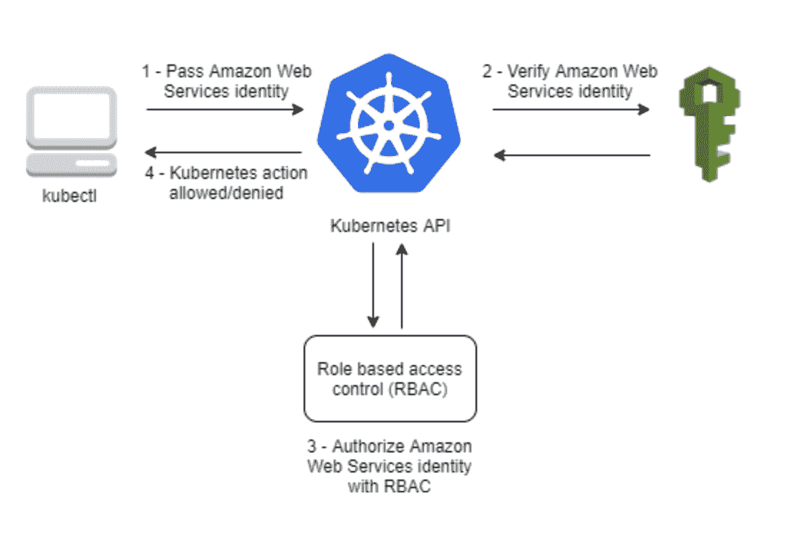
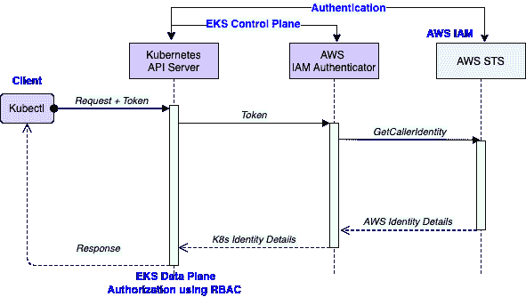

# 使用 IAM 验证器在 AWS EKS 进行 Kubernetes 验证

> 原文：<https://betterprogramming.pub/kubernetes-authentication-in-aws-eks-using-iam-authenticator-de3a586e885c>

## Kubernetes 如何与 AWS IAM authenticator 集成



EKS 认证。图片来自 AWS

# 语境

基于不同的云提供商实施，Kubernetes 有不同的认证方式。我将专门讨论由 AWS EKS 实现的认证。本文应澄清以下问题。

*   认证在 EKS 是如何工作的？
*   Kubernetes 的 AWS IAM 认证器是什么？
*   KubeConfig 中的“aws eks get-token”用来访问 eks 集群做什么？
*   什么是 EKS 的“aws-auth”配置图？
*   如何添加 AWS 用户/角色来访问 EKS 集群？
*   AWS 用户/角色如何映射到 EKS 的 Kubernetes 用户和组？
*   如何为 EKS 集群生成 KubeConfig？
*   如何授权用户执行特定的 Kubernetes 操作？

# 范围

本文介绍了 AWS EKS 服务。您将详细了解 AWS EKS 使用 IAM 认证器实现 Kubernetes 认证。它只包括使用 RBAC 的 Kubernetes 授权的高级必需细节。

# 先决条件

*   对 Kubernetes 的基本了解
*   了解 AWS IAM 用户和角色

# 什么是 EKS？

## 背景

如您所知，在任何 Kubernetes 集群中都有一个控制平面(主节点)和数据平面(工作节点)。控制计划负责管理工作节点，工作节点是使用 Kubernetes 对象(如 pod、deployment、services 等)部署应用程序工作负载的地方。

随着越来越多的云原生技术的发展，配置、部署和管理 Kubernetes 是一项非常具有挑战性的任务。大多数公司都想让他们的产品快速上市。他们不想花时间管理集群，而只想专注于产品交付。他们只想让开发人员访问集群来部署他们的应用程序，摆脱对集群的管理，或者至少限制只管理部署应用程序的工作节点。

不同的云提供商提供不同的托管解决方案，他们管理控制平面和数据平面的某些部分。

## 弹性 Kubernetes 服务(EKS)

EKS 是 AWS 为 Kubernetes 提供的托管解决方案。

我不打算详述 EKS 的特色。简而言之，控制平面是由 EKS 的 AWS 管理的高可用主节点，因此用户不能访问主节点，而只能访问 Kubernetes API 来部署他们的工作负载。如果需要，用户可以选择 AWS 管理的工作节点或自我管理的工作节点。

# 用于 Kubernetes 的 AWS IAM 验证器

Kubernetes 集群有多种身份验证方式，如证书、使用用户名和密码的基本身份验证以及身份验证令牌。在这里，我主要关注由 IAM authenticator 实现的认证。

在启动 EKS 时，AWS 包括对 IAM 用户和角色的本机支持，因此 IAM 用户和角色可以通过 EKS 集群进行身份验证。这个身份验证是由名为 AWS IAM Authenticator 的工具执行的。

AWS IAM Authenticator 可以手动安装在任何 Kubernetes 集群上，但是默认情况下它是随 EKS 一起安装的。

## 认证工作流程



EKS 认证工作流程:作者图片

*   客户端执行“kubectl get pods ”,它向 Kubernetes 的 API 服务器发送请求。除了标准的请求参数，它还在授权头中发送一个令牌，这是一个 base64 编码的签名请求字符串，发送给 AWS STS。
*   Kubernetes API 服务器向运行在 Kubernetes 控制平面中的已配置 IAM 认证服务器发送一个令牌。
*   IAM Authenticator 从请求正文中提取令牌，base64 解码令牌并验证 URI 主机、路径、请求参数、操作等。验证成功后，它会向 AWS STS 发送一个签名请求，以执行`GetCallerIdentity`操作。
*   AWS STS 验证从 IAM 验证器收到的请求的签名，然后执行`GetCallerIdentity`并发回响应，包括 IAM 身份细节，如用户/角色信息。
*   IAM Authenticator 根据 kube-system 名称空间中名为“aws-auth”的 ConfigMap 对象中配置的规则，将 AWS 身份映射到 K8s 身份，如用户和组。它将 K8s 标识发送回 Kubernetes API 服务器。
*   Kubernetes API 服务器根据部署在 Kubernetes 集群中的`Role`和`RoleBinding`对象的 RBAC 规则，对从 IAM authenticator 收到的 K8s 用户和组进行授权。如果用户被允许操作，那么响应将被发送回 kubectl 客户机。

# 使用 KubeConfig 生成令牌

我希望身份验证工作流已经清除了许多东西，但是您仍然会问，当我们使用 kubectl 发送请求时，令牌是如何生成的。

如您所知，Kubectl 使用 KubeConfig 连接到集群，所以一旦您在 EKS 创建了一个集群，那么您需要使用下面的命令生成 KubeConfig。

```
aws eks update-kubeconfig --region {region} --name {cluster-name}
```

它将在~/中生成/更新您的 KubeConfig 文件。kube/配置。看一下该文件中的用户部分。它使用不同的身份验证，使用“exec”方法通过“aws eks get-token”命令生成令牌。

如果您使用的 AWS CLI 版本早于 1.6.156，那么您将在“exec”下看到不同的命令在本例中，它使用“aws-iam-authenticator”客户端来生成访问令牌，因此您需要首先下载它来访问您的集群。

***注意*** *:您可以选择指定不同的 AWS_PROFILE 用于认证。*

# IAM 恒等式和 K8s 恒等式之间的映射

创建 EKS 集群时，它会在“kube-system”命名空间中创建一个名为“aws-auth”的默认配置映射。创建集群的 AWS 用户(admin)自动成为管理员，它将成为 Kubernetes 中“system:masters”组的一部分。

除了映射用户之外，还可以映射 IAM 角色，因此任何承担 IAM 角色的用户都将被映射到在“AWS-auth”config map 中配置的 K8s 用户和组。

# Kubernetes 中的授权

还没完成。将 IAM 标识映射到 K8s 标识并不赋予 K8s 标识对 K8s 对象的任何访问权限。您需要使用 K8s 中的`Role`和`RoleBinding`对象创建 RBAC 规则，这将授权 K8s 身份在 K8s 集群中执行操作。

Kubernetes 授权是一个很大的主题，超出了本文的讨论范围，所以我不会详细讨论，而是试图在下一节中作为示例用例的一部分来讨论。

好的。我什么都有了，但请让我看看实际情况。给你

# 使用案例—向 EKS 集群添加新用户

> 假设我想向我的 AWS EKS 集群添加一个新用户，并允许该用户在集群的“dev”名称空间中“创建、列出、修改、删除 pod 和部署”。

因为我已经创建了一个 EKS 集群，所以我自动获得了 K8s 集群的管理员权限。当我运行任何 kubectl 命令时，KubeConfig 使用“默认”概要文件。

如果在 KubeConfig 中没有指定 AWS 配置文件，或者没有使用`AWS_DEFAULT_PROFILE`环境变量在 KubeConfig 中执行“exec”命令来设置 AWS 配置文件。

让我首先创建一个“开发人员”用户，使用 AWS IAM 控制台进行编程访问，但没有任何 AWS 权限。使用 IAM 控制台中的凭据为“开发人员”用户创建新的 AWS 配置文件。

```
aws configure --profile developer
```

现在，让我们把“AWS-auth”`ConfigMap`输出到 YAML，或者你可以直接编辑`ConfigMap`。

```
kubectl -n kube-system get configmap aws-auth -o yaml
or
kubectl -n kube-system edit configmap aws-auth
```

我们将在“AWS-auth”`ConfigMap`中为名为“developer”的 IAM 用户添加到名为“k8s-developer”的 Kubernetes 用户的映射，并在 k8s 集群中部署`ConfigMap`。

```
$ kubectl apply -f aws-auth-configmap2.yaml
configmap/aws-auth configured
```

**注意** : *记住 Kubernetes 中没有“User”对象，所以我们可以给 K8s 用户取任何我们想要的名字，不一定要和 IAM 用户一样。*

我们已经完成了映射，我们需要使用 RBAC 规则向 k8s 用户“k8s-developer”授予所需的权限，所以让我们创建`Role`和`RoleBinding`对象，并将它们部署到 K8s 集群。

```
$ kubectl apply -f role-rolebinding.yaml
role.rbac.authorization.k8s.io/dev-role created
role.rbac.authorization.k8s.io/dev-role-binding created
```

让我们验证“开发人员”用户应该能够创建和列出 pod，但是不应该能够列出 K8s 节点。

```
# switch to developer profile
$ export AWS_DEFAULT_PROFILE=developer# create pod
$ kubectl run nginx --image=nginx --restart=Never --port=80
pod/nginx created# list pod
$ kubectl -n dev get pods
NAME         READY   STATUS    RESTARTS   AGE
nginx        1/1     Running   0          5s# list k8s nodes
$ kubectl get nodes
Error from server (Forbidden): nodes is forbidden: User "k8s-developer" cannot list resource "nodes" in API group "" at the cluster scope
```

如果切换到“默认”AWS 配置文件并尝试列出节点，应该可以正常工作，因为它使用名为“admin”的 IAM 用户，该用户映射到 K8s 中的“admin”用户和“system:master”组，提供对 K8s 集群的管理员访问。

# **结论**

我希望你已经找到了文章开始时所有问题的答案，现在事情已经很清楚了。

如果你喜欢这篇文章并且学到了新的东西，留下你的想法。

感谢阅读！

> 如果您有兴趣了解如何从 Kubernetes/EKS 获得 AWS 服务，请看看这篇文章。

[](https://faun.pub/how-to-access-aws-services-from-eks-ab5fa003a1b6) [## 如何从 EKS 访问 AWS 服务

### 从 Kubernetes 访问 AWS APIs 的解决方案

faun.pub](https://faun.pub/how-to-access-aws-services-from-eks-ab5fa003a1b6) 

# **参考文献**

*   [https://docs . AWS . Amazon . com/eks/latest/user guide/cluster-auth . html](https://docs.aws.amazon.com/eks/latest/userguide/cluster-auth.html)
*   [https://docs.aws.amazon.com/IAM/latest/UserGuide/id.html](https://docs.aws.amazon.com/IAM/latest/UserGuide/id.html)
*   [https://github.com/kubernetes-sigs/aws-iam-authenticator](https://github.com/kubernetes-sigs/aws-iam-authenticator)
*   [https://kubernetes.io/docs/reference/access-authn-authz/](https://kubernetes.io/docs/reference/access-authn-authz/)