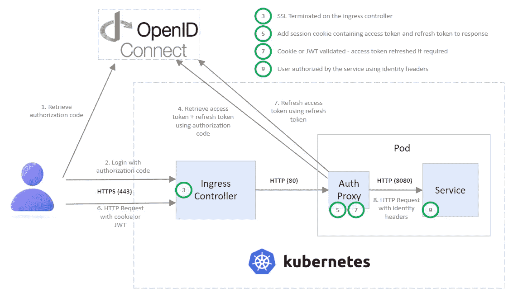
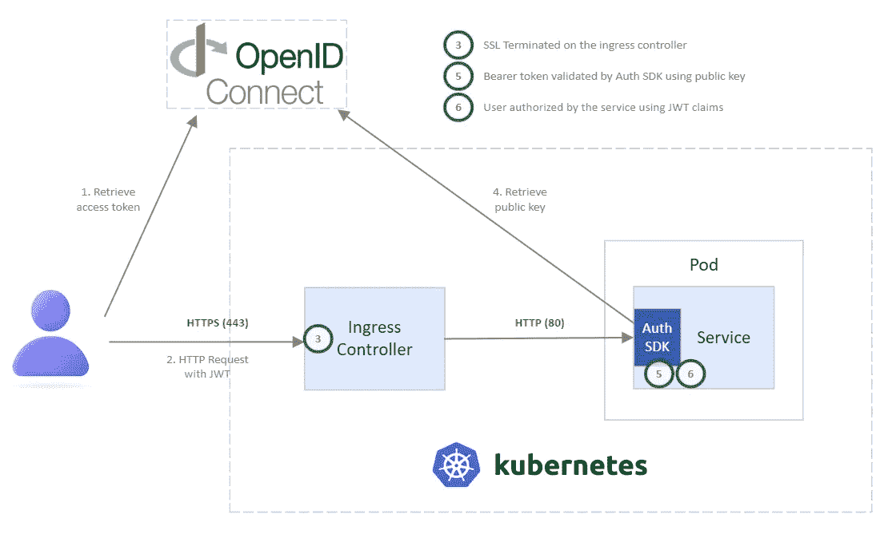
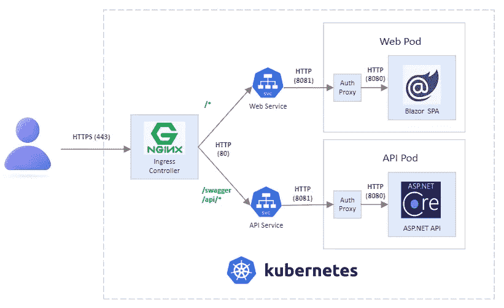

# Kubernetes 认证边车:微服务架构的启示

> 原文：<https://betterprogramming.pub/kubernetes-authentication-sidecars-a-revelation-in-microservice-architecture-12c4608189ab>

## 身份验证的历史以及如何在 Kubernetes 中使用 sidecar 容器以可重用的方式解决身份验证

作为软件工程师，我们花了太多的时间来设置认证和调试与认证相关的问题。我们都曾经掉进过这样的兔子洞，在那里我们的身份验证方法并不完全符合我们的预期，我们失去了几天(和头发)抓耳挠腮！

随着微服务的普及，越来越多的服务需要我们实现身份验证。在任何组织中，现在都有数百种不同的身份认证处理方式，并且使用了许多不同的库。

随着时间的推移，我们已经学会了卸载一些跨领域的问题，比如负载平衡器、API 网关和反向代理的 SSL 终止和 IP 授权。最近，像 Istio 和 Linkerd 这样的服务网格出现了，通过使用与我们的服务运行在同一个 Kubernetes pod 中的 sidecar 容器，帮助我们在更接近我们的应用运行的地方解决了一些问题。

sidecar 方法也可以用来卸载身份验证，这样我们的定制应用程序就不需要担心这个问题了。这篇文章展示了如何使用 ASP.NET YARP 作为反向代理来验证下游应用程序的请求。然而，任何技术都可以用于下游应用程序，只要它使用 HTTP。

这里讨论的反向代理思想并不特定于。并且可以使用大多数 web 技术来实现。

认证代理的完整代码可以在我的 GitHub [这里](https://github.com/matt-bentley/AuthenticationProxy)找到。

# 认证的历史

因此，在我们研究使用 sidecars 解决我们的身份验证问题之前，让我们先来看看身份验证是如何发展的。

## Cookie 身份验证

Cookies 已经被用于验证前端应用程序有一段时间了，但是传统上它们有一些缺点:

*   CSRF 攻击——CSRF 攻击是一种迫使用户发出附带 cookie 的意外请求的攻击。
*   会话 cookie——cookie 通常是有状态的，并且绑定到特定的服务器，这使得加载和平衡我们的应用程序变得很困难。这也使得它们很难用于认证我们的前端应用程序的 API。

## JWT 认证

JSON Web 令牌出现了，它通过提供自我验证的无状态令牌帮助我们解决了 cookies 的一些缺点。jwt 可以被解码以检索用户的声明，并使用公钥在任何服务器上进行验证。

由于这些原因，近几年来，JWTs 被推广者视为认证的圣杯…不幸的是，我们的故事并没有就此结束！使用 jwt 有一些人们经常忽视或不理解的主要缺点(如果你想了解更多，这里有一篇很棒的文章解释):

*   撤销-不能撤销 JWT。即使 JWT 被泄露，它仍然有效，直到过期，从而导致严重的安全漏洞。
*   XSS 攻击—jwt 通常存储在浏览器的本地存储中，这使得它们容易受到跨站点脚本攻击。当攻击者在您的网站上运行恶意 JavaScript 来提取 JWT 并将其发送到其他地方时，就会发生 XSS。

# 网络安全拯救世界！

幸运的是，随着时间的推移，cookies 和 jwt 的许多问题已经被安全特性所阻止:

*   SameSite 的 cookie 策略——现在可以在 cookie 上定义 cookie 策略，以限制它们在不同站点之间的使用。如果使用了`Strict`或`Lax`，则限制跨站点使用。
*   “HttpOnly”cookie—cookie 现在可以标记为 http only，这可以防止客户端脚本访问它们以阻止 XSS 攻击。
*   [数据保护密钥](https://docs.microsoft.com/en-us/aspnet/core/security/data-protection/configuration/overview?view=aspnetcore-6.0) —用于加密 cookie 的密钥现在可以安全地集中存储，以便分布式计算可以与 cookie 一起使用。
*   CORS 和 CSPs 现在可以在浏览器中实施 CORS 和内容安全策略，以防范 CSRF 和 XSS 的攻击。

## jwt 都死了；饼干万岁！

好吧，你可以对这个标题有所保留……jwt 仍然是验证用户身份的一个很好的方法，但是意识到风险是很重要的——确保使用短的过期时间，并且尽可能地限制服务器端的请求。

饼干怪兽——鸣谢:facebook.com

除了安全方面的好处，cookies 通常会使我们的应用程序更加简单，因为我们不需要定制代码来将它们附加到请求中，也不需要挑战访问我们网站的未经验证的用户。

最近，人们开始将他们的 jwt 安全地存储在 HttpOnly cookie 中，以便两全其美。

# 自我认证方法

我们需要实现的所有这些不同的选项和 web 安全策略听起来很复杂，不是吗？嗯，你是对的。认证有点像雷区，不是你想出错就能出错的！

然而，知道了这一点，一般来说，我们的团队和服务自己执行所有的认证逻辑。当使用这种方法时，当我们创建一个新项目时，我们必须解决的第一件事就是身份验证。

使用 JWTs 进行自我验证的典型过程如下所示:

自我认证方法

通常，jwt 用于认证用户，这意味着我们的应用程序必须解决两个不同的问题:

1.  必须在前端编写代码来检索访问令牌并将它们附加到请求上
2.  令牌必须经过服务器端验证，才能对用户进行身份验证

有许多身份验证 SDK 可以提供帮助，团队通常用他们自己的库来扩展这些 SDK。我们最终采用了这种方法，因为我们所有的开发人员都必须很好地理解这个问题，并且使用了大量不同的方法和库。

# 边车认证方法

为了减轻自认证方法的这些缺点，可以使用 sidecar 容器来代理对我们的服务的请求，并在请求到达我们的代码之前执行认证。

sidecar 模式是一种解耦模式，其中服务的支持功能由附属于主服务的 sidecar 容器提供。Sidecars 位于同一个 Kubernetes Pod 中，与其相关服务共享相同的生命周期，与服务一起创建和终止。

身份验证可以通过 sidecar 代理以多种不同的方式处理，但以下是我使用的方法:

边车认证方法

*   OpenId Connect with Authorization 代码流用于质询未经身份验证的用户，并在身份验证后保存一个会话 cookie
*   `access_token`和`refresh_token`存储在 cookie 中。这允许任何 sidecar 实例使用 cookie 来刷新`access_token`,并将其发送给下游应用程序，以便它们可以在需要时使用它
*   共享相同的数据保护密钥，以便 cookie 可以在不同的组件和实例上使用，例如负载平衡服务或另一个微服务
*   用户的身份通过头传递给下游服务
*   ASP。NET YARP(另一个反向代理)用于代理实现。参见下一节的实现
*   Cookies 或 jwt 可以用来认证请求。如果在请求中传递了一个承载令牌，它将用于身份验证。否则，将使用 cookies

## 边车认证的好处

实现身份验证代理相当复杂，但是这种方法的优点是只需要处理一次。还有其他一些好处:

*   开发可以由拥有该领域专家的平台团队来处理
*   可以支持复杂的逻辑，如刷新令牌和支持多种身份验证方法和身份提供者
*   更容易迁移到新的协议和方法
*   应用程序团队根本不需要身份验证代码。由于 cookies 是默认使用的，它们将自动被我们的网站使用
*   通过头传递的身份使得测试更容易，我们可以在没有代理的情况下运行，或者创建一个模拟代理进行测试

## 转发的声明和标题

选择报头来传递标识信息，以便下游应用程序不需要额外的配置。jwt 可以用于声明，但是下游应用程序需要知道发布机构以及如何验证 jwt。

目前，人们使用这种方法传递身份还有许多其他方式。希望随着时间的推移，越来越多的人采用这种技术，该行业将与一些推荐的最佳实践保持一致，不管是什么。

`access_token`通过授权头传递给下游请求，以便下游应用程序可以使用它为用户发出额外的请求。不管是使用 Cookies 还是 jwt 来验证用户，都将向下游传递`access_token`。这是可能的，因为`access_token`存储在 cookie 中。

# ASP。网络 YARP 实现

*如果。NET 不是你选择的武器，可以跳过这一节。无论您是否使用，本文的其余部分都适用。NET 或其他语言的身份验证边车。*

YARP(又一个反向代理)是一个帮助创建高性能、生产就绪和高度可定制的反向代理服务器的库。YARP 是建立在。NET 使用来自 ASP.NET 的基础设施。YARP 的关键区别在于它被设计成易于定制和调整。NET 代码来满足每个部署方案的特定需求。

通过使用 YARP，我们可以使用正常的 ASP.NET HTTP 请求管道，并在请求被 YARP 转发到我们的下游服务之前实现 cookie 和/或 JWT 认证。

认证代理的完整代码可以在我的 GitHub [这里](https://github.com/matt-bentley/AuthenticationProxy)找到。

配置 YARP 网关的大部分代码可以在网关项目的`Program.cs`中找到。

让我们分解`Program.cs`来看看是怎么回事:

# 证明

默认情况下，用户使用 OpenId Connect 进行质询，并使用 cookies 进行身份验证。JWT 承载认证也被添加为认证方案。`CustomAuthenticationSchemeProvider`用于选择合适的认证方案。稍后，我们将看到这是如何工作的。

使用授权代码流作为流程。每次经过验证的请求通过管道时，都会检查`access_token`的到期时间，如果需要，还会使用`refresh_token`刷新令牌。

## 认证方案检测

自定义`AuthenticationSchemeProvider`用于检测使用哪种方案对用户进行身份验证。如果传递的授权头包含一个不记名令牌，那么将使用 JWT。否则，将使用 cookies。

## 批准

正常的 ASP.NET 授权管道也可以用在反向代理上。默认情况下需要一个经过身份验证的用户，并且创建了一个附加的管理策略，允许为特定的下游端点配置管理员列表。

# YARP 构型

通过标准配置添加和配置 YARP。网络配置。这里 JSON 文件被用来配置代理。稍后，我们将看到在部署到 Kubernetes 时如何对其进行定制。

YARP 可以对框外转发的请求执行许多不同的转换。添加了一个定制的`ClaimHeaderAppender`转换来提取声明并将它们作为头转发给下游服务。

如果在原始请求中发现了用于转发声明的头名称，那么转换将删除它们，以防止攻击者假冒用户的身份。

# Kubernetes 部署

现在我们有了身份验证代理，我们可以将它部署为 API 网关或 sidecar 容器。

在这里，我们将把它部署为 Kubernetes pods 中的一个 sidecar 容器，以便所有流入 pod 的流量都经过身份验证。

## 示例应用程序架构

我的 GitHub repo 有一个示例应用程序，它使用身份验证代理作为边盘。该应用程序包含一个 Blazor WebAssembly 单页应用程序和一个 ASP.NET 核心 API。

Nginx 入口控制器终止 SSL，并将流量路由到 Web 和 API pods。入口使用基于路径的路由，使用请求路径前缀将流量路由到适当的服务。流量通过`port 80`上的 Kubernetes 服务提供给吊舱。

认证边车容器和服务容器分别使用`ports 8081 and 8080`，因此具有受限特权的用户可以用来运行容器(`USER 1000`)。

示例应用程序架构

## Kubernetes 载货清单

每个 pod 部署使用两个容器。下面显示了 API 部署:

`api`容器运行 ASP.NET API，`gateway`容器运行认证代理。默认情况下，所有经过身份验证的流量都将由网关转发到 pod 上的`http://localhost:8080`。

API 服务通过`port 8081`上的网关侧柜将流量路由到 pod。如果不经过网关和身份验证，就不可能向 pod 发出请求。

默认情况下，所有流量都必须经过身份验证，但是可以通过使用配置映射添加配置文件来覆盖 YARP 配置。

用于 API 边车网关的`ConfigMap`执行以下操作:

*   使用匿名策略允许未经身份验证的流量进入 API 健康端点
*   使用管理策略将对`/api/admin/*`路由的访问限制为只有管理员(此处为`admin@dev-28752567-admin.okta.com`)才能访问
*   对所有其他需要经过身份验证的用户的流量使用默认策略

现在 Kubernetes 已经成为大规模部署应用程序的事实方式，很可能会有更多的人开始采用 sidecar 模式来解决常见的横切关注点。

如果您的组织中有许多服务，那么构建自己的认证代理绝对是一项值得的投资！

我希望你觉得这篇文章很有趣。代码可以在我的 GitHub [这里](https://github.com/matt-bentley/AuthenticationProxy)找到，如果你想看看的话！