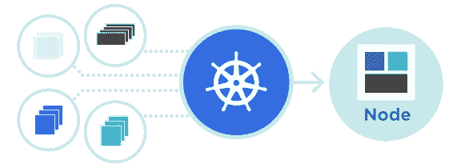
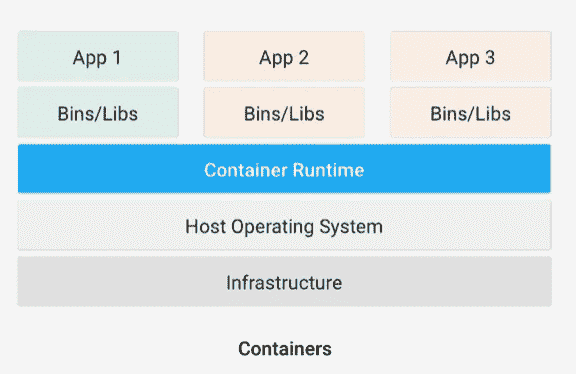
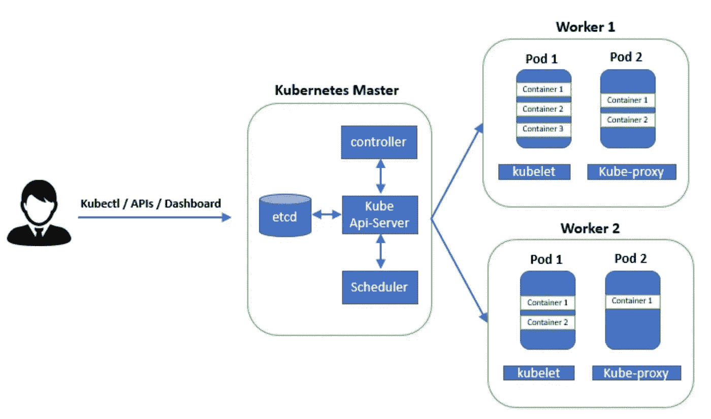
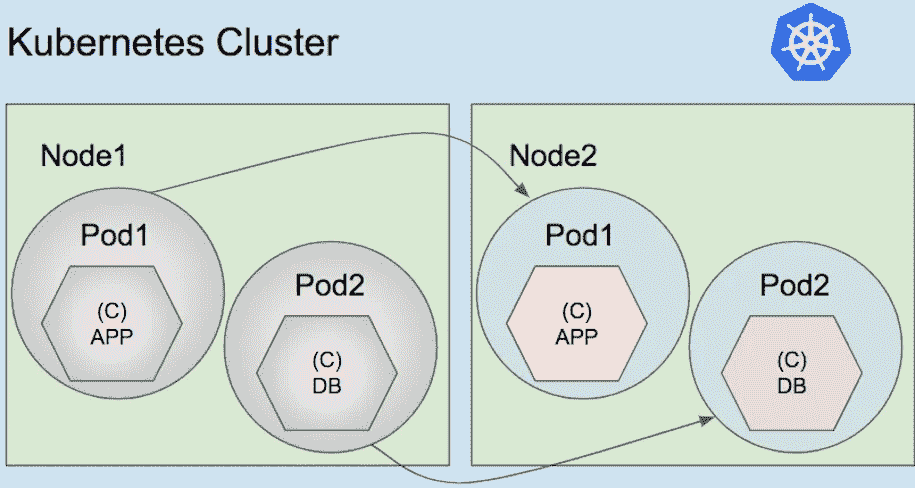
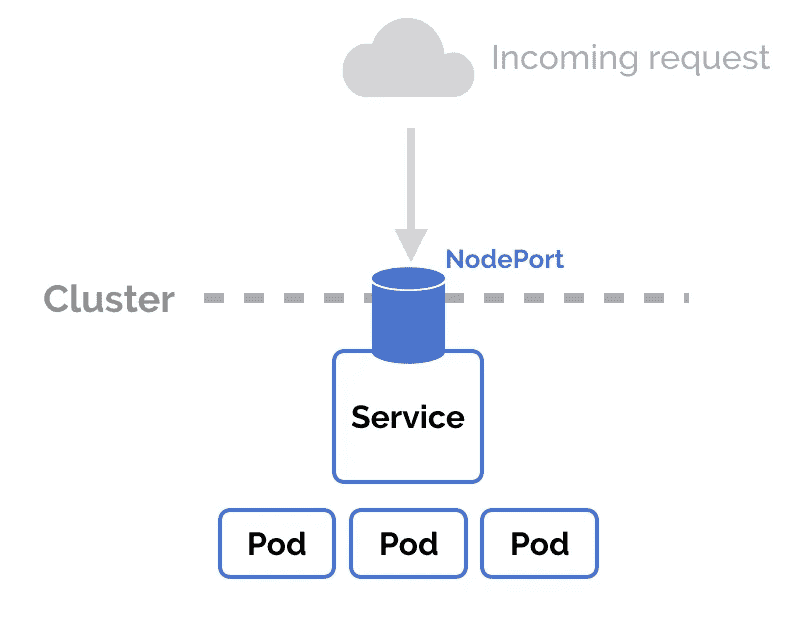

# Kubernetes 的概念概述

> 原文：<https://betterprogramming.pub/kubernetes-core-concepts-overview-cf4d8bede3e1>

## 集装箱化的好处


由[塞巴斯蒂安·赫尔曼](https://unsplash.com/@herrherrmann?utm_source=unsplash&utm_medium=referral&utm_content=creditCopyText)在 [Unsplash](https://unsplash.com/s/photos/boxes?utm_source=unsplash&utm_medium=referral&utm_content=creditCopyText) 拍摄的照片

您是否有一些容器化的应用程序需要部署、更新以及根据某些标准进行扩展和缩减？您是否需要一个解决方案来确保服务的连续性，并且 SLA 接近 100%？不要想太多:想想 Kubernetes。



图片来源: [Kubernetes 文档](https://kubernetes.io/)

在本文中，我将解释 [Kubernetes](https://kubernetes.io/) 的基本概念。(请注意，在进一步学习之前，您应该对容器有一些基本的了解。)

# 什么是集装箱化？

容器化包括将应用程序与所有相关的配置文件、库以及它在不同计算环境中高效运行所需的依赖项捆绑在一起



集装箱化概述(图片来源:[什么是集装箱化？](https://medium.com/hackernoon/what-is-containerization-83ae53a709a6)由沙安雷)

# 什么是 Kubernetes？

根据[维基百科](https://en.wikipedia.org/wiki/Kubernetes)，

> Kubernetes(通常风格化为 k8s)是一个开源的容器编排系统，用于自动化应用程序部署、扩展和管理

Kubernetes 可以在桌面、内部和云中运行。它主要由谷歌创建，现在由云原生计算基金会(CNCF)维护，该基金会定义了如何构建云原生应用。

# Kubernetes 架构概述

这是库伯内特建筑的样子:



Kubernetes 建筑(图片来源:[了解 Kubernetes 建筑](https://geekflare.com/kubernetes-architecture/)

*   **Master** :主节点通过 API 服务器管理整个集群，负责给工作节点分配任务。
*   **API 服务器**:这个组件提供了一组 API，可以用来在集群中执行一些动作。可以在集群外部使用`kubectl`命令或仪表板GUI 对其进行访问。
*   调度器(Scheduler):这个组件根据 pod 规范文件管理 pod 的选择和执行，我们将在后面看到。
*   **控制器**:该组件控制节点和副本。
*   **etcd** :这个组件存储一个数据字典。这是一个存储所有集群数据的 Kubernetes 数据库。
*   **Kubelet:** 工作节点通过 API 服务器使用 Kubelet 与主节点通信，并确保 pods 按照其规范正常运行。
*   **Kube-proxy** :该组件为用户管理集群外部的网络和端口。

# 什么是 Pod？

在 Kubernetes 架构中，Pod 是可以在 Kubernetes 集群中创建和管理的最小可部署计算单元。根据[文件](https://kubernetes.io/docs/tutorials/kubernetes-basics/explore/explore-intro/)，

> Pod 是由一个或多个容器(如 Docker 容器)组成的组，具有共享存储/网络，以及如何运行容器的规范

也就是说，在 Kubernetes 集群中，我们的应用程序运行在一个或多个 Pods 中。一个 Pod 代表集群中的一个正在运行的进程。一个 pod 包含:

*   docker 应用程序容器
*   存储资源
*   唯一网络 IP
*   显示容器应该如何运行的选项

在一些罕见的场景中，可以在一个 Pod 中运行多个容器，但是一个 Pod 代表一个单一的部署单元，一个 Kubernetes 中紧密耦合并共享资源的单一应用程序。



Kubernetes 星团内的豆荚概览(图片来源:[https://asksendai.com/category/algorithm/](https://asksendai.com/category/algorithm/))

# 创建一个 Pod

## 使用命令行

下面是一个使用命令行创建 Pod 的示例。在现实世界中，不推荐使用命令创建 Pod。

```
kubectl run mypod --port=8080 --image=pasciano007/sample:1.0 --generator=run-pod/v1
```

## 使用规范文件

这是在现实世界中用来创造一个 Kubernetes 豆荚。让我们看一个简单的规范 YAML 文件的例子。

Pod 规格 YAML 文件

*   `apiVersion`:这是 API 服务器的版本，如架构概述部分所讨论的。
*   `kind`:这是定义我们想要创建的资源类型的重要键。在这种情况下，它是一个豆荚。
*   `metadata`:这增加了一些关于 Pod 的附加信息，比如 Pod 的名称。
*   `spec`:该键定义需要如何创建、管理或控制 Pod。
*   `containers`:这个键列出了将在 Pod 中创建的所有容器。
*   `image`:定义用于创建容器的图像。

要运行上述 Pod 规范 YAML 文件，我们使用以下命令，该命令创建或更新集群中的资源:

```
kubectl apply -f filename.yml
```

在接下来的小节中，将只使用规范文件来创建资源，因为这是最好的方法，并且可以使用相同的命令来运行所有传入的规范文件。

# 什么是部署？

在 Kubernetes 中，部署是部署我们服务的最佳方式，因为它具有一些很棒的内置功能，如:

*   轻松部署副本
*   更新窗格
*   回滚到以前的部署版本
*   规模部署
*   暂停和恢复部署
*   清理不再需要的旧副本
*   还有更多…

下面是一个使用带有三个副本的部署规范文件部署应用程序的示例。

部署规范 YAML 文件

我们在 Pod 创建中看到的一些键在这里有相同的含义。

*   `kind`:和 Pods 一样，是定义资源类型的重要键。在这种情况下，它是一个部署。
*   `replicas`:定义将要创建并分布到所有集群节点的 pod 的数量
*   `template`:定义吊舱规格
*   `matchLabels`:选择将由副本管理的 pod
*   `containerPort`:集装箱将暴露的港口
*   `labels`:键值对定义了 Pod 的标签。该标签将被`matchLabels`用来选择该 Pod，并将副本仅应用于带有该标签的 Pod。

# 与 Kubernetes 服务联网

*服务*在 Kubernetes 的世界里有着不同的含义。在 Kubernetes 中，服务为集群中的一个或多个 pod 提供网络连接。

创建服务时，它有一个唯一的 IP 地址。然后，Pods 可以使用 IP 地址或服务名称进行通信。

Kubernetes 服务有四种类型:

## `ClusterIP`

这是公开的默认服务类型，它只允许集群内的通信。

下面是一个`ClusterIP`服务类型规范文件的例子:

集群 IP 规范 YAML 文件

*   `port`:定义服务的端口
*   `targetPort`:定义 pod 的端口

然后，节点内的 pod 可以使用服务的 IP 地址和端口或者使用服务名(web)和端口进行通信。

## 节点端口



该服务允许使用节点的 IP 地址与群集通信。一个`ClusterIP`服务被自动创建，并且`NodePort`服务将路由到它。从集群外部，您可以使用`NodeIP:NodePort` **访问`NodePort`服务。**

下面是一个`NodePort`服务类型规范文件的例子:

节点端口服务规范 YAML 文件

*   `port`:定义集群内部的服务(`ClusterIP`)
*   `targetPort`:定义 Pod 的端口
*   `nodePort`:定义节点的端口

事情就是这样运作的。假设我们有一个应用程序部署使用这项服务。例如，当我们键入`localhost:3000` ( `nodePort`)时，流量将被路由到端口 8080 ( `port`)上的服务，该服务又将流量路由到端口 8080 ( `targetPort`)上的容器。

## 负载平衡器

该服务向您的云提供商公开负载平衡器。负载平衡器将流量路由到自动创建的`NodePort`和`ClusterIP`。

## 外部名称

这种类型将服务映射到`externalName`字段的内容(例如 my.domain.com)。

要了解有关不同服务的更多信息，请参考[官方文档](https://kubernetes.io/docs/concepts/services-networking/service/)。

# 使用 ConfigMap 的应用程序配置

根据官方文件，

> "配置映射允许你将配置工件从图像内容中分离出来，以保持容器化的应用程序的可移植性."

换句话说，ConfigMap 存储代码的配置设置。在 ConfigMap 中存储连接字符串、环境变量、公共凭证、主机名和 URL，这些值由 Kubernetes 提供给容器。

下面是一个配置映射规范文件的例子，它设置了使用 [Postgres 图像](https://hub.docker.com/_/postgres)所需的 Postgres 关系数据库环境变量。

配置映射规范 YAML 文件

# 结论

在本文中，我们学习了一些学习 Kubernetes 时必须知道的概念。在接下来的教程中，我们将在现实世界中使用这些概念。

在那之前，请保持关注，注意安全。