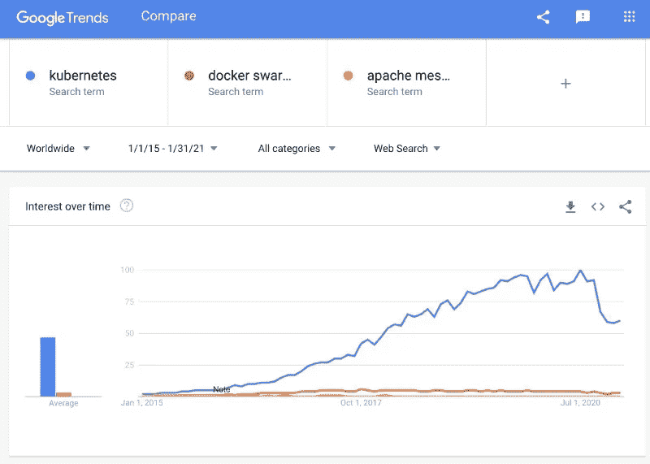
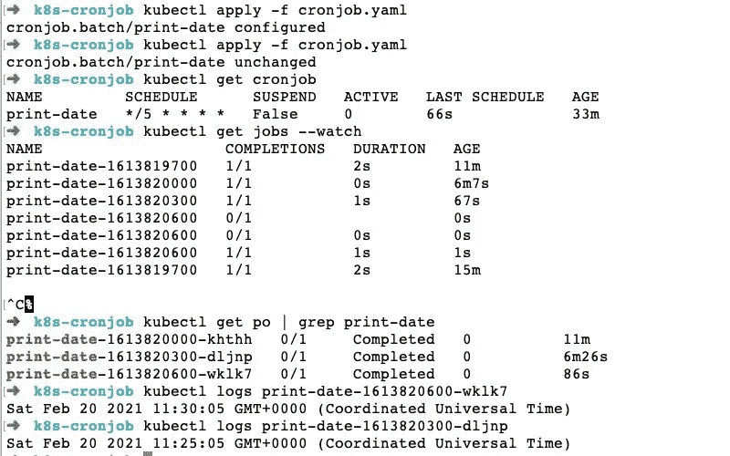
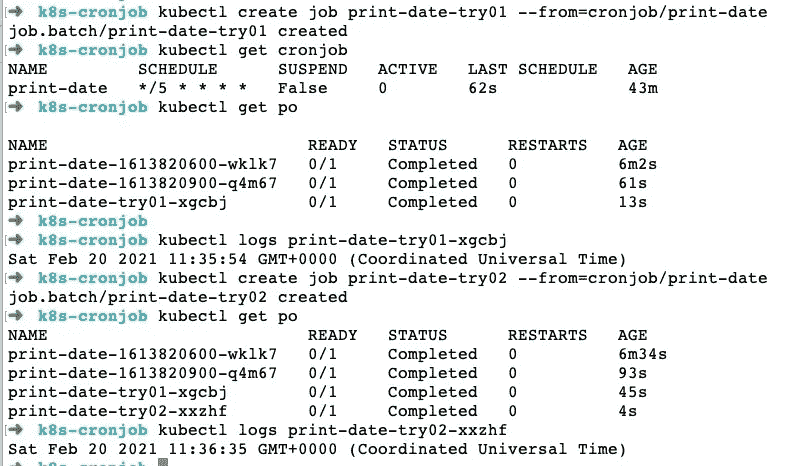

# 如何使用 Kubernetes 有效地运行 Cron 作业

> 原文：<https://betterprogramming.pub/kubernetes-cron-jobs-659a9c6db0e>

## 最佳配置 crons 的实践指南

由 [Swag 摄影](https://unsplash.com/@arni_gill?utm_source=unsplash&utm_medium=referral&utm_content=creditCopyText)在 [Unsplash](/?utm_source=unsplash&utm_medium=referral&utm_content=creditCopyText) 上拍摄

Kubernetes 在运行 cron 作业以及其他 web 应用程序工作负载方面非常有效。Kubernetes cron 作业是一种特殊的 Kubernetes 作业，它按基于时间的计划运行。在本文中，我们将关注如何在 Kubernetes 上运行优化配置的 cron 作业。

# 什么是 Kubernetes？

Kubernetes 有多种定义。我们将首先查看其中的几个，然后尝试简化它们。官方“什么是 Kubernetes？”Kubernetes.io 上的页面:

> Kubernetes 是一个可移植、可扩展的开源平台，用于管理容器化的工作负载和服务，有助于实现声明式配置和自动化

它进一步补充说，“Kubernetes 这个名字来源于希腊语，意思是舵手或领航员。谷歌在 2014 年开源了 Kubernetes 项目。”还提到了 Google 在大规模运行生产工作负载方面超过 15 年的经验。

Kubernetes 上的维基百科页面声明:

> Kubernetes(通常风格化为 K8s)是一个开源的容器编排系统，用于自动化计算机应用程序部署、扩展和管理

它还说，“它最初是由谷歌设计的，现在由云原生计算基金会维护。它旨在提供一个“跨主机集群自动部署、扩展和操作应用容器的平台。”"

# Kubernetes 是做什么的？

好了，有了这些定义，让我们简化一下。如果我说这是部署 web 应用程序、cron 作业等工作负载的容器时代，我不会错。在容器领域，Docker 赢得了比赛，它是事实上的容器工具。

考虑到这一点。我们可以从容器开始，在容器中运行一两个应用程序。这意味着，在任何给定的时间，我们将运行 1-10 个集装箱。随着时间的推移，我们喜欢这个想法和容器提供的其他优势，因此我们希望在容器中运行更多的工作负载/应用程序。这相当于有几十个容器在运行，可能是在生产中。

时间越久，越多的 app 被容器化。此时，我们有数百个容器在运行。那么，我们如何衡量这些容器呢？我们如何让服务 A 与服务 B 对话？我们如何处理拥有数百个容器的数十个应用程序的部署和回滚？我们如何一致地有效管理这数百个容器的资源(CPU/RAM)和秘密？

以上所有问题的答案是“容器编制器”2015 年左右，Kubernetes、Docker Swarm、Apache Mesos 之间出现了轻微的竞争。到 2017 年年中，Kubernetes 轻松赢得了比赛，成为根据[谷歌趋势](https://trends.google.com/trends/explore?date=2015-01-01%202021-01-31&q=kubernetes,docker%20swarm,apache%20mesos)广受欢迎的事实上的容器编排者，如下所示:

Kubernetes 在 2017 年年中赢得了集装箱管弦乐比赛

尽管 Kubernetes 灵活、强大、超受欢迎；有些事情 [Kubernetes 不是](https://kubernetes.io/docs/concepts/overview/what-is-kubernetes/#what-kubernetes-is-not)，最好也了解一下。如今，Kubernetes 已经成为一个成熟的平台，拥有一个蓬勃发展的生态系统。

# 库伯内特克朗工作

我是 2016 年在生产中使用 Kubernetes 的团队的一员。Kubernetes 非常擅长管理长时间运行的工作负载，比如 web 服务器或队列消费者。在 Kubernetes 行话中，它们大致翻译为[服务](https://kubernetes.io/docs/concepts/services-networking/service/)和[部署](https://kubernetes.io/docs/concepts/workloads/controllers/deployment/)工件。除了非常适合长时间运行的工作负载之外，Kubernetes 在管理 Cron 作业方面也做得非常出色。

如果我们看一下 Kubernetes 的历史，Kubernetes Cron 的工作被称为`ScheduledJob`。在[版本 1.5](https://github.com/kubernetes/kubernetes/blob/master/CHANGELOG/CHANGELOG-1.5.md#action-required-before-upgrading) 中，它被重命名为 Cron 作业。在 Kubernetes 中， [Cron 作业](https://kubernetes.io/docs/concepts/workloads/controllers/cron-jobs/)是一种特殊的[作业](https://kubernetes.io/docs/concepts/workloads/controllers/job/)，它按照重复的时间表运行。Kubernetes Cron 作业的频率以熟悉的 [Cron](https://crontab.guru/) 格式编写。例如，cron 格式中的`0 4 * * *`表示每天早上 4:00。如果你愿意，可以阅读更多关于 [cron 调度语法](https://kubernetes.io/docs/concepts/workloads/controllers/cron-jobs/#cron-schedule-syntax)的内容。

如何知道 cron 作业是否错过了一个或多个计划？在它不知不觉地溜走之前，最好了解更多关于有效的 [cron 作业监控](https://geshan.com.np/blog/2019/11/how-to-efficiently-monitor-crons-with-a-simple-bash-trick/)的信息。

## 先决条件

*   你通常知道 Kubernetes 是如何工作的，如何将容器作为 [pods](https://kubernetes.io/docs/concepts/workloads/pods/) 进行调度。
*   您知道 Kubernetes 以声明的方式管理对象和配置。
*   服务、部署和[水平 Pod 自动缩放器](https://kubernetes.io/docs/tasks/run-application/horizontal-pod-autoscale/)之间的区别
*   你一般都知道[入口](https://kubernetes.io/docs/concepts/services-networking/ingress/)在 Kubernetes 里是做什么用的。
*   你知道常见的 Kubernetes 术语，如 Node、Kubelet 等。

接下来，我们将研究一个简单的 Kubernetes cron 工作示例。

## Kubernetes cron job:简单的例子

我们将在 [Kind](https://kind.sigs.k8s.io/docs/user/quick-start/) 上尝试一个简单的 Kubernetes cron 工作示例。在撰写本文时，Kind 版本 0.9.0 启动了版本 1.19.1 的 Kubernetes 集群。下面是我们简单的 Kubernetes cron 文件，它使用一个`node:14-alpine`图像来打印当前日期。

让我们简单地分析一下，而不是详细地配置 Cronjob.yaml 文件:

1.  我们使用的是 Kubernetes API 的`batch/v1beta1` API 版本。
2.  这是一种`CronJob` Kubernetes 资源/工作量。
3.  我们将 cron 作业命名为`print-date`。
4.  Kubernetes cron 作业计划每五分钟执行一次— `*/5 * * * *`。
5.  我们使用的是`node:14-alpine`图片，默认从 Docker hub 获取。
6.  `IfNotPresent`图像拉取策略是默认策略。它使 [kubelet](https://kubernetes.io/docs/reference/command-line-tools-reference/kubelet/) 获取一个不存在的图像。
7.  然后，我们传入`-e`进行 eval，传入`console.log`以字符串形式打印当前日期。由于节点容器的命令是`node`，这将打印当前日期和时间。
8.  容器将根据上述[重启策略](https://kubernetes.io/docs/concepts/workloads/pods/pod-lifecycle/#restart-policy)在出现故障时重启。

现在，我们将这个 cron 作业安排在一个本地的 Kubernetes 集群上进行测试。在写这篇博文的时候，我使用的是 0.9.0 版本——它安装了 Kubernetes 1 . 19 . 1 版本。

如果我们将上面的文件保存为`cronjob.yaml`，我们可以用下面的命令将它添加到 Kubernetes:

该命令成功运行后，我们将看到如下内容:

要检查 cron 作业是否创建成功，我们可以执行以下命令:

如果一切正常，它将打印出如下内容:

五分钟后，我们可以试试`kubectl get po | grep print-date`。我们应该看到 cron 已经运行了一次，如下所示:

要查看已经运行的 cron 作业的日志，我们应该执行`kubectl logs print-date-1613818500-88ln6`，其中`print-date-1613818500-88ln6`是 pod 名称。在您的情况下，这个名称会有所不同。名称显示后，我们应该会看到以下内容:

让我们回顾一下下面的命令:

Kubernetes cron job:一个简单的例子—没有优化配置

在下一部分中，我们将研究如何优化配置 Kubernetes Cron 作业。

## Kubernetes cron job 是一个最佳的例子

在上面这个简单的例子中，让我们仔细观察一些事情:

1.  命令有错误怎么办？Kubernetes 会多次尝试安排 cron job pod 吗？
2.  我们如何清理已经完成工作的 pod？
3.  如果我们的 cron 作业还没有完成——是时候运行下一个作业了，该怎么办？我们只想跳过下一次运行，因为当前作业尚未完成。
4.  我们想暂时停止 cron 作业。
5.  我们希望看到一些旧的 cron 作业运行的日志，即使它们已经失败或成功。

以上问题以及更多问题的答案都在下面的 cron 作业配置中:

让我们来分析一些新添加的配置，以及它们的作用:

1.  在该定义中，`backoffLimit`用于指定将作业标记为[失败](https://kubernetes.io/docs/concepts/workloads/controllers/job/#pod-backoff-failure-policy)之前的重试次数。例如，如果容器没有启动或命令有错误，我们指定它应该在回退之前重试五次(将作业标记为失败)。
2.  为了减轻 Kubernetes 的压力，我们可以在完成后指定 TTL 秒数，此时 TTL 控制器清理作业并以级联方式[删除作业](https://kubernetes.io/docs/concepts/workloads/controllers/job/#ttl-mechanism-for-finished-jobs)。
3.  `parallelism`和`completions`默认为`1`；它可以用于只有一个 pod 在[平行](https://kubernetes.io/docs/concepts/workloads/controllers/job/#controlling-parallelism)运行。
4.  如果您想跳过下一次运行，使用`concurrencyPolicy`非常方便——如果当前的 cron job pod 仍然是活动的。将其设置为`Forbid`可以启用此功能。如果您的作业要求在下一次运行时取消当前运行，那么它可以被设置为替换[并发策略](https://kubernetes.io/docs/tasks/job/automated-tasks-with-cron-jobs/#concurrency-policy)。
5.  最后，我们设定了成功和失败的工作历史。我们这样做是为了在一定的限度内不清理那些 pod，如果需要，我们可以检查日志。

下面是重新应用新定义并检查我们添加的新配置的运行日志的屏幕截图:

Kubernetes cron job 是一个更好的例子—优化配置

上图中的新命令是:

它获取作业并观察它是否有任何变化。正如您在截图中看到的，它在每秒运行作业`print-date-1613820600`2-3 秒时检测到了变化。

## 即时运行 Kubernetes cron jobs

专业提示:您可以使用如下命令强制运行 Kubernetes Cron 作业(在计划之外):

这对于测试 cron 作业来说非常方便，因为我们不需要等待预定的运行。

我们要求 Kubernetes 创建一个名称为`print-date-try01\.` 的作业，该名称必须是唯一的。如果您第二次运行它，请使用`try02`。我们告诉 Kubernetes 从我们的 cron 作业`cronjob/print-date`中创建作业。

我们可以看到上面命令的一个例子，如下所示:

这是一个创建作业的演示程序，对于测试 cron 作业非常有用

如上所示，计划每五分钟运行一次的 cron 作业在`11:35:54`和`11:36:35`运行，这超出了它的常规计划。这是可能的，因为我们根据需要强制运行 cron 作业，而不是等待调度。当测试计划每小时或每天运行的 Kubernetes cron 作业时，这个命令非常方便。

# 结论

正如我们所见，Kubernetes cron jobs 非常有用。除了擅长处理长时间运行的工作负载之外，Kubernetes 在执行作业和 cron 作业方面也做得非常出色。

一些建议:优化配置您的 Kubernetes cron 作业，以便在 Kubernetes 集群上运行您期望的 cron 作业。

即使是现代的应用程序也有需要用 Cron 作业来完成的任务，Kubernetes cron 作业可以用来完成这样的任务。