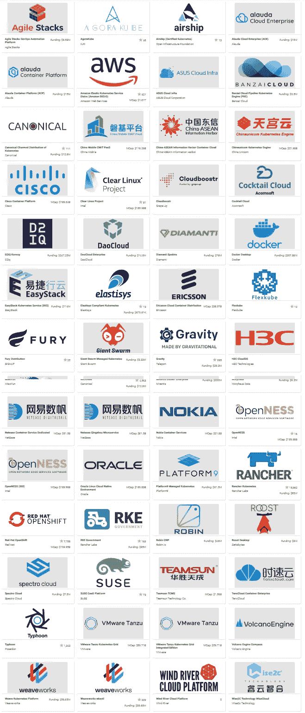

# Kubernetes 发行版—它们是什么？

> 原文：<https://betterprogramming.pub/kubernetes-distributions-what-are-they-be2c438c8706>

## 了解它们是什么以及为什么对你很重要

照片由[德鲁·比默](https://unsplash.com/@drew_beamer?utm_source=medium&utm_medium=referral)在 [Unsplash](https://unsplash.com?utm_source=medium&utm_medium=referral) 上拍摄

在最近的 [AWS re:Invent 2020](https://reinvent.awsevents.com/) 会议上，最大的宣布之一是亚马逊发布了 EKS-D。EKS-D 是他们的开源 Kubernetes 发行版，现在每个人都可以在他们的云提供商甚至内部开始使用。

它基于过去的发现和亚马逊在管理他们的 Kubernetes 托管平台亚马逊 EKS 时经历的整个过程。

这些公告让许多人自问:“好吧，我知道 Kubernetes，但是什么是 Kubernetes 发行版？我为什么要在乎？”

因此，我将尝试用我所掌握的知识来回答这个问题，我总是尝试使用相同的方法:Kubernetes 与 Linux 模型的比较。

如你所知，Kubernetes 是一个开源项目，由 Google 发起，现在由社区和云计算原生计算基金会(CNCF)管理，你可以在这里找到所有可用的代码:

 [## 库伯内特/库伯内特

### Kubernetes，也称为 K8s，是一个开源系统，用于管理跨多个主机的容器化应用程序…

github.com](https://github.com/kubernetes/kubernetes) 

但是让我们诚实地说:我们中没有多少人会拿出回购协议，并试图编译它来提供一个集群。我们通常不是这样工作的。如果您遵循代码路径——下载它，构建它，等等——这通常被命名为 *vanilla Kubernetes。*

如果我们从 Linux 比较开始，这与大多数 Linux 发行版中的 Linux 内核的情况相同，但是这已经编译好了，并且可以通过通常的方法与许多其他工具一起使用。

这就是库伯内特分布。他们建造 Kubernetes。它们提供了其他工具和组件来增强或提供更多功能，并专注于其他方面，如安全焦点、开发运维焦点或其他焦点。另一个经常被提出的概念是分销的*纯度*，我们试图谈论的是*纯度的分销。*

当一个发行版在构建 Kubernetes 的时候，我们称之为纯发行版。它让开发者或用户来决定他们想要在它上面使用什么。

# Kubernetes 发行版中的主要组件是什么？

当我们谈论 Kubernetes 发行版时，主要的不同组件如下:

## **容器运行时和注册表**

我们都知道不止一个容器运行时，即使你没有意识到这一点，你可能已经阅读了所有关于 Kubernetes v1.20 中删除 Docker 支持的文章，正如你可以从 Edgar Rodriguez 的这篇精彩文章中读到的。

 [## Kubernetes 刚刚否决了 Docker 支持。现在怎么办？

### 这会杀死 Docker 吗？

medium.com](https://medium.com/better-programming/kubernetes-just-deprecated-docker-support-e86d2327afad) 

目前，似乎所有运行时都应该支持现有的[容器运行时接口](https://kubernetes.io/blog/2016/12/container-runtime-interface-cri-in-kubernetes/)，CRI-O、Containerd 或 Kata 等运行时似乎是默认选项。

## **联网**

当我们谈论 Kubernetes 发行版时，另一个经常不同的话题是他们如何管理他们的网络，这是整个平台最关键的方面之一。

正如我们对容器运行时所做的那样，有一个标准规范涵盖了这个主题，那就是[容器网络接口(CNI)](https://github.com/containernetworking/cni) 。有几个关于这个主题的项目，像法兰绒、印花布、运河和波浪。此外，一些平台提供了自己的组件，如 [Openshift SDN](https://docs.openshift.com/container-platform/4.4/networking/openshift_sdn/about-openshift-sdn.html) 操作符。

## **存储**

如何在 Kubernetes 中处理存储也非常重要，特别是当我们在需要有状态模型的部署中采用这种模型时。不同的平台可以支持不同的存储选项，比如文件系统等等。

# 谁是顶尖选手？

我们需要注意的第一件事是有大量的 Kubernetes 发行版。

我们会统计有 CNCF 认证的，你可以在这里看一看。在写这篇文章的时候，我们正在讨论 72 个认证发行版。

[图片](https://www.cncf.io/certification/software-conformance/)通过云计算原生计算基金会

这些是我今天想要强调的:

## 红帽 OpenShift

Red Hat OpenShift 平台可能是最常用的平台之一，尤其是在私有云模式下。它可能包括大多数关于存储的红帽服务，如 GlusterFS 和 OpenShift DNS 网络。它有 [OKD](https://www.okd.io/) 作为支持和贡献 OpenShift 平台的开源项目。

## 米兰蒂斯

被 [Mirantis](http://mirantis.com/software/docker/docker-enterprise) 收购的前 Docker enterprise 是我们谈论受支持平台时的另一个常见选择。

## VMware Tanzu

[VMware Tanzu](http://tanzu.vmware.com/kubernetes-grid) ，也是从 VMware 收购 Pivotal 而来，是一个 Kubernetes 平台。

## 权威的

[Canonical](http://ubuntu.com/kubernetes) (开源)是一个来自开发和维护 Ubuntu 的公司的平台。这是这里的另一个重要选择，它提供了多种选项，不仅侧重于通用中央模式，还侧重于 edge Kubernetes 部署，以及 MicroK8S 等项目和更多选项。

## 大牧场主

Rancher (开源)是另一个大玩家，专注于遵循和扩展 CNCF 标准，也为 K3S 的边缘部署提供了巨大的推动力。它还提供自动升级。

# 摘要

所以，如你所见，可供选择的数量是巨大的。它们都是不同的，所以当你根据你的项目或公司的标准来决定你的目标平台时，慢慢来是很重要的。

这还不包括现有的托管平台，这些平台正成为公司的首选，因此他们可以从 Kubernetes 获得所有的灵活性，而不需要自己处理管理 Kubernetes 平台的复杂性。但是这是另一篇文章的主题——希望很快。

本文至少为您提供了关于什么是 Kubernetes 发行版、它们之间的主要区别的更多信息，并快速查看了这个范围内的一些关键角色。享受你的一天，享受你的生活。