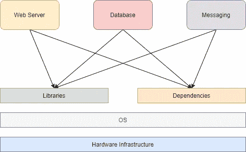
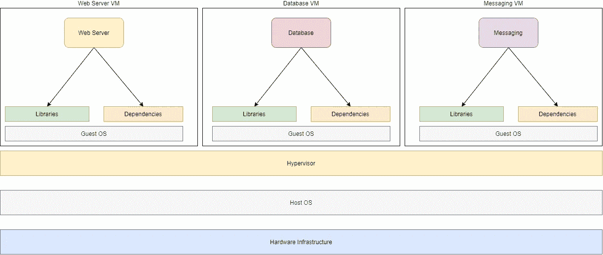
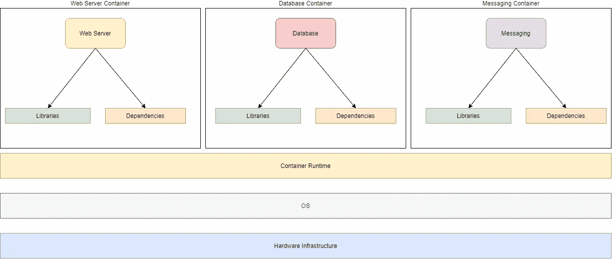
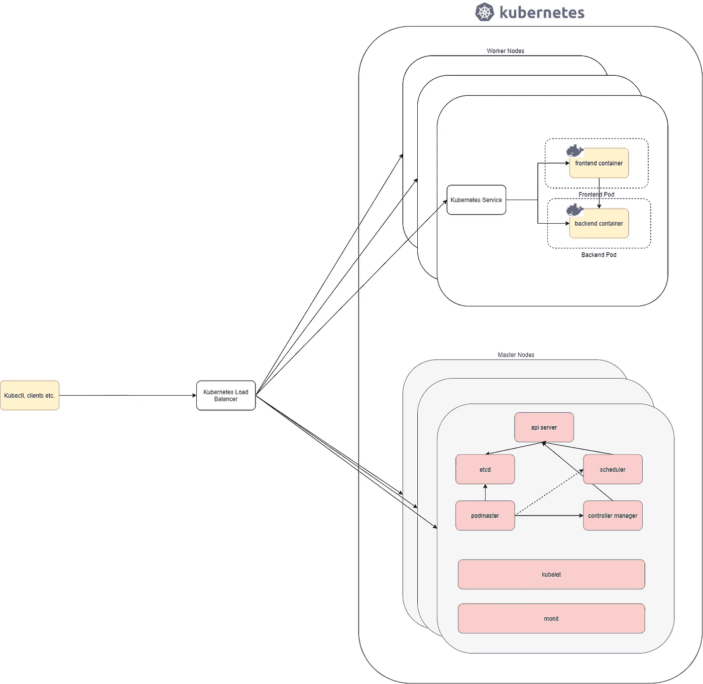

# 初学者的 Kubernetes

> 原文：<https://betterprogramming.pub/kubernetes-for-beginners-b3042e01ccff>

## Kubernetes，面向更普通的观众

约瑟夫·巴里恩托斯在 [Unsplash](https://unsplash.com?utm_source=medium&utm_medium=referral) 上拍摄的照片

[Kubernetes](https://kubernetes.io/) 已经有一段时间了。正是这种领先的平台改变了我们今天看待信息技术的方式。该项目由一群谷歌开发人员发起，作为编排容器的一种方式，他们将容器开源给了云原生计算基金会。今天，它是最流行的系统之一，也是运行容器的事实上的标准。

这有各种各样的原因。我们将深入了解 Kubernetes 最初是什么，为什么它如此受欢迎，以及它用简单明了的语言解决了什么问题。要阅读本文，您不需要任何 Kubernetes 或容器方面的经验。我将逐一理清这些概念。

# 什么是 Kubernetes？

如果我们查看[维基百科的定义](https://en.wikipedia.org/wiki/Kubernetes)，我们会看到“Kubernetes 是一个开源的容器编排系统，用于自动化应用程序的部署、扩展和管理。”

这里主要有两个词:*容器*和*编排*。我们需要了解每一个是什么来理解 Kubernetes。

# 什么是容器？

Kubernetes 表示，“**容器**是一种技术，用于打包应用程序的(已编译)代码以及它在运行时需要的依赖关系。您运行的每个**容器**都是可重复的；包含依赖项的标准化意味着无论你在哪里运行它，你都会得到相同的行为。”

这个定义对初学者来说可能听起来有点过了。让我解释一下。

如果我们需要在服务器上运行一堆应用程序，比如 web 应用程序、数据库、消息传递层等。，这将导致以下情况。

服务器上的应用程序堆栈

有一个运行操作系统(OS)的硬件基础设施，库和应用程序依赖项安装在 OS 上。不同的应用程序共享相同的库和依赖项来运行。

# 地狱矩阵

如果您研究上一节中描述的设计，肯定会有多个问题。如果您猜对了，例如，与数据库服务器相比，web 服务器可能需要不同版本的库，而一个版本的依赖关系可能与一个应用程序兼容，但与另一个不兼容。如果我们需要升级其中一个依赖项，我们需要确保不会影响另一个可能不支持它的应用程序。这种场景被称为地狱矩阵，对开发者和管理员来说都是一场噩梦。

# 它在我的机器上工作

任何在技术领域工作过的人在职业生涯中都至少遇到过一次这个短语。“它在我的机器上工作”是开发人员和测试人员之间的典型对话，其中开发人员说应用程序在他们的机器上工作得非常好。尽管如此，它在测试环境中并不工作，在测试环境中工作得非常好的东西在生产环境中可能就不一样了。原因？地狱矩阵。

# 解决方法

在容器出现之前，组织已经通过使用虚拟机解决了这个问题。虚拟机是对计算机系统的模拟。虚拟机基于计算机架构，并使用名为*管理程序*的软件提供物理计算机的功能。市场上一些受欢迎的虚拟机管理程序是 VMWare 和 Oracle Virtual Box。典型的基于虚拟机的堆栈如下所示:

虚拟机上的应用程序堆栈

到目前为止，一切顺利。我们已经解决了依赖问题，现在我们已经脱离了地狱矩阵。这种架构是开创性的，持续了二十多年，今天仍在使用。然而，这引入了另一个问题。现在，我们不再在一台机器上运行单个操作系统，而是在一台物理设备上运行多个客户操作系统。

# 虚拟机时代的问题

我们试图解决运行时、库和依赖性问题，但是我们在它们之间引入了一个重量级的来宾操作系统层，这有它的缺点。虚拟机很重，启动速度较慢，并且需要额外的依赖来维护来宾操作系统和主机操作系统。管理员现在需要管理多台服务器，而不是众多的依赖项。

此外，我们需要为来宾操作系统分配最低数量的资源，组织会向虚拟机过度调配资源，以满足虚拟机的峰值利用率，而不是正常使用。即使架构正确，虚拟机内的资源共享也不是最佳的。虚拟机浪费了大量资源，因为大量已分配的资源仍未得到利用。为一个应用程序配备专用的虚拟机会导致可移植性问题，运营团队很快就会发现自己在试图将服务器当成宠物。运行在服务器上的应用程序是必不可少的，如果它们由于某种原因失败了，从头开始重新构建它们是一个问题。

# 介绍容器

容器通过将服务器视为服务器来平衡这个问题。我们不再有单独的虚拟机用于 web 服务器、数据库和消息传递。相反，我们为它们准备了不同的容器。迷茫？见下图。

容器上的应用程序堆栈

我们现在已经摆脱了对客户操作系统的依赖，容器现在在同一个操作系统中作为独立的进程运行。容器利用容器运行时。一些流行的容器运行时是 [Docker](https://www.docker.com/) 、 [Rocket](https://www.rocker-project.org/) 和 [containerd](https://containerd.io/) 。其中最流行的，或多或少是容器运行时技术中事实上的标准，是 Docker。

容器运行时提供了一个抽象层，允许应用程序自包含，并且所有应用程序和依赖项相互独立。

容器解决了很多问题。

**容器是可移植的**——因为容器将运行时和应用程序依赖打包在一起，所以它们是可移植的。容器不关心它在哪里运行，在所有环境中的行为都是一样的。

**容器更高效** —因为容器不包含客户操作系统，所以启动速度极快。虽然启动一个虚拟机需要几分钟，但启动一个新容器只需几秒钟。

**容器是可扩展的** —这并不是说虚拟机不可扩展，而是因为容器启动速度快且占用空间少，所以构建新容器比构建新虚拟机要容易得多。您可以让多个容器在一个操作系统中独立地扩展和缩减，并共享资源，这比虚拟机浪费更少。

**容器是轻量级的** —因为容器不包含沉重的客户操作系统，所以容器具有非常轻的足迹。您不需要将 set 资源分配给容器，它可以使用底层 OS 资源，类似于应用程序。与虚拟机相比，它们需要更少的计算资源来运行。

# 管理容器

在一个服务器中运行多个容器的想法听起来很诱人，但是它们也有自己的问题。你如何称集装箱？当容器不健康时，您如何确保容器运行并修复？如果您突然看到一个峰值，并希望自动扩大容器，会发生什么情况？如果您看到流量下降，并希望将容器缩小到最佳水平，该怎么办？容器适用于微服务架构，如果您正在使用它，您将如何确保容器能够相互通信？如果您达到了资源限制，并且想要在另一个 VM 中调度您的容器，该怎么办？

所有这些问题的答案是像 Kubernetes 这样的容器编排平台。

# 使用 Kubernetes 介绍容器编排

使用 Kubernetes 的想法很简单。您有一个由 Kubernetes 管理的服务器集群，Kubernetes 负责编排服务器中的容器。您将服务器视为服务器，并在称为容器的自包含单元中运行应用程序。

因为容器可以在任何服务器上运行，所以只要客户端可以访问它，容器在哪个服务器上运行并不重要。如果您需要扩展您的集群，您可以向群集中添加或删除节点，而不必担心应用程序体系结构、分区、角色等问题。你在 Kubernetes 级别处理所有这些。

Kubernetes 使用一个简单的概念来管理容器。有控制和协调容器工作负载的主节点(控制平面),以及容器运行的工作节点。Kubernetes 在 pod 中运行容器，这构成了 Kubernetes 中的基本构件。

Kubernetes 主要提供以下内容:

1.  **与底层容器运行时**通信——Kubernetes 不是容器平台，而是容器编排平台。它的 kubelet 组件作为服务在每个节点上运行，负责与底层容器平台对话以管理容器。例如，当您使用`kubectl`创建一个 pod，并且您的底层容器平台是 Docker 时，kubelet 向所选 worker 节点中的 Docker 运行时发出一个 Docker run 命令。
2.  **存储预期配置的状态** —当您使用`kubectl` create/apply 命令应用 Kubernetes 配置时，Kubernetes 会将其作为预期配置存储在其`etcd`数据存储中。
3.  **根据预期配置维护状态** — Kubernetes 通过查看`etcd`数据存储中的配置，不断尝试维护集群的预期状态。
4.  **提供基于抽象软件的网络编排层**—Kubernetes 提供的 pod 网络确保容器可以在某种覆盖或桥接网络上相互通信。这个网络在容器运行时内被管理(例如，使用 Docker 桥接网络),或者通过内部或外部网络被管理。当一个 pod 与另一个 pod 对话时，Kubernetes 会修改路由表，以确保连接到位。
5.  **提供内置的服务发现** — Kubernetes 提供开箱即用的容器服务发现。您不需要外部应用程序来管理它。Kubernetes 在 DNS 上公开您的 pod，该 DNS 将服务名称映射到任何可用的 Pod IP，因此提供服务发现和多个 Pod 副本之间的负载平衡。正是因为这种服务发现，豆荚才是短暂的。服务还可以通过在节点内创建监听器，以及通过请求云提供商提供指向您的 pod 的负载平衡器，将您的 pod 暴露给内部和外部客户端。
6.  **健康检查配置** — Kubernetes 确保集群中运行的容器工作负载处于预期的健康状态，如果没有，它会销毁并重新创建容器。
7.  **请求云提供商提供对象** —如果你在像 GCP 或 Azure 这样的云提供商内运行 Kubernetes，它可以使用云 API 来动态供应资源，如负载平衡器和存储。这样，您就有了一个单一的控制平面来管理在容器中运行应用程序所需的一切。

以下是 Kubernetes 集群的高级架构:

您不再需要担心您的应用程序的状态，而是依靠 Kubernetes 来确保您的应用程序继续运行并保持健康。开发人员只需要关注应用程序代码，他们不需要担心底层的基础设施，因为容器在所有环境中都是一样的。Kubernetes 使管理员的工作变得更加容易:它提供了大量的特性，这使得管理 Kubernetes 集群更加有效和高效。

# 进一步阅读

感谢您通读。我希望你喜欢这篇文章。如果您有兴趣进一步了解，请查看“[揭开 Kubernetes 对象的神秘面纱](https://medium.com/better-programming/demystifying-kubernetes-objects-understanding-the-what-why-and-how-18b42c9ca9c2)”