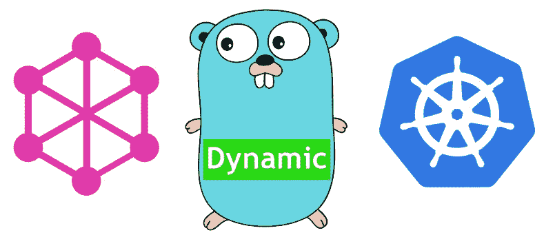
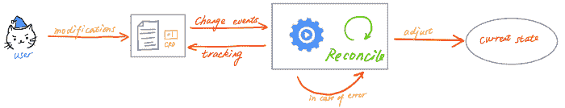
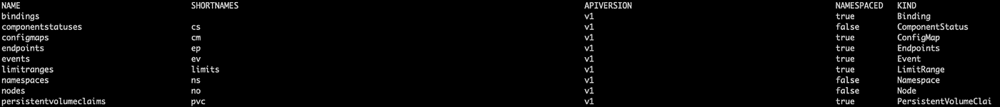
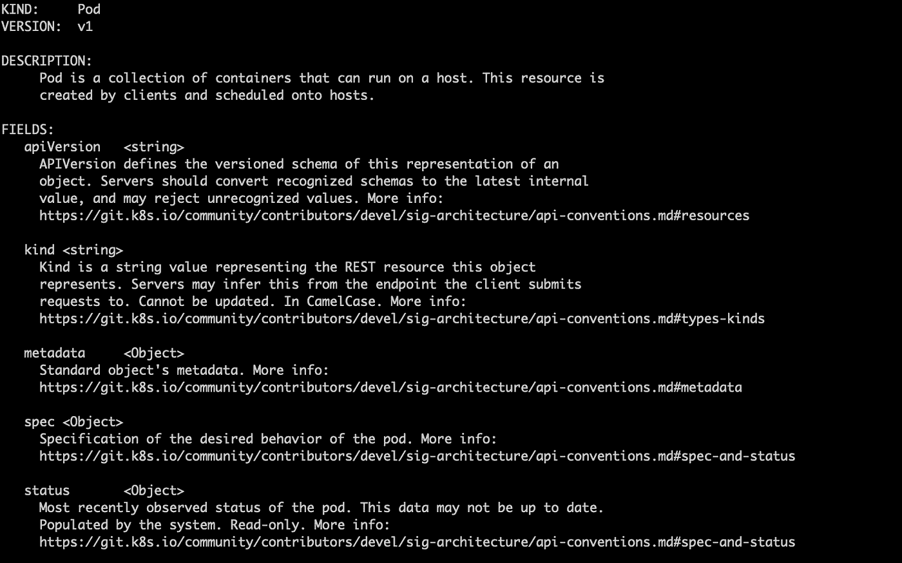
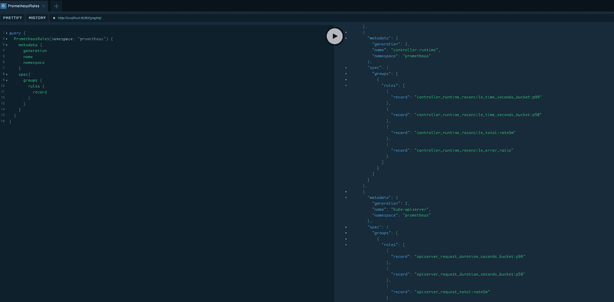

# Go 中的 Kubernetes GraphQL 动态查询

> 原文：<https://betterprogramming.pub/kubernetes-graphql-dynamic-query-in-go-b6cc3ab5490f>

## 用客户端玩点魔法-去发现客户端



在 Go*中的第一集 [*Kubernetes GraphQL 查询中，我们构建了使用 GraphQL 查询集群中 pod 的服务器代码。然而，由于相关的`graphql.Feilds`的定义都是硬编码的，这需要重构，所以这种查询在灵活性和可伸缩性方面很差。*](https://laiyuanyuan-sg.medium.com/kubernetes-graphql-query-in-go-2f88af8f0d67)*

*于是*动态查询第二集来了，*使用`client-go [DiscoveryClient](https://pkg.go.dev/k8s.io/client-go@v0.24.1/discovery#DiscoveryClient)`灵活定义 GraphQL 查询结构。*

# ***自定义资源定义(** CRD)*

*大多数 Kubernetes 用户都知道，像`Pod`、`Deployment`这样的 Kubernetes 资源对象都是 Kubernetes 原生资源类型，本质上一个 Kubernetes 原生 [Operato](https://medium.com/swlh/kubernetes-operator-for-beginners-what-why-how-21b23f0cb9b1) r 就像那些用户定制的操作员一样，是以 **CRD +控制器**的形式实现的。唯一的区别是本地资源类型分散在 Kubernetes 源代码的不同包中。*

**

*操作员如何处理*

*   *用户向集群提交符合 CRD 定义的 YAML。*
*   *Kubernetes APIServer 基于相关的 CRD 类型在`etcd`存储资源。*
*   *CRD 对应控制器找到要处理的资源并执行协调过程，包括更新资源状态。*
*   *将最新的资源状态保存到`etcd`。*

*很容易得出结论， **CRD 是对应于 Kubernetes 资源类型**的模式，就像数据库表的 DDL 语句，或者 XML 文件的 XSD 文件。*

# *读取模式*

*在构建与集群中所有资源类型相对应的 GraphQL 查询时，我们面临的第一个困难是如何获取所有资源类型的模式。*

## *Kubectl 命令*

*命令总是我们在 Kubernetes 相关查询中尝试的第一种方法。*

*当前集群中的所有资源类型都可以用`kubectl get api-resources`返回，比如`Pod`、`Deployment`等。*

**

*但是在运行`kubectl get crd`时，我们没有看到像`pod`那样的本地资源类型的返回。*

*我们肯定需要寻求一个补充来找到原生资源类型的模式，让我们尝试一些。*

*   *一些 YAML 验证工具，比如`kubeval`，它指向一些包含各种 Kubernetes 版本模式的 GitHub 存储库，比如[yannh/Kubernetes-JSON-schema](https://github.com/yannh/kubernetes-json-schema)。这些 GitHub 模式也支持通过相应的 URL 获取 JSON 版本模式，比如版本 1.22.8 的 [pod 模式](https://raw.githubusercontent.com/yannh/kubernetes-json-schema/master/v1.22.8/_definitions.json#/definitions/io.k8s.api.core.v1.Pod)。*
*   *`kubectl explain`命令，可以打印相应类型的模式。*

**

*但以上两种方法都有隐藏的缺陷:第一种受版本限制，一旦集群升级就需要代码升级；第二个只能返回被搜索类型的模式，而不能返回嵌套类型的模式，并且不支持 JSON 格式。*

*   ***Discovery API，是我最终发现的真正可以扫除棘手问题的东西**。*

> *discovery 包用于发现 Kubernetes API 服务器支持的 API。*
> 
> *OpenAPISchema 使用 rest 客户机获取 open api v2 模式，并解析 proto。*

*`DiscoveryClient`中的 [OpenAPISchema](https://pkg.go.dev/k8s.io/client-go@v0.24.1/discovery#DiscoveryClient.OpenAPISchema) API 返回集群中定义的所有类型的模式定义。从它的简介中你无法完全感受到这个 API 的强大，尤其是在`client-go`中没有展示相关的例子时。*

*但是多尝试永远不会让你失望。一开始，我只是在 Kubernetes 文档“CRD 是一个可选的基于 OpenAPI v3 的验证模式”的指导下，尝试使用这个 API 来获得 CRD 的定义然后我幸运地发现，它可以返回集群中的所有模式定义，包括原生类型。*

## *Kubernetes API*

*让我们深入挖掘一下，看看为什么`OpenAPISchema` 函数可以返回所有模式？*

*没什么神奇的，只是通过简单地调用 Kubernetes API。*

```
*d.restClient.Get().AbsPath(“/openapi/v2”).SetHeader(“Accept”, openAPIV2mimePb).Do(context.TODO()).Raw()*
```

*返回到之前的`kubectl explain`命令，添加`-v`标志，并再次运行。*

*`kubectl explain pods -v 9`显示器*

**

*由此可见，是 [OpenApi](https://kubernetes.io/id/docs/concepts/overview/kubernetes-api/#swagger-and-openapi-definition) 在`explain`命令之后进行处理，但接收的是`protobuf`格式的数据，并为用户提供了更高的可读性。*

*我们也可以尝试在 CLI 中调用`OpenApi`，下面的命令是针对 GKE 的。*

```
*curl -X GET https://{ip}/openapi/v2 --header "Authorization: Bearer $(gcloud auth application-default print-access-token)" --insecure*
```

# *解析模式*

*我们需要充分理解我们得到的信息，然后才能很好地利用它。*

*将`curl`命令的输出导出到一个文件中，我们可以看到得到的只是 Kubernetes 中每个 API 的分析，就像 swagger API 文档一样。向下滚动到底部可以看到`definitions`，其中显示了所有资源类型的所有字段的定义。*

*Pod 定义会很长，所以以下面的`resources`字段为例。*

*`client-go`已经将模式解析成 openapi_v2 `[Document](https://pkg.go.dev/github.com/google/gnostic/openapiv2#Document)`，准备应用于开发。*

*但有一个问题不容忽视:在返回所有资源类型的情况下，很难区分真正的顶级资源类型，例如，我们不希望用户查询 PodAffinity，而只希望用户查询 Pods。*

*`DiscoveryClient`还提供 API `[ServerGroups](https://pkg.go.dev/k8s.io/client-go@v0.24.1/discovery#DiscoveryClient.ServerGroups)`和`[ServerResourcesForGroupVersion](https://pkg.go.dev/k8s.io/client-go@v0.24.1/discovery#DiscoveryClient.ServerResourcesForGroupVersion)`来帮助构建所需的`GKV` (GroupKindVersion)。*

*现在我们终于可以开始解析模式了。*

*   *找到要解析的资源类型*
*   *查找类型中的字段。*
*   *建立相应的`graphql.Fields`。*

# *构建 GraphQL 查询*

*这一步的关键是通过`graphqlType`函数在相应的 Kubernetes Go 类型和 GraphQL 类型之间建立连接。*

*   *对于普通型，直接连接。诸如*

```
*// a TypeItem from the schema
switch openApiType {
case "boolean":
   return graphql.Boolean
case "integer":
   return graphql.Int
case "number":
   return graphql.Float
case "string":
   return graphql.String*
```

*   *对于对象类型，在递归解析后在 GraphQL 中构建对象类型。*

```
*case "object":
   objectFields := parse(document, schema)
   return graphql.NewObject(graphql.ObjectConfig{
      Name:        rt.Kind + "Props",
      Description: schema.GetDescription(),
      Fields:      objectFields,
   })*
```

*   *对于数组类型，解析第一个元素对应的 GraphQL 类型，然后组合成 GraphQL 列表类型。*

```
*case "array":
   iType = graphqlType(docuemnt, possible_type,     schema.GetItems().GetSchema()[0])
   return graphql.NewList(iTypes)*
```

*循环之后，我们得到了集群中所有资源类型对应的 GraphQL `Fields`，可以进一步组合成一个 GraphQL `Object`。*

*现在，让我们在`localhost:8080/graphql`做一个快速测试。重新运行程序，并尝试获取关于`PrometheusRule`资源的信息。太棒了。在编辑请求时，GraphQL 不仅返回相关信息，还返回相关提示。*

**

# *包裹*

*GraphQL 已经推出 10 年了，但它并没有像 REST 那样被广泛采用。很难解释为什么，就像你不能理解为什么许多 Java 程序仍然使用 Java8，甚至 Java 7 一样。*

*但是我对 GraphQL 有信心。与 REST 相比，它在很多方面都有巨大的优势，比如它大大简化了前端-后端 API 的设计交互，提高了开发效率。并且被越来越多的互联网公司雇佣，将成为未来的发展标准。*

*感谢阅读！*

# *参考*

*【k8s.io/client-go/discovery 探索套餐—旅行套餐*