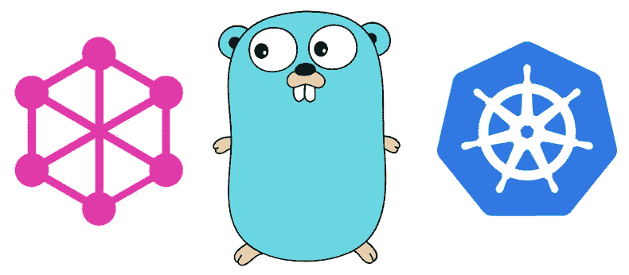
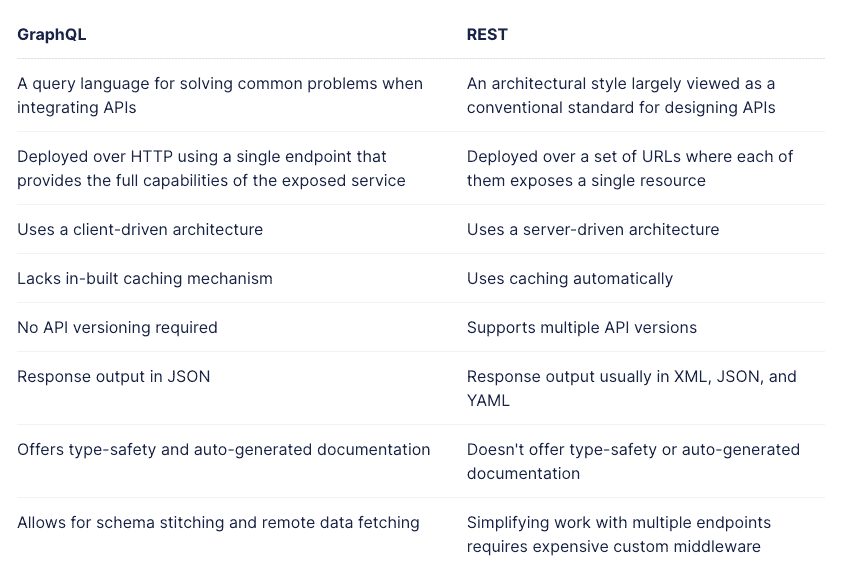
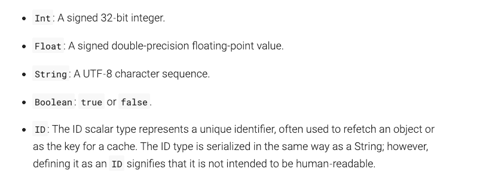

# Go 中的 Kubernetes GraphQL 查询

> 原文：<https://betterprogramming.pub/kubernetes-graphql-query-in-go-2f88af8f0d67>

## 构建 GraphQL 服务器来搜索集群中的 Kubernetes 资源



在共享集群治理中，我们的部分职责是允许用户访问他们的资源，这由 RBAC 来完成，分配合理的权限，并通过 kubectl 支持用户的查询。对于后端开发人员来说“没有障碍”,而对于不熟悉命令行操作或 kubectl 的移动、web 和数据开发人员来说却不是这样。

那么，我们如何为我们的用户突破障碍呢？

我们用一个 UI 可查询接口来实现它，提供查询服务和 API，如 REST 或 GraphQL，以确保更容易的访问、更高的平台可见性和更好的用户体验。关于实现，我们用 Go 实现了一个 GraphQL 服务。

# 为什么选择 GraphQL

REST 和 GraphQL 是实现前端-后端交互时的两种流行选择。前者多年来一直是互联网标准，后者是一种脸书开源 API 查询语言，你可以在 graphql.org 的[找到它的基础知识。这两者之间有很多比较，但在这里我只贴一张来自 https://graphcms.com/blog/graphql-vs-rest-apis](https://graphql.org/)[的照片，它最直观地展示了两者的区别。](https://graphcms.com/blog/graphql-vs-rest-apis)



所以，不难得出为什么我们选择 GraphQL 而不是 REST。

*   **GraphQL 更加灵活**。

它的对手休息是刚性的。以`Pod`查询(name，namespace，labels，container_name，maintainer)为例，我们可以发现为什么:REST 通常会设计类似`GET /pod/:name, GET /pod/:namespace`的多查询 API。在返回的数据需要定制的场景中，只有两种方法，不是所有的信息都需要，而是只需要某些字段。

*   返回所有字段并用客户端过滤它们，当响应包含几十个字段时，会大大增加网络开销。
*   服务器根据需要定制返回数据，这对后端工作负载来说很重要。

当 Kubernetes 中有几十种资源类型，每一种都支持至少三个查询，因此要设计数百个 REST APIs，更不用说未来的维护了，这是多么令人沮丧啊。

GraphQL 拯救了我们。它没有几十个 API，使客户端能够独立选择数据内容，服务器能够准确地返回目标数据。此外，它为客户端提供了一种统一的格式来获取数据，无论数据类型是什么，都是以一种更加严格、可伸缩和可维护的方式。

```
query {
  Pod(namespace: $namespace, name: $name) {
    metadata {
      name
      namespace
      //labels
      //annotations
    }
    status {
      conditions {
        lastTransitionTime
        message
        reason
        status
        type
      }
    }
    spec {
      //spec fields
    }
  }
}
```

*   **GraphQL 是我们用户比较熟悉的。**

[Backstage](https://backstage.io/) ，一个在很多大公司广泛使用的平台，给了 GraphQL 很好的支持，很多内部实现都基于 GraphQL，使得我们的查询 API 更容易被用户接受，因为他们对它非常熟悉。

# 在 Go 中启用 GraphQL

**Schema** (GraphQL schema 语言)是 GraphQL 的核心，描述了我们要查询的数据模型，其中最基础也是最关键的是抽象和定义对象类型。

在 Go 中开发 GraphQL 时，我们使用框架 [graphql-go](https://github.com/graphql-go/graphql) ，在此基础上我们完成了 graphql 模式的定义。这四个要素是

*   **类型模式**，它定义了查询名称、查询使用的参数以及查询返回的字段和类型。
*   **解析器**，填充返回消息的回调方法。
*   **订阅方**，返回增量更新的回调方法。
*   **突变**，一种修改数据的方法(本例不赘述)。

## 类型架构

定义字段。

```
type Resource {
  name: String!
  labels: [Label!]
  status: Status!
}
```

`Type`就像 Java 中的`Class`和 Go 中的`struct`一样，由一组字段组成，每个字段都有对应的类型。如示例所示，类型有不同的类别，其中[标量类型](https://graphql.org/learn/schema/#scalar-types)是最常见的一种，像示例中的`String`以及下面的许多类型。



GraphQL 还支持定制的标量类型。例子中的`Label`和`Status`属于`Object Type`，这允许我们像定义类图一样定义 GraphQL 类型，并将它们链接在一起。

`[]`、`!`、`[]!`为`Type Modifier`，用于标记`Field`为数组或非空，如`[Label!]`表示`labels`是由`Label`类型组成的数组，数组可以为空，但`Label`不可以。

对于 GraphQL 支持的其他[接口类型](https://graphql.org/learn/schema/#interfaces)、[联合类型](https://graphql.org/learn/schema/#union-types)和[输入类型](https://graphql.org/learn/schema/#input-types)，有兴趣可以参考文档中的例子。

而在`graph-go`端，也有一一对应的类型，比如`graphql.String`，默认每个字段都是可空的，如果需要非空，可以用`graphql.NewNonNull`包装类型。

## 分解器

下一步是分配或解析字段。

`Resolver`以您定义的任何方式填写退货数据。为了查询 Kubernetes 集群中的资源，这里使用了 client-go。

## 订户

通过注册与`List/Watch`非常相似的`Subscriber`，我们可以随后更新 GraphQL 数据。如果你熟悉 Kubernetes 的告密者模式，这并不陌生。

由于我们使用 Kubernetes 查询，`client-go` informer 是一个完美的匹配。但是在查询数据库或者像 Kafka 这样的消息库的时候，肯定有其他的方式来支持这个。

在`Type Schema`、`Resolver`和`Subscriber`之后，可以为 Pod 查询定义一个简单的 GraphQL 模式。

# 搜索集群并构建 GraphQL APIs

现在是关于应用 client-go，它被认为是 go 与 Kubernetes 集群交互的最佳选择，来实现`resolver`和`subscriber`方法。

至于 Pod 查询，我们直接使用`clientset` API，将它们与我们上面定义的各种参数结合起来。

对于订阅者，我们用 Informer 定制`Add`事件的更新，返回一个通道，用`graphql-go`框架处理来自订阅者的通道更新消息。

# 试验

让我们用 Go `httpserver`一步一步地启动 GraphQL 服务器。

*   创建`graphqlHandler`。

```
graphqlHandler := handler.New(&handler.Config{
   Schema:     &schema,
   Pretty:     true,
   GraphiQL:   false,
   Playground: true,
})
```

*   定义`http handler`。

```
http.Handle("/graphql", graphqlHandler)
```

*   启动`server`。

```
err = http.ListenAndServe(":8080", nil)
```

现在在[http://localhost:8080/graph QL](http://localhost:8080/graphql)上测试一下。

投入

```
query {
  Pod(namespace: "prometheus") {
    name
    status
  }
}
```

我们得到了

```
{
   "data":{
      "Pod":{
         "name":"prometheus-khdf12",
         "status":"Running"
      }
   }
}
```

# 部署

将程序封装到 docker 映像中并部署到集群后，我们现在就可以向用户开放服务了。

`Dockerfile`👇

需要注意的是， [WorkloadIdentity](https://cloud.google.com/kubernetes-engine/docs/how-to/workload-identity) 应该配置为在 GKE 集群中启用 client-go。详见[集群治理—定期清理资源](https://medium.com/codex/cluster-governance-clean-up-resources-periodically-2a8d4f0966da)。

# 更进一步

我们完成的 Kubernetes Pod 的 GraphQL 查询远非完美，我们希望返回完整的 Pod 信息，而不是简单的`PodShort`。

然而，手动返回 Pod 字段还有一些问题。

*   繁琐。可能有几十个字段，层层嵌套。
*   不便于维护。如果 Kubernetes 在未来版本中丢弃或添加一些字段，代码更新是不可避免的。
*   不利于扩张。一个 Pod 类型需要繁琐的定义，如果在集群中扩展到几十个甚至几百个类型和 CRD 会怎样？这似乎是一个不可能完成的任务。

有没有灵活可扩展的方式？简单的答案是应用 client-go 来获取集群中的 CRD 定义，并将其解析到一个`graph.Fields`集合中。详细回答请关注我的下一篇文章。

感谢阅读！

# 参考

[https://graphcms.com/blog/graphql-vs-rest-apis](https://graphcms.com/blog/graphql-vs-rest-apis)

[https://graphql.org/learn/schema/](https://graphql.org/learn/schema/)