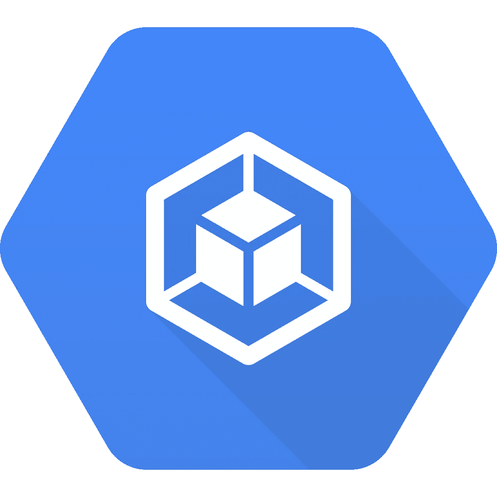

# 用外行人的话来说就是库伯内特

> 原文：<https://betterprogramming.pub/kubernetes-in-layman-terms-d9c307d2ef1d>

## 【Kubernetes 如何席卷软件工程，并从根本上改善商业 IT

来源:[维基共享资源](https://commons.wikimedia.org/wiki/File:Kubernetes-Engine-Logo.svg)

如果你不在其中，你可能没有听说过 Kubernetes。但它正被迅速而悄然地应用于科技界。

VMware [称](https://www.zdnet.com/article/kubernetes-is-the-new-java-vmware/)为“新 Java ”,这是一种在 1996 年发明的编程语言，如今几乎应用于所有领域。这就是他们认为这项技术将会变得有多大，有多普遍。

但是，与区块链不同，它引发了大量的公开宣传，但除了加密货币之外很少有经过实战检验的用例，Kubernetes 已经得到广泛使用，并且非常稳定。

# 什么是 Kubernetes？

Kubernetes(又名 K8s)不是一个单一的计算软件或编码语言。更确切地说，它可以被描述为一个具有特定服务器体系结构的系统，以及围绕它构建的用于该目的的大量软件。一篇[文章](https://www.zdnet.com/article/what-is-kubernetes-everything-your-business-needs-to-know/)将其描述为一种新的“数据中心集群服务器的工作负载分配和协调机制”。

好吧，非极客的话，正如我在标题中承诺的。

这里的关键词是*配器*。

乐队指挥的比喻经常被用来描述库伯内特。在有限的意义上，这是正确的。Kubernetes 协调和调整所有不同的“工具和部分”,这些工具和部分组成了位于服务器上的计算机应用程序。因此，即使应用程序不同部分的需求有所波动，it 部门也能及时高效地响应多个用户。

然而，我们需要进一步扩展这一类比，以解释它如何极大地改善服务器架构，以及它如何为我们今天使用的所有基于网络的计算机应用程序提供服务——无论是你在工作中收到的电子邮件，还是你从互联网上传到智能手机的音乐和视频。

# 超级协调员

传统的中央服务器架构就像在一个大型交响乐大厅里建造和举办音乐会。人们从四面八方赶来听管弦乐队演奏，但大厅的容量有限，任何一场演出都有可能满座，也有可能座无虚席。但是演出必须继续，指挥指导乐手的演奏，演奏观众来听的曲子。

但是这里有一个潜在的空间浪费，也有一个上限。

为了更有效、更灵活地利用服务器容量，出现了“虚拟机”的概念，即每台服务器都可以被软件人为划分成几台计算机，而不是一台。

把它想象成音乐厅的主人决定把空间分割成更小的大厅，以便几个管弦乐队可以同时演奏。这样，场地就能得到更有效的利用。

但是这种方法又产生了另一个问题。为了在同一个场地同时举办多场音乐会，你需要有几个管弦乐队，每个管弦乐队都有单独的指挥。那不是很有效率。

一个虚拟现实天才出现了，他对店主说:你为什么不把所有的表演都录下来？我将为你建立一个全息投影仪网络，它可以在你需要的任何时候，在一个大小和位置合适的音乐会空间内，在观众想听的任何时候，投影表演。

现在想象一下，这种虚拟现实技术是如此之好，以至于对观众来说，不用戴上虚拟现实护目镜和所有那些令人头晕的东西，表演看起来和感觉上都像真的一样。

这就是 Kubernetes 所做的。它旋转一个应用程序的映像，并使用任何适合该任务的可用服务器空间按需交付给用户。

当一个应用程序的性能结束时，Kubernetes 会关闭该应用程序并将其从临时空间中撤出，释放出来供其他人使用。如果一场演出由于某种原因被中断或破坏，Kubernetes 可以立即重新上演另一场演出，继续向相同的观众提供相同的表演。

事实上，库伯内特不仅仅是管弦乐队的指挥。它是多个管弦乐队演奏不同交响乐的自动超级协调器，所有这些都在同一时间发生！

*(顺便说一句:对于非极客来说，计算机的‘程序’和‘应用程序’是一回事。这是微软 vs 苹果术语的事情……)*

# **历史与影响**

Kubernetes [始于](https://kubernetes.io/blog/2018/07/20/the-history-of-kubernetes-the-community-behind-it)三名谷歌工程师在 2013 年决定做的一个项目。他们的目标是改善云服务器上的资源管理方式，以便其上托管的应用程序能够以最高效率运行。

这个想法并不新鲜。第一个做到这一点的产品来自一家名为 Docker 的公司。但是谷歌三人组看到了进行大规模改进的机会——他们抓住了这个机会。

他们还将他们的解决方案开源并独立于谷歌，这意味着它是免许可的。正因为如此，它很快吸引了一个由开发者和支持者组成的志愿者社区。谷歌的起源和支持也帮了大忙。

第一个版本于 2015 年推出。三年后，它在一年一度的 O'Reilly 开源大会(OSCON)上赢得了最具影响力的开源项目。到 2019 年 11 月，“超过 12，000 名与会者”在一年一度的“Kubecon”上尽可能多地了解 Kubernetes。

Kubernetes 的标志。一艘船的方向盘的图像象征着它的目的:驾驶和协调船只。来源:[维基媒体](https://commons.wikimedia.org/wiki/File:Kubernetes_logo_without_workmark.svg)

世界上一些最大和使用最频繁的在线[平台](https://kubernetes.io/case-studies/)——Shopify、Slack、Ebay、Spotify 和广受欢迎的 [Pokemon Go](https://cloud.google.com/blog/products/gcp/bringing-pokemon-go-to-life-on-google-cloud) 游戏——都是由 Kubernetes 驱动的。除了互联网业务，世界各地的各种公司，如中国联通、蚂蚁金服、康卡斯特、华为、贝莱德、SAP、纽约时报和飞利浦，都在使用 Kubernetes。甚至像高盛和荷兰国际集团这样的银行(通常是最谨慎和最严格的新技术采纳者)也在使用它。

但是，Kubernetes 的崛起真正令人惊讶的不是它吸引的用户类型，而是它吸引的 it 服务提供商类型——甚至是那些与之竞争的提供商！

> “……其他容器编排程序，如马拉松和 Docker swarm 模式，根本就没有火起来。事实上，它们的母公司 D2iQ(前身是 Mesosphere)和 Docker 都开始向客户提供 Kubernetes。还需要多说吗？”
> 
> *——*[Kubernetes 到底有多火？](https://www.zdnet.com/article/just-how-popular-is-kubernetes/)、ZDNet

如今几乎所有常用的云计算服务都支持 Kubernetes:谷歌云平台、微软 Azure、亚马逊网络服务、IBM Cloud 和 Oracle Cloud Infrastructure。微软甚至雇佣了三个联合创作者中的一个来“领导按照 Kubernetes 的形象重塑 Azure 的重要部分”。"

与此同时，早在 2017 年，三位 Kubernetes 联合创始人的原始灵感 Docker 就已经完全接受了它。

# **云中性**

Kubernetes 对企业最大的吸引力之一是它是一个*独立于供应商的平台*。

> 多云可能是有能力让供应商相互竞争的客户的崛起，而对 VMware 来说，Kubernetes 将使这成为可能。
> 
> —“[为什么 VMware 的 Kubernetes 投资将塑造您的云计算战略](https://www.zdnet.com/article/why-vmwares-kubernetes-investment-will-shape-your-multi-cloud-strategy/)”，ZDNet

好吧，对不起——又是极客说话！

## **俗人版**

很多时候，当你要求一个技术供应商为你开发软件时，你最终会感激他们，因为软件是建立在他们提供的硬件之上的，或者你需要他们来维护它。

在基于云计算的现代世界中，情况也是如此。例如，如果你的应用程序由亚马逊云服务提供的一系列系统托管和支持，你可能会发现很难转向谷歌，即使前者提高了对你的价格。

但是 Kubernetes 正在改变这一切。有了 Kubernetes，企业主[可以轻松地在不同的云提供商之间转移](https://www.zdnet.com/article/why-vmwares-kubernetes-investment-will-shape-your-multi-cloud-strategy/?fireglass_rsn=true)他们的在线平台，而不用担心会出问题。

事实上，您甚至可以使用多个云构建一个系统，并将您的数据存储在许多不同的位置。可以说，在 Kubernetes 驱动的系统的任何部分，都不依赖于集中或锁定到特定的技术堆栈。

回到虚拟管弦乐队的类比，这相当于说演出场地不再重要。一旦虚拟现实投影系统就位并连接到交响乐作品的数字录音，所有者就可以选择在他能找到的任何租赁空间举行音乐会，在世界上的任何地方，面向任何规模的观众。

# 实施成本

有什么条件？

如果 Kubernetes 这么有用，而且可以免费使用，我为什么不现在就为我的生意投入使用呢？

没那么快。这仍然是有代价的。

开源并不意味着“无成本”。这只是意味着底层技术不附带使用许可或费用。你仍然需要花钱请人来安装、定制和维护它(除非你是一个多才多艺的极客创业公司创始人)，你可能还得购买相关软件。

如果你以前使用过三星、华为或 Oppo 等制造商的智能手机，你就会产生共鸣。他们的手机运行的 Android 操作系统也是由谷歌开发的开源软件。与苹果 iOS 等专有操作系统不同，任何人都可以下载 Android，并使用它来驱动智能手机的操作。

但是如果你以前用过不止一个品牌，你会注意到每个品牌的用户界面和功能都有显著的不同。这是因为他们聘请了软件工程师根据自己的喜好对其进行定制，并增加了额外的功能，以区别于竞争对手。

Kubernetes 也是如此。对于像这样的旨在作为通用基础层的系统来说，一种尺寸并不适合开箱即用。它需要由经验丰富的工程师定制，以便公司特定的应用程序在其上运行。

不可能是任何一个程序员或软件工程师。IT 世界就像音乐世界，有许多不同的流派和乐器。仅仅因为所有的音乐家学习相同的基本音乐理论和符号并不意味着他们能够演奏所有的乐器或者以相同的风格演奏。这只是意味着他们能够比一个完全的初学者更快地学会一种新的乐器或流派。因此，使用 Kubernetes，您可能需要专业供应商或系统开发人员来实现它。

既然我们在谈论多样性，这里也值得一提的是，Kubernetes 的魅力在于它不仅仅适用于像亚马逊或谷歌这样的大规模多租户云服务。它也可以安装在传统的私有现场服务器上。但是，作为一个管理现代商业应用的系统，尽管它有各种不同的功能和组件，但预计它将变得如此受欢迎和流行，以至于它将变得几乎*不可见—* 云技术堆栈中的一个标准层，人们甚至不再考虑它。就在*那里*。

# 前方的路

但这并不全是好事。

Kubernetes 仍处于充分发挥潜力的早期阶段。而且，就像创作管弦乐交响乐一样，所需要的复杂性、天赋和知识与创作广告歌曲或电台流行歌曲非常不同。

> “我们仍处于潜在阶段……现实是有很多复杂因素。它非常强大，但也非常复杂。”
> 
> —云原生应用的 VMware 副总裁兼首席技术官 [Kit Colbert](https://www.zdnet.com/article/kubernetes-is-the-new-java-vmware/) 。

对于使用遗留系统的大企业来说，采用 Kubernetes 的一个吸引人之处是能够将旧的应用程序集成到新的 Kubernetes 驱动的设置中。不需要重新构建一个旧的软件或者想办法修改它以在新的系统中工作，它可以简单地作为一个应用程序放在 Kubernetes 中，它需要在任何需要的时候与新的组件一起运行。

回到管弦乐队的类比——把它想象成一个由即将退休的老音乐家组成的低音或弦乐组。这一部分仍然需要，但投资培训新的音乐家需要时间和金钱。

现在有了新的全息投影技术，另一种选择是录制他们表演的各种作品。然后，每当需要演奏这些作品时，它们的部分的全息投影可以与乐队的其余部分集成在一起，以完成演奏，即使他们已经从乐队中退休。

只要听众仍然需要录制的作品，这种解决方案就比只为旧作品的那些部分雇佣和培训新的音乐家更优雅和有效。

当然，在真实的 IT 世界中，有各种不同的遗留语言、平台和架构，这仅仅是解释了高级概念，掩盖了复杂的执行细节。

但使用 Kubernetes 的这一优势对许多采用它的大公司来说意义重大，因为他们通常不像初创公司那样从零开始构建系统。

# 区块链和库伯内特

为了结束我们开始的地方，让我再次尝试将区块链和 Kubernetes 作为新技术进行比较。

区块链更像是一种新发明的乐器。很迷人，很吸引人。它为管弦乐队的混音引入了一种新的声音，但我们仍然不太确定它如何适应现有的作品，为观众创作出一首有凝聚力和令人愉悦的音乐。

为此，它在设计上仍在进行广泛的调整。即使它确实适合现有的管弦乐队，它也可能仅限于某些音乐流派。

而 Kubernetes 则像是一种通用的模拟技术，观众可以很容易地立即接受。因为对他们来说，没什么区别。他们甚至不会注意到舞台上演奏的不是真正的物理管弦乐队。

然而，为了让这种新的商业模式和演出交付方式发挥作用，管弦乐队的所有者必须接受并投资建立这种模式。只要他们这样做，世界上大多数可用的音乐会场地和活动组织者已经准备好与它合作。

本质上，今天的区块链是每个人都在谈论的温和而神秘的管理大师。他看起来令人印象深刻，但你不确定他宣扬的东西是否对你的企业有用。你花在雇佣他身上的钱可能会被浪费掉。但是……让他参与进来看起来是如此时尚和正确，因为其他人都在这么做。

另一方面，Kubernetes 是一个默默无闻但才华横溢的工作者，你并没有真正注意到他。他不是最容易相处的同事，但他开始证明他可以为你节省很多钱，并为你带来巨大的效率提升。