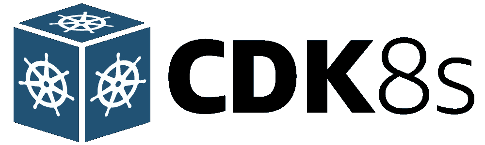
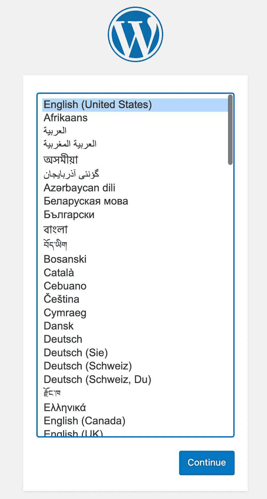

# 将您的 Kubernetes 基础设施编写为 Go 代码——“cdk8s-plus”投入使用！

> 原文：<https://betterprogramming.pub/kubernetes-infrastructure-as-code-for-go-developers-cdk8s-plus-in-action-ee3eb2203745>

## 使用“cdk8s-plus”库减少样板代码



cdk8s.io

我之前的一篇博客文章介绍了如何开始使用[cdk8s](https://cdk8s.io/docs/latest/)(Kubernetes 的云开发工具包)，这是一个开源框架(CNCF 的一部分)，通过它你可以使用常规编程语言(而不是`yaml`)定义你的 Kubernetes 应用。

[](/write-your-kubernetes-infrastructure-as-go-code-getting-started-with-cdk8s-989725f8af73) [## 将您的 Kubernetes 基础设施编写为 Go 代码 Cdk8s 入门

### 使用 Go 定义您的 Kubernetes 应用程序

better 编程. pub](/write-your-kubernetes-infrastructure-as-go-code-getting-started-with-cdk8s-989725f8af73) 

您可以设置一个简单的`nginx`部署并通过`Service`访问它——所有这些都是使用 Go 完成的，然后使用`cdk8s synth`转换为`yaml`，并使用`kubectl`提交给集群。这是一个好的开始。然而，由于核心的`cdk8s`库是相当低级的(理由很充分！)代码涉及了很多样板文件(你可以[参考这里的代码](https://github.com/abhirockzz/cdk8s-for-go-developers/tree/master/part1-getting-started))。

`cdk8s-plus`利用来自`cdk8s`核心库的构建块，从而通过为所有 Kubernetes 对象(如`Deployment`、`Service`等)提供更高级别的抽象/API 来帮助减少冗长和复杂性。在这篇博客中，我们将看到`cdk8s-plus`的实际应用，甚至用它在 Kubernetes 上部署 Wordpress！

# 让我们从改造 Nginx 部署开始。

要见证`cdk8s-plus`是如何工作的，最好看看代码。

> *是 Github* *上可用的* [*。*](https://github.com/abhirockzz/cdk8s-for-go-developers/tree/master/part2-cdk8s-plus-in-action)

在我们进行的过程中，我将带您浏览代码。

```
func NewNginxChart(scope constructs.Construct, id string, props *NginxChartProps) cdk8s.Chart {
    var cprops cdk8s.ChartProps
    if props != nil {
        cprops = props.ChartProps
    }
    chart := cdk8s.NewChart(scope, jsii.String(id), &cprops) dep := cdk8splus22.NewDeployment(chart, jsii.String("deployment"), &cdk8splus22.DeploymentProps{Metadata: &cdk8s.ApiObjectMetadata{Name: jsii.String("nginx-deployment-cdk8s-plus")}}) dep.AddContainer(&cdk8splus22.ContainerProps{
        Name:  jsii.String("nginx-container"),
        Image: jsii.String("nginx"),
        Port:  jsii.Number(80)}) dep.ExposeViaService(&cdk8splus22.DeploymentExposeViaServiceOptions{
        Name:        jsii.String("nginx-container-service"),
        ServiceType: cdk8splus22.ServiceType_LOAD_BALANCER,
        Ports:       &[]*cdk8splus22.ServicePort{{Port: jsii.Number(9090), TargetPort: jsii.Number(80)}}}) return chart
}
```

我们首先创建一个[部署](https://pkg.go.dev/github.com/cdk8s-team/cdk8s-plus-go/cdk8splus22/v2#NewDeployment)，然后[添加一个容器](https://pkg.go.dev/github.com/cdk8s-team/cdk8s-plus-go/cdk8splus22/v2#Deployment.AddContainer)，最后使用服务公开它[。这是非常直观和用户友好的。](https://pkg.go.dev/github.com/cdk8s-team/cdk8s-plus-go/cdk8splus22/v2#Deployment.ExposeViaService)

> *容器细节可以通过*[*deployment props*](https://pkg.go.dev/github.com/cdk8s-team/cdk8s-plus-go/cdk8splus22/v2#DeploymentProps)*提供，但是使用* `*AddContainer*` *似乎更自然(至少对我来说)。*

要生成 Kubernetes 清单，只需运行`cdk8s synth`。这将在`dist`文件夹中生成一个`yaml`。这里有一个例子(一些名称，标签等)。在您的情况下会有所不同):

```
apiVersion: apps/v1
kind: Deployment
metadata:
  name: nginx-deployment-cdk8s-plus
spec:
  minReadySeconds: 0
  progressDeadlineSeconds: 600
  replicas: 1
  selector:
    matchLabels:
      cdk8s.io/metadata.addr: nginx-cdk8s-plus-deployment-c84b388e
  strategy:
    rollingUpdate:
      maxSurge: 25%
      maxUnavailable: 25%
    type: RollingUpdate
  template:
    metadata:
      labels:
        cdk8s.io/metadata.addr: nginx-cdk8s-plus-deployment-c84b388e
    spec:
      automountServiceAccountToken: true
      containers:
        - image: nginx
          imagePullPolicy: Always
          name: nginx-container
          ports:
            - containerPort: 80
          securityContext:
            privileged: false
            readOnlyRootFilesystem: false
            runAsNonRoot: false
      dnsPolicy: ClusterFirst
      securityContext:
        fsGroupChangePolicy: Always
        runAsNonRoot: false
      setHostnameAsFQDN: false
---
apiVersion: v1
kind: Service
metadata:
  name: nginx-container-service
spec:
  externalIPs: []
  ports:
    - port: 9090
      targetPort: 80
  selector:
    cdk8s.io/metadata.addr: nginx-cdk8s-plus-deployment-c84b388e
  type: LoadBalancer
```

> *`*Deployment*`*和* `*Service*` *出现在同一个清单中，因为它们是在同一个* `*Chart*` *中声明的。**

*值得注意的是*没有*需要指定任何`Pod`标签选择器、模板标签(在`Deployment`代码中)或`Service`选择器。`cdk8s-plus`通过自动生成`cdk8s.io/metadata.addr: nginx-cdk8s-plus-deployment-c84b388e`来处理它，这在 s `pec.selector.matchLabels`和`spec.template.metadata.labels`中使用，与`nginx-container-service`中的服务`selector`一起使用*

***关于依赖关系的注释***

*`go.mod`列出所有模块:*

```
*require (
    github.com/aws/constructs-go/constructs/v10 v10.1.42
    github.com/aws/jsii-runtime-go v1.61.0
    github.com/cdk8s-team/cdk8s-core-go/cdk8s/v2 v2.3.31
    github.com/cdk8s-team/cdk8s-plus-go/cdk8splus22/v2 v2.0.0-rc.23
)*
```

*注意，我们使用的是`cdk8splus22`。这种命名约定的原因是因为每个`cdk8s-plus`库都是针对特定的 Kubernetes 版本单独出售的——结尾的`22`表示这个依赖项将与 Kubernetes `1.22`一起工作*

> **我建议* [*阅读常见问题解答*](https://cdk8s.io/docs/latest/plus/#whats-the-difference-between-cdk8s-plus-20-cdk8s-plus-21-and-cdk8s-plus-22) *以进一步了解情况**

***本地测试…***

*…您可以使用 [minikube](https://minikube.sigs.k8s.io/docs/start/) 、[类](https://kind.sigs.k8s.io/docs/user/quick-start/#installation)等。*

```
*git clone https://github.com/abhirockzz/cdk8s-for-go-developers
cd part2-cdk8s-plus-in-action/nginx-example# make sure cluster is running
minikube start# create the resources
kubectl apply -f dist/
kubectl get pods -w*
```

*一旦`Pod`运行，检查`Service`:*

```
*kubectl get svc*
```

*在终端中，运行以下命令(它作为单独的进程运行):*

```
*minikube tunnel*
```

*要访问`nginx`服务器，导航到外部 IP(根据`Service`)。在 minikube 的情况下，您可以简单地使用`localhost:9090`或`127.0.0.0:9090`*

# *在 Kubernetes 上安装一个 Wordpress 怎么样？*

*我喜欢这个例子——它并不过分复杂，但足够真实，因为它有多个移动部分，包括无状态、有状态组件、不同种类的服务等的组合。*

> **这篇文章并不是对* `*Wordpress*` *的深入探究，而是从 Kubernetes 文档* *中的* [*这篇文章中获得的灵感，我想人们可能对此很熟悉。*](https://kubernetes.io/docs/tutorials/stateful-application/mysql-wordpress-persistent-volume/)*

*`main`功能会给你一个未来的感觉:*

```
*func main() {
    app := cdk8s.NewApp(nil) mySQLChart := NewMySQLChart(app, "mysql", nil)
    wordpressChart := NewWordpressChart(app, "wordpress", nil) wordpressChart.AddDependency(mySQLChart) app.Synth()
}*
```

*到目前为止，我们只处理了一张图表。我们的 Wordpress `cdk8s`应用程序有**两个**独立的图表——一个用于 MySQL 数据库，另一个用于 Wordpress。这将导致作为`cdk8s synth`流程的结果创建两个不同的清单。*

***让我们先看看 MySQL 的图表***

> **为简洁起见，省略了一些代码**

*我们首先定义一个 Kubernetes `Secret`来存储 MySQL 密码(用 [NewSecret](https://pkg.go.dev/github.com/cdk8s-team/cdk8s-plus-go/cdk8splus22/v2#NewSecret) ):*

```
*func NewMySQLChart(scope constructs.Construct, id string, props *MyChartProps) cdk8s.Chart {
    //....
    secretName := "mysql-pass"
    password := "Password123" mysqlSecret := cdk8splus22.NewSecret(chart, jsii.String("mysql-secret"),
        &cdk8splus22.SecretProps{
            Metadata: &cdk8s.ApiObjectMetadata{Name: jsii.String(secretName)}}) secretKey := "password"
    mysqlSecret.AddStringData(jsii.String(secretKey), jsii.String(password))*
```

> **MySQL 密码已在代码中声明——无论如何都不是最佳实践，只是为了演示。在生产中做到* ***而不是*** *这样！**

*然后我们创建`Deployment`并提供容器细节。注意`Secret`是如何作为环境变量添加到容器中的:*

*   *首先，我们使用[env value _ FromSecretValue](https://pkg.go.dev/github.com/cdk8s-team/cdk8s-plus-go/cdk8splus22/v2#EnvValue_FromSecretValue)得到一个 [EnvValue](https://pkg.go.dev/github.com/cdk8s-team/cdk8s-plus-go/cdk8splus22/v2#EnvValue)*
*   *使用 [Env#AddVariable](https://pkg.go.dev/github.com/cdk8s-team/cdk8s-plus-go/cdk8splus22/v2#Env.AddVariable) 将其添加到容器中*

```
*dep := cdk8splus22.NewDeployment(chart, jsii.String("mysql-deployment-cdk8splus"), &cdk8splus22.DeploymentProps{}) containerImage := "mysql" mysqlContainer := dep.AddContainer(&cdk8splus22.ContainerProps{
        Name:  jsii.String("mysql-container"),
        Image: jsii.String(containerImage),
        Port:  jsii.Number(3306),
    }) envValFromSecret := cdk8splus22.EnvValue_FromSecretValue(&cdk8splus22.SecretValue{Key: jsii.String(secretKey), Secret: mysqlSecret}, &cdk8splus22.EnvValueFromSecretOptions{Optional: jsii.Bool(false)}) mySQLPasswordEnvName := "MYSQL_ROOT_PASSWORD" mysqlContainer.Env().AddVariable(jsii.String(mySQLPasswordEnvName), envValFromSecret)*
```

*为了持久存储，我们创建了一个 [PersistentVolumeClaim](https://pkg.go.dev/github.com/cdk8s-team/cdk8s-plus-go/cdk8splus22/v2#NewPersistentVolumeClaim) ，用它来定义一个[卷](https://pkg.go.dev/github.com/cdk8s-team/cdk8s-plus-go/cdk8splus22/v2#Volume_FromPersistentVolumeClaim)和[挂载到路径`/var/lib/mysql`处的](https://pkg.go.dev/github.com/cdk8s-team/cdk8s-plus-go/cdk8splus22/v2#Container.Mount)容器中。*

```
*mysqlPVC := cdk8splus22.NewPersistentVolumeClaim(chart, jsii.String("mysql-pvc"), &cdk8splus22.PersistentVolumeClaimProps{
        AccessModes: &[]cdk8splus22.PersistentVolumeAccessMode{cdk8splus22.PersistentVolumeAccessMode_READ_WRITE_ONCE},
        Storage:     cdk8s.Size_Gibibytes(jsii.Number(2))}) mysqlVolumeName := "mysql-persistent-storage"
    mysqlVolume := cdk8splus22.Volume_FromPersistentVolumeClaim(chart, jsii.String("mysql-vol-pvc"), mysqlPVC, &cdk8splus22.PersistentVolumeClaimVolumeOptions{Name: jsii.String(mysqlVolumeName)}) mySQLVolumeMountPath := "/var/lib/mysql"
    mysqlContainer.Mount(jsii.String(mySQLVolumeMountPath), mysqlVolume, &cdk8splus22.MountOptions{})*
```

*最后，我们创建一个[服务](https://pkg.go.dev/github.com/cdk8s-team/cdk8s-plus-go/cdk8splus22/v2#NewService):*

```
*mySQLServiceName := "mysql-service"
    clusterIPNone := "None" cdk8splus22.NewService(chart, jsii.String("mysql-service"), &cdk8splus22.ServiceProps{
        Metadata:  &cdk8s.ApiObjectMetadata{Name: jsii.String(mySQLServiceName)},
        Selector:  dep,
        ClusterIP: jsii.String(clusterIPNone),
        Ports:     &[]*cdk8splus22.ServicePort{{Port: jsii.Number(3306)}},
    })*
```

> **与前面的例子不同，我们显式创建一个* `*Service*` *，然后在服务选择器中引用* `*Deployment*` *对象。**

***WordPress 图表**——除了微小的差异，它与带有 WordPress 特定配置的 MySQL 图表明显相同。所以这里就不赘述了——可以随意[探索代码](https://github.com/abhirockzz/cdk8s-for-go-developers/blob/master/part2-cdk8s-plus-in-action/wordpress/main.go#L70)。*

# *是时候启动 Kubernetes 上的 Wordpress 了！*

*冲洗并重复— `cdk8s synth`以创建清单并使用`kubectl`应用它:*

```
*cd part2-cdk8s-plus-in-action/wordpress#create manifests
cdk8s synth#apply them
kubectl apply -f dist/#output - you will see something similar to:secret/mysql-pass created
deployment.apps/mysql-mysql-deployment-cdk8splus-c83762d9 created
persistentvolumeclaim/mysql-mysql-pvc-c8799bba created
service/mysql-service created
deployment.apps/wordpress-wordpress-deployment-cdk8splus-c8252da7 created
service/wordpress-service created
persistentvolumeclaim/wordpress-wordpress-pvc-c8334a29 created*
```

*在不同的终端运行(如果尚未运行):*

```
*minikube tunnel*
```

*使用浏览器导航至 [http://localhost:80](http://localhost/) 。你应该会看到熟悉的 Wordpress 安装界面。*

**

*wordpress 软件*

*继续，完成安装并登录你的 Wordpress 实例。请随意尝试。也许可以尝试删除 MySQL 部署并重新创建它。多亏了`PersistentVolume`，MySQL 数据应该能恢复，Wordpress 也能继续工作。*

# *结论*

*厉害！在这篇博客里，你看到了`cdk8s-plus`的表现力。我们从一个简洁的 Nginx 部署版本开始，以一个成熟的 WordPress 实例结束——全部使用 Go。*

*编码快乐！*