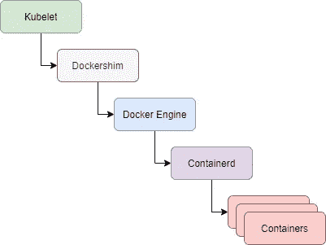
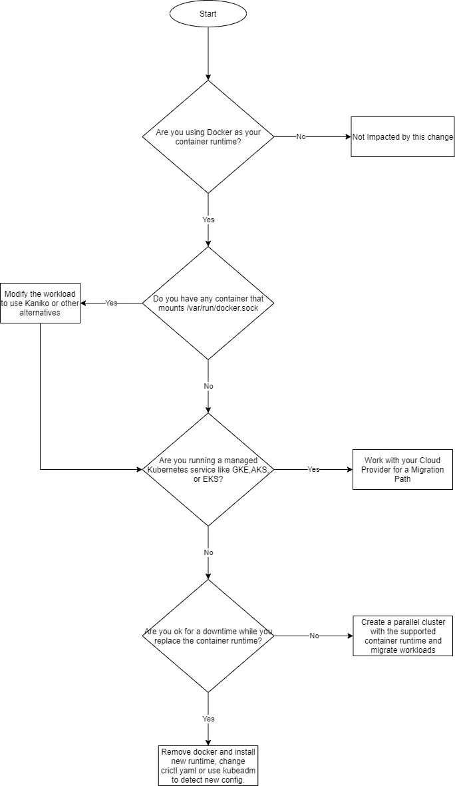

# Kubernetes 是在贬低 Docker

> 原文：<https://betterprogramming.pub/kubernetes-is-deprecating-docker-8a9f7566fbca>

## 变化是什么，谁受到影响，如何迁移，为什么这不是恐慌的理由？

作者图片

就像我们大多数人听说的那样，Kubernetes 反对 Docker 作为 1.20 版的运行时，而支持使用容器运行时接口(CRI)的运行时，如 containerd 和 CRI-O。

不过，这不是恐慌的理由。首先:这是一种反对——也就是说，你会从 1.20 版开始收到警告，所以你不会立即受到影响。你仍然有整整一年的时间来制定计划，因为 Docker 在 1.22 版将不受支持，他们将在 2021 年底推出。

即使到那时您还没有准备好，您也可以选择不升级到 1.22 版，直到您认为自己准备好了为止。Kubernetes 仍然会用任何安全更新来修补你现有的版本。

但是，在我们深入了解如何迁移的任何细节之前，让我们先了解一下发生了什么变化以及它会对谁产生影响。

# 有什么变化

那么是什么在改变呢？这只是 Kubernetes 运行时。如果您正在使用 Docker 构建您的映像，并在开发期间测试您的 CI/CD 管道，您可以继续使用它。Docker 在内部使用 containerd 来运行 Docker 容器。

如果 Docker 使用 containerd，并且众所周知，containerd 是另一个容器运行时，那么为什么还要使用 Docker 呢？好吧，Docker 不仅仅是一个容器运行时——容器运行时只形成它的核心，Docker 已经把它卸载给 containerd 了。Docker 还在上面提供了许多用户体验层，允许像你我这样的开发人员轻松地与之交互。

然而，这一层对于机器来说毫无意义。最重要的是，Kubernetes 不能直接与 Docker 交互，因为它与 Kubernetes CRI 不兼容。相反，它需要在上面使用另一个层，称为 dockershim，这在已经复杂的容器运行时上增加了额外的复杂性，如下图所示:

作者图片

现在这变得有些过头了，因此 Kubernetes 已经决定逐步取消它的支持，因为 Docker 最终会与 containerd 交互，而 Kubernetes 可以直接与 container d 交互。Kubernetes 也不在乎任何花哨的 UI，因为它只是一台机器。

# 谁受到了影响？

那么我们是否应该完全停止使用 Docker 呢？不尽然！Docker 有一个非常不同的功能。除了是一个容器运行时，它还是一个开发人员友好的容器引擎。因此，如果您正在使用 Docker 构建容器映像并在 CI/CD 管道中使用，您可以继续使用它。

Docker 建立了 OCI 标准的集装箱形象。这意味着 Docker 映像可以在任何符合 OCI 标准的容器运行时上运行良好——包括 containerd 和 CRI-O

现在让我们看看编排层。如果您在 Kubernetes 集群中使用 Docker 作为容器运行时，就会受到影响。您必须用受支持的容器运行时来替换它——container d 或 CRI-o。Docker 容器在这两种环境下都能很好地运行。

如果您使用的是托管服务，如 GKE、EKS 或 AKS，您可以检查集群设置，找出它使用的容器运行时。无论如何，这三个都默认为 containerd，如果您没有进行任何自定义选择，那么您很可能正在使用 containerd，并且不会受到影响。

如果您出于某种原因使用 Docker，您需要与您的云提供商合作，以确保您获得到受支持的运行时的正确的、经过测试的升级。云提供商将朝着这一目标努力，并很快提供迁移路径和建议。

如果您已经构建了您的集群或者有一个本地设置，那么当您替换您的容器运行时并通过修改`crictl.yaml`文件以指向新的容器运行时或者通过允许 kubeadm 自动检测新的运行时并应用配置来再次启动它时，将会有更多的工作并导致停机。

好吧，如果您不想停机，您可以采用金丝雀方法，使用受支持的容器运行时旋转一个重复的集群，并将您的工作负载迁移到那里，然后关闭现有的集群。

# 容器工作负载会受到影响吗？

如果您在尝试迁移到新的运行时之前进行评估，那将是最好的。如果您有一个 CI/CD 管道在 Kubernetes 中运行，并且它通过挂载`/var/run/docker.sock`套接字文件使用 Docker-in-Docker (DinD)方法，那么您会受到影响。

因为您不会在 Kubernetes 集群中运行 Docker，所以您需要用一个合适的解决方案来替换它——Kaniko 是一个很好的解决方案，因为它不依赖 Docker 守护进程来构建容器映像。你可以阅读“[如何用 Kaniko](https://medium.com/better-programming/how-to-build-containers-in-a-kubernetes-cluster-with-kaniko-2d01cd3242a7) 在 Kubernetes 集群中构建容器”来获得关于如何解决这个问题的更详细的观点。

任何其他工作负载都不会受到影响，您可以在任何其他受支持的容器运行时上很好地运行它们。

# 摘要

尽管 Kubernetes 已经决定弃用 Docker，转而支持 CRI 的容器运行时，但没有理由恐慌。这并不意味着 Docker 的死亡，其影响只是针对 Kubernetes 集群上的容器运行时。您可以像以前一样继续使用 Docker 进行开发活动。

为了简单起见，让我们用一个有用的流程图来总结整个故事:

作者图片

感谢阅读！我希望你喜欢这篇文章。