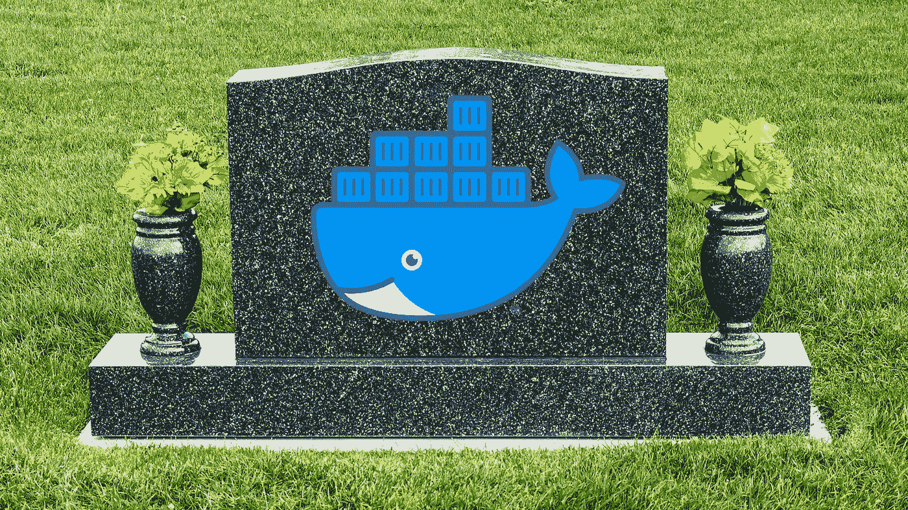
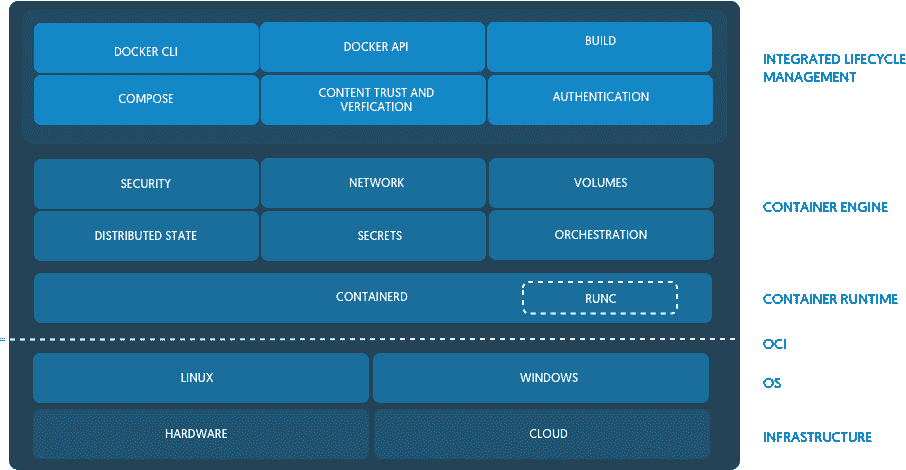

# Kubernetes 刚刚否决了 Docker 支持。现在怎么办？

> 原文：<https://betterprogramming.pub/kubernetes-just-deprecated-docker-support-e86d2327afad>

## 这会杀死 Docker 吗？

作者照片。

> 这篇文章的视频版本在[https://youtu.be/AB2elYLNlLs](https://youtu.be/AB2elYLNlLs)

[凯特·科斯格罗维](https://twitter.com/Dixie3Flatline)12 月 2 日在推特上写道:

如果你不是 Twitter 用户，让我在这里为你转录整个线程:

> “所以，Kubernetes 不赞成 Docker 的支持，你要么紧张，要么困惑。没关系！我想帮助你了解发生了什么。一根线！1/10
> 
> 从 Kubernetes v1.20 开始，您将收到 Docker 的弃用警告。之后，您将需要使用不同的容器运行时。是的，这将打破你的集群。你可能认为 Docker == Kubernetes。不是这样的！2/10
> 
> 我们称之为 Docker 的东西实际上是一个完整的技术堆栈，包括一个叫做 containerd 的东西以及一些其他东西，比如一些花哨的 UX 变化，使人类更容易与之交互。Containerd 本身就是一个高级容器运行时。3/10
> 
> 不过，库伯内特并不需要 UX 那些花哨的东西。它只需要容器运行时。使用 Docker，整个堆栈，因为你的容器运行时意味着 Kubernetes 必须使用称为 dockershim 的东西来与它实际需要的部分进行交互。4/10
> 
> 这是因为 Docker 与 CRI(容器运行时接口)不兼容。Dockershim 允许我们绕过这一点，但这也意味着我们要维护一个完全独立的东西，以便我们可以使用 Docker 作为我们的运行时。5/10
> 
> 这真糟糕。不方便。解决方案是去掉抽象，只使用 containerd 作为我们在 Kubernetes 中的容器运行时。因为，再说一次，库贝内特斯不是人类——它不需要 UX 增强功能。6/10
> 
> 所以，你不需要恐慌。Docker 还没有死，它仍然有它的用途。在 Kubernetes 中，您不能再将它用作容器运行时。下一个版本之后，需要切换到 containerd。7/10
> 
> 是的，你可以呆在旧版本的 Kubernetes 上。不，你绝对不应该，否则@IanColdwater 会缠着你的集群。幽灵 8/10
> 
> 关于容器运行时的 Kubernetes 文档在这里，其中包含关于使用 containerd 或 CRI-O 的信息:https://Kubernetes . io/docs/setup/production-environment/container-runtimes/…9/10
> 
> 无论如何，我希望这有助于减轻一些焦虑或误解。如果你还是很困惑，没关系！提问！这真的很复杂。你的问题并不愚蠢，即使它们很简单！10/10
> 
> 奖励推文:是的，Kubernetes 仍将运行 Docker 构建的图像！TL；对于开发人员来说，灾难恢复不会有太大的变化，这些映像仍然符合 OCI(开放容器倡议), containerd 知道如何处理它们。"

# 官方公告在哪里？

一个有趣的回答是:

我还要在这里补充一点:

> kubelet 中的 Docker 支持现在已被否决，并将在未来的版本中删除。kubelet 使用了一个名为“dockershim”的模块，它实现了对 Docker 的 CRI 支持，并且在 Kubernetes 社区中发现了维护问题。我们鼓励您评估迁移到一个容器运行时，这是一个成熟的 CRI 实现(v1alpha1 或 v1 兼容)，因为它们变得可用。”—[GitHub 上的 Kubernetes](https://github.com/kubernetes/sig-release/blob/master/releases/release-1.20/release-notes-draft.md)

# 我应该停止使用 Docker 吗？

如果您是开发人员，不用担心:Docker 充当了容器化的人性化接口，它已经使用了 containerd。

# 包含什么？

他们提到的这个书呆子容器是什么？

实际上是[集装箱](https://containerd.io/)。

[迈克尔·克罗斯比在 Docker 博客上讨论了这个问题](https://www.docker.com/blog/what-is-containerd-runtime/)。这是最有助于我理解的部分:

图片来自 Docker 博客。

> “由于在内核空间中没有 Linux 容器这样的东西，容器是捆绑在一起的各种内核特性，当您构建一个大型平台或分布式系统时，您需要在管理代码和运行容器的系统调用和特性之间有一个抽象层。那是集装箱人住的地方。它提供了一个客户端类型层，平台可以在其上构建，而不必下降到内核级别。
> 
> Containerd 旨在供 Docker 和 Kubernetes 以及任何其他希望抽象出系统调用或操作系统特定功能以在 linux、windows、solaris 或其他操作系统上运行容器的容器平台使用。考虑到这些用户，我们希望确保 containerd 只有他们需要的东西，没有他们不需要的东西。实际上这是不可能的，但至少这是我们努力的方向。”——[Docker 博客](https://www.docker.com/blog/what-is-containerd-runtime/)

# 这会杀死 Docker 吗？

大概不会。我大部分时间都是不用别的东西就用 Docker。很简单。

此外，如果新来者从 Kubernetes 开始，他们可能会首先看到新的替代方案。

无论哪种方式，如果这种转变影响 Docker 的使用，它只会在未来几年内出现。

感谢阅读！