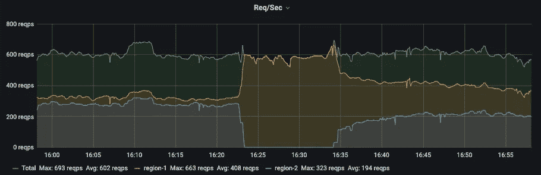
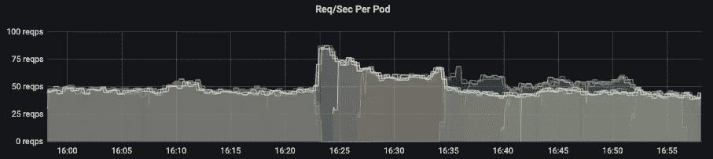
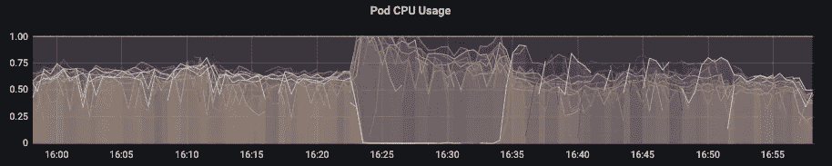

# Kubernetes 的警示课程

> 原文：<https://betterprogramming.pub/kubernetes-lessons-in-alerting-a0b7a455e89d>

## 实时问题是一个学习和提高的好机会。这就是我们的遭遇

由[弗勒](https://unsplash.com/@yer_a_wizard?utm_source=medium&utm_medium=referral)在 [Unsplash](https://unsplash.com?utm_source=medium&utm_medium=referral) 上拍摄的照片。

在本文中，我们将探讨一个案例，当我们的一个服务扩展到其最大值时，我们如何改变我们的警报以防止这在未来成为一个问题。

# 我们的基础设施

我们在本文中作为示例使用的服务部署在启用了自动缩放的 [Kubernetes](https://kubernetes.io/) (K8s)上。我们基于每秒请求数进行扩展，K8s 被配置为将每秒请求数(RPS)保持在 50。在扩展服务之前会有一点延迟，因为 RPS 是一分钟内的平均值。有关 K8s 缩放的更多信息，请查看[的文档](https://kubernetes.io/docs/tasks/run-application/horizontal-pod-autoscale/)。

为了保持高可用性，我们运行两个 K8s 集群。下图将这些集群显示为`region-1`和`region-2`。当涉及自动扩展时，这会产生额外的复杂性，因为集群是完全独立的，并且不共享指标。我们的网站以主动-主动方式运行，并且在两个区域之间实现了负载平衡。

我们使用 [Prometheus](https://prometheus.io/) 和 [Grafana](https://grafana.com/) 来监控我们的应用程序。下图来自 Grafana，显示了来自 Prometheus 的各种指标。Alert Manager 用于提醒 Prometheus metrics，允许我们在晚上唤醒待命的工程师，并在白天向工程师发送通知。我们试图在白天发送先发制人的通知，并且只有在出现实际上影响客户的问题时才叫醒待命工程师。

# 该事件

由于一个单独的应用程序出现问题，我们的基础架构工程师故障切换到一个数据中心/区域。这导致所有请求都发送到一个区域，如下图所示。绿线显示了服务正在处理的请求总数，另外两条线是针对每个地区的。16:20 刚过，故障转移发生在橙线与绿线汇合的地方，蓝线归零确认了流量变化。

图表显示每个地区的请求。所有请求都发往一个地区。

在事故发生前几个小时，团队得到了警报，因为一个区域已经达到了 80%的容量(最多 10 个吊舱中有 8 个正在使用)。最大吊舱可以在下图中看到，由 10 处的直线显示。该图还示出了一个区域放大到最大值，而另一个区域由于交通状况的变化而缩小。我们将缩放比例配置为最少为 2，这就是蓝线不为零的原因。

向上扩展到允许的最大 pod 本身实际上不是问题。当服务的请求数量超过 pod 可以处理的最大数量时，就会出现问题。你可能会争辩说，由于达到最大 pod 而叫醒待命工程师是错误的，因为客户可能不会受到影响。相反，您应该只在响应时间或错误增加时叫醒人们。这确实取决于在几小时内有先发制人的警报，并对你的警报有信心。

下面的两张图显示了每个单独的 pod 是如何受到影响的。第一个图表显示了 pods 是如何比正常情况下每秒接收更多请求的。这导致 CPU 增加并达到最大值，如第二个图表所示。这证实了我们没有足够的容量来满足在故障转移期间发送给服务的 RPS。

图表显示每个 pod 每秒的请求数。

显示每个 pod 的 CPU 使用率的图表。

# 我们学到了什么

我们知道，由于白天触发了 80%利用率警报，我们已经达到了可以调配的 pod 数量的极限。我们很幸运，那天晚上发生了故障转移。我们计划第二天提高限制，但如果不是因为这个问题，我们可能不会解决真正的问题。由于应用程序在两个地区运行，我们需要在警报中考虑这一点。我们应该针对 40%发出警报，而不是针对 80%的 pod 利用率发出警报，这是一个区域处于故障切换状态时的 80%。

事故发生 15 分钟后，向我们的待命工程师发出了警报。这被设置为 15 分钟的持续时间，因为如果我们爆发到最大吊舱和规模缩小，这不是世界末日。理论上，客户不会受到影响。这应该被改变以考虑请求的数量而不是正在使用的 pod 的数量。当请求数量超过最大 pod 处理能力时，将触发警报。

我们的服务高度依赖于下游响应时间，因为它是一种代理。下游服务没有明确定义的预期响应时间，因此我们很难对诸如高响应时间和错误之类的症状发出警报。理想情况下，我们会对这些发出警报，而不是最大化 pod 或对 pod 的太多请求。

# 结论

感谢阅读。我希望这能帮助其他工程师改进他们的应用程序的扩展和警报方式。我确信有更多的经验可以学习和分享。