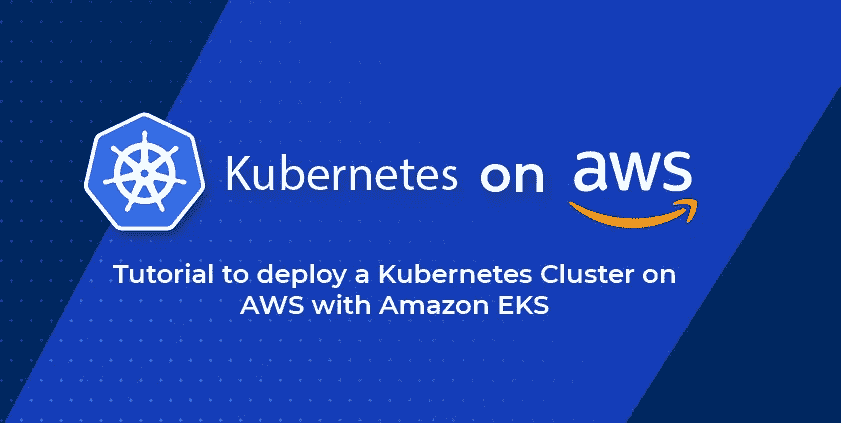

# AWS 上的 Kubernetes:使用亚马逊 EKS 部署 Kubernetes 集群

> 原文：<https://betterprogramming.pub/kubernetes-on-aws-tutorial-to-deploy-kubernetes-cluster-with-amazon-eks-a62c23f5aa6>

## 部署 Kubernetes 集群的更快捷方式



作者图片

在过去的五年里，计算机技术呈指数级增长。应用程序已经远远超出了客户机-服务器模型，分布式计算已经成为标准。AWS 上的 Kubernetes 提供了最强大的分布式计算平台之一。

由于亚马逊 Fargate 等技术和亚马逊云计算基础设施的广泛覆盖，弹性 Kubernetes 服务或 EKS 可以提供一个真正的分布式环境，您的应用程序可以在其中运行和扩展。

在 AWS web 控制台的帮助下用 AWS 设置 Kubernetes 可能不是最快的入门方式。在接下来的章节中，我们将提炼出在 AWS 上启动 Kubernetes 的最简单的方法，然后我们将在这个集群上启动一个 Dockerized 应用程序。

# AWS 上 Kubernetes 的先决条件

在开始使用 AWS 上的 Kubernetes 之前，让我们先熟悉几个关键概念。其中包括以下内容:

1.  了解 [Docker 容器](https://www.docker.com/resources/what-container)。我们稍后将模糊容器和虚拟机之间的界限，所以请确保您知道容器和传统虚拟机之间的区别。
2.  熟悉 AWS 相关术语，如 IAM 角色、VPC，

# 为什么是 Docker？Kubernetes 不是掉了 Docker 支持吗？

Kubernetes 是一个容器编排引擎。要将应用程序部署到 Kubernetes 集群，需要将其打包成一个或多个容器映像。Docker 是目前最流行的处理容器的方式。它有助于您实现以下目标:

1.  在您的 Windows、macOS 或 Linux 工作站上本地运行容器
2.  将您的应用程序打包成 Docker 图像

自诞生以来，Kubernetes 走过了漫长的道路。最初，它与 Docker(这是最常见的)和 rkt 等容器运行时一起工作。这意味着每个 Kubernetes 节点都将安装并运行 docker。运行在一个节点上的 kubelet 二进制文件将与 Docker 引擎对话，以创建由 Kubernetes 管理的 pods 和容器。

最近，[Kubernetes 项目已经停止支持 Docker 运行时](https://kubernetes.io/blog/2020/12/02/dont-panic-kubernetes-and-docker/)。相反，它使用自己的[容器运行时接口(CRI)](https://kubernetes.io/blog/2016/12/container-runtime-interface-cri-in-kubernetes/) ，这减少了在节点上安装 Docker 的额外依赖性。

但是却导致了一种误解，认为 Docker 老了，或者与想了解 Kubernetes 的人格格不入。

这不是真的。您仍然需要 Docker 在本地运行和测试您的映像，任何在您的 Docker 运行时上工作的 Docker 映像也将在 Kubernetes 上工作！只是 Kubernetes 现在有了它的轻量级实现来启动那些 Docker 图像。

又念: [Kubernetes vs Docker](https://www.clickittech.com/devops/kubernetes-vs-docker/)

# 亚马逊上的库伯内特 vs EKS

那么，你为什么关心在亚马逊上建立一个 EKS 集群呢？为什么不选择创建自己的 Kubernetes 集群，或者使用其他云提供商，如 GCP 或 Azure？

原因有很多，包括以下几点:

## **复杂性**

引导您的 Kubernetes 集群不是一个好主意。您不仅要负责保护和管理您的应用程序，还要负责群集、网络和存储配置。除此之外，Kubernetes 维护涉及到集群、底层操作系统等的升级。

使用 AWS 的托管 Kubernetes 服务，EKS，将确保您的集群配置正确，并及时获得更新和补丁。

## **整合**

AWS 的 EKS 与亚马逊的其余基础设施一起开箱即用。弹性负载平衡器(ELB)用于向外界公开服务。您的集群使用弹性块存储(EBS)来存储持久数据。Amazon 确保数据在线，并且对您的集群可用。

## **真正的可扩展性**

亚马逊 EKS 提供了比自托管 Kubernetes 更好的可扩展性。控制平面确保你的吊舱跨多个物理节点发射(如果你愿意的话)。如果任何节点关闭，您的应用程序仍将在线。但是如果您管理自己的集群，您必须确保不同的虚拟机(EC2 实例)位于不同的可用性区域。

如果你不能保证这一点，那么在同一个物理服务器上运行不同的 pods 不会给你多少容错能力。

## **鞭炮**

虚拟机实例运行在虚拟化的硬件上，即软件伪装成硬件。这带来了更好的整体云基础架构安全性。但这是以较慢的性能为代价的，因为有一层软件正在虚拟化硬件资源。

另一方面，容器是轻量级的，因为它们都运行在相同的操作系统上，并共享相同的底层内核。这导致了更快的启动时间，并且没有性能影响！直接在硬件上运行容器被称为裸机上的容器。

在撰写本文时，亚马逊是极少数提供裸机容器的公共云之一。也就是说；您可以使用 Amazon Fargate 在裸机上运行容器，而不是启动 EC2 实例，然后在这些虚拟机中运行您的容器。

他们通过鞭炮来管理这一点，这是一种非常轻量级的基于 Linux KVM 的技术，它在一个 microVM 中运行 Docker 容器。这些为您提供了容器的性能和虚拟机的安全性。这就是亚马逊上的 EKS 优于任何竞争对手的原因。

# 剖析亚马逊 EKS 集群

EKS 集群由两大部分组成:

## **控制平面**

该服务完全由 AWS 管理，因为在您的帐户中不会创建 EC2 实例，而您可能会期望 etcd、kube-apiserver 和其他组件出现。相反，所有这些都是抽象的，控制平面只是作为一个服务器向您公开，即 kube-api。

控制飞机每小时收费 0.10 美元。幸运的是，你可以使用单个集群运行多个应用程序，随着你推出更多的应用程序或服务，这个价格不会上涨。

## **节点**

反过来，这些可以被管理 EC2 实例或在 AWS Fargate 上运行。托管 EC2 实例选项是 AWS 代表您启动 EC2 实例，并让控制平面控制这些实例。这些在您的帐户中显示为 EC2 实例。[标准 EC2 定价](https://aws.amazon.com/ec2/pricing/)适用于这些节点。

对于 AWS Fargate，没有需要管理的 EC2 实例；相反，你的吊舱直接在裸机上运行，你只需为吊舱运行的时间付费。我强烈推荐为您的新集群使用 AWS Fargate，我们也将在下一节创建集群时使用它。AWS Fargate 定价详情可在[这里](https://aws.amazon.com/fargate/pricing/)找到。

# 在 AWS 上创建一个 Kubernetes 集群

开始使用 EKS 最简单的方法是使用命令行实用程序，包括:

1.  [AWS-CLI](https://docs.aws.amazon.com/cli/latest/userguide/install-cliv2.html) 与您的 AWS 帐户互动
2.  [eksctl](https://docs.aws.amazon.com/eks/latest/userguide/eksctl.html) 创建、管理和删除 EKS 集群，以及
3.  [kubectl](https://docs.aws.amazon.com/eks/latest/userguide/install-kubectl.html) 与 Kubernetes 集群本身进行交互。
4.  [docker](https://docs.docker.com/get-docker/) 创建并封装你的应用程序。
5.  [Docker Hub](https://hub.docker.com/) 账户托管您的 Docker 图片(免费层也可以)

# 设置 AWS CLI

AWS 为用户提供了命令行工具和直接从终端配置 AWS 资源的可能性。它直接与 AWS API 对话，并代表您提供资源。这消除了使用 AWS Web 控制台手动配置 EKS 集群或其他资源的需要。使用 CLI 实现自动化也减少了流程出错的可能性。

让我们在本地计算机上设置 AWS CLI。

1.首先，获取适合您的系统的 CLI 二进制文件。

2.AWS CLI 允许您快速地以编程方式在 AWS 的云中创建资源，而不必在仪表板中瞎折腾。这也消除了人为错误。

3.为了创建和管理 EKS 集群，您需要是 root 用户或具有管理员访问权限的 IAM 用户。

4.为了简洁起见，我将使用我的 root 帐户。单击 AWS Web 控制台右上角的个人资料，然后选择“我的安全凭证”

接下来，导航到主菜单中的“访问键”选项卡。

单击“创建新的访问密钥”按钮。

然后点击新弹出窗口中的“显示访问密钥”,小心地将访问 ID 和秘密访问密钥复制到您的本地计算机上。请务必注意，秘密访问密钥只会显示一次。

5.打开您的终端，键入以下命令，出现提示时，输入您的访问密钥 ID 和秘密访问密钥:

```
$ aws configure
AWS Access Key ID [None]:
AWS Secret Access Key [None]:
Default region name [None]:us-east-2
Default output format [None]: text
```

您还将被要求选择一个默认区域。我们将选择`us-east-2`，但您可以选择对您最有利的地区(或离您最近的地区)。在我们的例子中，默认的输出格式是文本。

您的配置和凭证位于您的主目录的子目录中。aws 和 eksctl 都将使用 AWS 和来管理资源。现在，我们可以继续创建集群了。

# 2.使用 Fargate 创建和删除 EKS 集群

要创建包含 Fargate 节点的集群，只需运行以下命令:

```
$ eksctl create cluster --name my-fargate-cluster --fargate
```

就是这样！该命令可能需要大约 15–30 分钟才能完成，在运行时，它会在您的终端中输出为启动群集而创建的所有资源。

您可以在下面看到一个示例输出:

```
2021-08-01 18:14:41 [ℹ]  eksctl version 0.59.0
2021-08-01 18:14:41 [ℹ]  using region us-east-2
2021-08-01 18:14:42 [ℹ]  setting availability zones to [us-east-2c us-east-2a us-east-2b]
2021-08-01 18:14:42 [ℹ]  subnets for us-east-2c - public:192.168.0.0/19 private:192.168.96.0/19
2021-08-01 18:14:42 [ℹ]  subnets for us-east-2a - public:192.168.32.0/19 private:192.168.128.0/19
2021-08-01 18:14:42 [ℹ]  subnets for us-east-2b - public:192.168.64.0/19 private:192.168.160.0/19
2021-08-01 18:14:42 [ℹ]  nodegroup "ng-5018c8ae" will use "" [AmazonLinux2/1.20]
2021-08-01 18:14:42 [ℹ]  using Kubernetes version 1.20
2021-08-01 18:14:42 [ℹ]  creating EKS cluster "my-fargate-cluster" in "us-east-2" region with Fargate profile and managed nodes
2021-08-01 18:14:42 [ℹ]  will create 2 separate CloudFormation stacks for cluster itself and the initial managed nodegroup
2021-08-01 18:14:42 [ℹ]  if you encounter any issues, check CloudFormation console or try 'eksctl utils describe-stacks --region=us-east-2 --cluster=my-fargate-cluster'
2021-08-01 18:14:42 [ℹ]  CloudWatch logging will not be enabled for cluster "my-fargate-cluster" in "us-east-2"
2021-08-01 18:14:42 [ℹ]  you can enable it with 'eksctl utils update-cluster-logging --enable-types={SPECIFY-YOUR-LOG-TYPES-HERE (e.g. all)} --region=us-east-2 --cluster=my-fargate-cluster'
2021-08-01 18:14:42 [ℹ]  Kubernetes API endpoint access will use default of {publicAccess=true, privateAccess=false} for cluster "my-fargate-cluster" in "us-east-2"
2021-08-01 18:14:42 [ℹ]  2 sequential tasks: { create cluster control plane "my-fargate-cluster", 3 sequential sub-tasks: { 2 sequential sub-tasks: { wait for control plane to become ready, create fargate profiles }, 1 task: { create addons }, create managed nodegroup "ng-5018c8ae" } }
2021-08-01 18:14:42 [ℹ]  building cluster stack "eksctl-my-fargate-cluster-cluster"
2021-08-01 18:14:44 [ℹ]  deploying stack "eksctl-my-fargate-cluster-cluster"
2021-08-01 18:15:14 [ℹ]  waiting for CloudFormation stack "eksctl-my-fargate-cluster-cluster"
2021-08-01 18:46:17 [✔]  EKS cluster "my-fargate-cluster" in "us-east-2" region is ready
```

正如输出所示，大量资源正在加速运转。包括所选可用性区域的几个新的专用子网、几个 IAM 角色以及 Kubernetes 集群的控制平面本身。如果你不知道这些是什么，不要惊慌！这些细节都是 eksctl 的问题。当我们使用以下命令删除集群时，您将会看到:

```
$ eksctl delete cluster --name my-fargate-cluster
2021-08-01 23:00:35 [ℹ]  eksctl version 0.59.0
## A lot more output here
2021-08-01 23:06:30 [✔]  all cluster resources were deleted
```

这将拆除群集，删除所有节点组、专用子网和其他相关资源，并确保您不会有像 ELB 这样的资源闲置，浪费您的额外资金。

# 将你的申请归档

现在我们知道了如何创建和销毁集群。但是我们如何在其中启动应用程序呢？该过程的第一步是将您的应用程序容器化。

要将应用程序容器化，您需要知道如何为它编写 docker 文件。Docker 文件是容器编排系统构建 Docker 映像的蓝图。要编写 Dockerfile 文件，您需要:

1.  选择一个基础图像。例如，根据您的应用程序所依赖的内容，您可以将 Docker 映像用于 Node 或 Python。
2.  在容器中选择一个工作目录。
3.  将项目的构建工件(编译的二进制文件、脚本和库)转移到该目录
4.  为启动的容器设置要运行的命令。因此，举例来说，如果你有一个起点为`app.js`的节点应用程序，你将有一个命令 CMD [ `node`，`app.js` ]作为你的 docker 文件的最后一行。这将启动你的应用程序。

这个 docker 文件位于您项目的 git repo 的根目录中，使得 CI 系统可以轻松地为每个增量更新运行自动构建、测试和部署。

让我们使用一个用 Express.js 编写的示例应用程序作为测试项目，在我们的 EKS 集群上进行 dockerized 和部署。

# 示例应用程序

让我们创建一个简单的`express.js`应用程序，部署在我们的集群上。创建一个名为`example-app`的目录:

```
$ mkdir example-app
```

接下来，创建一个名为`app.js`的文件，它将包含以下内容:

这个`app.js`应用程序是一个简单的 web 服务器，它监听`port 80`并用`Hello World`进行响应！

# 创建 Dockerfile 文件

为了将应用程序作为容器来构建和运行，我们在 example-app 目录中创建了一个名为 Dockerfile 的文件，其中包含以下内容:

```
FROM node:latest
WORKDIR /app
RUN npm install express
COPY app.js .
CMD ["node", "app.js"]
```

这将指示 Docker 引擎使用 node:来自 [Docker Hub](https://hub.docker.com/) 的最新基本映像来构建我们的容器。要构建 Docker 映像，请运行以下命令:

```
$ docker build -t username/example-app
```

这里，标签用户名需要替换为您实际的 Docker Hub 用户名。我们将在关于容器注册的章节中讨论为什么会出现这种情况。

# 在本地运行应用程序

一旦构建了映像，我们就可以测试它是否能在本地工作。运行以下命令启动容器:

```
$ docker run --rm -d -p 80:80 --name test-container username/example-app
$ curl [http://localhost](http://localhost/)
Hello World!
```

这似乎是按计划进行的。让我们看看集装箱日志是怎么说的。使用特定容器的名称运行 docker log 命令:

```
$ docker logs test-container
This app is listening at [http://localhost:80](http://localhost/)
```

如您所见，无论我们的 express.js 应用程序向标准输出写入了什么(使用 console.log ),都会通过容器运行时记录下来。这有助于在测试和生产环境中调试您的应用程序。

# 关于容器注册表

默认情况下，Docker 图片保存在 [Docker Hub](https://hub.docker.com/) 上。Docker Hub 就像是 Docker 图片的 GitHub。你可以对你的图片进行版本化、标记，并把它们放在 Docker Hub 上

node:latest 标记意味着最新发布的 Node.js 版本将用于这个映像的构建过程。对于 Node.js 的特定版本，如 LTS 版本，还有其他可用的标记。您可以随时访问特定图像的 Docker Hub 页面，查看可供您下载的各种选项。

正如 GitLab 和 GitHub 一样，您可以使用各种容器注册表。AWS 有他们的[弹性容器库](https://aws.amazon.com/ecr/)或 ECR 解决方案， [GCP 有类似的东西](https://cloud.google.com/container-registry)，但是我们将在本文中坚持使用 Docker Hub，因为它是 Docker 安装的默认设置。

为了推送在上一步中构建的映像，我们首先登录我们的 Docker Hub 帐户:

```
$ docker login
```

并在出现提示时提供您的用户名和密码。
成功登录后，使用以下命令推送您的映像:

```
$ docker push username/example-app
```

现在，示例应用程序 Docker 映像已准备好供 EKS 集群使用。

另请阅读: [Kubernetes 替代品和竞争对手](https://www.clickittech.com/devops/kubernetes-alternatives/)

# 部署应用程序

为了部署我们刚刚构建的应用程序，我们将使用 kubectl，这是一个与 Kubernetes 控制平面交互的命令行工具。如果您已经使用 eksctl 创建了您的集群，那么 kubectl 已经通过了身份验证，可以与您的 EKS 集群对话。

我们将创建一个名为 eks-configs 的目录，该目录将存储我们的集群和在其上运行的应用程序的期望状态的描述。

```
$ mkdir eks-configs
```

# 创建部署

为了部署该应用程序，我们将创建一个 [Kubernetes 工作负载](https://kubernetes.io/docs/concepts/workloads/)，其类型为 [Deployment](https://kubernetes.io/docs/concepts/workloads/controllers/deployment/) ，非常适合无状态应用程序。创建一个文件`example-deployment.yaml`并将以下内容添加到其中。

正在使用的图像是 Docker Hub 的用户名/示例应用程序。请确保将“用户名”替换为您实际的 Docker Hub 用户名。运行此应用程序时，您将获得以下内容:

使用 kubectl，我们可以如下启动这个部署:

```
$ kubectl create -f example-deployment.yaml
```

这创建了一个`Deployment`对象，这是 Kubernetes 逻辑处理运行在一个或多个 pod 上的应用程序(或应用程序的一部分)的方式。

接下来，我们添加了一些元数据，包括部署的名称和标签，我们很快就会看到这些元数据将被集群的其他部分使用。此外，我们要求 EKS 发布示例应用程序容器的六个副本，以便在我们的集群中运行。

根据您的需要，您可以动态地更改该数字——这将允许您放大或缩小应用程序。拥有许多副本还可以确保高可用性，因为您的 pod 跨多个节点进行调度。

使用以下命令获取集群上运行的部署和 pod 的列表(在默认命名空间中):

```
$ kubectl get pods
$ kubectl get deployments
```

# 创建服务

部署已经创建，但是我们如何访问它呢？因为它跨多个 pod 运行，那么另一个应用程序(比如用户的浏览器)如何访问它呢？我们不能让直接的 DNS 条目指向 pod，因为它们是短暂的和可替换的。此外，将集群的内部组件直接暴露给外界并不是最安全的想法。

相反，我们将创建一个 Kubernetes 服务。有几种类型的 Kubernetes 服务，你可以了解他们[在这里](https://kubernetes.io/docs/concepts/services-networking/service/#publishing-services-service-types)。我们现在将使用 AWS 的弹性负载平衡器，或 ELB 服务。

作为旁注，这是一个具有大多数 Kubernetes 特性的通用主题。它们与底层云基础架构集成得非常好。例如，将 EC2 实例用于节点，将 ELB 用于向外界公开服务，将 AWS 的 VPC 用于集群内联网，将弹性块存储用于高可用性持久存储。

我们可以通过创建一个`example-service.yaml`文件并在其中添加以下内容来创建一个负载平衡器类型的 Kubernetes 服务:

然后使用以下命令创建它:

```
$ kubectl create -f example-service.yaml
```

Kubernetes 服务将在几分钟后启动并运行，我们终于可以与我们的应用程序对话了。首先，我们需要获得服务的“外部 IP”。这通常不是 IP，而是指向我们服务的 FQDN，如下所示:

```
$ kubectl get svc
NAME              TYPE           CLUSTER-IP      EXTERNAL-IP     PORT(S)        AGE
example-service   LoadBalancer   10.100.88.189   [a78b55c6b3a574e61accfe13b324bd08-1728675516.us-east2.elb.amazonaws.com](http://a78b55c6b3a574e61accfe13b324bd08-1728675516.us-east2.elb.amazonaws.com/)   80:31058/TCP   5m33
kubernetes        ClusterIP      10.100.0.1      <none>  43/TCP        33m
```

该服务可以从您的 web 浏览器或使用命令行工具(如 cURL)轻松访问，如下所示

```
$ curl
a78b55c6b3a574e61accfe13b324bd08-1728675516.us-east-2.elb.amazonaws.co
Hello World!
```

就是这样！现在，您可以开始将您的应用程序一部分一部分地推广到 AWS EKS 平台。将集群数量保持在最低水平，以降低成本，并将应用的不同部分划分到不同的 Dockerized 微服务中。

# 清除 AWS 上的 Kubernetes

为了清理我们以前拥有的资源，我们将按照与创建它们相反的顺序删除每个 Kubernetes 资源，然后删除整个集群。

```
$ kubectl delete -f example-service.yaml
$ kubectl delete -f example-deployment.yaml
$ eksctl delete cluster --name my-fargate-cluster
```

通过访问 web 用户界面，仔细检查没有留下任何资源。对于 EKS 和 EC2 服务，将 web UI 中的区域切换到`~/.aws/config`，并确保周围没有任何未使用的 ELB/EC2 实例或 Kubernetes 集群。

# 结论

如果你正在考虑一个托管的 Kubernetes 解决方案，在 AWS 上运行 Kubernetes 是最好的选择。可扩展性出色，升级过程流畅。通过使用 AWS 运行 Kubernetes，您可以获得与其他 AWS 服务的紧密集成，这也是一个巨大的好处。

在 AWS 上运行 Kubernetes 将把你的公司从管理基础设施的麻烦中解放出来，让你有更多的时间专注于核心产品。这将减少对额外 It 人员的需求，同时，使您的产品能够满足用户群不断增长的需求。

原帖:[https://www.clickittech.com/devops/kubernetes-on-aws/?UTM _ source = kubernetes+on+AWS&UTM _ id = Blogs](https://www.clickittech.com/devops/kubernetes-on-aws/?utm_source=kubernetes+on+aws&utm_id=Blogs)