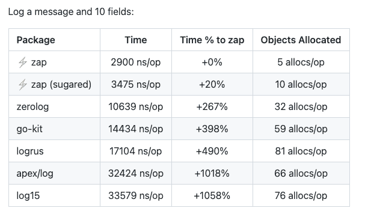
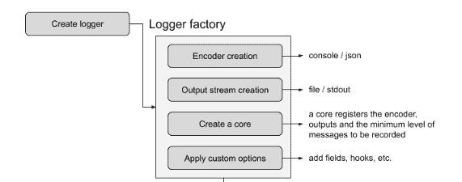
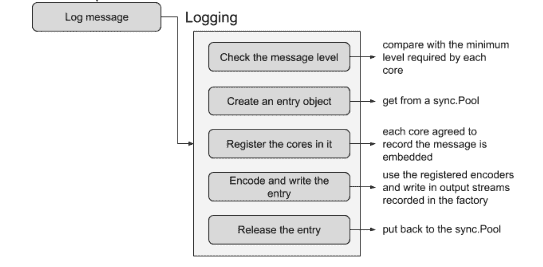

# Kubernetes 操作员使用 Go 进行日志记录

> 原文：<https://betterprogramming.pub/kubernetes-operator-logging-4d4553d19f15>

## 操作员日志选择什么？


来自 Unsplash， [@de](https://unsplash.com/photos/SId-lmFXSDU)

让我们用一个操作员信息日志来引出我们的主题。与最常见的打印方法`fmt.Printf`不同，它不打印消息中的具体参数信息，而是像 JSON 字符串一样单独打印在日志中。

```
{"severity":"INFO","eventTime":"2022-07-09T09:04:55.260Z","logger":"controller.opresource","message":"Deleting OpResource, because it is no longer in scope!","reconciler group":"op.spotify.com","reconciler kind":"OpResource","name":"afs-proxy-0618bce","namespace":"","name":"afs-proxy"}
```

这是操作员日志打印的规范方式吗？让我们通过深入运营商日志框架的实现和使用细节来揭示答案。

# 登录操作员

`controller-runtime` [alias.go](https://github.com/kubernetes-sigs/controller-runtime/blob/15154aaa67679df320008ed45534f83ff3d6922d/alias.go#L132) 提供了一个默认的`Log`对象，默认由`go-logr`执行。

```
// Log is the base logger used by controller-runtime.  It delegates
// to another logr.Logger.  You *must* call SetLogger to
// get any actual logging.
Log = log.Log
```

`[go-logr](https://github.com/go-logr/logr)`是一个简单的日志框架，本身没有日志输出功能，而是对[戴夫·切尼](http://dave.cheney.net/2015/11/05/lets-talk-about-logging)提出的`Go log`日志分类的进一步优化。

*   在正常情况下，一个 Go 程序只需要两级日志，INFO 和 ERROR 而其他层面并不重要。
*   对于调试，它提供 V 电平输出，放弃其他电平，如`trace` 或`debug`。

其实现包括 [Logr](https://github.com/go-logr/logr/blob/89d4c03b0f902d395854776f2ef6b5948237a5d5/logr.go#L239) 和 [LogSink](https://github.com/go-logr/logr/blob/89d4c03b0f902d395854776f2ef6b5948237a5d5/logr.go#L416) 接口，任何外部日志框架都可以通过实现`LogSink`来集成`logr`。

在默认的`controller-runtime`中，`[DelegatingLogSink](https://github.com/kubernetes-sigs/controller-runtime/blob/5636d975d88e2072884fd82c75b5d3bacf274919/pkg/log/deleg.go#L89)`被实现为默认 Logr 的日志输出，其中`logger`使用简单的`[NullLogSink](https://github.com/kubernetes-sigs/controller-runtime/blob/5636d975d88e2072884fd82c75b5d3bacf274919/pkg/log/null.go#L28)`。这个默认实现对于大多数场景来说已经足够了，并且可以与`fmt.Sprintf`结合使用。

```
log.V(10).Info(fmt.Sprintf("Create Resources for User:%s, Project:%s", user, project))
```

然而，`DelegatingLogSink`有一个明显的缺陷:当它被部署为集群范围的控制器并管理成千上万的资源时，它的低效率是一个性能瓶颈。以下两点是导致其效率低下的主要原因。

*   它使用许多锁。`DelegatingLogSink`使用了一个`promisesLock`互斥锁，`loggerPromise`的`WithName`和`WithValues`方法都需要锁，甚至`Enable`、`[Info](https://github.com/kubernetes-sigs/controller-runtime/blob/5636d975d88e2072884fd82c75b5d3bacf274919/pkg/log/deleg.go#L118)`和`Error`函数都依赖于`RLock`读锁。毫无疑问，在具有大量写操作的日志输出中，频繁的锁定(即使是读锁定)会导致低性能。

```
func (l *DelegatingLogSink) Info(level int, msg string,keysAndValues ...interface{}) {
  l.lock.RLock()
  defer l.lock.RUnlock()
  l.logger.Info(level, msg, keysAndValues...)
}
```

*   **日志内容使用** `**fmt.Sprintf**`。我们使用`Strings.Join`或`Buffer`操作来代替`fmt.Sprintf`和`+`来连接字符串，以提高许多 Go 字符串操作的效率(阅读 golang a quick benchmark : +或 fmt 中的 [Concatenate strings)。Sprintf](https://dev.to/pmalhaire/concatenate-strings-in-golang-a-quick-benchmark-4ahh) 了解更多)。但是在编写日志时，我们确实希望从日志框架中免费获得，而不是重新发明轮子，这是`logr`和`controller-runtime`的默认实现无法提供的。

# 其他选项

如果我们放弃默认实现，还有其他选择吗？以及如何切换？

Go 社区提供了广泛的日志包，甚至原生的也能满足基本的日志输出需求。

在 [*一口围棋日志*](https://levelup.gitconnected.com/a-sip-of-go-log-94b968071ed8) 中，我们深入挖掘了日志的基本逻辑，对比了一些流行的日志开源包，其中来自优步的 [zap](https://github.com/uber-go/zap) 以其性能吸引了我们的眼球。让我们回忆一下那些惊人的数字，看看`zap`是不是最好的选择。



`controller-runtime`已经有了`zapr`默认[实现](https://github.com/kubernetes-sigs/controller-runtime/blob/5636d975d88e2072884fd82c75b5d3bacf274919/pkg/log/zap/zap.go#L42)，在国内不少地方已经使用。但是为什么不用它作为默认实现呢？

用户可以通过定制一个`Logger`来集成 zap，以实现某些附加功能，如时间转换、日志输出到外部存储等。`controller-runtime`最终在`controller-runtime`的`zap`实现中将其封装为`logr.Logger`。

遵循定义 zap 记录器的四个步骤。



[zap.go](https://github.com/kubernetes-sigs/controller-runtime/blob/5636d975d88e2072884fd82c75b5d3bacf274919/pkg/log/zap/zap.go#L176) 实现了`console`和`json`两个编码器，提供了`zapr`标准`Logger`要求的功能，如`WriteTo`和`Level`。

默认情况下，`zapr`在开发模式下使用`consoleEncoder`和`debugLevel/warnLevel`，而在生产模式下使用`jsonEncoder`和`infoLevel/errorLevel`。

至于替换这个[操作符](https://github.com/slaise/operator-test/blob/52447e26da0ca4351ca73f1800cb86669aa7f6da/kubebuilder-test/main.go#L75)中的默认`Logr`，我们只需要在 main 方法中初始化`Reconciler`时使用`Log: zap.New(),`，然后我们就可以按照下面的模式打印控制器中的日志。

# 为什么 zap 很快



zap 采取的 5 个步骤，每个步骤都反映了优化，主要使用了 Go 的两个特性，这两个特性决定了 zap 的效率。

*   **使用** `**sync.Pool**` **避免输出日志时的内存开销。**

[日志。检查](https://github.com/uber-go/zap/blob/2cfc92c94b14298b9ff814f7fbfdda850046e7b3/logger.go#L196)是打印的第一步，在`Check`方法中进行了两次性能优化。

1.  避免不必要的操作，比如跳过不必要的`Log`关卡，直接返回不需要打印的日志。例如，如果我们的日志级别是`Info`，一旦有`Debug`级别的日志，它就直接返回。
2.  重复使用`Entry`对象。`zap`构造一个真实的打印入口对象，该对象将被 [Check](https://github.com/uber-go/zap/blob/2cfc92c94b14298b9ff814f7fbfdda850046e7b3/zapcore/core.go#L78) ed，以便在`sync.Pool`保存的对象中重用，降低高频日志对象的创建和删除频率，最终减少 GC。

```
func getCheckedEntry() *CheckedEntry {
  ce := _cePool.Get().(*CheckedEntry)
  ce.reset()
  return ce
}
```

`Pool`每隔`[Write](https://github.com/uber-go/zap/blob/2e615d88d0eb88c94c15f196a538dea3fa181451/zapcore/entry.go#L235)`更新一次。

```
func (ce *CheckedEntry) Write(fields ...Field) {
  //…
  putCheckedEntry(ce)
}
```

在输出日志时，我们也使用`sync.Pool`进行内存优化。默认的`consoleEncoder`和`jsonEncoder`都将打印的信息存储在一个`buffer`中，这个`buffer`使用`sync.Pool`构建的[缓冲池](https://github.com/uber-go/zap/blob/2e615d88d0eb88c94c15f196a538dea3fa181451/buffer/pool.go#L31)获取一个对象，通过后续拼接得到最终的输出日志。

*   **避免用** `**interface{}**` **设计 API，优化 JSON 序列化。通过强类型设计和零内存开销实现 JSON 序列化。**

在`zap`输出的日志中，JSON 格式是最终统一的输出格式，甚至`console_encoder` [最终调用](https://github.com/uber-go/zap/blob/2e615d88d0eb88c94c15f196a538dea3fa181451/zapcore/console_encoder.go#L133) `json_encoder`打印字段。`Fields`结构设计显著加快了日志打印的速度，并用于定义每个输入参数的类型信息，以快速将类型转换为字符串。并且在 Field 的`AddTo`方法中定义了类型和字符串之间所有可能的转换，避免了 zap 的类型推断或反射，大大提高了输出效率。

当然，别忘了释放`bufferPool`中获得的对象！

# 特性试验

让一个基准测试来验证 zap 的优秀表现。

通过比较三个日志包在非参数和多参数场景下的性能，我可以“自豪地”宣布`zap`是最好的:zap Logr 比`controller-runtime`中的默认`logr`快大约 **7 倍**。

很容易得出结论，如果我们想要实现一个高性能的操作符，替换默认的日志实现是必要的。但是需要注意的是，如果您仍然使用 v1，您可能需要将您的 kubebuilder 升级到最新的 v3 版本，这涉及到从`klog`迁移到`logr`，请参考[结构化和上下文日志迁移说明](https://github.com/kubernetes/community/blob/HEAD/contributors/devel/sig-instrumentation/migration-to-structured-logging.md#structured-and-contextual-logging-migration-instructions)以获得指导。

感谢阅读！