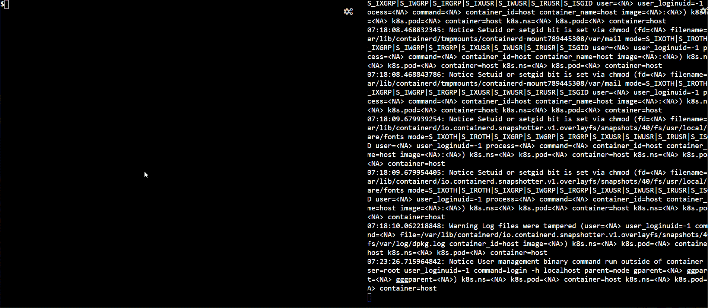

# Kubernetes 安全与法尔科

> 原文：<https://betterprogramming.pub/kubernetes-security-with-falco-2eb060d3ae7d>

## 通过动手演示为您的容器提供全面的运行时安全性


由[张秀坤·吉罗夫斯克](https://unsplash.com/@dominik_jirovsky?utm_source=medium&utm_medium=referral)在 [Unsplash](https://unsplash.com?utm_source=medium&utm_medium=referral) 拍摄的照片。

Falco 是一款开源的运行时安全工具，可以帮助您保护各种环境。Sysdig 创建了它，自 2018 年以来，它一直是 CNCF 的一个项目。Falco 读取实时 Linux 内核日志、容器日志、Kubernetes 日志等。强大的规则引擎提醒用户注意恶意行为。

它对于容器安全特别有用——特别是如果您使用 Kubernetes 来运行它们——并且它现在是事实上的 Kubernetes 威胁检测引擎。它接收 Kubernetes API 审计日志进行运行时威胁检测，并了解应用程序的行为。

它还帮助团队了解集群中谁做了什么，因为它可以与 Webhooks 集成，以在票务系统或 Slack 之类的协作引擎中发出警报。

Falco 通过使用定义意外行为的检测规则来工作。虽然它有自己有用的默认规则，但是您可以扩展它们来定义自定义规则，以进一步强化您的集群。

Falco 可以检测到的一些东西如下:

*   从容器中打开外壳会话
*   主机路径卷装载
*   读取机密和敏感文件，如`/etc/shadow`
*   运行容器中的新软件包安装
*   从不属于 CMD 的容器中派生出的新进程
*   打开新端口或意外的网络连接
*   创建特权容器
*   还有更多…

所有这些功能都使它特别有用，更少地了解您是否有适当的安全措施，更多地确保您知道何时有潜在的违规，以便您可以在可怕的事情发生之前阻止它。因此，Falco 补充了现有的 Kubernetes 本地安全措施，如 RBAC 和 Pod 安全策略，有助于预防问题而不是检测问题。

在 Kubernetes 集群中有多种运行 Falco 的方式。您可以在每个 Kubernetes 节点中安装 Falco，将 Falco 作为 pod 中的第二个容器，或者您可以使用守护程序集在其中注入 Falco pod。

使用 DaemonSet 是一个更好、更灵活的选择，因为它需要对 Dev 功能进行最少的更改，并且不会像第一个选择那样对 Ops 功能造成影响。此外，它是 Kubernetes-native，所以它是首选方式。

# 亲自动手

让我们现在动手看看法尔科的行动。对于先决条件，您需要一个正在运行的 Kubernetes 集群。

## 安装舵

Helm 是 Kubernetes 的软件包管理器，如果你安装了它，它会帮上很大的忙。我们将使用 Helm 图表安装 Falco，因此我们需要在集群中首先安装 Helm。如果您已经在集群中安装了 Helm，请忽略以下步骤。

安装舵很简单。为您的操作系统下载最新的软件包，解压缩它，并将其移动到您的路径:

```
wget [https://get.helm.sh/helm-v3.3.4-linux-amd64.tar.gz](https://get.helm.sh/helm-v3.3.4-linux-amd64.tar.gz)
tar -xvf helm-v3.3.4-linux-amd64.tar.gz 
chmod +x linux-amd64/helm 
mv linux-amd64/helm /usr/local/bin/
```

## 安装 Falco

现在让我们安装法尔科使用官方舵图。

先添加`falcosecurity`舵回购，更新回购:

```
$ helm repo add falcosecurity [https://falcosecurity.github.io/charts](https://falcosecurity.github.io/charts)
"falcosecurity" has been added to your repositories
$ helm repo update
Hang tight while we grab the latest from your chart repositories...
...Successfully got an update from the "falcosecurity" chart repository
Update Complete. ⎈Happy Helming!⎈
```

现在，让我们使用舵图安装 Falco:

```
$ helm install falco falcosecurity/falco
NAME: falco
LAST DEPLOYED: Fri Oct 16 07:06:24 2020
NAMESPACE: default
STATUS: deployed
REVISION: 1
TEST SUITE: None
NOTES:
Falco agents are spinning up on each node in your cluster. After a few
seconds, they are going to start monitoring your containers looking for
security issues.No further action should be required.
```

Helm 旋转了一个 Falco DaemonSet，我们应该在每个节点上都看到一个 Falco pod。让我们把豆荚拿出来看看:

```
$ kubectl get pod -o wide
NAME          READY   STATUS    RESTARTS   AGE     NODE                 
falco-cgvxc   1/1     Running   0          6m53s   kind-control-plane
falco-f9526   1/1     Running   0          6m53s   kind-worker2         
falco-rx2gj   1/1     Running   0          6m53s   kind-worker
```

恭喜你！我们已经成功安装了 Falco，它正在所有节点上运行。

# 测试

是时候做些测试了！我们将创建一个 NGINX pod，并尝试做一些我们通常不会做的活动。

创建 NGINX pod:

```
kubectl run nginx --image=nginx
```

现在，我们让 pod 看看它是在哪个节点上启动的:

```
kubectl get pod nginx -o wide
NAME    READY   STATUS    RESTARTS   AGE   NODE
nginx   1/1     Running   0          2m    kind-worker
```

正如我们所知，NGINX pod 存在于 kind-worker 节点中。对应的 Falco pod 是`falco-rx2gj`。

让我们打开一个复制窗口，在左侧窗口执行以下操作，同时在右侧窗口使用`kubectl logs falco-rx2gj`跟踪 Falco 容器日志:

*   在 NGINX 容器上启动一个 shell。
*   a 类敏感文件`/etc/shadow`。
*   从 shell 退出。



如您所见，每当我们进行可能违反安全的活动时，日志就会出现在右边的窗口中。

您还可以将这些日志导出到像 Prometheus 或 Grafana 这样的监控工具中，并且还可以触发 webhook 来获得即时通知。

# 结论

Falco 是 Kubernetes 的一个流行的运行时安全工具，我建议在所有环境中使用它——尤其是生产环境。一个有用的特性是，您还可以修改规则以满足您的需求，因此，您可以避免许多错误的警报。

感谢阅读！我希望你喜欢这篇文章！