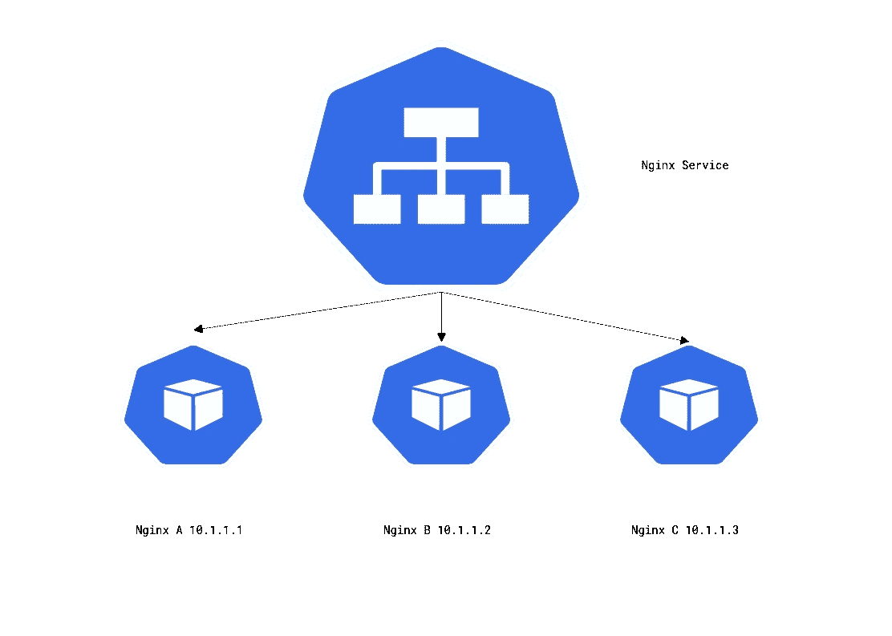
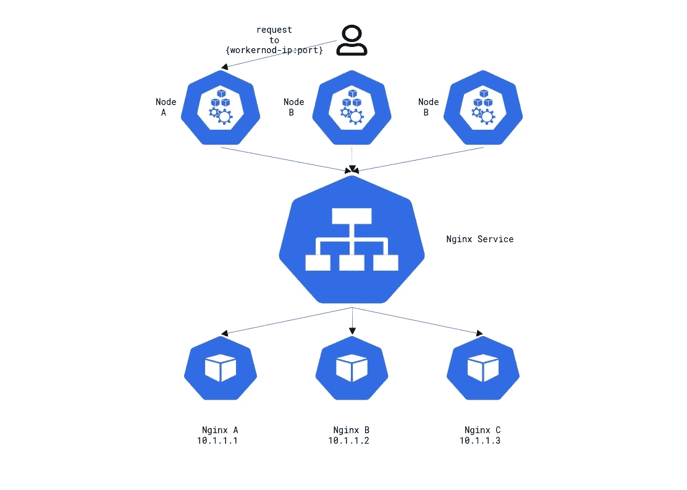
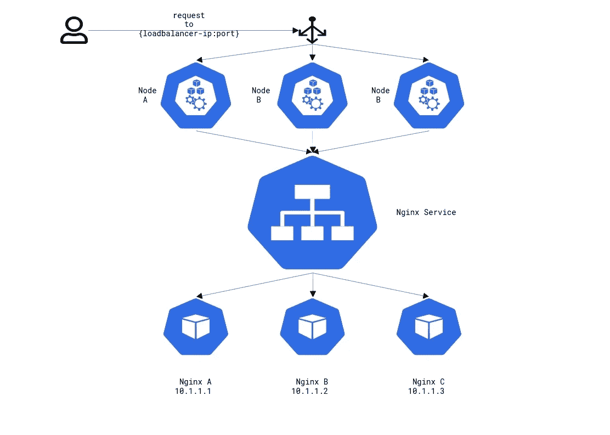
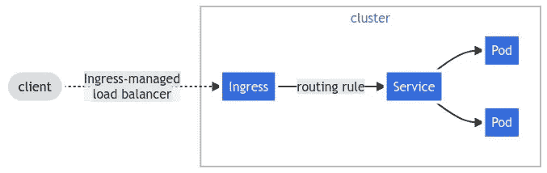

# Kubernetes 服务概述

> 原文：<https://betterprogramming.pub/kubernetes-service-types-3c4a3088a5c>

## 了解不同类型的 Kubernetes 服务和入口控制器

埃里克·麦克林在 [Unsplash](https://unsplash.com?utm_source=medium&utm_medium=referral) 上拍摄的照片

# 库伯内特的服务是什么

在 Kubernetes 的环境中，你可能有成百上千个短命的豆荚。无论是因为节点被缩减、单元副本被缩减，还是单元被重新安排到新节点，单元的 IP 地址都无法得到保证。pods IP 地址是在将它调度到特定节点之后、引导之前分配的。

假设我们处于云原生环境中，我们希望能够水平扩展 pod。因此，跟踪我们所有应用程序的所有 IP 地址将是一项非常困难的任务。Kubernetes 有一种资源类型可以解决这种不断变化的 pod IPs 问题，称为服务。Kubernetes 服务允许您创建一个单一的常量 IP 地址，其中包含一组包含相同服务的 pod 的 IP 地址。这非常有用，因为服务 IP 保持静态，而 pod 的 IP 可以不断变化。你永远不用担心没有合适的 IP 地址。

# 服务是如何工作的

服务是如何工作的？我如何配置一个？

让我们从创建一个包含三个 nginx pod 实例的部署开始。

在应用部署清单之后，我们可以看到有三个 nginx 实例使用 IPs `10.244.242.66, 10.244.242.67, 10.244.230,199`运行。此外，请注意我们分配给这些 pod 的标签`app=nginx`,这对服务如何监控这些 pod 至关重要。

现在，让我们定义我们的服务清单，它在下面通过对定义内容的分解来定义。

当我们开始分解这个清单时，我们注意到这个种类是`Service`。接下来，应该熟悉元数据部分，因为它与其他 Kubernetes 资源上的元数据字段相同。规范部分是我们定义我们的服务将如何交互以及交互什么的地方。

`selector`字段。在此字段中，您可以定义希望此服务监控哪些 pod。这是通过标签匹配完成的。你会注意到这个`selector`有一个`app: nginx`的定义。如果您还记得，这些是我们在部署清单中为 pod 定义的标签。根据这个选择器定义，我们声明任何带有标签`app=nginx`的 pod 都将是该服务的一部分。

接下来，我们有了`type`字段。这定义了我们希望这是什么样的服务。稍后我们将更深入地研究服务类型，但是现在我们将它定义为`ClusterIP`。

最后，我们有了`ports`字段。在这里，我们定义了流量将如何以及在哪里流经服务。注意，这个字段接受一个数组，所以可以定义多个条目。

让我们细分端口中的每个字段:

*   名称:您可以为给定的端口条目指定一个特定的名称。
*   端口:这是服务将监听的端口。
*   targetPort:这是服务将请求转发到的端口。这应该与 pod 正在监听的端口相匹配。
*   协议:您希望服务监听并与之交互的特定协议。

既然我们对服务清单的作用以及它如何与 pod 交互有了基本的了解，我们就可以部署清单并检查服务了。

describe 命令中的所有内容都应该与清单定义对齐，除了两个字段“IP”和“Endpoints”。

`IP`字段定义了服务 IP 地址。这是可用于访问服务背后的 pod 的静态 IP。

`Endpoints`字段定义了当前分配给该服务的 pod IPs。您会注意到这些 IP 来自我们的 nginx 部署。

在我们继续讨论其他服务类型之前，让我们展示一下如何缩减 nginx 部署，看看服务将如何处理这种变化。

您可以看到，向上和向下扩展 pod 会立即反映在服务中，允许单个静态 IP 访问 pod。

# 服务类型

在服务资源中有三种不同的类型。它们如下:

1.  ClusterIP
2.  节点端口
3.  负载平衡器

这些都有它们自己的行为和特定的用例，所以知道何时使用每一个是很重要的。在接下来的几节中，我们将对其中的每一个进行更深入的探讨。

## ClusterIP

ClusterIP 是最“基本”的服务类型。它将创建一个静态 IP 地址，该地址位于与 pod IP 范围不同的子网上，并将通过标签选择器监控一组 pod。

ClusterIPs 允许 pod 轻松地相互通信，因为 pod 既可以向静态 IP 发送请求，也可以使用 Kubernetes DNS 向`{service-name}.{namespace}`发送请求。在前面的例子中，我们部署的 DNS 应该是`nginx.default`。使用 ClusterIP 有一些限制。最大的问题是没有办法向外界公开这项服务。这就是应该使用服务类型`nodePort`和`loadBalancer`的地方。

## 节点端口

`NodePort`服务建立在`ClusterIP`类型之上。它通过在 worker 节点上打开一个端口来转发流量，从而将`ClusterIP`暴露给外界。这意味着，如果您有 50 个工作节点，每个工作节点将在分配的端口上侦听，即使 pod 不在该工作节点上。

要创建一个`NodePort`服务，唯一的区别是将`Type`定义为`NodePort.`

您可能会注意到`nodePort`被注释掉了，这是因为如果您没有在`ports`部分中定义`nodePort`，Kubernetes 将自动从范围`30000–32767`中分配一个随机端口。如果您希望定义一个特定的端口，必须在此范围内完成。

部署节点端口服务清单并让我们检查它。

这里我们看到一个名为`NodePort`的新字段，其值为`30828/TCP`。这是分配给此服务的端口和协议。现在，如果我们要向具有该端口的任何工作节点 IP 地址发送请求，该请求将被发送到服务，然后被发送到我们的 pod。

虽然这是向外界公开我们的服务的一种有用的方式，但是它的可伸缩性不好。在高度自动伸缩的 Kubernetes 集群中，工作节点可能是短暂的，因为它们可能会不断地旋转。这给我们留下了一个与 pod 类似的问题，我们可以找到 IP 是什么，但这并不意味着它们会一直存在。如果您的服务需要一个静态外部 IP 地址，那么`LoadBalancer`服务类型将满足这一需求。

## 负载平衡器

类似于`NodePort`构建在`ClusterIP`之上，服务`LoadBalancer`构建在`NodePort`之上。使用`LoadBalancer`服务，每个工作者节点继续拥有分配给特定服务的唯一端口。但是，现在 L4 被部署和配置为路由到特定的工作节点和端口。一个高级的请求流如下:一个请求被发送到负载均衡器，它被转发到特定`nodeport`上的一个工作节点，然后被传递到特定的服务，最后被发送到一个 pod。

注意:部署的负载平衡器依赖于运行 Kubernetes 的云提供商。

如果需要的话，配置一个`LoadBalancer`服务会稍微复杂一些。一个非常简单的配置如下，只需将`type`字段更改为`LoadBalancer`。

例如，如果您希望更改您的负载平衡器以强制 SSL 重定向、配置防火墙规则、使用 HTTPS 而不是 HTTP，或者使用不同的平衡算法，那么这将需要在您的服务上定义`Annotations`。

这里是一个这样的例子`LoadBalancer`使用 Vultrs 负载平衡器集成清单。

可以在这里找到 Vultr 负载平衡器可以使用的所有可用注释的列表[。](https://github.com/vultr/vultr-cloud-controller-manager/blob/master/docs/load-balancers.md)请向您的特定云提供商咨询配置选项。

当您第一次部署您的`LoadBalancer`服务时，您会看到`EXTERNAL-IP`部分是`pending`

您会注意到这里 Kubernetes 已经部署了一个负载平衡器，并且一直在进行通信，以检查负载平衡器是否已经被供应和分配了一个 IP。

一旦提供了负载平衡器并为流量做好了准备，您将在`EXTERNAL-IP`字段中看到一个分配的 IP 地址，并且 LB 已经得到“确保”。这意味着 Kubernetes 现在可以相应地监控和更新负载平衡器。此外，注意分配了唯一的`nodeport`。

为了验证我们的负载平衡器正在工作，我们可以向负载平衡器的公共 IP 地址`EXTERNAL-IP`发送一个请求。

您可能会将`LoadBalancer`服务类型视为一个奇妙的解决方案。然而，它们有一个缺点；您不能定义任何类型的 URL 路径，这不允许灵活性或让它路由到多个服务。`LoadBalancer`服务与单个服务相关联，因此，如果您想要从集群中公开另一个应用程序，您将部署另一个负载平衡器，如果您有多个应用程序，这可能会快速增加成本。

这个问题的解决方案不是另一种服务类型，而是另一种叫做`ingress`的 Kubernetes 资源。

## 进入

“入口”资源是一种更加灵活的方式来定义外部世界要到达的服务。这里最大的卖点之一是，你可以定义一个单一的入口资源，并在你定义的子域、端口或 URL 路径下拥有到所有服务的路由。它们还提供了许多其他功能，如速率限制、身份验证、自动 TLS、加权路由等等。所有这些都可以通过单个负载平衡器完成，因为`Ingress`资源与`LoadBalancer`服务类型一起工作，唯一的区别是部署负载平衡器充当代理，将所有流量发送到“入口”资源，该资源充当集群内的 L7 负载平衡器。

[入口控制器](https://mermaid.live/edit#pako:eNqNkstuwyAQRX8F4U0r2VHqPlSRKqt0UamLqlnaWWAYJygYLB59KMm_Fxcqx8qmGwbuXA7DwAEzzQETXKutof0Ovb4vaoUQkwKUu6pi3FwXM_QSHGBt0VFFt8DRU2OWSGrKUUMlVQwMmhVLEV1Vcm9-aUksiuXRaO_CEhkv4WjBfAgG1TrGaLa-iaUw6a0DcwaI-WgOsF7zm-pN882lXo46KB5vRK1dQYt6SYVCrZCSZJzz3Dqj90Cytm3TvPgU3O3IXf-VMy21Idl8Pl9MIPtHmxC35QOD-39RQm5KSTdMpHEryZqmmWLKERNPHEl_3clTB_KhL8NQDmWe-eJjxgZM5FhFiiFTK5zjDkxHBQ9_4zB4a-x20EGNSZhyaKmXrg7f5hSs1Du9_lYME2c85Nj3nDpYCRoespuKz1w4bTBpqbRw-gEvqt_v)

这里唯一需要注意的是，Kubernetes 没有自带入口控制器。有各种入口控制器，都有不同类型的功能。最终，在决定安装哪个入口控制器之前，这符合您的需求。有关配置指南，请参考入口控制器的文档。

一些比较流行的入口控制器有:

*   [使者入口](https://github.com/emissary-ingress)
*   [大使缘栈](https://www.getambassador.io/products/edge-stack/api-gateway/)
*   [入口 Nginx](https://kubernetes.github.io/ingress-nginx/)

# 包扎

虽然这篇文章可能会让你对不同类型的 Kubernetes 服务和入口控制器有一个很好的理解，但这仅仅是皮毛。这些服务有更多的配置选项，以及一些补充功能，如网络策略。我鼓励你查看下面列出的一些链接以获取更多信息。

*   [入口资源](https://kubernetes.io/docs/concepts/services-networking/ingress/)
*   [网络策略](https://kubernetes.io/docs/concepts/services-networking/network-policies/)
*   [服务](https://kubernetes.io/docs/concepts/services-networking/service/)