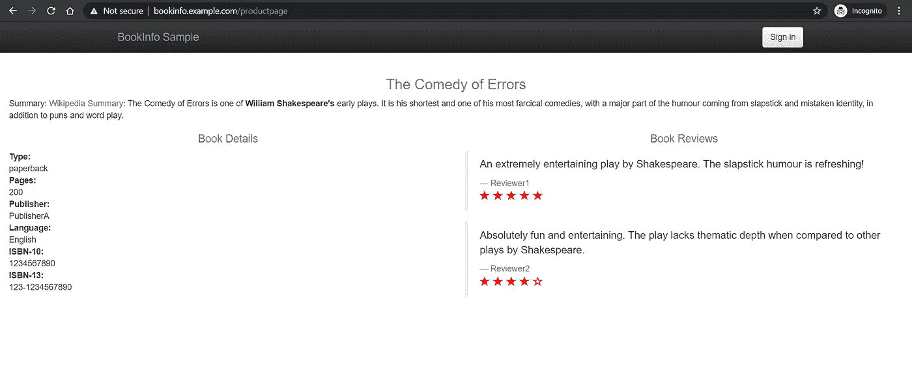
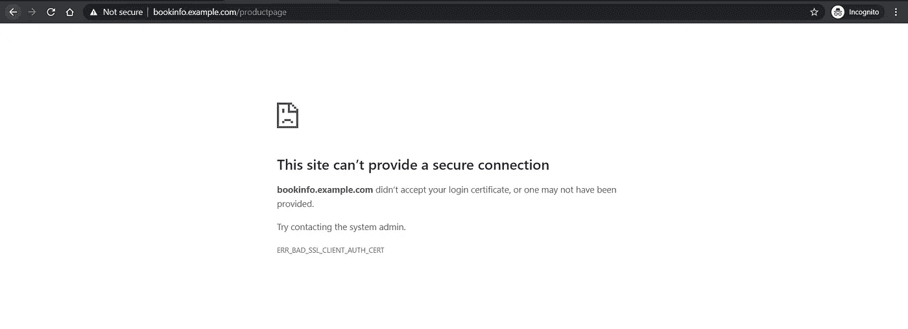

# Kubernetes 通过 Istio 的安全网关在 HTTPS 提供服务

> 原文：<https://betterprogramming.pub/kubernetes-services-over-https-with-istios-secure-gateways-210b2ce91b71>

## 通过 TLS 向外界公开您的微服务


[本杰明·蔡尔德](https://unsplash.com/@bchild311?utm_source=unsplash&utm_medium=referral&utm_content=creditCopyText)在 [Unsplash](/collections/385548/work-and-collaboration?utm_source=unsplash&utm_medium=referral&utm_content=creditCopyText) 上的照片

[Istio](https://istio.io) 为您提供许多功能，帮助您连接、保护、控制和观察您的微服务。它给了 Kubernetes 更多的控制权。Istio 网关是一个强大的资源，它允许您从外部世界定义进入服务网格的入口点。

在上一篇文章中，我们向 HTTP 协议公开了 BookInfo 应用程序。然而，Istio 提供了安全的网关来托管您在 HTTPS 上的微服务。Istio 提供简单的和相互的 TLS 认证，它使您的生活更加简单，因为您不再需要在 Kubernetes 集群之外管理证书。

本文是对“[如何在 Kubernetes 上使用 Istio 管理流量](https://medium.com/better-programming/how-to-manage-traffic-using-istio-on-kubernetes-cd4b96e00b57)”的跟进今天，让我们讨论如何使用 Istio 安全网关通过 HTTPS 向外部世界公开微服务。

# 先决条件

您需要一个运行 Kubernetes 集群来进行实践练习。

按照“[Kubernetes 上的 Istio 入门](https://medium.com/better-programming/getting-started-with-istio-on-kubernetes-e582800121ea)”指南，在您的 Kubernetes 集群中安装 Istio。

通过运行以下代码确定`INGRESS_HOST`和`SECURE_INGRESS_PORT`。

如果您使用负载平衡器，请运行以下命令。

```
$ export INGRESS_HOST=$(kubectl -n istio-system get service istio-ingressgateway -o jsonpath='{.status.loadBalancer.ingress[0].ip}')
$ export SECURE_INGRESS_PORT=$(kubectl -n istio-system get service istio-ingressgateway -o jsonpath='{.spec.ports[?(@.name=="https")].port}')
```

如果您没有使用负载平衡器，也可以使用节点 IP 和节点端口的组合。运行下面的来使用它。

```
export INGRESS_HOST=<worker-node-address>
export SECURE_INGRESS_PORT=$(kubectl -n istio-system get service istio-ingressgateway -o jsonpath='{.spec.ports[?(@.name=="https")].nodePort}')
```

# 生成 TLS 证书

对于实际操作演示，我们假设是`example.com`域。

让我们使用 OpenSSL 为`example.com`生成一个自签名的根证书。

```
$ openssl req -x509 -sha256 -nodes -days 365 -newkey rsa:2048 -subj '/O=example Inc./CN=example.com' -keyout example.com.key -out example.com.crt
```

使用`example.com`根证书为`bookinfo.example.com`创建一个证书和私钥。让我们首先生成一个私钥和一个 CSR，然后使用`example.com`根证书对 CSR 进行签名以创建一个公共`bookinfo.example.com`证书。

```
$ openssl req -out bookinfo.example.com.csr -newkey rsa:2048 -nodes -keyout bookinfo.example.com.key -subj "/CN=bookinfo.example.com/O=bookinfo organization"
$ openssl x509 -req -days 365 -CA example.com.crt -CAkey example.com.key -set_serial 0 -in bookinfo.example.com.csr -out bookinfo.example.com.crt
```

# 为 BookInfo 应用程序配置一个简单的 TLS

用生成的密钥和证书在`istio-system`名称空间上创建一个秘密。请注意，机密名称不应该以`istio`或`prometheus`开头，因为它们是为系统机密保留的关键字。

```
$ kubectl create -n istio-system secret tls bookinfo-credential --key=bookinfo.example.com.key --cert=bookinfo.example.com.crt
secret/bookinfo-credential created
```

使用凭据在默认 Istio 入口上创建 BookInfo 网关。下面的 YAML 在默认的 Istio `ingressgateway`上定义了一个名为`bookinfogateway`的网关，监听`simple` TLS 协议上的端口`443`，并将`bookinfo-credential`用于主机`bookinfo.example.com`。

创建一个虚拟服务来连接到产品页面。

应用目的地规则。

```
$ kubectl apply -f samples/bookinfo/networking/destination-rule-all.yaml
destinationrule.networking.istio.io/productpage created
destinationrule.networking.istio.io/reviews created
destinationrule.networking.istio.io/ratings created
destinationrule.networking.istio.io/details created
```

在您的主机文件中输入以下内容。如果您想从浏览器访问产品页面，这是必需的。

```
<INGRESS_HOST> bookinfo.example.com
```

从浏览器访问 BookInfo 应用程序。

转到[https://bookinfo.example.com/productpage](https://bookinfo.example.com/productpage)，您应该会看到以下内容。



BookInfo 产品页面

由于证书是自签名的，我们得到一个不安全的警告。如果您使用由公共 CA 签署的证书，该通知应该会消失。

让我们通过`curl`访问页面，看看如果我们使用`example.com` CA 证书进行验证，是否会出现验证错误。

我们得到了一个`HTTP 200`响应。这证明简单的 TLS 运行良好。

# 证书轮换

入口网关的证书轮换只需几个命令。

从根证书生成一组新的证书。

```
$ mkdir new_certificates
$ openssl req -x509 -sha256 -nodes -days 365 -newkey rsa:2048 -subj '/O=example Inc./CN=example.com' -keyout new_certificates/example.com.key -out new_certificates/example.com.crt
$ openssl req -out new_certificates/bookinfo.example.com.csr -newkey rsa:2048 -nodes -keyout new_certificates/bookinfo.example.com.key -subj "/CN=bookinfo.example.com/O=bookinfo organization"
$ openssl x509 -req -days 365 -CA new_certificates/example.com.crt -CAkey new_certificates/example.com.key -set_serial 0 -in new_certificates/bookinfo.example.com.csr -out new_certificates/bookinfo.example.com.crt
```

现在删除旧密码，并用新凭证创建一个新密码。

```
$ kubectl -n istio-system delete secret bookinfo-credential
secret "bookinfo-credential" deleted
$ kubectl create -n istio-system secret tls bookinfo-credential \
--key=new_certificates/bookinfo.example.com.key \
--cert=new_certificates/bookinfo.example.com.crt
secret/bookinfo-credential created
```

现在让我们使用新的证书访问 BookInfo 应用程序。

如果我们使用旧证书来连接服务，会发生什么情况？让我们找出答案。

它失败了！这表明证书轮换工作正常。

# 配置相互 TLS

如果您需要在客户端和服务器之间建立信任，那么相互 TLS 可能是必要的，反之亦然。如果您正在托管一个 API，并且希望只有受信任的客户端才能访问它，那么这可能是必要的。

对于使用相互 TLS 的网关，我们需要重新定义`bookinfo-credential`来设置`tls.key`、`tls.cert`和`cacert`属性来保存 CA 证书。这是必需的，因为现在服务器需要信任客户端，并且需要使用配置的 CA 证书来验证客户端证书。

```
$ kubectl -n istio-system delete secret bookinfo-credential
secret "bookinfo-credential" deleted
$ kubectl create -n istio-system secret generic bookinfo-credential --from-file=tls.key=bookinfo.example.com.key \
--from-file=tls.crt=bookinfo.example.com.crt --from-file=ca.crt=example.com.crt
secret/bookinfo-credential created
```

更新入口网关以使用`MUTUAL` TLS 认证。

现在让我们使用旧方法访问应用程序。

我们得到一个错误！这意味着它需要一个客户端证书来验证 BookInfo 应用程序。让我们使用 OpenSSL 生成客户端密钥和证书。

```
$ openssl req -out client.example.com.csr -newkey rsa:2048 -nodes -keyout client.example.com.key -subj "/CN=client.example.com/O=client organization"
$ openssl x509 -req -days 365 -CA example.com.crt -CAkey example.com.key -set_serial 1 -in client.example.com.csr -out client.example.com.crt
```

让我们使用客户机证书对 BookInfo 应用程序进行身份验证。

我们得到了一个`HTTP 200`响应。

让我们尝试从浏览器访问 BookInfo 应用程序。



现在我们看到它不允许我们连接，因为当我们从浏览器打开页面时，我们没有提供有效的客户端证书。

恭喜你！您已经在 Istio 中成功配置了相互 TLS！

# 结论

感谢阅读。我希望你喜欢这篇文章。

在下一部分中，我将讨论使用 Istio 在 Kubernetes 中进行[流量镜像，并进行实际操作演示，到时见！](https://medium.com/better-programming/traffic-mirroring-in-kubernetes-using-istio-dad0976b4e1)