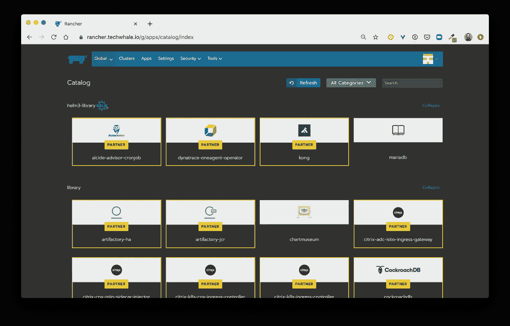
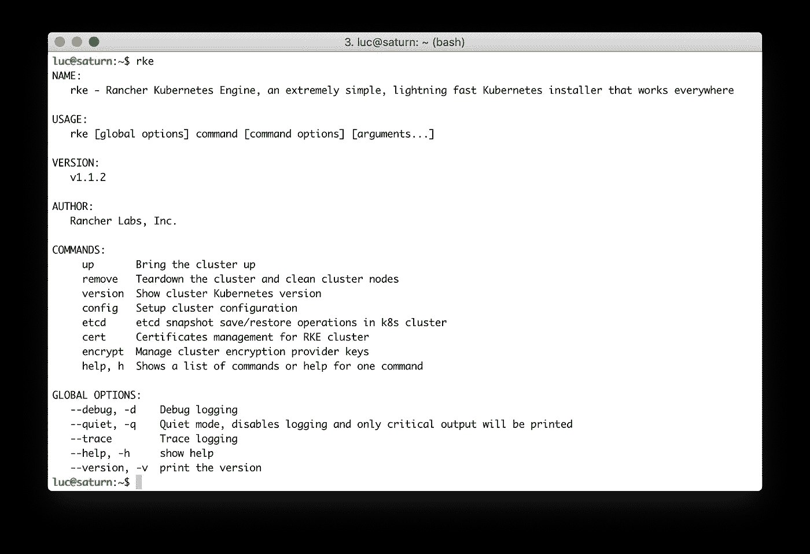

# Kubernetes 提示:备份和恢复 Etcd

> 原文：<https://betterprogramming.pub/kubernetes-tips-backup-and-restore-etcd-97fe12e56c57>

## 使用牧场主 RKE 聚类的示例


马库斯·温克勒在 [Unsplash](https://unsplash.com/s/photos/backup?utm_source=unsplash&utm_medium=referral&utm_content=creditCopyText) 上的照片

在上一篇文章中，我解释了 etcd 在 Kubernetes 集群中扮演的角色。

[](https://medium.com/better-programming/a-closer-look-at-etcd-the-brain-of-a-kubernetes-cluster-788c8ea759a5) [## 近距离观察 Etcd:Kubernetes 星团的大脑

### etcd 包含什么以及它如何组织信息

medium.com](https://medium.com/better-programming/a-closer-look-at-etcd-the-brain-of-a-kubernetes-cluster-788c8ea759a5) 

我们看到了 etcd 包含的信息示例、它的不同安装方式(集群内部或外部)，以及 etcd 节点如何通过 Raft 分布式共识算法交换信息。所有这些使得 etcd 成为 Kubernetes 集群的重要组成部分。

在今天的文章中，我们将使用 Rancher 的 RKE 集群，看看如何从一个集群备份 etcd，并在另一个集群中恢复它。这说明了一个集群出错(不幸的是，这种情况经常发生)并且我们需要在一个备用集群中恢复它的情况。

我们将遵循以下步骤:

*   牧场主的 RKE 快速介绍
*   创建两个 Kubernetes 集群
*   在第一个集群上备份 etcd
*   在第二个集群上恢复 etcd

# 关于牧场主 RKE

[Rancher Labs](https://rancher.com/) 是一家主要以其主要产品 [Rancher](https://rancher.com/products/rancher/) 而闻名的公司，该产品是 Kubernetes 的管理平台。 [Rancher](https://rancher.com/products/rancher/) 允许我们在同一个界面内管理多个集群。它涵盖了集群配置、用户访问控制、工作负载部署(通过集成的应用程序目录)等等



牧场主中的应用程序目录

[Rancher Labs](https://rancher.com/) 在开源生态系统中也因其他伟大的项目而闻名:

*   [RKE](https://rancher.com/products/rke/):CNCF 认证的 Kubernetes 发行版，完全在 Docker 容器中运行(这就是我们将在本文中演示的)。
*   [K3s](https://k3s.io/) :一个轻量级的 Kubernetes 发行版(主要致力于在边缘和 ARM 设备上运行，但在标准 x86 上确实很棒)。
*   [Longhorn](https://rancher.com/products/longhorn/):Kubernetes 的分布式块存储解决方案。它在几周前正式上市，但已经积极开发了两年多。Longhorn 由 [CNCF](https://cncf.io) 管理，目前在[沙盒项目](https://www.cncf.io/sandbox-projects/)中(可能很快会进入孵化阶段)

在本文中，我们将重点讨论 RKE，因为这是一个设置和管理 Kubernetes 集群的非常好的工具。

rke 二进制文件可以很容易地安装在 MacOS、Linux 或 Windows 上([https://rancher.com/docs/rke/latest/en/installation/](https://rancher.com/docs/rke/latest/en/installation/))。安装后，我们可以列出所有可用的命令和选项。



rke 的可用命令和选项。

在下文中，我们将演示用于创建集群的命令以及用于备份和恢复集群底层 etcd 的命令。

# 建立 Kubernetes 集群

首先，我们将使用 RKE 创建两个集群。

## 创建第一个集群

1.  在云提供商上启动虚拟机

外面有很多选择。我最喜欢的一些是[数字海洋](https://digitalocean.com)、 [Civo](https://www.civo.com/) 和 [Scaleway](https://www.scaleway.com) 。此外，我们需要使用 ssh 密钥设置对这台机器的 ssh 访问。

2.码头工人的安装

当 RKE 在 Docker 容器中创建 Kubernetes 集群时，Docker 的安装是一个先决条件。使用以下命令可以很容易地做到这一点:

```
$ curl -sSL [https://get.docker.com](https://get.docker.com) | sh 
```

3.创建 RKE 集群的配置文件

从名为 *kube1、*的专用文件夹中，我们运行 *RKE 配置*命令，以便准备一个包含我们将要创建的集群配置的文件。该命令需要几个参数来配置在我们的单个虚拟机上设置集群的方式，其中包括:

*   虚拟机的 IP 地址
*   应该在此虚拟机上运行的组件(控制平面等)
*   要安装的网络插件(法兰绒、印花布、编织、运河)
*   一些网络相关参数(IP 范围等)

```
**$ rke config**
[+] Cluster Level SSH Private Key Path [~/.ssh/id_rsa]:
[+] Number of Hosts [1]:
[+] SSH Address of host (1) [none]: 209.97.129.73
[+] SSH Port of host (1) [22]:
[+] SSH Private Key Path of host (209.97.129.73) [none]:
[-] You have entered empty SSH key path, trying fetch from SSH key parameter
[+] SSH Private Key of host (209.97.129.73) [none]:
[-] You have entered empty SSH key, defaulting to cluster level SSH key: ~/.ssh/id_rsa
[+] SSH User of host (209.97.129.73) [ubuntu]: root
[+] Is host (209.97.129.73) a Control Plane host (y/n)? [y]:
[+] Is host (209.97.129.73) a Worker host (y/n)? [n]: y
[+] Is host (209.97.129.73) an etcd host (y/n)? [n]: y
[+] Override Hostname of host (209.97.129.73) [none]:
[+] Internal IP of host (209.97.129.73) [none]:
[+] Docker socket path on host (209.97.129.73) [/var/run/docker.sock]:
[+] Network Plugin Type (flannel, calico, weave, canal) [canal]:
[+] Authentication Strategy [x509]:
[+] Authorization Mode (rbac, none) [rbac]:
[+] Kubernetes Docker image [rancher/hyperkube:v1.17.6-rancher2]:
[+] Cluster domain [cluster.local]:
[+] Service Cluster IP Range [10.43.0.0/16]:
[+] Enable PodSecurityPolicy [n]:
[+] Cluster Network CIDR [10.42.0.0/16]:
[+] Cluster DNS Service IP [10.43.0.10]:
[+] Add addon manifest URLs or YAML files [no]:
```

注意:在本例中，我们只设置了一个单节点集群，但是 RKE 使创建高可用性集群变得非常容易。

4.创建 Kubernetes 集群

现在可以使用 *RKE* 二进制文件来安装 Kubernetes，该文件会读取上一步中生成的 *cluster.yml* 文件。

```
**$ rke up**
INFO[0000] Running RKE version: v1.1.2
INFO[0000] Initiating Kubernetes cluster
...
INFO[0135] Finished building Kubernetes cluster successfully
```

我们的单节点 Kubernetes 集群启动并运行大约需要一分钟。RKE 创建了两个文件:

*   `kube_config_cluster.yml`:一个 kubeconfig 文件，我们将通过 kubectl 使用它与集群的 API 服务器进行通信。
*   `cluster.rkestate`:包含集群所有配置选项的文件。

我们现在可以使用 kubeconfig 文件并验证集群是否启动并运行:

```
~/kube1 $ export KUBECONFIG=$PWD/kube_config_cluster.yml~/kube1 $ kubectl get nodes
kubectl get nodes
NAME            STATUS   ROLES                      AGE     VERSION
209.97.129.73   Ready    controlplane,etcd,worker   4m26s   v1.17.6
```

该集群只包含一个节点，显然不是生产级别的集群，但是对于本文的目的来说已经足够了。

5.部署工作负载

我们现在在新创建的集群上启动一些 pod。我们在这里使用一些命令性的命令(那些命令非常方便；避免使用 yaml 规范)。

```
# Create a MongoDB Deployment and expose it with a ClusterIP service
$ kubectl create deploy db --image=mongo:4.2
$ kubectl expose deploy/db --port 27017 --target-port=27017# Create 10 replicas of a simple nginx Pod
$ kubectl create deploy/www --image=nginx:1.16-alpine
$ kubectl scale deploy/www --replicas=10
```

然后，我们确保一切正常运行:

```
**$ kubectl get deploy,svc** NAME                  READY   UP-TO-DATE   AVAILABLE   AGE
deployment.apps/db    1/1     1            1           89s
deployment.apps/www   10/10   10           10          13sNAME                 TYPE        CLUSTER-IP      EXTERNAL-IP   PORT(S)     AGE
service/db           ClusterIP   10.43.248.161   <none>        27017/TCP   83s
service/kubernetes   ClusterIP   10.43.0.1       <none>        443/TCP     7m42s
```

第一个集群运行良好。我们还能够在其中运行一些工作负载。那也行！

## 创建第二个集群

要创建新的集群，我们将遵循与第一个集群相同的过程:

*   在云提供商上运行一个虚拟机
*   在上面安装 Docker
*   运行 *RKE 配置*来创建一个集群配置文件(确保使用一个新的文件夹来覆盖用于第一个集群的文件夹:)
*   运行 *RKE up* 来设置集群

在这个过程的最后，我们得到一个新的 kubeconfig 文件。然后，我们可以验证我们的第二个集群已经启动并正在运行，并且没有工作负载正在其上运行(还没有)。

```
~/kube2 $ export KUBECONFIG=$PWD/kube_config_cluster.yml~/kube2 $ kubectl get pod
No resources found in default namespace.
```

我们现在有两个集群:

*   姑且称之为 **kube1** 和 **kube2** 。
*   每个集群包含一个节点，该节点同时充当控制平面(etcd)和工作节点。
*   我们在 **kube1** 上部署了一些虚拟工作负载，在 **kube2** 上没有部署任何虚拟工作负载。

下一步，我们将从第一个集群备份 etcd。

# 备份 Etcd

RKE 使得备份 etcd 变得非常容易。命令 *rke etcd snapshot-save* 为我们处理整个过程，并在集群的每个 etcd 节点(本例中只有一个节点)上创建一个备份(作为 zip 文件)。

我们从包含第一个集群的 kubeconfig 文件的文件夹中运行这个命令。

```
$ rke etcd snapshot-save --name snapshot
INFO[0000] Running RKE version: v1.1.2
INFO[0000] Starting saving snapshot on etcd hosts
INFO[0000] [dialer] Setup tunnel for host [209.97.129.73]
INFO[0001] [etcd] Running snapshot save once on host [209.97.129.73]
INFO[0001] Image [rancher/rke-tools:v0.1.56] exists on host [209.97.129.73]
INFO[0001] Starting container [etcd-snapshot-once] on host [209.97.129.73], try #1
INFO[0002] [etcd] Successfully started [etcd-snapshot-once] container on host [209.97.129.73]
INFO[0002] Waiting for [etcd-snapshot-once] container to exit on host [209.97.129.73]
INFO[0002] Container [etcd-snapshot-once] is still running on host [209.97.129.73]
INFO[0003] Waiting for [etcd-snapshot-once] container to exit on host [209.97.129.73]
INFO[0003] Removing container [etcd-snapshot-once] on host [209.97.129.73], try #1
INFO[0003] Finished saving/uploading snapshot [snapshot] on all etcd hosts
```

注意:我们给快照取了一个简单的名字；在生产环境中，我们会选择一个更有意义的环境。

我们确保快照存在于我们集群的节点上(RKE 将它存储在**/opt/rke/etcd-snapshot s**):

```
$ ssh root@**kube1** -- ls /opt/rke/etcd-snapshots
snapshot.zip
```

然后，我们在本地计算机上复制备份(备份不应保存在节点上):

```
$ scp root@**kube1**:/opt/rke/etcd-snapshots/snapshot.zip .
```

我们有第一个集群的备份，这很好。我们现在将了解如何在另一个集群上恢复该备份。

# 恢复 Etcd

首先，我们将备份文件复制到第二个集群的节点上(在/opt/rke/etcd-snapshots/文件夹中):

```
$ scp ./snapshot.zip root@**kube2**:/opt/rke/etcd-snapshots/
```

然后，我们使用*RKE etcd snapshot-restore*命令来恢复 *snapshot.zip* 。从快照中恢复新集群大约需要一分钟的时间(这里恢复的时间不多，因为我们只创建了几个资源)。

```
$ rke etcd snapshot-restore --name snapshot
INFO[0000] Running RKE version: v1.1.2
INFO[0000] Restoring etcd snapshot snapshot
...
INFO[0095] Finished building Kubernetes cluster successfully
INFO[0095] Restarting network, ingress, and metrics pods
INFO[0097] Finished restoring snapshot [snapshot] on all etcd hosts
```

我们现在可以检查第二个集群上正在运行什么:

```
$ kubectl get deploy,po,svc
NAME                  READY   UP-TO-DATE   AVAILABLE   AGE
deployment.apps/db    1/1     1            1           4h1m
deployment.apps/www   10/10   10           10          3h59mNAME                       READY   STATUS    RESTARTS   AGE
pod/db-d76859d75-gstkf     1/1     Running   0          2m34s
pod/www-5fd6c8cc68-2zm5d   1/1     Running   0          2m34s
pod/www-5fd6c8cc68-4f8hh   1/1     Running   0          2m34s
pod/www-5fd6c8cc68-brjpn   1/1     Running   0          2m34s
pod/www-5fd6c8cc68-c2wvw   1/1     Running   0          2m34s
pod/www-5fd6c8cc68-j89tc   1/1     Running   0          2m34s
pod/www-5fd6c8cc68-jxq6r   1/1     Running   0          2m33s
pod/www-5fd6c8cc68-m8kk5   1/1     Running   0          2m34s
pod/www-5fd6c8cc68-n4dbd   1/1     Running   0          2m34s
pod/www-5fd6c8cc68-r5f55   1/1     Running   0          2m34s
pod/www-5fd6c8cc68-tx49m   1/1     Running   0          2m34sNAME                 TYPE        CLUSTER-IP      EXTERNAL-IP   PORT(S)     AGE
service/db           ClusterIP   10.43.248.161   <none>        27017/TCP   4h1m
service/kubernetes   ClusterIP   10.43.0.1       <none>        443/TCP     4h7m
```

我们在第一个集群上运行的所有工作负载现在都在第二个集群上运行，在第二个集群上运行的是“*rke etcd snapshot-restore*”和“*rke etcd snapshot-restore*”，这是我们所需要的。

# 摘要

etcd 是 Kubernetes 集群的大脑，因为它包含关于集群中现有资源的所有信息。为了备份 Kubernetes，我们需要快照 etcd，并将生成的文件移动到一个安全的地方(以防以后需要恢复，当然，我们希望永远不会发生…)。当然，这个过程应该定期进行，时间表取决于集群的使用情况。

此外，我们必须小心，因为在 etcd 级别完成的备份没有考虑到在应用程序级别管理的所有数据。备份/恢复过程也应该在应用程序级别完成。[Longhorn](https://longhorn.io)(Rancher Labs 的分布式块存储)是实现这一目的的绝佳选择。