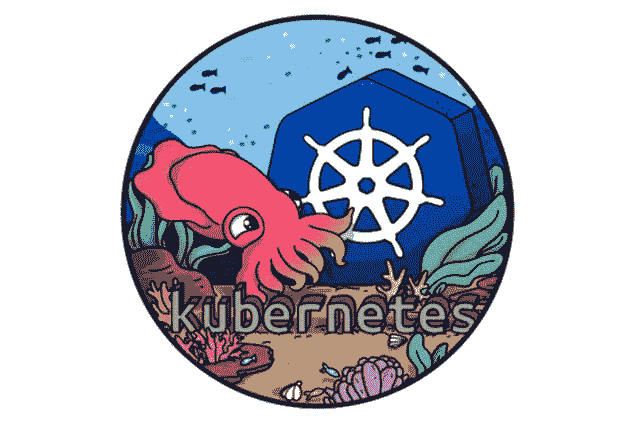
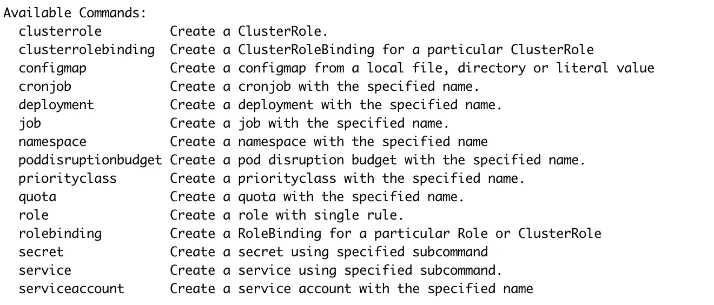

# Kubernetes 提示:在 1.18 中使用命令式命令创建 pod

> 原文：<https://betterprogramming.pub/kubernetes-tips-create-pods-with-imperative-commands-in-1-18-62ea6e1ceb32>

## 了解“kubectl run”在这个新版本中是如何修改的



Kubernetes 1.18 于 2020 年 3 月底发布。在这个版本带来的所有变化/修复/增强中，我们将把重点放在迄今为止使用起来相当痛苦的`kubectl run`命令上。

# 命令式与陈述式

在 Kubernetes 集群中创建资源有两种方式:命令式和声明式。

声明性方法用于使用`kubectl apply`命令从清单文件(通常在 YAML)创建资源。这是生产环境中使用的方法。

命令方式用于使用几个不同的命令来管理资源，并且不需要任何清单文件。

这绝对不是在生产中使用的方法，但是它非常方便快速地进行测试，并且它还可以帮助生成清单文件(使用`--dry-run`和`-o yaml`标志的组合)。

# 1.18 之前

在 1.18 之前的集群中，可以使用`kubectl run`命令运行 Pod 和其他资源。

为了说明这一点，我们使用 kubectl 1.17.0 来对抗版本 1.17.2 中的一个 [K3s](https://k3s.io/) 集群。

```
**$ kubectl version** Client Version: version.Info{Major:"1", Minor:"17", GitVersion:"**v1.17.0**", GitCommit:"70132b0f130acc0bed193d9ba59dd186f0e634cf", GitTreeState:"clean", BuildDate:"2019-12-07T21:20:10Z", GoVersion:"go1.13.4", Compiler:"gc", Platform:"darwin/amd64"}
Server Version: version.Info{Major:"1", Minor:"17", GitVersion:"**v1.17.2+k3s1**", GitCommit:"cdab19b09a84389ffbf57bebd33871c60b1d6b28", GitTreeState:"clean", BuildDate:"2020-01-27T18:09:26Z", GoVersion:"go1.13.6", Compiler:"gc", Platform:"linux/amd64"}
```

我们可以看到,`kubectl run`命令允许我们运行一个特定的映像(阅读:创建一个 Pod)以及创建其他资源(部署、作业):

```
$ kubectl run --helpCreate and run a particular image, possibly replicated.
Creates a deployment or job to manage the created container(s).
```

这个简单的命令允许我们创建一个部署:

```
**$ kubectl run www --image=nginx:1.16**
kubectl run --generator=deployment/apps.v1 is DEPRECATED and will be removed in a future version. Use kubectl run --generator=run-pod/v1 or kubectl create instead.
**deployment.apps/www created**
```

我们得到一条警告消息，因为`--generator=deployment/apps.v1` 标志(隐式使用，因为我们不提供任何其他标志)已被否决。如果我们想创建一个 Pod 而不是一个部署，建议使用`--generator=run-pod/v1` 标志。

```
**$ kubectl run --generator=run-pod/v1 www-1 --image=nginx:1.16**
pod/www-1 created
```

这工作得很好，但是不太方便(并且很难记住确切的语法并在第一次尝试时得到正确的选项)。从`kubectl run`命令中获取 Pod 的另一种方法是使用`--restart=Never`标志:

```
**$ kubectl run www-2 --image=nginx:1.16 --restart=Never** pod/www-2 created
```

是否要创建作业类型的资源？使用`--restart=OnFailure`标志或`--generator=job/v1`T22 即可。

```
**$ kubectl run hello --image=hello-world --restart=OnFailure**
kubectl run --generator=job/v1 is DEPRECATED and will be removed in a future version. Use kubectl run --generator=run-pod/v1 or kubectl create instead.
**job.batch/hello created**
```

正如我们在这个输出中看到的，`--generator=job/v1`(使用`--restart=OnFailure`标志时隐含的)也将被否决。

我们在上述命令中得到的反对消息已经存在很长时间了。正如我们所见，使用不同的生成器和不同的`--restart`标志值的可能性使得这个命令非常复杂。

# Kubernetes 1.18 中的新功能

随着 1.18 的发布，事情变得更加清晰，因为`kubectl run`现在只用于创建一个 Pod 不再有模糊的旗帜。

为了说明这一点，我们在同一个 1.17.2 K3s 集群上使用 kubectl 1.18.0。

```
**$ kubectl version** Client Version: version.Info{Major:”1", Minor:”18", GitVersion:”**v1.18.0**", GitCommit:”9e991415386e4cf155a24b1da15becaa390438d8", GitTreeState:”clean”, BuildDate:”2020–03–25T14:58:59Z”, GoVersion:”go1.13.8", Compiler:”gc”, Platform:”linux/amd64"}
Server Version: version.Info{Major:”1", Minor:”17", GitVersion:”**v1.17.2+k3s1**", GitCommit:”cdab19b09a84389ffbf57bebd33871c60b1d6b28", GitTreeState:”clean”, BuildDate:”2020–01–27T18:09:26Z”, GoVersion:”go1.13.6", Compiler:”gc”, Platform:”linux/amd64"}
```

注意:如果您还没有安装 kubectl 1.18，您可以从 [lucj/k8stools:1.18.0](https://hub.docker.com/repository/docker/lucj/k8stools) 映像运行一个容器。您只需要提供一个`kubeconfig`文件，就可以使用 kubectl 1.18 与 1.18 之前的集群进行交互。

这张图片还附带了一堆有用的工具，比如[kube txx/kubens](https://github.com/ahmetb/kubectx)、 [kube-ps1](https://github.com/jonmosco/kube-ps1) 、 [kubectl-aliases](https://github.com/ahmetb/kubectl-aliases) 、 [Helm](https://github.com/helm/helm/releases) 第 2 版和第 3 版客户端，以及伟大的 [K9s](https://github.com/derailed/k9s) 界面。

```
$ docker run -ti -v $PATH_TO_KUBECONFIG:/kubeconfig lucj/k8stools:1.18.0
```

`kubectl run`命令的帮助页面在 1.18 中有一点改变:

```
$ kubectl run --helpCreate and run a particular image in a pod.
```

现在更清楚了，因为该命令仅用于创建 Pod。让我们运行一个简单的 NGINX。

```
$ kubectl run www --image=nginx:1.16
pod/www created
```

不再有折旧消息，不再有复杂的标志来选择要创建的资源类型；事情现在非常清楚了。感谢这个改变！

背后的基本原理是将众所周知的`docker run`命令与`kubectl run`对齐。第一个创建一个容器，第二个创建一个 Pod，clean！

# 其他资源呢？

如果我们需要以强制的方式创建其他资源，我们可以使用`kubectl create`命令。但是，在 1.18 版本中，这些命令没有任何变化。



可以用“kubectl create”创建的资源

例如，可以使用以下命令创建基于`nginx:1.16`的部署，每个资源都有自己的一组参数:

```
$ kubectl create deployment w3 --image=nginx:1.16
deployment.apps/w3 created
```

如果我们需要为部署生成一个基本的清单文件，那么使用`--dry-run`和`-o yaml`标志会非常方便，因为它显示了如何在不进行创建的情况下创建资源:

然后，我们可以修改规范，删除不必要的字段，使其符合我们的需求。

# 结论

我真的很高兴`kubectl run`在这个新版本中被清理了。折旧信息已经存在很长时间了，很难真正理解不同标志和生成器背后的逻辑。

我想知道你是否使用命令式命令，以及哪些是你最常用的。