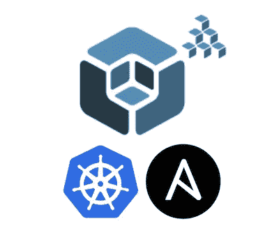
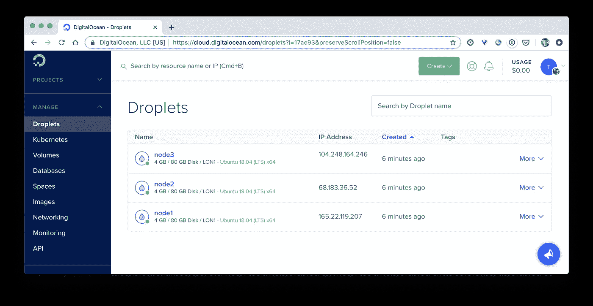
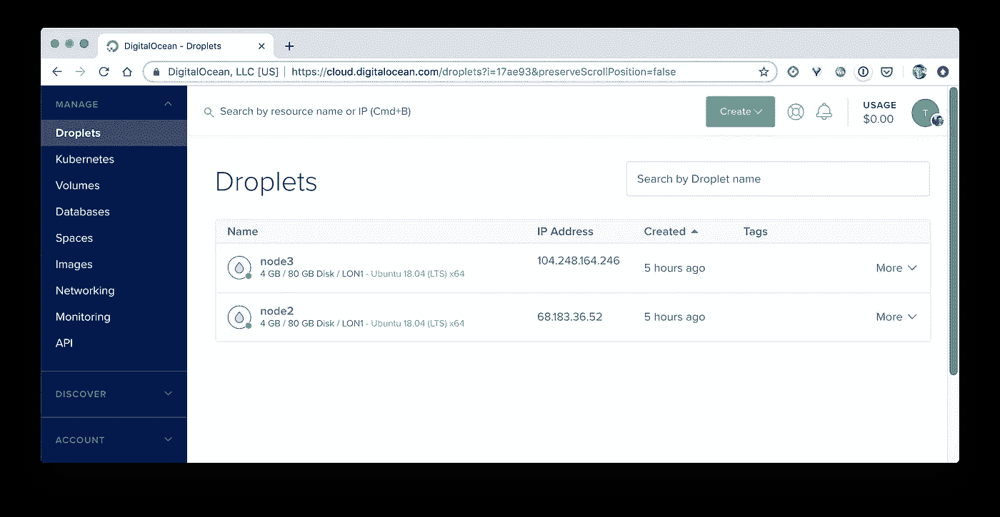

# Kubernetes 提示:使用 Kubespray 的 HA 集群

> 原文：<https://betterprogramming.pub/kubernetes-tips-ha-cluster-with-kubespray-69e5bb2fa444>

## 使用 Kubespray 创建高可用性集群并了解控制平面组件的行为方式



有几种工具可以用来建立 Kubernetes 集群。这些选项包括但不限于:

*   kubeadm:可用于部署一个[单主机](https://kubernetes.io/docs/setup/production-environment/tools/kubeadm/create-cluster-kubeadm/)或一个[高可用性集群](https://kubernetes.io/docs/setup/production-environment/tools/kubeadm/high-availability/)
*   [Kubespray](https://github.com/kubernetes-sigs/kubespray) :基于 Ansible playbook，在幕后使用 kubeadm 部署单主或多主集群
*   eksctl:致力于在 AWS 基础设施上部署集群
*   [Rancher](https://rancher.com/products/rancher/) :提供了一个很棒的 web UI 来从一个位置管理几个集群
*   …这样的例子不胜枚举

在本文中，我们将看到如何使用 Kubespray 建立一个 HA 集群。

# 设置依赖关系

我们从克隆 Kubespray 存储库开始。它包含设置集群所需的所有可翻译的行动手册。

```
$ git clone [git@github.com](mailto:git@github.com):kubernetes-sigs/kubespray.git
```

然后我们用 Python 的`pip`安装依赖项:

```
$ cd kubespray$ pip3 install -r requirements.txt
```

在此过程中，将安装以下部件:

```
$ cat requirements.txt
ansible==2.7.12
jinja2==2.10.1
netaddr==0.7.19
pbr==5.2.0
hvac==0.8.2
jmespath==0.9.4
ruamel.yaml==0.15.96
```

# 供应基础设施

在本例中，我们使用在 DigitalOcean 上创建的三个节点。每个节点都具有以下属性:

*   标准型(开发/测试环境的理想选择)
*   Ubuntu Server 18.04
*   4 GB / 2 个 CPU
*   位于伦敦数据中心
*   配置了预定义的 ssh 密钥(稍后用于从 Ansible 行动手册中自动建立 ssh 连接)



# 集群配置

使用 Kubespray 时，首先建议从`inventory/sample`复制默认样本配置:

```
$ cp -rfp inventory/sample inventory/mycluster
```

然后，我们可以在以下文件中自定义 Ansible 变量:

*   `inventory/mycluster/group_vars/all/all.yml`
*   `inventory/mycluster/group_vars/k8s-cluster/k8s-cluster.yml`

在当前示例中，使用默认值完全没问题。

## 存货文件

Kubespray 有一个助手脚本，用于根据 IP 地址列表创建清单。以下命令设置我们三个节点的 IP，并在 yaml 中创建一个清单:

```
$ declare -a IPS=(165.22.119.207 68.183.36.52 104.248.164.246)$ CONFIG_FILE=inventory/mycluster/hosts.yml python3 contrib/inventory_builder/inventory.py ${IPS[@]}
```

生成的清单文件如下:

```
all:
  hosts:
    node1:
      ansible_host: 165.22.119.207
      ip: 165.22.119.207
      access_ip: 165.22.119.207
    node2:
      ansible_host: 68.183.36.52
      ip: 68.183.36.52
      access_ip: 68.183.36.52
    node3:
      ansible_host: 104.248.164.246
      ip: 104.248.164.246
      access_ip: 104.248.164.246
  children:
    kube-master:
      hosts:
        node1:
        node2:
    kube-node:
      hosts:
        node1:
        node2:
        node3:
    etcd:
      hosts:
        node1:
        node2:
        node3:
    k8s-cluster:
      children:
        kube-master:
        kube-node:
    calico-rr:
      hosts: {}
```

如果你喜欢玩类似 INI 格式的库存文件(像我一样)，你可以很容易地将内容重新格式化并保存为一个`hosts.ini`文件:

```
[all]
node1 ansible_host=165.22.119.207
node2 ansible_host=68.183.36.52
node3 ansible_host=104.248.164.246[kube-master]
node1
node2[etcd]
node1
node2
node3[kube-node]
node2
node3[k8s-cluster:children]
kube-master
kube-node
```

这里需要注意几件重要的事情:

*   三个节点在`[all]`部分定义
*   `[master]`部分包含`node1`和`node2`,确保管理进程(API 服务器、调度器、控制器管理器)在每个主机上运行
*   `[etcd]`部分包含三个节点，这意味着 etcd 的一个实例将在其中的每一个节点上运行(至少需要一个 HA etcd 集群)
*   `[kube-node]`部分包含节点 2 和节点 3，因此可以在这些节点上调度用户的工作负载。在每个主节点上默认设置的`NoExecute`污点不会在`node2`上设置。这个污点用于防止用户工作负载被调度到一个节点上
*   yaml 清单中的`calico-rr`键下没有定义主机，所以我们在这里不指定任何部分

该清单定义了一个具有堆栈 etcd 拓扑的集群。这意味着 etcd 实例在主节点上运行。


部署在主节点上的 etcd 集群(来源:Kubernetes 文档)

注意:我们可以供应更多的虚拟机，并指定其中的 3 个运行 etcd 集群，这样它就在 Kubernetes 的外部。这将确保群集具有更高的安全性/弹性，但代价是增加了硬件。

## 构建集群

一旦一切就绪，我们就可以运行 Ansible 剧本来构建集群了。以下命令执行`cluster.yml`文件中指定的动作:

```
$ ansible-playbook -i hosts.ini -u root -b --key-file=~/.ssh/do-key.pem cluster.yml
```

群集只需要几分钟就可以准备就绪。一旦它启动并运行，我们就可以从主服务器上的`/etc/kubernetes/admin.conf`位置获得一个 kube 配置文件。我们可以通过`KUBECONFIG`环境变量配置`kubectl`客户端来使用它:

```
$ scp root@MASTER_X_IP:/etc/kubernetes/admin.conf kubespray-do.conf$ export KUBECONFIG=$PWD/kubespray-do.conf
```

然后我们可以得到节点列表:

```
$ kubectl get nodes
NAME    STATUS   ROLES    AGE   VERSION
node1   Ready    master   29m   v1.15.2
node2   Ready    master   28m   v1.15.2
node3   Ready    <none>   27m   v1.15.2
```

## 近距离观察控制平面

让我们列出集群上运行的所有 pod。因为我们没有运行任何工作负载，所以所有的 pod 都属于`kube-system`名称空间，它们专用于管理任务。

```
**$ kubectl get pods -n kube-system**
NAME                                  READY STATUS    RESTARTS   AGE
calico-kube-controllers-64c..-dtnzv   1/1   Running   0          27m
calico-node-j62dh                     1/1   Running   1          28m
calico-node-jtfml                     1/1   Running   1          28m
calico-node-qh8rw                     1/1   Running   1          28m
coredns-74c9d4d795-cp274              1/1   Running   0          27m
coredns-74c9d4d795-hrnqd              1/1   Running   0          27m
dns-autoscaler-7d95989447-t54wv       1/1   Running   0          27m
kube-apiserver-node1                  1/1   Running   0          29m
kube-apiserver-node2                  1/1   Running   0          28m
kube-controller-manager-node1         1/1   Running   0          29m
kube-controller-manager-node2         1/1   Running   0          28m
kube-proxy-6v5tf                      1/1   Running   0          28m
kube-proxy-dbhvs                      1/1   Running   0          28m
kube-proxy-tv4kg                      1/1   Running   0          28m
kube-scheduler-node1                  1/1   Running   0          29m
kube-scheduler-node2                  1/1   Running   0          28m
kubernetes-dashboard-7c547b4c64-q2gds 1/1   Running   0          27m
nginx-proxy-node3                     1/1   Running   0          28m
nodelocaldns-52rwd                    1/1   Running   0          27m
nodelocaldns-dgzk2                    1/1   Running   0          27m
nodelocaldns-grfsq                    1/1   Running   0          27m
```

列出集群的其他资源，我们可以很容易地看到:

*   pod`calico-kube-controllers`、`coredns`、`dns-autoscaler`和`kubernetes-dashboard`均由部署资源管理
*   pod`calico-node`、`kube-proxy`、`nodelocaldns`分别由一个 DaemonSet 资源管理

当谈到在控制平面内使用的吊舱时，事情有点不同:`kube-apiserver`、`kube-controller-manager`和`kube-scheduler`。这些 pod 不受任何更高资源(部署、DaemonSet 等)的管理，并且在其名称中包含它们所运行的主节点。

由于这些进程对集群至关重要，我们可以想象每个进程的两个实例不能同时运行。接下来让我们看看这些流程是如何处理的。

**API 服务器**

为了连接到 API 服务器，工作节点通过一个负载平衡器。在`node3`，吊舱`nginx-proxy-node3`正在运行。如果我们检查它的配置，我们可以看到它将每个请求代理到 API 服务器的一个实例(在下面的输出中以粗体显示)。

```
$ kubectl exec -ti pod/nginx-proxy-node3 -n kube-system -- sh
# cat /etc/nginx/nginx.conf
error_log stderr notice;worker_processes 2;
worker_rlimit_nofile 130048;
worker_shutdown_timeout 10s;events {
  multi_accept on;
  use epoll;
  worker_connections 16384;
}stream {
  upstream kube_apiserver {
    least_conn;
    **server 165.22.119.207:6443;
    server 68.183.36.52:6443;**
    }server {
    listen        127.0.0.1:6443;
    proxy_pass    kube_apiserver;
    proxy_timeout 10m;
    proxy_connect_timeout 1s;
  }
}http {
  aio threads;
  aio_write on;
  tcp_nopush on;
  tcp_nodelay on; keepalive_timeout 75s;
  keepalive_requests 100;
  reset_timedout_connection on;
  server_tokens off;
  autoindex off;}
```

因此，如果一个 API 服务器不健康(通过 keepalive 指令检测)，另一个将用于处理请求。

**控制器管理器&调度器**

正如 Kubernetes 文档中所定义的，这些组件使用租用机制来确保集群中每个组件只有一个实例是活动的。考虑到调度程序，让我们仔细看看。

首先，我们需要获得端点列表，它定义了访问其他资源的方式(服务资源使用端点来对后端 Pods 的请求进行负载平衡):

```
**$ kubectl get endpoints -n kube-system** NAME                    ENDPOINTS                              AGE
coredns                 10.233.90.2:53,10.233.96.1:53 + 3 more 109m
kube-controller-manager <none>                                 112m
kube-scheduler          <none>                                 112m
kubernetes-dashboard    10.233.92.1:8443                       109m
```

我们可以检查一下`kube-scheduler`里面有什么:

```
**$ kubectl get endpoints kube-scheduler -n kube-system -o yaml**
apiVersion: v1
kind: Endpoints
metadata:
  annotations:
 **control-plane.alpha.kubernetes.io/leader: '{"holderIdentity":"node1_e7f79dcf-ed72-43c0-902a-6fc62aac2a69","leaseDurationSeconds":15,"acquireTime":"2019-08-11T11:30:08Z","renewTime":"2019-08-11T13:24:55Z","leaderTransitions":0}'**
  creationTimestamp: "2019-08-11T11:30:08Z"
  name: kube-scheduler
  namespace: kube-system
  resourceVersion: "13193"
  selfLink: /api/v1/namespaces/kube-system/endpoints/kube-scheduler
  uid: 5437cbe6-7e5d-4dd2-a491-e345dc09a73b
```

然后关注`control-plane.alpha.kubernetes.io/leader`标注:

```
{
  "holderIdentity":"**node1**_e7f79dcf-ed72-43c0-902a-6fc62aac2a69",
  "leaseDurationSeconds":15,
  "acquireTime":"2019-08-11T11:30:08Z",
  "renewTime":"2019-08-11T13:24:55Z",
  "leaderTransitions":0
}
```

这个定义了哪个调度器是领导者，在这个例子中，是运行在`node1`上的调度器。当前领导者有一个租约，必须更新以确保它仍然有效。如果它不能续约，那么将会进行新的领导人选举。

从数字海洋界面，我们可以模拟断电并摧毁`node1`。



如果我们在`kube-scheduler`端点的注释中检查`control-plane.alpha.kubernetes.io/leader`键的内容，我们可以看到 leader 不再是运行在`node1`上的调度程序。新的领导者现在是在`node2`上运行的调度程序。

```
{
  "holderIdentity":"**node2**_a13c0374-44ea-419e-ac07-f868faddab3e",
  "leaseDurationSeconds":15,
  "acquireTime":"2019-08-11T14:19:51Z",
  "renewTime":"2019-08-11T14:26:31Z",
  "leaderTransitions":1
}
```

由于以前的计划程序无法更新租约，因此进行了新的领导者选举。

同样的过程也适用于控制器管理器，因此每次只使用一个实例。

# 摘要

在本文中，我们使用 Kubespray 创建了一个 HA 集群，并看到了控制平面的组件在该集群中的行为。在使用 HA 集群时，理解用于访问 API 服务器的负载平衡器和租用机制非常重要。

为了获得更高的弹性和安全性，应该考虑外部 etcd 集群，这样 etcd 实例就不依赖于 Kubernetes 集群的节点。