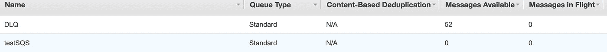

# λSQS 触发器和并发

> 原文：<https://betterprogramming.pub/lambda-sqs-trigger-and-concurrency-87131dad9a12>

## 重温λSQS 触发器的极限

阿诺·弗朗西斯卡在 [Unsplash](https://unsplash.com?utm_source=medium&utm_medium=referral) 上拍摄的照片。

AWS 提供了用 SQS 队列中的传入事件触发 lambda 函数的能力。Lambda 轮询消息队列，并同步调用您的函数。Lambda 成批地挑选这些消息，并将它们作为输入传递给一个函数。当函数成功处理批处理时，它会从队列中删除事件。

如果在处理消息时出现错误，消息在[可见性超时](https://docs.aws.amazon.com/AWSSimpleQueueService/latest/SQSDeveloperGuide/sqs-visibility-timeout.html)后再次出现在队列中，并且如果错误继续出现，最终可以落在[死信队列](https://docs.aws.amazon.com/AWSSimpleQueueService/latest/SQSDeveloperGuide/sqs-dead-letter-queues.html)中。

# 问题出在哪里？

当启用 SQS 触发器时，Lambda 开始对五个并行连接进行长轮询。每个连接从 SQS 队列中挑选一批消息，并将其传递给 lambda 函数。如果队列中还有消息，Lambda 每分钟会增加 60 个以上的轮询过程。实例的最大数量可以达到 1000 个。

与[http://draw.io/](http://draw.io/)合影。

问题是这种轮询实例的扩展与您的 lambda 函数并发性没有直接联系。因此，如果您的 lambda 函数随着轮询实例的增加而达到其并发限制，并且无法处理传入的请求，它将节流消息。在可见性超时之后，被抑制的消息将返回到队列中，并最终在[死信队列](https://docs.aws.amazon.com/AWSSimpleQueueService/latest/SQSDeveloperGuide/sqs-dead-letter-queues.html)中结束。当 Lambda 的并发性设置为 1 到 30 这样的低值时，很可能会出现这个问题。

# 重现问题

为了更好地理解它，我做了一个小的概念验证，其中我创建了一个并发设置为 5 的 lambda。我的 lambda 的任务是接受一个输入，然后休眠五秒钟。下面是 lambda 函数的代码:

我在 Lambda 上启用了事件源映射，SQS 的批处理大小为 1，重驱动限制为 3。因此，如果一条消息被扼制三次以上，它将到达 DLQ。

当在 SQS 添加大约 2000 条消息的流量突发时，我观察了性能。死信队列中大约有 52 条信息。

来自 AWS 控制台的照片。

# 你该怎么办？

不幸的是，这没有直接的配置。然而，AWS 的以下[建议](https://docs.aws.amazon.com/lambda/latest/dg/with-sqs.html#events-sqs-queueconfig)可以帮助降低这种情况发生的可能性:

1.  将 SQS 的可见性超时设置为至少是 lambda 函数执行时间的六倍。额外的时间允许 Lambda 重试，如果你的函数在处理前一个批处理时执行受阻。
2.  将队列的重新驱动策略上的`maxReceiveCount`至少设置为 5。
    这将使消息在发送到死信队列之前有更好的处理机会。
3.  配置死信队列以保留失败的消息，以便您可以在以后重新驱动这些消息。

# 结论

感谢您的阅读！