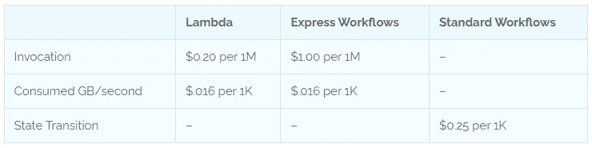
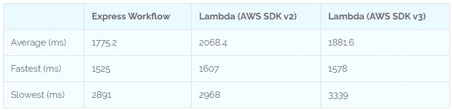
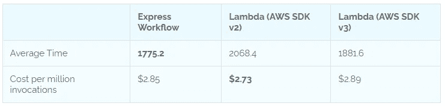

# Lambda 与阶跃函数:成本与性能之战

> 原文：<https://betterprogramming.pub/lambda-vs-step-functions-the-battle-of-cost-and-performance-5f008045e2ab>

## 随着在 Lambda 上使用阶跃函数的强大推动力，你可能会想“哪种更划算”？答案可能会让你大吃一惊。

从[维基图片](https://pixabay.com/users/wikiimages-1897/)上的[图片](https://pixabay.com/)

在过去的几周里，我做了一些分析，关于如何开始将 Step 函数作为标准开发过程的一部分。您可以选择使用[“存储优先”](/build-better-serverless-apis-by-going-storage-first-597784f8f399)完全异步的工作流，或者使用[完全同步的](/how-to-build-lightning-fast-apis-with-aws-step-functions-d1725624aaaa)快速状态机。

这两种方法都有用例，但是生产开发的共识是采用混合方法:同步执行一组基本操作，比如验证和 id 创建，然后异步开始其余的处理。然后[使用 WebSocket](/introduction-to-aws-websockets-8b336a92c379) 通知用户工作流何时完成。

开发者天性好奇。很多人回复了我在 LinkedIn 和 Twitter 上的帖子，询问 Lambda 和 Step 函数之间的成本差异。毕竟，我正在努力完全抛弃 Lambda。似乎是一个合理的问题。

为了弄清楚对钱包的影响，我们需要确定这些服务是如何计费的。AWS 有多种方式向你收取他们的无服务器服务费用，但在透明度和无隐藏成本方面做得很好。

让我们深入分析一下 [AWS Lambda](https://aws.amazon.com/lambda/) 与 [AWS 阶跃函数](https://aws.amazon.com/step-functions)的成本和性能。

# 成本因素

我们今天将比较三种不同的方法:**λ**、**快速工作流程**和**带步骤功能的标准工作流程**。下表列出了每项服务的使用计费方式。

*价格基于美国东部 1 区*

您可以调整 Lambda 允许消耗的内存量，因此您的`consumed GB/sec`可以根据配置而变化。使用阶跃函数，它消耗的内存量可以用下面的公式计算出[:](https://aws.amazon.com/step-functions/pricing/)

> *50MB +状态机定义大小+执行数据大小 x 并行或映射步骤数*

将上面计算的数字*四舍五入到最接近的 64MB* 并除以工作流的平均持续时间，得到快速工作流消耗的 GB/秒。

如您所见，快速工作流程的计费方式与 Lambdas 相似。但是标准的工作流程完全不同。他们的账单完全基于状态转换的数量。

为了了解 Lambda 与 express 工作流相比如何，我们必须对性能进行衡量。

# 大型 Lambdas 和 Express 工作流的基准测试

## 同步比较

构建快速工作流的替代方法是使用一个巨大的 Lambda 来执行相同的操作。您也可以使用 [Lambda 目的地](https://aws.amazon.com/blogs/compute/introducing-aws-lambda-destinations/)，但是它们是异步的，不能直接应用于我们正在进行的比较。

作为基准，我将使用我在 express 状态机上的帖子中的 [API 关键工作流](https://github.com/allenheltondev/serverless-api-key-registration/tree/benchmark-testing)。

*API 密钥创建工作流程*

为了提供更全面的比较，我将针对 Node.js 中的 [AWS SDK v2](https://docs.aws.amazon.com/AWSJavaScriptSDK/latest/) 和 [AWS SDK v3](https://www.readysetcloud.io/blog/allen.helton/lambda-vs-step-functions-breakdown/lessons-learned-from-switching-to-aws-sdk-v3) 中编写的相同 Lambda 测试 express 工作流。

每个 Lambda 都经过了由 Alex Casalboni 针对性能进行优化的 aws-lambda-power-tuning。

为了测试，每个端点运行 1000 次。计算结果的平均值，得到平均执行时间。一旦我们得到平均值，我们就可以进行成本分析。

*性能测试结果*

如您所见，*我们的全面赢家是具有步骤功能的快速工作流*！对于 Lambda，最慢的时间可以归因于冷启动。但是，您不需要为冷启动时间付费，它只是您的功能的执行时间。

走阶跃函数路线的一个好处是你不会有冷启动(除非你用 Lambda 作为状态)。如果你使用[直接 SDK 集成](https://docs.aws.amazon.com/step-functions/latest/dg/supported-services-awssdk.html)，你的状态机将以惊人的速度运行。

再说一次，这些 Lambdas 被调整到最佳性能，所以它们被设计成尽可能快地运行。与阶跃函数相比，性能几乎可以忽略不计。

快速工作流**每 100 万次调用**的直接成本比较的数学公式是:

> *1.00 + ( 64 个消耗的内存四舍五入到最接近的 64MB/ 1024MB ) x 1M 次调用 x 1.8s 平均持续时间(四舍五入到下一个 100ms) x .00001667 = $2.87*

对于 Lambda，我们可以采用 AWS SDK v3 的更快执行时间，并计算每一百万次调用的计费成本，如下所示:

> *.2 +(平均消耗内存 88MB/1024 MB)x 1M 次调用 x 1.881s 秒平均持续时间 x .00001667 = $2.89*

汇总结果，我们有一些令人惊讶的数字:

奇怪的是，AWS SDK v2 函数消耗的内存最少，这降低了每百万次调用的成本。不管怎样，每百万例死刑的成本只有几分之差。*非常有趣！*

## 异步比较

如果你考虑到标准工作流程，你可以用不同的方式来分摊成本。如果你有一个运行在 Lambda 函数中的异步进程，你必须保证处理将在 15 分钟内完成(T12 ),或者你启动其他 Lambda 继续处理(通过目的地有效地构建你自己的状态机)。

这种方法的替代方案是提供 EC2 实例并支付机器正常运行时间的成本，或者创建一个具有步骤功能的标准工作流并按转换付费。

让我们以一个图像处理作业为例，该作业通过 [Textract](https://aws.amazon.com/textract/) 运行一个图像以获取任何文本并将结果放到 S3，然后运行 [Rekognition](https://aws.amazon.com/rekognition/) 作业以识别图像中包含的对象，最后将合并后的结果保存到 DynamoDB。

对于 Lambda，这将相当昂贵。假设我们可以在大约 2 分钟内完成工作并完成任何处理。如果我们提供 1024MB 的内存，平均使用 256MB 的处理能力(这些是大图像)，我们会看到下面的公式**每 100 万次调用**:

> *. 20+(100 万 x 120 秒)x(256 MB/1024 MB)x . 0000166667 = $ 500*

让我们假设执行相同动作的状态机需要 15 个状态才能完成。它启动作业，并在循环中执行状态检查，直到作业完成。计算 100 万次调用成本的公式是:

> *100 万 x 15 x . 000025 = 375 美元*

在这种情况下，每月将工作负载作为标准状态机运行会更便宜一些。

# 总拥有成本

当谈及直接成本时，就选择阶跃函数 vs Lambda 而言，它似乎可以忽略不计。但是当你把总拥有成本考虑在内时，情况就有点变化了。正如之前一篇关于[重构无服务器应用](/how-to-refactor-serverless-applications-the-right-way-fb5e80c71d36)的文章中所讨论的，在计算业务的**成本时，某种东西的实际成本只是一个因素。**

如果在云中运行一段代码每月花费 1000 美元，但由于可维护性差，开发人员要花 20 个小时来修复一个 bug，那么企业的成本就会大大增加。

另一方面，如果在云中运行相同的代码每月花费 2000 美元，但由于易于维护，只需要开发人员花 4 个小时的时间来修复一个 bug，那么企业的总体成本会更低。

> 成本不仅仅是金钱。

没有“一刀切”的解决方案。适用于一个团队的可能不适用于其他团队。当你决定采取哪种方式进行无服务器冒险时，请考虑这一点。

通过使用 Step 函数切换到代码模型上的*配置，您将代码执行的责任推给了云供应商。作为一家软件公司，你承担的责任越少，你获得的投资回报就越高。*

# 结论

对于我的用例，Step 函数更适合同步和异步执行。

这并不总是正确的，因为一些状态机可能会变得庞大，并且比一些设计良好的 Lambda 函数大大增加了成本。

*找到平衡。*

在投入下一个重大项目之前，花时间做成本估算是值得的。将复杂的工作流程可视化在步骤功能图中，您会从中受益吗？或者你的团队更好地通过代码吗？

Step Functions 将是未来改变游戏规则的服务(*见鬼，它已经是了！*)。随着采用率的增加和功能的不断增长，它将会变得越来越好，并将传统的“Lambda 开发”远远甩在身后。

通过阶跃函数，你可以获得更好的可追溯性，更低的责任，以及一个[超级酷的设计师](https://docs.aws.amazon.com/step-functions/latest/dg/workflow-studio.html)。在某些情况下，它似乎也是一种比 Lambda 成本更低的服务。

我鼓励你尝试一下，如果你还没有，你可能会喜欢你所看到的。

编码快乐！