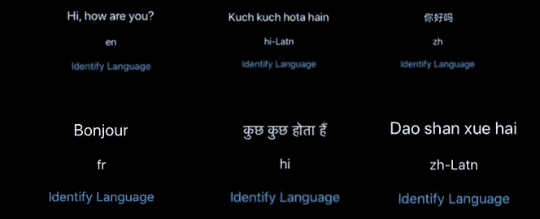
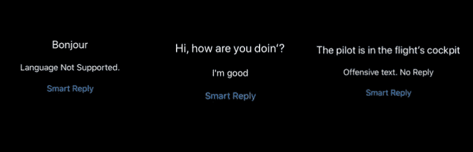
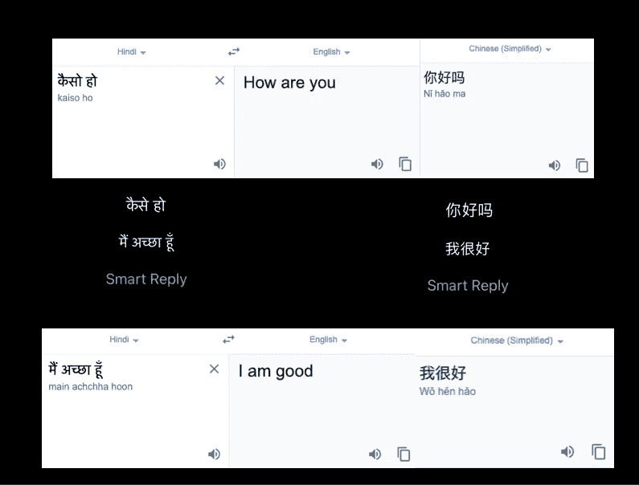

# 构建一个 SwiftUI 应用程序，使用 Firebase MLKit 编写外语智能回复

> 原文：<https://betterprogramming.pub/language-identification-translation-and-smart-reply-in-ios-with-firebase-ml-kit-b6a2ba25f144>

## 使用 Firebase ML 套件在 iOS 中进行语言识别、翻译和智能回复


照片由[杰米街](https://unsplash.com/@jamie452?utm_source=medium&utm_medium=referral)在 [Unsplash](https://unsplash.com?utm_source=medium&utm_medium=referral)

[Firebase ML Kit](https://firebase.google.com/products/ml-kit) 是谷歌雄心勃勃的平台，旨在弥合机器学习和移动应用开发之间的差距。它提供了易于使用的 API 来在设备上或使用云运行强大的框架，如 [Vision](https://developers.google.com/ml-kit/vision) 和 [Language](https://firebase.googleblog.com/2019/04/ml-kit-expands-into-nlp.html) 。

此外，随着今年(2019 年末，撰写本文时)推出设备上语言翻译和 [Auto ML Vision Edge](https://firebase.google.com/docs/ml-kit/automl-image-labeling) ，谷歌推动机器学习驱动的移动应用开发的计划迄今为止似乎步入了正轨。Firebase ML Kit 框架拥有跨平台支持，这使得开发令人兴奋的基于机器学习的应用程序变得更加容易，这些应用程序在 Android 和 iOS 设备上保持一致。

ML Kit 的语言框架是本文的主要焦点。最近推出的设备上翻译 API 利用谷歌不断发展的翻译 API，提供跨 58 种语言的支持，模型可以下载并在设备上本地使用。凭借额外的自然语言处理能力，如语言识别和智能回复，这个 MLKit 的框架作为一个整体，在人工智能设备的正确道路上。

与此同时，苹果的自然语言框架也取得了巨大的进步，加入了情感分析，并提供了在苹果设备上部署文本分类和单词标记模型的工具。这两家科技巨头目前提供的这些不同的功能对苹果开发者来说是一大福音，因为他们可以结合和混合两个世界的最佳功能，以开发出令人兴奋的人工智能应用。

Firebase ML Kit 仍处于测试阶段，其自然语言功能(如智能回复)目前仅支持英语。

本文的目标是将设备上的翻译和识别与智能回复相结合，并探索智能回复在其他语言中是如何工作的。

# 行动（或活动、袭击）计划

我们将在一个基于 SwiftUI 的 iOS 应用程序中探索 ML Kit 的自然语言处理能力。下面是本文剩余部分的蓝图:

*   在您的 iOS 项目中设置 Firebase
*   对输入文本进行识别、智能回复和翻译
*   将三者结合起来，看看智能回复如何在不同的语言中工作。
*   讨论语言框架的未来范围。

# 在您的 iOS 项目中设置 Firebase

[Firebase 文档](https://firebase.google.com/docs/ios/setup)对在 iOS 应用中集成 Firebase 有一个很好的演示。以下是在应用程序中设置 Firebase 时需要的基本要素清单:

*   创建一个新的 Firebase 项目，并注册您的应用程序的捆绑包 ID。
*   下载 **GoogleService-Info.plist** 文件，并将其放入 Xcode 项目中。
*   使用 Cocoapods 或 Swift Package Manager 添加相关的 Firebase 依赖项。
*   使用`Firebase.configure()`初始化`AppDelegate`中的 Firebase。

# 语言识别

语言识别功能能够从大约 110 种当前支持的语言中确定输入文本的语言。它只需要几个词就可以识别，并返回语言代码及其置信度阈值。如果不能确定语言，它将返回`und`。

为了将语言标识添加到应用程序中，请在项目中添加以下依赖项:

```
pod 'Firebase/MLNaturalLanguage'
pod 'Firebase/MLNLLanguageID'
```

接下来，只需在类中导入依赖项，并在输入文本上调用标识 API，如下所示:

默认情况下，将返回阈值高于 0.01 的所有可能的语言。我们可以自定义最小阈值，如下所示:

```
let options = LanguageIdentificationOptions(confidenceThreshold: 0.4)
let languageId = NaturalLanguage.naturalLanguage().languageIdentification(options: options)
```

下图描述了几种语言的语言识别结果:



语言识别功能足够智能，可以从文本的上下文中检测语言，如上图所示。对于用英语输入的外语，语言代码通常不同于本地外语代码(它被附加了`Latn`)。

# 智能回复

智能回复在消息应用程序中迅速流行起来。像 Gmail 和 LinkedIn 这样的应用现在已经支持这项功能了。API 根据最近十条消息来确定对会话的可能回复(尽管它也适用于单条消息)。

为了集成 ML 工具包的智能回复，请在您的项目中添加以下 ML 工具包库:

```
pod 'Firebase/MLCommon'
pod 'Firebase/MLNLSmartReply'
```

以下代码演示了一个关于输入文本的智能回复示例:

智能回复 API 需要一个`TextMessage`数组，其中的对话经过排序，最新的对话位于数组的末尾。每个`TextMessage`由一个`isLocalUser`布尔参数组成。智能回复 API 会向本地用户建议回复。

在上面的例子中，由于对话只包含一条文本消息，我们将`isLocalUser`设置为`false`。

API 返回三个建议的回复。如果文本的上下文是攻击性的或者语言不被支持，目前智能回复不会返回任何内容。



第三个不是攻击性的…尽管如此，智能回复目前是这么说的。

目前，智能回复 API 还处于早期阶段，需要进行一些微调来确定什么是冒犯性的，什么是不冒犯性的，正如你在上面第三幅图中看到的。

# 设备上翻译

离线语言翻译是 ML 工具包的最新成员。它支持 58 种语言，在某些情况下非常准确。让我们在一些不同的情况下测试它的准确性。在项目中添加以下依赖项:

```
pod 'Firebase/MLNLTranslate'
```

以下代码展示了翻译 API 的使用:

`Translator`实例用于定义源语言和目标语言。我们可以设置将语言模型下载到设备上的条件。最后，`translator.translate(text)`是执行翻译并在完成处理程序中返回结果的行。

下载语言模型以便在离线模式下在设备上使用。通常每个模型大约 30 MB，所以在处理多语言翻译时要小心。

以下代码用于删除下载的模型:

```
let deModel = TranslateRemoteModel.translateRemoteModel(language: .fr)
ModelManager.modelManager().deleteDownloadedModel(deModel) { error in
    guard error == nil else { return }
    // Model deleted.
}
```

这里有一个跨几种不同语言(中文、印地语和法语)的翻译结果的图示。


ML Kit 的设备上翻译或多或少与 Google Translator API 相同。在上面的例子中已经证明，当语言没有被确定时，它返回源文本作为结果。

既然我们已经分别讨论了三种自然语言能力，那么是时候将它们混合起来了。在下一节中，我们将探索除英语之外的其他语言的智能回复，并看看 ML Kit 进展如何。

# 非英语语言的智能回复

如上所述，智能回复目前仅支持英语。然而，通过使用 Identification API 从文本中了解语言，我们可以将其翻译成英语，然后生成智能回复，最后将其翻译回原始语言。

使用这四个步骤，我们可以用外语撰写聪明的回复。让我们开始实现吧。

## 设置用户界面

在 SwiftUI `ContentView.swift`结构中添加以下代码:

```
 @State var inputText: String = ""
    @State var languageIdentified: String = ""
    @State var smartReplyInOriginalLanguage: String = ""var body: some View {

        VStack(alignment: .center, spacing: 20){
            TextField("Enter some text", text: $inputText)
                .font(.system(size: 20))
                .multilineTextAlignment(.center)
            Text(smartReplyInOriginalLanguage)Button(action: identifyLanguage, label: {
                Text("Smart Reply").foregroundColor(.blue)
            })
        }
    }
```

## 识别语言

以下代码用于从输入文本中识别语言:

## 识别翻译的语言代码

接下来，我们将了解如何从语言代码中确定语言。在下面的代码中，我们将遍历支持的语言集，并检索我们识别的语言的代码进行翻译:

## 翻译和智能回复生成器

现在我们已经得到了代码，我们将把它传递给`Translator` 实例，以便把它转换成英语，然后生成智能回复。

在上面的代码中，由`generateEnSmartReply`函数的完成处理程序返回的结果被再次输入到一个翻译器中——这一次，以原始语言获得最终结果(智能回复):

下面是我们两种外语的最终结果，以及它们的英文实际版本。



用于演示目的的语言是中文和印地语。相当准确聪明的回复

正如我们从上图中混合的实际谷歌翻译结果中看到的，ML Kit 智能回复 API 的结果对于外语来说相当准确。

# 结论

在本教程中，我们看到了 ML Kit 的语言框架在 iOS 应用程序中的三个主要特性。语言识别功能运行良好。然而，智能回复的盔甲也有一些漏洞。

在上一节中，我们创建了自己的自定义智能回复系统，它可以跨所有支持翻译的语言工作，并获得了相当不错的结果。你可以从 GitHub 库下载完整的源代码。请确保您从 Firebase 添加了自己的`GoogleService-Info.plist`文件。

Firebase ML 套件仍处于测试阶段，但看起来已经很有希望了。与苹果的自然语言框架一起，它可以用来构建令人兴奋的应用程序，如由翻译支持的文本分类，等等。

这一次到此为止。我希望你喜欢阅读。