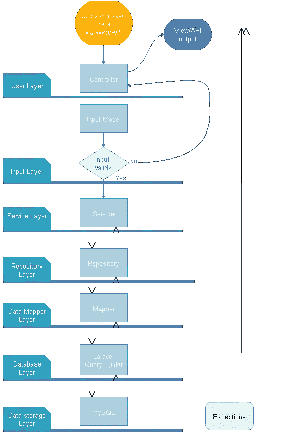

# 解释了用 Laravel 编写更好代码的 OOP 原则

> 原文：<https://betterprogramming.pub/laravel-oop-principles-for-writing-better-code-explained-part-1-531276365cba>

## 第一部分


# **一个小故事:我如何开始与拉勒维尔**

我曾经花了很多年使用 WordPress，因为我的客户想要一个能够自己更新网站的低成本解决方案。对于小公司来说，这是一个典型的要求。

然而，随着 Wordpress 变得越来越大，越来越受欢迎，越来越多的人开始构建自己的插件。事态的发展开始让人无法忍受。这些网站变得不稳定、不安全、庞大、缓慢。

有一天，在花了几个小时试图找出我的一个网站的错误后，我对自己说:**够了**！我对其他选项做了一些研究，发现了几个流行的框架。我几乎立刻就喜欢上了 Laravel，并开始学习一种全新的 web 开发方法。

## **压死骆驼的最后一根稻草**

OOP 的主要原则之一是 **SRP** — *单一责任原则*。WordPress 在“专家级”使用 SoC。明显是讽刺！

我管理的一个网站，但不是我创建的，使用了一个推荐插件。插件的作者认为将一组推荐与文章类别联系起来是个好主意。删除类别后发生了什么？整个主页以一种非常奇怪的方式崩溃了。所有的积木都一个接一个地放在右边。一个简单的分类变化就毁掉了整个网站。WordPress 惊人的代码架构！

## **设计良好的代码 vs 糟糕的代码。金钱—时间—客户**

许多程序员感到来自客户的压力很大。显然，客户希望这项工作又快又便宜。价格越低越好，但只是刚开始。写得不好的代码的代价是什么？它实际上是巨大的！作为一名专业人士，你必须能够更好地向你的客户或雇主解释。

这幅图展示了糟糕的代码和设计良好的代码之间的典型对比。


好吧，深思熟虑的代码在开始时需要更多的工作和思考。初期效果没那么快，价格也比较高。然而，适当的代码将易于扩展或更新。从长远来看，这对程序员和客户来说都是值得的。

# 对设计糟糕的代码的体验

我已经经历过几次“红色情况”了。一个客户让我更新一些别人乱七八糟的代码。我很清楚这是不可能的。程序员自己告诉客户，他不能再更新它了，他已经放弃了。

没有适当命名约定的超长函数。*if*inside*for*inside other*while*inside more*if*。一个新的程序员需要多少时间来理解这样一个函数？这不值得。我们不得不在绿线上重新开始。

最近，我开始着手一个新项目，也有类似的糟糕概念。PHP、SQL 调用、HTML——都在一个文件中。关注点分离在这个项目中夭折了。创建代码的人甚至懒得分离 HTML 头。每一页都有自己的页眉。现在，如果一个客户要求改变图标，他们最终会更新 30 多个文件。难道他们没听说过**干**原理吗？

我和客户谈了一下，他说他了解程序员，他们入行很久了，不会差。好吧，如果一个程序员一遍又一遍地犯同样的错误，他的经验算不算几年或几十年都没关系。代码是坏的，句号。

# OOP 规则将帮助你创建更好的代码

OOP 规则工作得很好，它们确实能帮助你写出更好的代码。然而，学习如何实际应用它们是非常困难的。这些原则非常清楚，但不幸的是，如何遵循它们往往非常不直观。我的一个朋友是微软的高级程序员，他是我最重要的知识和技巧来源。互联网不再有足够的帮助。一个能直接对你的用例提出建议的人更有价值。

这里我们不会解释主要的原则，而是展示一些如何实际有效地使用 OOP 的例子。

以下是一些最重要的术语:

*   [坚实原理](https://en.wikipedia.org/wiki/SOLID)
*   [SoC —关注点分离](https://en.wikipedia.org/wiki/Single_responsibility_principle)
*   [SRP —单一责任原则](https://en.wikipedia.org/wiki/Single_responsibility_principle)
*   [IoC —控制反转，链接](https://en.wikipedia.org/wiki/Inversion_of_control)
*   [设计模式](#https://sourcemaking.com/design_patterns)
*   [反模式](#https://sourcemaking.com/antipatterns)

其中一些术语显然是重叠的，但是它们将帮助您搜索更深层次的知识，特别是如果设计模式需要一些使用它们的经验。作为一名程序员，你必须在许多标准中做出适当的妥协，比如复杂性、时间、代码可读性、程序速度、开发进度、团队合作等等。

# 从图层开始设计；你的生活会变得轻松很多！

最重要的编程原则之一是一个*架构模式* ( [1](https://en.wikipedia.org/wiki/Abstraction_layer) ，[2](https://en.wikipedia.org/wiki/Layer_(object-oriented_design)))——简单来说，就是层。让我们考虑一下我们通常需要的每一层是做什么的。有没有适合典型 web 应用程序的大多数标准情况的好方法？

典型 web 应用程序的可能层次。



1.路由。用户或 API 客户端调用某个 URL 并期望发生一些事情。我们的应用程序必须识别 URL。这是由路由类完成的。在 Laravel 中，有一个很棒的路由系统，它有很多有用的特性。VueJs 还包括一个很棒的路由机制，[ [1](https://router.vuejs.org/guide/essentials/dynamic-matching.html#reacting-to-params-changes) 。

2.应用程序检查调用的重要属性。它有合适的标题吗？会话是否处于活动状态？用户登录了吗？电话授权了吗？用户是否有使用此呼叫的适当权限？

所有类型的调用验证都由中间件管理。在 Laravel 中，您可以根据需要创建任意数量的中间件。很多马上就为你准备好了。

3.Laravel 创建一个封装了所有输入数据的*请求*对象。Laravel 将请求对象发送到一个*控制器*。

现在，我们在一个 ***控制器*** 中，这是我们应用的一种入口点。在控制器的功能结束时，应用程序应该返回一些数据。在入口点和返回语句之间，我们有一个业务逻辑在做一些客户想要的事情。

**注**:控制器是大部分 Laravel 教程结束的地方。举个琐碎的例子，多建几层没什么意义。然而，正因为如此，新程序员很难学习更高级的东西。我自己也经历过这种挣扎。

4.一个*控制器*应该验证传入的数据，调用一个服务执行一些业务逻辑，然后以期望的格式形成一个响应(例如 json 或 blade 视图)。

5.数据验证是一项极其重要的任务。许多程序员没有足够重视它，从而创建了不安全的应用程序。SQL 注入只是众所周知的安全威胁之一。

记住，你永远不要相信客户的数据。始终验证它们，即使它们来自您自己的前端客户端。请记住，API 可能会被其他应用程序使用。

6.数据经过验证后，我们就可以调用服务了。业务逻辑应该与控制器分离，如果可能的话，也应该与框架本身分离。如果类不依赖于框架，那么对你的应用进行单元测试会更容易。建议的一个例子是避免使用`*resolve (‘ClassName’)*`*；*更喜欢控制反转或将依赖关系手动传递给较低层。

什么是商业逻辑？大多数时候，你的应用需要 [CRUD](https://en.wikipedia.org/wiki/Create,_read,_update_and_delete) 操作。服务类将接收传入的数据，并将其保存到数据库中。或者，它将读取数据，将其转换成所需的格式，然后返回。如果需要更复杂的东西，服务类将调用其他服务。

**7。**如果服务需要访问数据库，它调用一个 ***存储库*** 类。存储库处理对数据库的所有调用。上面的层不知道数据是如何存储的。你只要打电话

```
$userRepository->getById(1);
```

仅此而已。对于服务来说，无论你的数据库是 MySQL、NoSQL 还是数据通过 API 保存在云中的某个地方，都没有关系。

8.Laravel 原生模型非常强大，可以为创建简单的应用程序节省一些时间。然而，它们违反了一些 OOP 规则。为此，我决定创建自己的系统，彻底摆脱主动记录(反)模式。我将在文章的后面解释这个想法。

存储库调用知道如何从数据库获取数据的数据映射器。DataMapper 类是特定于数据库的。它必须为每种类型的数据库(mySql、noSql、文件)单独创建。但是，它的界面应该是完全一样的。我的数据映射器总是有这些公共函数:

```
public function getById($id, $attributes = '*');
public function getBySlug($slug, $attributes = '*');
public function patchById (IModel $model, $selectedAttributes);
public function deleteById ($id);
public function search (array $criteria, $attributes = '*');
public function store (IModel &$model);
```

如果数据映射器需要一些特殊的函数，它们在子类中实现。例如 *UserDataMapper* 需要 *getByUserName()* 、 *isRoot()* 等函数。

9.DataMapper 为 Laravel 查询生成器准备数据。这是应用程序的最低层。如果失败，查询生成器将返回数据或引发异常。

**重要规则**:任何类或函数都不应该跳层！它产生了紧密耦合，并最终导致测试和在团队成员中分配工作的问题。这条规则真的很重要，然而，即使是 Laravel 也支持以一种恐怖的方式打破它。

示例 : Laravel [验证器](https://laravel.com/docs/5.7/validation)是一个强大的工具。毫无疑问。但是，它允许您创建这样的验证规则:

```
'state' => 'exists:states'
```

看起来简单大方。然而，从 OOP 规则的角度来看，这是一个可怕的概念。它将顶层与底层 SQL 数据库连接起来。最重要的是，它将您的验证与数据库列的实际名称联系起来。这是一对极其紧密的组合，最终会踢你的后腿。一旦你走上这条路，你几乎肯定会在将来痛苦地重写一大部分代码。

最重要的是，你可以用这个概念做更糟糕的事情。你可以这样验证用户的数据(伪代码):

```
IF Validator( 'email' => 'exists:emails') == False THEN createNewUser()
```

**为什么这段代码很危险？**如果邮件在你的代码到达 save()函数之前就出现在 DB 里了怎么办？99%的情况下都不会发生。然而，当你的应用程序为更多的客户服务变得更忙时，你必须预料到这种情况会发生。你的应用会在没有警告的情况下崩溃。验证通过，电子邮件未被接收，但数据不会被保存，电子邮件已经在那里。一个你从未见过的异常可能会使应用程序崩溃。

# **第 1 部分的结论**

我们已经介绍了 PHP/Laravel 面向对象编程的重要基本概念。然而，这些概念是一般性的，可以应用于任何类型的代码。

遵循一些基本的 OOP 规则将帮助你写出更好的代码，在可读性、安全性和可扩展性方面更好。

下次在第 2 部分再见！