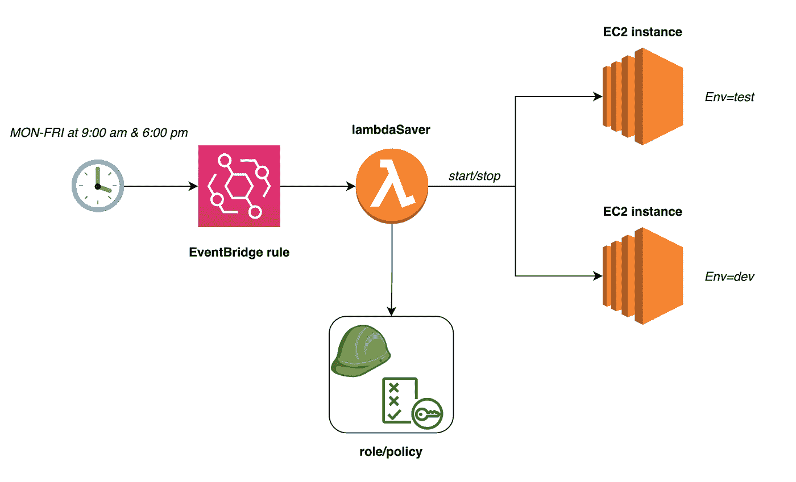

# 最后一个出去，关灯

> 原文：<https://betterprogramming.pub/last-one-out-turn-off-the-lights-9647c8b3f52d>

## ***如何为开发和测试环境自动提供云资源***

克里斯蒂安·杜博万在 [Unsplash](https://unsplash.com?utm_source=medium&utm_medium=referral) 上拍摄的照片

在使信息和云技术更具可持续性的背景下，工具、技术和原则有很大的空间来实现云基础设施的最佳利用。

考虑到这一点，我曾有过这样一个简单的想法:当工程师、质量分析师等不需要开发和测试环境时。不在使用它们。因此，这篇文章的名字让我想到…如果我在办公室工作，并且是最后一个下班的人，我可能会被指示(逻辑上)关掉所有的灯。

**我为什么不打开和关闭我在下班时间或周末不会使用的云环境？**

Lambda saver 是一个简单的实验，旨在实现这个用例(以及我对更多地了解“云”的具体细节的内在需求)。它是一个函数，可以被调用来根据特定的时间表打开和关闭开发和测试环境。

该解决方案基本上包括为上午 9:00 和下午 6:00 创建一个 [AWS EventBridge](https://docs.aws.amazon.com/eventbridge/latest/userguide/eb-what-is.html) 规则。这将触发一个 [AWS Lambda](https://docs.aws.amazon.com/lambda/latest/dg/welcome.html) 的执行，它将根据与这些计算实例相关联的标记相应地启动/停止开发和测试环境。

此解决方案抽象了一些细节，如事件规则的周期性、用于托管这些环境的底层基础架构和云服务、调用功能时这些实例的初始状态、用于识别它们的技术、生产路径和所用的测试策略，以及由于概念验证的实验性质而被忽略的其他内容。

lambda 代码本身已经嵌入了必要的标签，我希望通过这些标签来过滤这些环境。

在这种情况下，它们是`Env=dev`和`Env=test`。起初，我试图让 lambda 调用将标签作为有效负载的一部分包含在调用中，但是找不到一种可靠的方法来触发带有这样一个有效负载的 lambda 调用的预定事件。因此，我决定暂时将它们保留在代码库中，尽管这对于您想要过滤哪些标签造成了限制。

此外，还有其他方法来实现相同的功能。AWS 实例调度器可能是一个非常好的选择。这还要求标记您的目标实例，并定义周期、计划以及其他资源。

结论是，云效率低下通常表现为分散的小问题，这些小问题在我们的云账单中占了很大的比重(在碳排放方面也是如此)。

你可以通过分析你当前的团队环境，挑战你自己关于**为什么你以你现在的方式做你所做的事情的假设，开始以一种务实的方式解决这些问题。**更多关于在跟进条目中发现低效的流程。

像往常一样，代码可以在[这里](https://github.com/dfratte/lambda-saver)获得，欢迎所有的反馈和改进。