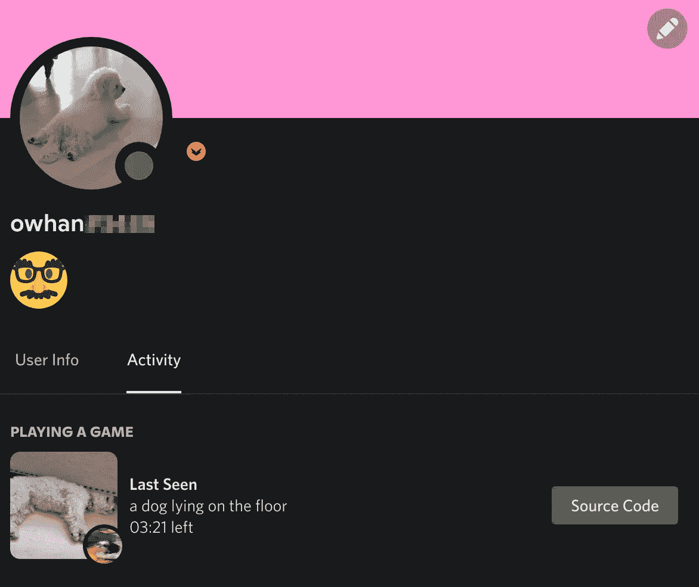

# 最后一次看到:使用 Python 构建一个基于人工智能的 Discord 富呈现客户端

> 原文：<https://betterprogramming.pub/last-seen-an-ai-based-discord-rich-presence-client-ad57d6f6ba3c>

## 我如何使用 Python 构建它

由[亚历山大·沙托夫](https://unsplash.com/@alexbemore?utm_source=medium&utm_medium=referral)在 [Unsplash](https://unsplash.com?utm_source=medium&utm_medium=referral) 上拍摄的照片

我真的很喜欢不和谐丰富的存在功能。这就像你的电脑版的 Snapchat stories，展示你此刻在做什么。对于我电脑上的大多数活动，我喜欢找到丰富的在线客户端在我的个人资料上广播我的活动——无论是玩游戏、[用 Neovim](https://github.com/andweeb/presence.nvim) 编码，还是[看动漫](https://github.com/MALSync/MALSync/wiki/Discord-Rich-Presence)。

对 Discord 的丰富存在的兴趣让我创建了自己的 RPC(丰富存在客户端)。我创作了 *Last Seen* ，这是一个不和谐的 RPC，它使用人工智能来展示你的相机胶卷的最新情况。

最后一次看到:自动从谷歌照片中抓取最新图片，并使用人工智能生成说明

# 最后看到的建筑

## 成分

1.  丰富的在线客户端功能
2.  轮询云服务以获取相机胶卷中的最新照片
3.  图像托管
4.  使用人工智能为最新图像生成标题

## 正在查找 RPC 库

首先，我希望能够编程设置我的不和谐丰富的存在的内容。为此，我找到了 [pypresence](https://github.com/qwertyquerty/pypresence) ，这是一个用于编写不和谐 RPC 的 Python 包装器。这使得通过调用一个简单的`Presence.update(...)`函数从代码中更新丰富的表示变得非常容易。

## 为照片轮询相机胶卷

下一步是能够根据用户相机胶卷中的最新照片更新丰富的现场图像。要从桌面应用程序中做到这一点，最简单的方法是从云中提取最新的照片。人们使用的照片托管平台主要有两个，iCloud 和 Google Photos。作为一名 Google 相册用户，我决定从实现 Google 相册支持开始。

在 Google Cloud 控制台注册了我的应用程序后，我启用了照片库 API，并获取了 OAuth 流所需的凭证。OAuth 允许应用程序与 Google Photos API 交互并访问用户数据。我用下面要点中的`GooglePhotosClient.load_auth()`函数运行了 OAuth 流。

我将轮询限制为每 5 分钟一次，以帮助减少程序的资源消耗。Google 的 API 客户端库通过将所有的小细节抽象成几个函数来执行，使得与它们的端点进行交互变得非常容易。我使用下面要点中的`GooglePhotosClient.get_latest_image_url()`功能在 Google 相册中查询了最新的图片 URL。

用于与 Google 相册 API 交互的 Python 类

## 图像托管

我们的照片已经通过 Google Photos 托管在云上，所以你可能会奇怪，为什么图像托管被列为另一个组件？原因是 Discord 的丰富内容只允许最长 256 个字符的 URL，而我们所有的 Google 相册 URL 都要长得多。为了解决这个问题，我想出了链接缩短和图像托管的解决方案。我确实试图在本地托管这些图片，但似乎不和谐要求 URL 托管在互联网上。虽然链接缩短会更有效，但我选择了图像托管，因为每个用户都必须用链接缩短服务设置自己的 API 键(像 Bitly)，这可能会令人望而生畏。幸运的是，图像托管服务 Imgur 为托管的图像提供了比 256 个字符短得多的链接。它还允许匿名上传图像，只需要一个客户端 ID，而不是客户端 ID 和密码。不幸的是，将来可能会有一个问题，一个客户端 ID 上的用户太多，达到 API 使用限制；然而，与大多数其他服务相比，使用 Imgur 创建新的客户端凭证非常容易，也非常用户友好。

每当该应用程序从 Google 相册中检测到最新图片 URL 的变化，它就会删除最后一张托管的 Imgur 图片并上传新图片。这可以防止图像混乱，并限制用户图像的曝光。即使程序终止，清理功能也会运行以删除最后一个托管映像。这些 Imgur URLs 是为了呈现图像而提供给 Discord RPC 的。请参见下面的 Imgur 客户端类。

用于与 Imgur API 交互的 Python 类

## 图像字幕生成

真正让这个应用程序从众多 RPC 中脱颖而出的最后一步是集成 AI。仅仅看到最新的图像不会让最后看到的看起来有吸引力，它需要一些标题。我决定让人工智能为正在显示的任何图像生成标题。我考虑过训练我自己的模型，并在本地运行它来生成字幕，但我认为这样做计算量太大，而且不如在云上使用已建立的模型准确。用谷歌快速搜索图像标题生成 API，我通过微软 Azure 的认知服务找到了一个。与微软 Azure 合作很愉快，因为它有非常清晰的说明和文档，告诉我如何使用他们的服务来满足我的需求。此外，为了防止触及 API 使用限制，我只在检测到新的 URL 时发送一个图像进行分析，就像我对 Imgur 主机所做的那样。下面是我写的通过 Azure 的端点生成标题的类。

使用人工智能生成图像标题的 Python 类

## GitHub 知识库

 [## GitHub-arhan Jain/最后出现时间

### 一个不和谐的丰富的存在客户端，使用人工智能炫耀你的相机卷的最新。在…中克隆此存储库

github.com](https://github.com/arhanjain/last-seen)