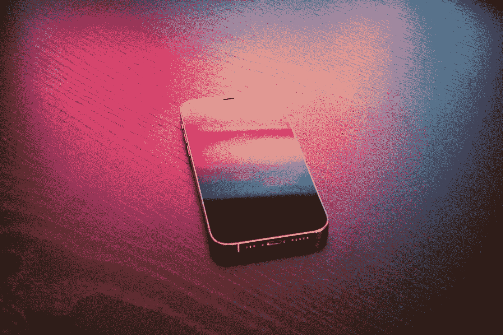
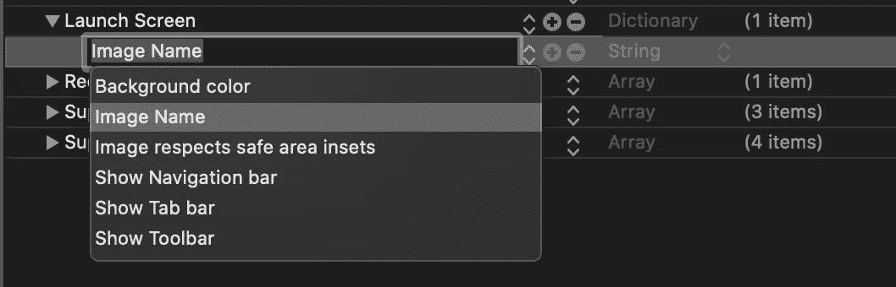
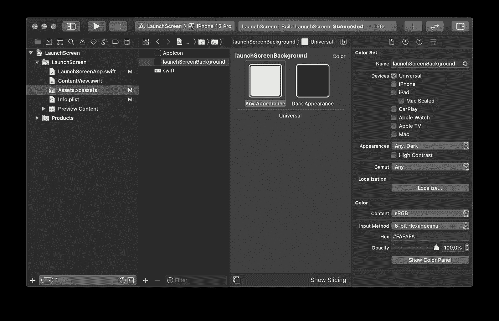
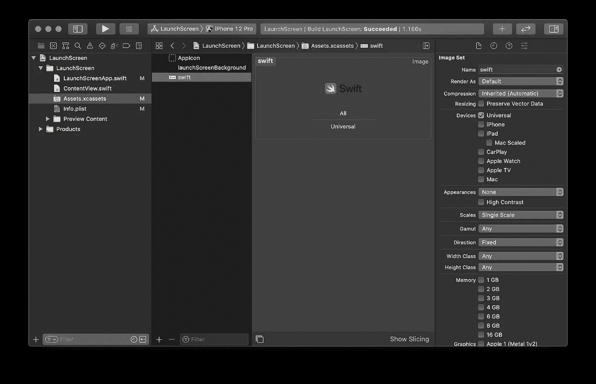
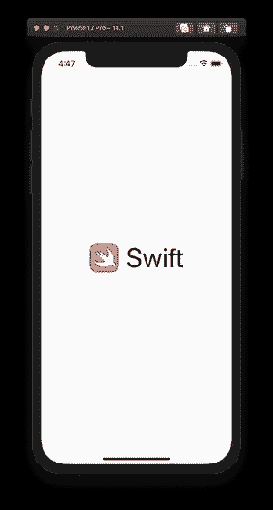

# 如何用 SwiftUI 构建启动屏幕

> 原文：<https://betterprogramming.pub/launch-screen-with-swiftui-bd2958771f3b>

## 在应用程序中使用专业的启动屏幕，给人留下深刻的第一印象

马丁·桑切斯在 [Unsplash](https://unsplash.com/?utm_source=medium&utm_medium=referral) 上拍摄的照片。

启动屏幕是用户在使用我们的应用时看到的第一个交互。这就是为什么投入时间让我们的应用程序启动屏幕感觉灵敏和视觉上有吸引力是很重要的。我们在玩“感知时间”，它可以给人留下很好的第一印象。

在 WWDC 2020 上，苹果推出了一种新的方法，使用 Xcode 12 在 iOS 14 中实现 SwiftUI 应用的启动屏幕。当我们创建一个新的 SwiftUI 应用程序时，这是制作启动屏幕的新方法。我们仍然可以在现有的应用程序中使用故事板启动屏幕的老方法。

# Info.plist 中的启动屏幕

所有的设置都在`Info.plist`文件中完成。我们可以看到字典类型有一个空的`Launch Screen`键。当我们按下加号按钮时，有几个选项:

现在，让我们来看一下所有这些选项，并了解如何使用它们来设置我们的启动屏幕。

# 背景颜色

首先，我们可以改变启动屏幕的背景颜色。这是资产目录中颜色名称的一个`String`值。默认情况下，iOS 使用`systemBackground`颜色。

让我们在资产目录中添加一个新的颜色集，并将其命名为`launchScreenBackground`:

然后我们可以向`Info.plist`文件中的`Launch Screen`字典添加一个新的`launchScreenBackground`键。现在，当我们运行应用程序时，我们会在启动屏幕上看到这个彩色背景。

# 背景图像

背景色设置好之后，让我们在它的前面展示一个图像。我们可以使用两个选项来进行配置:

*   `Image Name`是资产目录中的图像名称。
*   `Image respects safe area insets`是`Boolean`，描述图像是否需要尊重安全区域。如果是这样，它不会超出安全区边界。

假设我们在资产目录中有一个 Swift 徽标，它是一个 SVG 文件。在 Xcode 12 中，完全支持 SVG 图像(最终)。该图像的名称为`swift`:

现在我们可以使用`Image Name`键将图像添加到`Launch Screen`字典的`Info.plist`中。通过将`Image respects safe area insets`选项设置为`true`，我们可以确保它正确缩放，并且不会超出安全区域。该图像是 SVG 文件格式，可以完美缩放，而不会牺牲图像质量。

现在，当启动应用程序时，我们可以看到背景颜色和顶部的 Swift 徽标:

# 额外选项

我们可以使用几个其他选项来配置启动屏幕:

*   `Show Navigation bar` —用图像显示导航栏。
*   `Show Tab bar` —用图像显示标签栏。
*   `Show Toolbar` —用图像显示工具栏。

我们不会深入研究这些选项，因为大多数情况下，启动屏幕由背景颜色和图像组成。

# TL；速度三角形定位法(dead reckoning)

对于用户来说，启动屏幕的“感知时间”应该感觉很快。

在 WWDC 2020 大会上，苹果推出了一种新的方式，通过使用`Info.plist`和资产目录的功能，SwiftUI 应用程序可以创建启动屏幕。

故事板启动屏幕的老方法仍然工作得很好，但是我们可以假设它在将来可能会被废弃。

# 资源

*   [iOS 14 上的启动屏幕和 SwiftUI 应用生命周期](https://danielbernal.co/creating-a-launch-screen-with-swift-ui/)
*   [使用应用的信息列表自定义应用的启动屏幕](https://wwdcbysundell.com/2020/launch-screen-info-plist/)
*   [Xcode 中的启动屏幕:解释所有选项](https://www.avanderlee.com/xcode/launch-screen/)
*   [人机界面指南—启动屏幕](https://developer.apple.com/design/human-interface-guidelines/ios/visual-design/launch-screen/)
*   [投放启动故事板](https://useyourloaf.com/blog/dropping-launch-storyboards/)