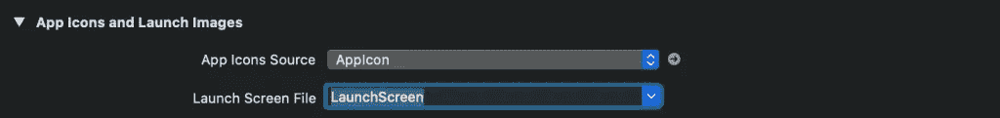
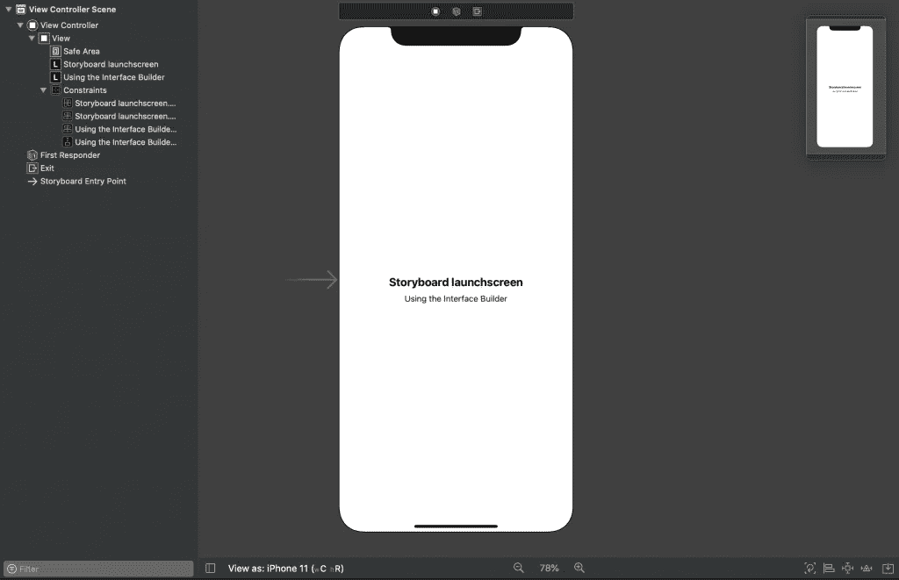
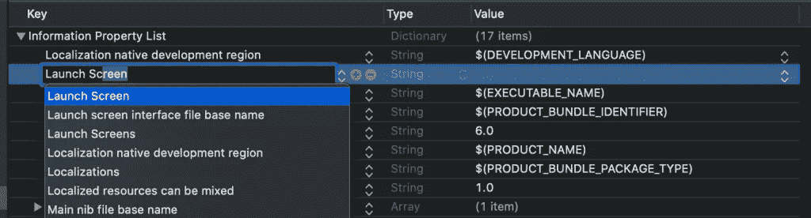
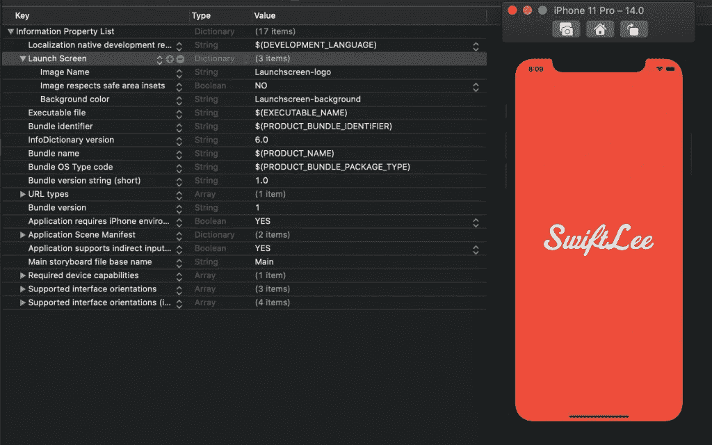
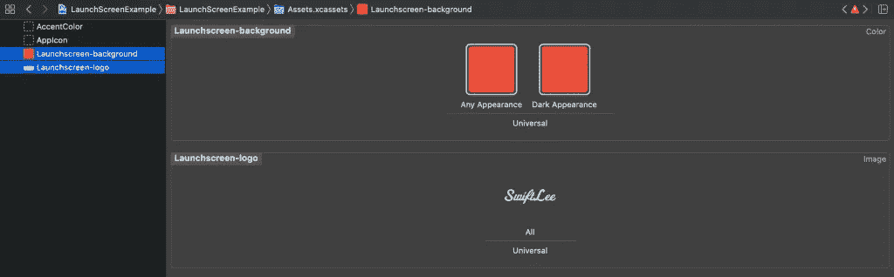
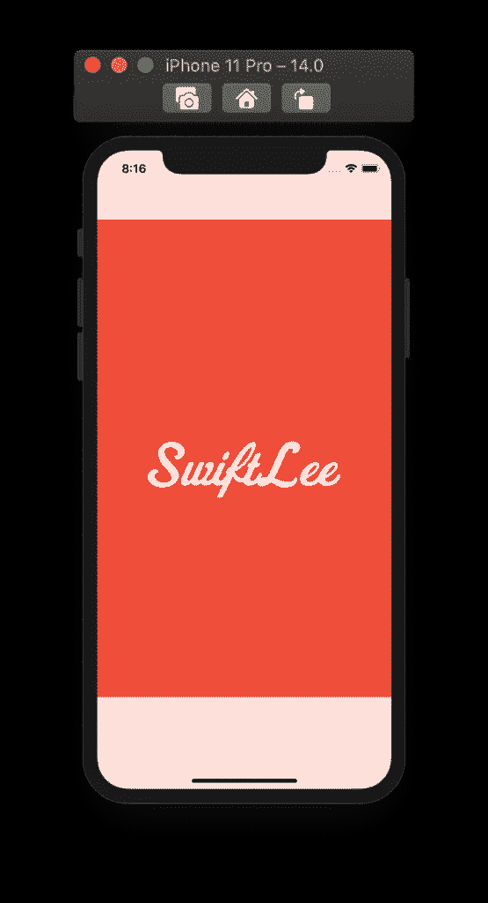
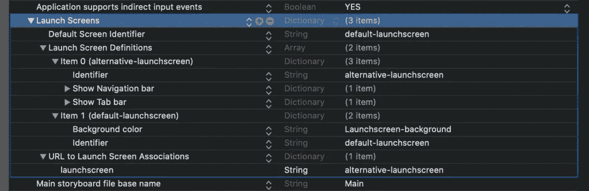

# Xcode 中的启动屏幕:解释了所有选项

> 原文：<https://betterprogramming.pub/launch-screens-in-xcode-all-the-options-explained-7a7a7992f535>

## 没有故事板的启动屏幕非常适合 SwiftUI

在 [Unsplash](https://unsplash.com?utm_source=medium&utm_medium=referral) 上由 [SpaceX](https://unsplash.com/@spacex?utm_source=medium&utm_medium=referral) 拍摄的照片。

当你的应用程序启动时，会出现启动屏幕，给用户一种你的应用程序速度快、响应快的印象。加载应用程序后，启动屏幕将替换为应用程序的第一个屏幕，用户可以开始使用应用程序。

默认情况下，Xcode 会创建一个故事板，您可以使用它来设置加载屏幕。虽然这在大多数情况下都很好，但 Xcode 12 和 iOS 14 中还有令人兴奋的新选项。

但是在我们开始之前，让我们看看我们是如何开始实现这一点的。

# 启动屏幕的历史

启动屏幕有相当长的历史。在 Xcode 6 之前，我们唯一的选择是在资产目录中提供静态图像。这已经比以前更好了，因为我们曾经为那些要显示的图像设置特定的文件名。

Xcode 6 自带的 iOS 8 允许我们用故事板文件替换静态图像。这已经简化并改进了我们定义加载屏幕的方式，但是选项仍然有限。启动屏幕被大量缓存，动态替换是不可能的。然而，使用标签、图像视图和其他界面元素消除了打开图像编辑应用程序来导出所有正确尺寸的图像的需求。

Xcode 12 和 iOS 14 改进了本文中描述的启动屏幕。

# 如何使用启动屏幕的指南

在我们深入研究如何和何时之前，最好了解一下启动屏幕的目的。做错很难，做好很容易。

当准备像启动屏幕这样的实现时，重温苹果的[人机界面指南](https://developer.apple.com/design/human-interface-guidelines/ios/visual-design/launch-screen/)总是好的。这些指导方针为你给用户留下良好的第一印象提供了方向和正确的开端。

在不引用指南中所有内容的情况下，我认为最重要的是理解几件事:

*   不鼓励使用文本，因为本地化不可用。
*   任何使用的图像都应该适合不同的屏幕尺寸。
*   屏幕应该尽可能靠近应用程序的首页。

最后一点给出了方向。你的闪屏越靠近你的第一页，你的应用程序的第一印象就越平滑。

# 开发期间清除缓存

如果我开始在这里分享可能的实现，我打赌你会遇到启动屏幕不更新的情况。iOS 将您的加载视图缓存为图像，以提高性能。因此，我想给你一些关于如何清除缓存的提示，以确保你在花几个小时找出你的设置有什么问题之前看到一个更新的屏幕。

在 iOS 14 上测试的大多数情况下，我都看到屏幕正确更新。但是，如果没有，您可以尝试以下方法之一:

*   使用`Product ➞ Clean Build Folder`清理您的构建文件夹。
*   从模拟器中删除应用程序，然后重新安装。

作为最后的手段，你可以重置模拟器。然而，这既费时又不会让你真正有效率。Gui 兰博提供了另一个未记录在案的技巧，这个技巧没有在 iOS 14+上测试过，但可能也能工作:

您可以从您的`didFinishLaunchingWithOptions`方法中调用这个方法。但是，请确保您只在开发过程中启用这段代码。

# 添加睡眠以延迟应用程序的启动

是的，你没看错。在开发启动屏幕的过程中，添加一个延迟会很有用，这样你就可以花更长的时间来查看你实现的设计。如果你的应用程序启动速度很快，它的启动屏幕可能只会出现不到一秒钟。

我在开发过程中使用了以下代码，所以我可以花两秒钟来验证我的实现:

# 实现启动屏幕的选项

既然您已经了解了关于启动屏幕的所有必需信息，那么是时候深入了解 Xcode 12 及更高版本中的可用选项了。有两种实现启动屏幕的方法:

1.  使用故事板(默认)。
2.  使用一个`plist`配置，你可以设置一个图像，启动图像是否应该考虑安全区域的插入，背景颜色，导航栏的可见性，标签栏的可见性，工具栏的可见性，以及每个 URL 方案的启动屏幕配置。

配置选项列表`plist`是 Xcode 12 中的新功能，它允许你在不使用故事板的情况下设置启动屏幕。这对于 SwiftUI 应用程序来说是很棒的，因为在 swift ui 应用程序中，仍然有一个故事板文件作为你的“启动页面”有点难看

## 使用故事板文件

从 Xcode 6 开始，这是默认的可用选项，与使用界面构建器构建视图非常相似。

打开在应用目标的“常规”选项卡中配置的`LaunchScreen.storyboard`文件:

Xcode 中的启动屏幕故事板配置

在这里，您可以像使用界面构建器构建视图一样构建故事板:

界面生成器中配置的启动屏幕。

## 使用 plist 配置

另一个选择是使用`plist`配置，随着 SwiftUI 取代故事板(在这里扮演上帝)，这很可能是构建启动屏幕的未来。

只有在显示原始键的情况下，移除名为“启动屏幕界面文件基本名称”或`UILaunchStoryboardName`的故事板键，此配置才会生效。

一旦你开始在你的`Info.plist`文件中配置你的启动屏幕，你会发现发现选项很容易，因为它们会在添加新密钥时列出。首先添加一个名为“启动屏幕”的新键`UILaunchScreen`:

在 info.plist 文件中配置启动屏幕。

在这个字典中，您可以设置可用选项的组合。这意味着您可以设置背景颜色和图像:

组合图像和背景色。

背景图像和颜色在资产目录中配置:

背景颜色和图像的资产目录配置。

我使用的是[单尺度 SVG 图像](https://www.avanderlee.com/xcode/svg-image-assets/)，它可以自动调整不同的屏幕尺寸。

在同一个配置字典中，我们可以切换导航栏、选项卡栏和工具栏的可见性。这可能会导致以下输出:

带有导航栏和标签栏的启动屏幕示例。

如果我的应用程序的第一个屏幕同时显示标签栏和导航栏，这将是一个很好的加载屏幕。过渡将会是平稳和自然的！

# 根据 URL 方案配置启动屏幕

Xcode 12 附带的另一个新选项是可以为每个 URL 配置不同的加载屏幕。如果你的应用程序使用[自定义 URL](https://developer.apple.com/documentation/uikit/inter-process_communication/allowing_apps_and_websites_to_link_to_your_content/defining_a_custom_url_scheme_for_your_app)来深度链接到你的应用程序，你可能会发现根据方案调整加载屏幕是很有用的，这样你的应用程序才能平稳过渡。

你可以用 [RocketSim](https://www.avanderlee.com/workflow/rocketsim-simulator-recording/) 测试你的深度链接和通用链接，快速迭代，提高生产力。

您可以配置以下选项:

*   默认启动屏幕
*   根据 URL 方案启动要使用的屏幕

例如，只显示`launchscreen://` URL 方案的选项卡和导航栏:

多个启动屏幕的配置示例

这个键叫做`UILaunchScreens`,名为“启动屏幕”,要求你提供一个默认配置、启动屏幕定义和 URL 关联。

URL 关联在字典中定义，关键字设置为 URL 方案。像`launchscreen://`这样的 URL 方案被定义为`launchscreen`。该值应该与启动屏幕定义的标识符相匹配。

# 结论

启动屏幕有改进的历史，Xcode 12 为这个故事增添了新的篇章。为每个 URL 方案定义不同的启动屏幕，切换工具栏的可见性，并在您的`info.plist`中定义一个配置，这样就不需要启动屏幕故事板了。

感谢阅读！