# 使用 ERC-721 智能合同启动您的 NFT 项目

> 原文：<https://betterprogramming.pub/launch-your-nft-project-with-an-erc-721-smart-contract-dda2673c3ae8>

## 使用 Hashlips art generator、IPFS、Remix 和 Dapp 的全包式分步指南

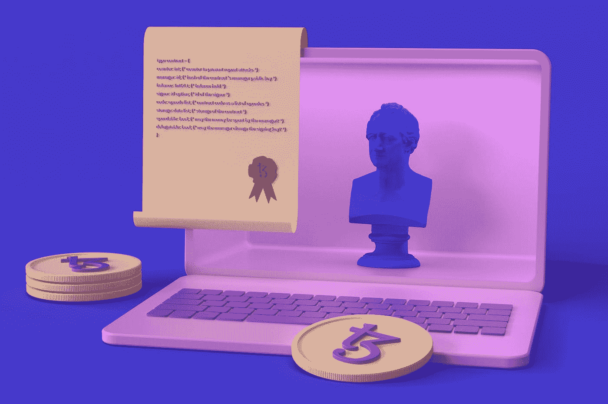

[泰佐斯](https://unsplash.com/@tezos?utm_source=medium&utm_medium=referral)在 [Unsplash](https://unsplash.com?utm_source=medium&utm_medium=referral) 拍摄的照片

现在网上有很多关于如何创造和打造你的 NFT 收藏的指南。但是当你不得不自己创造一切的时候，尤其是当你是一个艺术家的时候，这就变得很棘手了。

我为那些团队中没有开发人员，但仍然希望使用自己的智能合同启动 NFT 项目的人准备了本指南，与直接通过市场或使用“即用型”服务相比，智能合同更加可靠和灵活。

# 1.艺术

首先，你需要艺术。如果你是一名艺术家——我不需要告诉你这种艺术是如何被创造出来的。如果你不是——就用 Photoshop、Figma 或 Procreate。我个人使用生育，这是相当可怕的。所有你需要的是画一些层。层数越多，你的收藏就越独特。

# 2.NFT 一代

目前在这个领域中，NFT 一代最好的工具之一是由 hash lips[现在，打开 VS 代码终端，运行`npm run generate`。这将生成您的收藏并将其放在`build`文件夹中。在这里你会找到`images`和`json`文件夹。在下一节中，我们需要将它们部署到 IPFS。](https://medium.com/u/d29e80626c41#50 添加到您的收藏中来增加稀有性。png 文件名。例如，背景黑#50 将是背景红#100 的两倍。</p><p id=)

[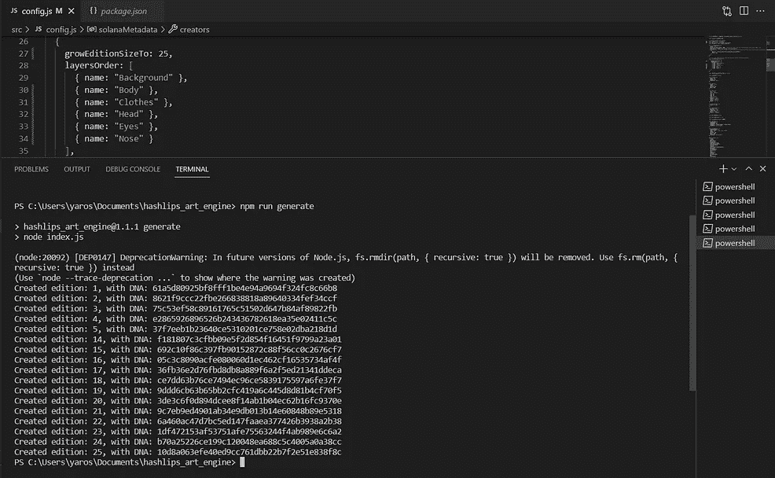](https://medium.com/u/d29e80626c41#50 添加到您的收藏中来增加稀有性。png 文件名。例如，背景黑#50 将是背景红#100 的两倍。</p><p id=)[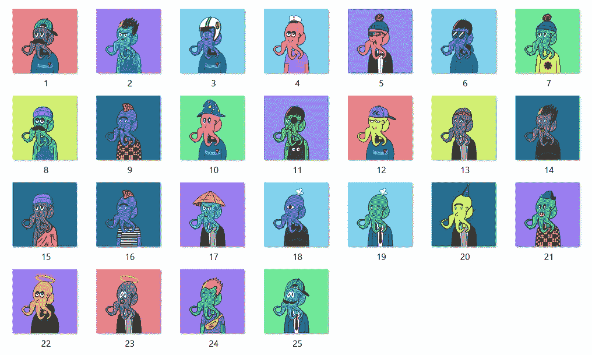](https://medium.com/u/d29e80626c41#50 添加到您的收藏中来增加稀有性。png 文件名。例如，背景黑#50 将是背景红#100 的两倍。</p><p id=)[](https://medium.com/u/d29e80626c41#50 添加到您的收藏中来增加稀有性。png 文件名。例如，背景黑#50 将是背景红#100 的两倍。</p><p id=)

# [3.部署到 IPFS](https://medium.com/u/d29e80626c41#50 添加到您的收藏中来增加稀有性。png 文件名。例如，背景黑#50 将是背景红#100 的两倍。</p><p id=)

[IPFS 是一个分布式系统，用于存储和访问文件、网站、应用程序和数据。与集中式数据存储相比，IPFS 的主要优势是可以从不受一个组织管理的多个位置下载文件。](https://medium.com/u/d29e80626c41#50 添加到您的收藏中来增加稀有性。png 文件名。例如，背景黑#50 将是背景红#100 的两倍。</p><p id=)

[去](https://medium.com/u/d29e80626c41#50 添加到您的收藏中来增加稀有性。png 文件名。例如，背景黑#50 将是背景红#100 的两倍。</p><p id=)[https://ipfs.io/](https://ipfs.io/)下载 IPFS 桌面应用。

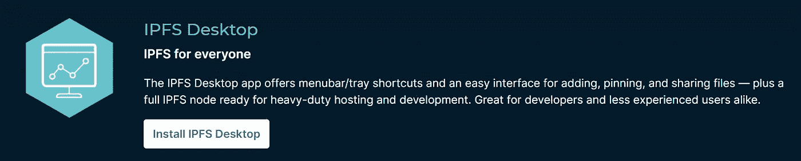

转到文件选项卡，然后按导入按钮。这将上传你的图像文件夹到 IPFS。我们需要复制 CID 并进入我们的艺术生成应用程序。

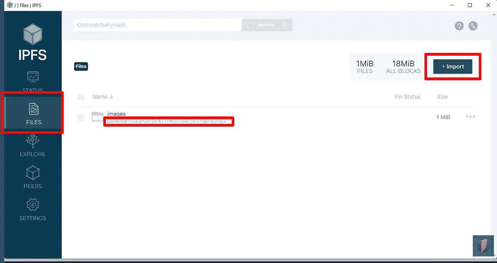

IPFS 桌面应用程序

将`config.json`中的这一行替换为您新获得的图像文件夹的 CID。

```
const baseUri = "ipfs://QmRXh4mEZ1uKaPLGzjhrk1zTMCWJJb9UjXcE7qDrmGFxGx";
```

然后到 VS 代码终端运行`npm run update_info` 脚本。这将重新生成元数据文件，并更新每个 JSON 文件的 IMG URL。这将是未来像 https://opensea.io/这样的市场正确展示你的 NFT 所需要的。

在我们更新了我们的元数据之后——让我们回到 IPFS 应用程序并将`json` 文件夹上传到 IPFS。

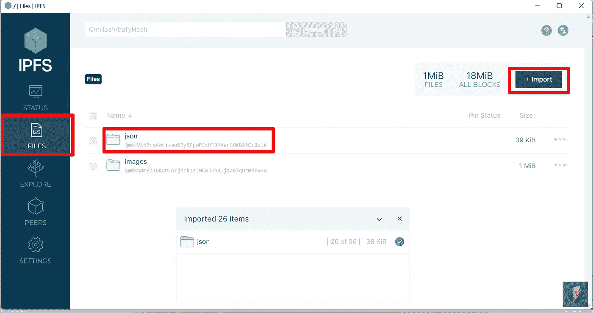

IPFS 桌面应用程序

现在，我们准备创建我们的第一个智能合同！

# 4.智能合同 ERC-721

转到 [Hashlips git repository](https://github.com/HashLips/solidity_smart_contracts/blob/main/contracts/NFT/NFT.sol) 并复制智能合约的代码。

转到 [Remix IDE](https://remix.ethereum.org/) 并在`contracts`文件夹中创建一个新文件。

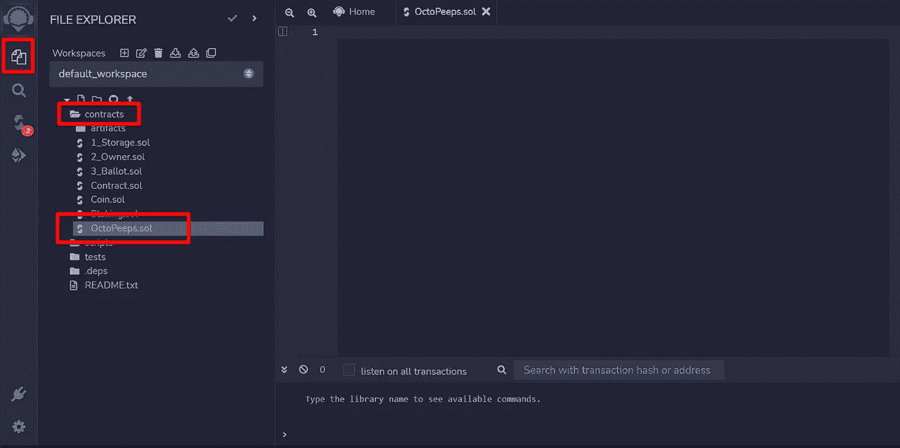

混合 IDE

复制智能[合同代码](https://github.com/HashLips/solidity_smart_contracts/blob/main/contracts/NFT/NFT.sol)并将其粘贴到您的`.sol`文件中。

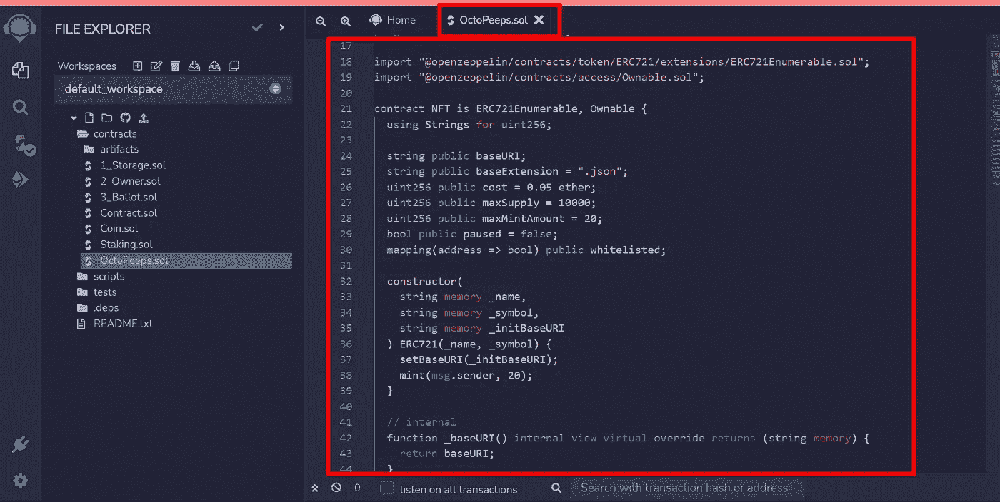

混合 IDE

更改这些变量以满足您的收集要求。你不能再改变`maxSupply` 了，但是你可以改变 NFT 成本。

```
uint256 public cost = 0.05 ether; // Cost of your NFTuint256 public maxSupply = 10000; // Collection Amountuint256 public maxMintAmount = 20; // Max mint amount for 1 wallet
```

进入**实体编译器**选项卡，按下**编译按钮**。这将为我们的部署合同做准备。

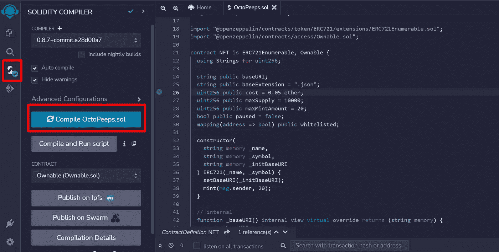

混合 IDE

在 Metamask wallet 上启用测试网络。我们将使用 Rinkbey 网络。

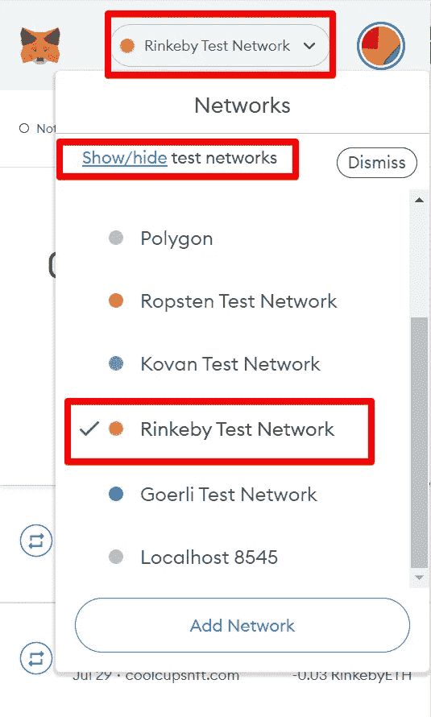

元掩码扩展

> 在将智能合约部署到主网络之前，必须将其部署到测试网络，如 Rinkeby，以确保一切正常运行——你可以在市场上看到 NFTs，你可以铸造 NFT，你可以从智能合约中提取资金。

转到 Remix 编辑器的部署和运行事务选项卡，并执行以下操作:

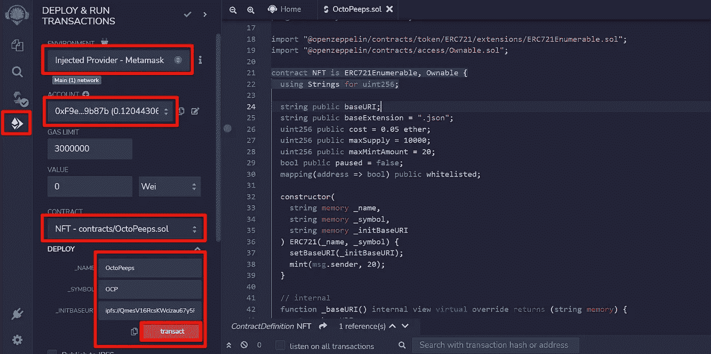

*   选择环境-注入提供元掩码
*   默认情况下，应选择元掩码帐户。这个沃勒将是合同的所有者。为了能够将它部署到区块链的林克比，你需要一些钱。你可以在这里买到 ETH 的测试赛车——https://faucets.chain.link/rinkeby。
*   在合同下拉列表中选择您的合同
*   转到部署部分并打开它。您将看到 3 个字段:`_NAME`、`_SYMBOL`和`_INTBASEURI` —您应该像上面的截图一样用您的收集数据填充它们。`Name`是你的收藏名称，`Symbol`是你在区块链上的令牌符号，`BaseUri` —是你在 IPFS 上的 JSON 文件夹的链接。

> 非常重要的是，您要以这样的格式添加它——ipfs://qmesv 16 rcskwcizau 67y 5 fpwpjchfbnaarc 8 KD 25 ci 8 eik/

按下**交易**按钮——这将打开你的 Metamask 钱包，你应该**确认**交易。

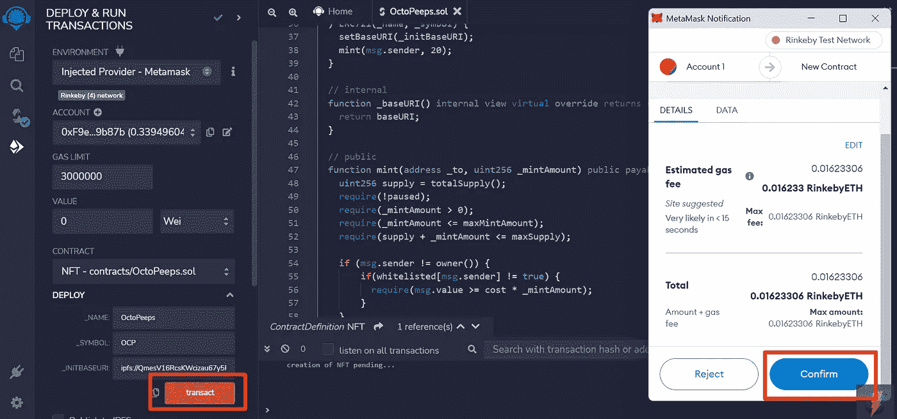

混合 IDE

瞧啊。你的第一份智能合同在区块链[上](https://rinkeby.etherscan.io/tx/0x8729c957353e3676651acb2bac0899af70fa5ba496bc551e084b490d2c457283)。

> 要将其部署到主区块链网络，您只需将 metmask 钱包网络更改为以太坊或多边形。

# 5.创建 DAPP

分散式应用程序(DApp、Dapp、dapp 或 dApp)是一个可以自主运行的[应用程序](https://en.wikipedia.org/wiki/Application_software)，通常通过使用[智能契约](https://en.wikipedia.org/wiki/Smart_contracts)，它运行在[分散式计算](https://en.wikipedia.org/wiki/Decentralized_computing)、[区块链](https://en.wikipedia.org/wiki/Blockchain)或其他分布式总账系统上。

我们将使用由 [Hashlips](https://medium.com/u/d29e80626c41?source=post_page-----dda2673c3ae8--------------------------------) 提供的[牛逼解决方案](https://github.com/HashLips/hashlips_nft_minting_dapp)。

只需克隆或者下载一个 ZIP 文件，用 [VS 代码](https://code.visualstudio.com/)从根文件夹打开项目。然后在项目的终端中运行`npm install`。

运行 npm 运行开始，您将看到这个神奇的应用程序:

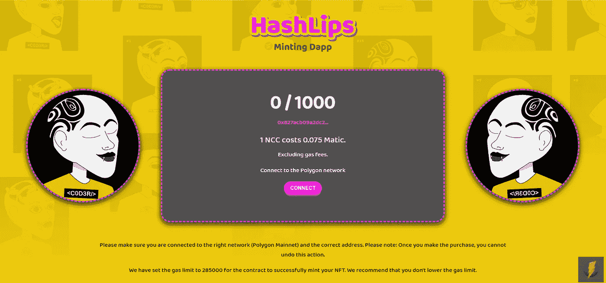

Hashlips 铸造 Dapp

> 您可以更改背景和图像，也可以调整样式以匹配您的收藏主题。

转到`hashlips_nft_minting_dapp\public\config\config.json`文件，更新您的收藏和网络设置。确保设置正确的合同地址、网络名称、符号和 id。集合名称、符号和最大供应量应与我们最近部署的智能合同中的数据相匹配。重要的是从魏的 Dapp 中设定正确的 NFT 价格。你可以在这里把 ETH 转换成魏——[](https://eth-converter.com/)****。****

**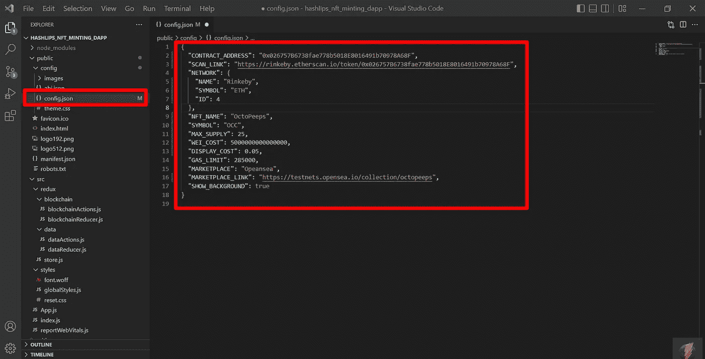**

**Hashlips Dapp 配置文件**

**我们准备从我们的 Dapp 铸造我们的第一个 NFT！在此之前，我们必须修复项目中的一行代码。**

**转到`hashlips_nft_minting_dapp\src\App.js`文件，通过简单地添加`blockchain.account`作为 mint 函数的第一个参数，修复第 133 行的代码。并按 CTRL-S 保存您的更改。**

```
.mint(blockchain.account, mintAmount)
```

**现在你可以用你的 Dapp 铸造一个 NFT 了！**

**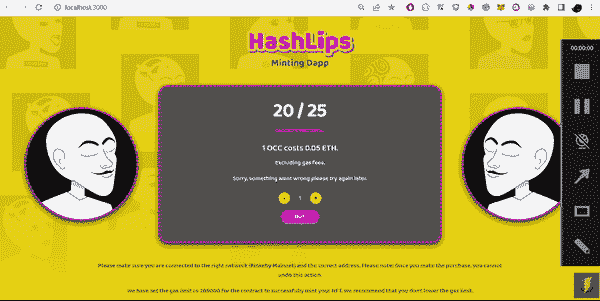**

**Hashlips 铸造 Dapp**

**过一会儿，你制作的 NFT 将会出现在 Opensea 上。在这种情况下在[https://testnets.opensea.io/collection/octopeeps](https://testnets.opensea.io/collection/octopeeps)上。区块链捕获所有影像和元数据可能需要一些时间。所以，不用担心。**

# **6.部署 DAPP**

**首先，您需要将本地代码添加到 Github 存储库中。转到[https://github.com/new](https://github.com/new)并创建您的远程存储库。然后将您的本地代码推送给它。如果你不熟悉 Github，请跟随这些[文档](https://docs.github.com/en/get-started/importing-your-projects-to-github/importing-source-code-to-github/adding-locally-hosted-code-to-github)。**

**我们将使用 Netlify 将我们的 Dapp 部署到生产中。进入 Netlify“从 Git 资源库导入现有项目”页面—【https://app.netlify.com/start ，将您的帐户连接到您的 Github 资源库。**

**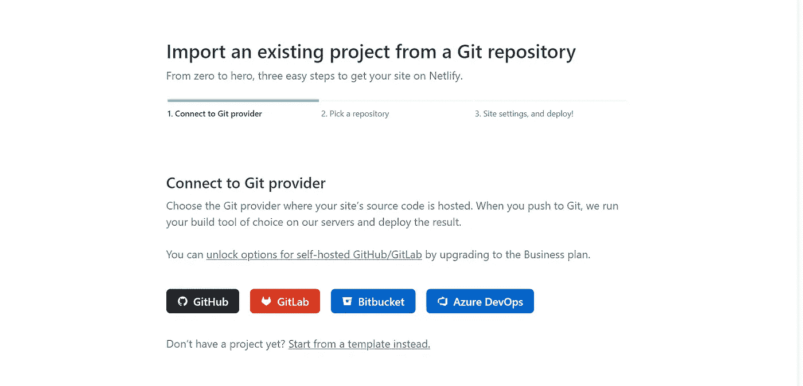**

**网络生活**

**选择您的 Github 存储库:**

**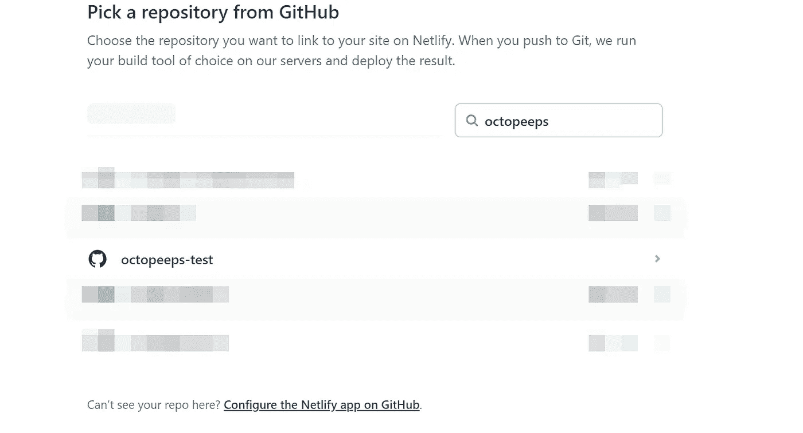**

**网络生活**

**接下来，选择分支名称(默认为 main)、构建命令(可能是“npm run build”或“yarn build”)和发布目录(默认为 build)。并按下**“部署地点”。****

**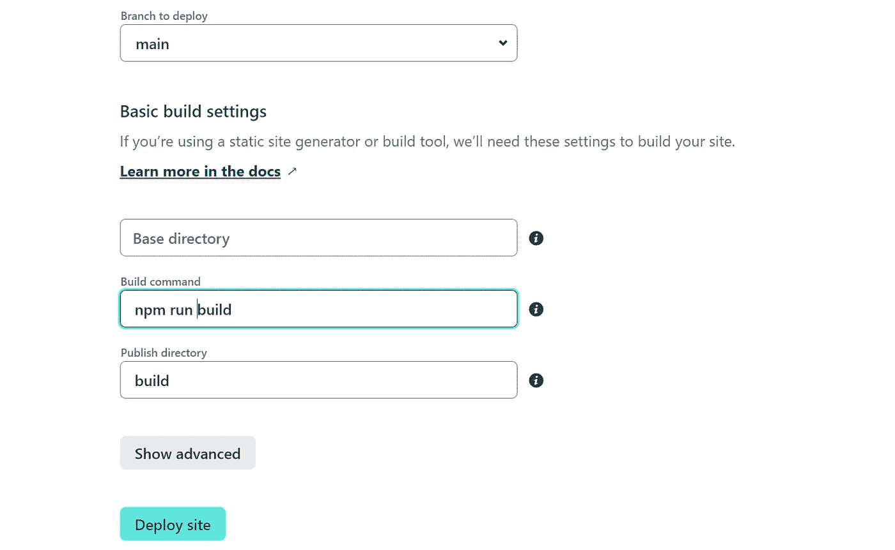**

**网络生活**

****宾果！您的网站现已上线！****

**[https://relaxed-stroopwafel-413e76.netlify.app/](https://relaxed-stroopwafel-413e76.netlify.app/)**

**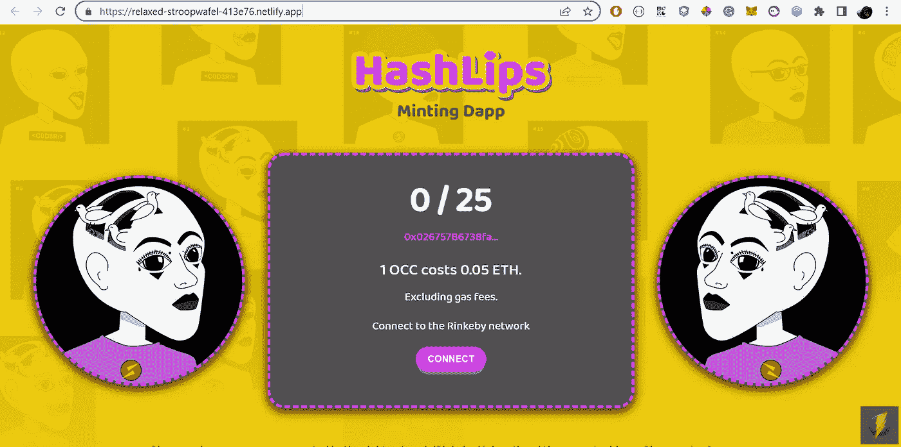**

**Hashlips 铸造 Dapp**

**本文到此为止！你现在有自己的区块链 NFT 收藏和一个铸造 Dapp，人们可以铸造你的 NFT，并成为你的真棒持有人！**

****如果您有任何问题，请通过社交网络联系我:****

*   **推特:[https://twitter.com/octo_peeps](https://twitter.com/octo_peeps)**
*   **不和:[https://discord.gg/MfMTwyP6b9](https://discord.gg/MfMTwyP6b9)**
*   **insta gram:[https://instagram.com/octo.peeps](https://instagram.com/octo.peeps)**
*   **https://www.tiktok.com/@octopeeps Tiktok**
*   **Opensea OctoPeeps 主要收藏:[https://opensea.io/collection/octopeeps](https://opensea.io/collection/octopeeps)**
*   **Opensea 章鱼卡通俱乐部:[https://opensea.io/collection/octopeeps-cartoon-club](https://opensea.io/collection/octopeeps-cartoon-club)**