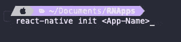
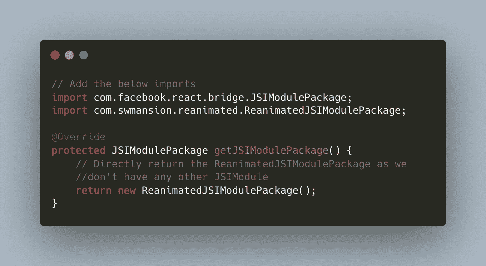
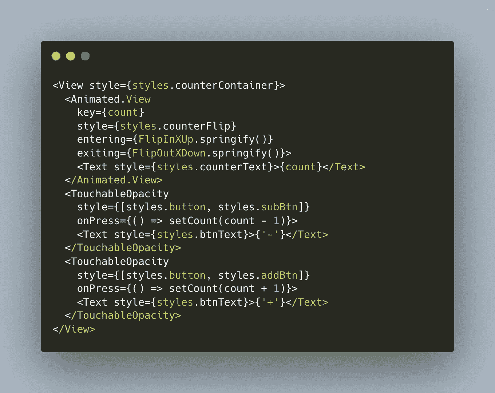
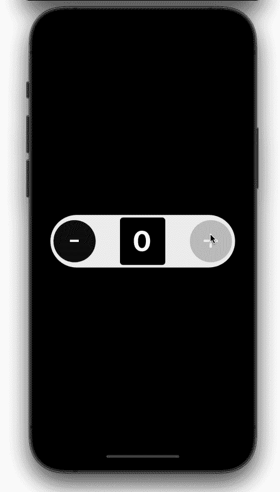
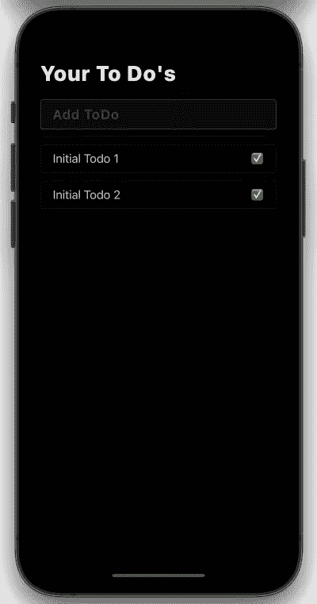
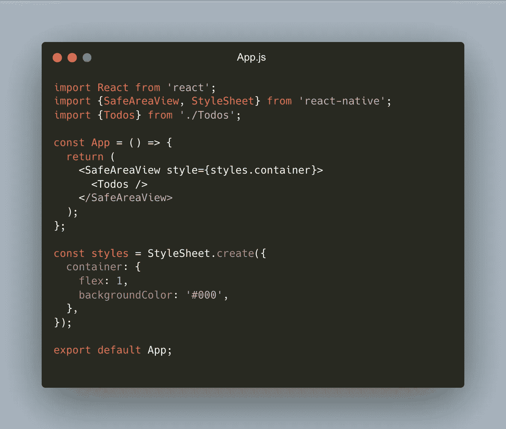
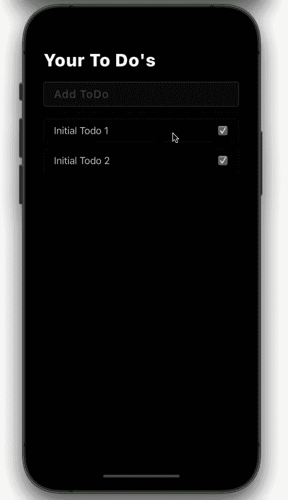

# 使用 React Native Reanimated 构建布局动画

> 原文：<https://betterprogramming.pub/layout-animations-with-react-native-reanimated-2-3-0-52da4bdc347e>

## 使用 react-native-reactive 2 . 3 . 0 库


照片由[劳塔罗·安德烈亚尼](https://unsplash.com/@lautaroandreani?utm_source=medium&utm_medium=referral)在 [Unsplash](https://unsplash.com?utm_source=medium&utm_medium=referral) 上拍摄

在本文中，我们将看到如何使用[React-Native-reanimated](https://docs.swmansion.com/react-native-reanimated/)库在 React Native 中实现布局动画。

React Native Reanimated 是一个动画库，它将我们在 Javascript 线程上声明的动画直接运行到 Native / UI 线程上。

在 React Native 中，组件立即呈现或出现在 UI 上，这与缓慢淡入或带有其他动画的内容相比，并不令用户满意。现在，由于新版 [2.3.0](https://docs.swmansion.com/react-native-reanimated/docs/) 的 reanimated，当组件进入或退出用户界面时，制作组件动画变得非常容易。他们引入了一种叫做[布局动画](https://docs.swmansion.com/react-native-reanimated/docs/fundamentals/layout_animations)的东西，它做的和听起来一模一样。使用这个我们现在可以指定当一个组件`Mounts` / `Enters`或者`Demounts` / `Exits`出现在屏幕上时应该出现哪种类型的动画。有很多预定义的动画可以用于`[Entering](https://docs.swmansion.com/react-native-reanimated/docs/api/LayoutAnimations/entryAnimations#predefined-animations)`和`[Exiting](https://docs.swmansion.com/react-native-reanimated/docs/api/LayoutAnimations/exitAnimations#predefined-animations)`动画。

我们将看到如何通过创建两个动画在 React 本地应用程序中实现布局动画:

*   动画翻转计数器
*   动画待办事项列表

下面是开始编码前您需要的先决条件:

*   react-原生版本=> 0.62+
*   React-Native-Reanimated => 2.3.0 或更高版本(因为布局动画是最近在 2.3.0 中引入的)

我们将从创建一个新的 react-native 项目开始，要创建一个新的 react-native 项目，请在您的终端中键入以下命令。

**你可以在这个** [**仓库**](https://github.com/hrupesh/LayoutAnimationsDemo) 中检查代码

> 在我写这篇文章的时候，最新的 react-native 版本是 0.67



然后将您当前的工作目录更改为我们刚刚创建的应用程序

```
cd <App-Name>
```

在终端中键入以下内容以安装 pods 并运行 iOS 项目:

```
cd ios
pod install
cd ..
yarn ios ``` 
Use Yarn if you have it installed and if 
not run [ npm run ios ]```
```

使用以下命令运行 android 项目:

```
yarn android
```

现在，我们的 iOS 和 Android 应用程序已经启动并运行，我们将安装 react-native-reanimated。由于这个库使用了 [TurboModules](https://github.com/react-native-community/discussions-and-proposals/issues/40) ，我们需要做一些额外的步骤来使它工作。

> Turbo 模块为初始化本机模块提供了一种新的架构。在应用程序运行时，TurboModules 会打开一个桥，以后允许 js 代码在第一次使用时初始化任何模块。

iOS 中的设置非常简单，因为他们不再使用 Turbomodules 来注册他们的模块。

在你的终端窗口中运行下面的命令来安装重新激活的软件包。

> 在我写这篇文章的时候，最新的版本是 2.3.1

```
yarn add react-native-reanimated```
Once installed cd into ios folder and install pods for RNReanimated
```
cd ios
pod install```
Now we just need to build the iOS app again
To do that either build from XCode or using below command
```
yarn ios
```

这就是我们在 iOS 项目中安装的 reanimated。

对于 android，我们需要采取一些额外的步骤:

首先，我们需要启用爱马仕；为此，转到应用程序级的`build.gradle`文件，并将`enableHermes`标志切换为真。


然后，我们需要在`getJSIModulePackage`方法中返回复活的 JSI 模块，为此，将下面的代码添加到您的`MainApplication.java`



现在，我们需要重新构建我们的 Android 应用程序，以反映原生变化

```
```
Either run the android app from android studio or type the command below ```
yarn android
```

既然 reanimated 已经正确地安装到我们的项目中，我们可以利用它来创建令人惊叹的动画。

我们将从创建一个简单的计数器开始，每当它的值改变时，它就翻转。

为了利用布局动画，我们有两个道具，它们将预定义的或 [*自定义创建的*](https://docs.swmansion.com/react-native-reanimated/docs/api/LayoutAnimations/customAnimations) 动画作为输入:

*   `entering`:组件安装到屏幕上时应该出现的动画。
*   `exiting`:组件从屏幕上卸下时应该出现的动画。

在本例中，我们将创建一个带有两个按钮[add 和 subtract]的计数器，它们的功能与听起来完全相同，并且`count`被包裹在一个`Animated`视图中，该视图会随着值的变化而翻转。

这是可能的，因为`React`中的`key`属性，所以我们只需要将计数值(它是对`key`属性的一个反应`state`)赋值，其余的将由`React`和`Reanimated`处理。当我们为它编写代码时，我们将看看它实际上是如何工作的。

将下面的代码粘贴到您的`App.js`文件中

```
import {
  Text,
  SafeAreaView,
  Button,
  View,
  StyleSheet,
  TouchableOpacity,
} from "react-native";
import React, { useState } from "react";
import Animated, {
  FlipInXUp,
  FlipOutXDown,
  SlideInDown,
  SlideOutUp,
} from "react-native-reanimated";const App = () => {
  const [count, setCount] = useState(0);
  return (
    <SafeAreaView style={styles.container}>
      <View style={styles.counterContainer}>
        <Animated.View
          key={count}
          style={styles.counterFlip}
          entering={FlipInXUp.springify()}
          exiting={FlipOutXDown.springify()}
        >
          <Text style={styles.counterText}>{count}</Text>
        </Animated.View>
        <TouchableOpacity
          style={[styles.button, styles.subBtn]}
          onPress={() => setCount(count - 1)}
        >
          <Text style={styles.btnText}>{"-"}</Text>
        </TouchableOpacity>
        <TouchableOpacity
          style={[styles.button, styles.addBtn]}
          onPress={() => setCount(count + 1)}
        >
          <Text style={styles.btnText}>{"+"}</Text>
        </TouchableOpacity>
      </View>
    </SafeAreaView>
  );
};export default App;const styles = StyleSheet.create({
  container: {
    flex: 1,
    justifyContent: "center",
    alignItems: "center",
    backgroundColor: "#000",
  },
  counterContainer: {
    height: 100,
    backgroundColor: "#EEE",
    width: "90%",
    justifyContent: "center",
    alignItems: "center",
    borderRadius: 100,
    marginBottom: 8,
    overflow: "hidden",
    paddingVertical: 8,
  },
  counterText: {
    color: "#FFF",
    fontWeight: "bold",
    fontSize: 54,
    letterSpacing: 2,
    lineHeight: 64,
  },
  button: {
    position: "absolute",
    backgroundColor: "#111",
    borderRadius: 40,
    height: 80,
    width: 80,
    justifyContent: "center",
    alignItems: "center",
  },
  subBtn: { left: 6 },
  addBtn: { right: 6 },
  btnText: {
    color: "#FFF",
    fontWeight: "400",
    fontSize: 54,
    lineHeight: 56,
  },
  counterFlip: {
    backgroundColor: "#000",
    paddingHorizontal: 24,
    justifyContent: "center",
    alignItems: "center",
    height: 90,
    borderRadius: 6,
  },
});
```

一旦你粘贴了代码，你会看到我们有`Animated.View`一个组件，它有`Text`一个显示`count`值的组件。主要代码在这里:



我们已经使用`count`作为`View`的`key`，所以当我们增加或减少`count`值时，组件的`key`也会改变，这导致组件的拆卸，并使用新的`key`值安装另一个组件。

我们将`FlipInXUp`用作`entering`动画，将`FlipOutXDown`用作`exiting`动画，并且我们还对它们使用了`springify`方法，这样我们就为我们的反视图获得了一个有弹性的动画。

我们的最终输出将是:



现在计数器已经完成，我们可以进入`Animated`待办事项列表组件。

这将是一个非常简单的待办事项列表，只有删除和添加待办事项功能。如果你愿意，你可以添加更多的功能。

我们将设计的用户界面如下所示:



让我们首先为 Todo 创建一个组件，根据您的可访问性创建一个`Todos.tsx`或`Todos.js`文件。此外，删除我们在`App.js`中为`Counter`编写的所有代码(将`counter`组件移动到单独的文件),并将以下代码粘贴到其中。



> 我们还没有创建`Todos`组件

将以下代码粘贴到您的`Todos.tsx`文件中

```
import React, { useState } from "react";
import { ScrollView, StyleSheet, Text, TextInput, View } from "react-native";
import Animated, {
  Easing,
  FadeInDown,
  Layout,
  SlideOutLeft,
} from "react-native-reanimated";type Todo = {
  id: number,
  text: string,
};export const Todos: React.FC = () => {
  const [todos, setTodos] = useState<Todo[]>([
    { id: 1, text: "Initial Todo 1" },
    { id: 2, text: "Initial Todo 2" },
  ]);
  const [text, setText] = useState < string > ""; const removeTodo = (id: number) => {
    setTodos(todos.filter((todo) => todo.id !== id));
  }; const addTodo = () => {
    if (text?.trim()) {
      setTodos([...todos, { id: todos?.length + 1, text }]);
      setText("");
    }
  }; return (
    <ScrollView
      contentContainerStyle={styles.container}
      keyboardDismissMode="on-drag"
      keyboardShouldPersistTaps={"always"}
    >
      <Text style={styles.header}>Your To Do's</Text>
      <View style={styles.separator} />
      <TextInput
        style={styles.todoInput}
        blurOnSubmit={false}
        placeholder={"Add ToDo"}
        placeholderTextColor={"#444"}
        value={text}
        onChangeText={setText}
        onSubmitEditing={addTodo}
      />
      <View style={styles.separator} />
      {todos.map((todo, index) => (
        <Animated.View
          key={todo.id}
          style={styles.todo}
          entering={FadeInDown}
          layout={Layout.easing(Easing.bounce).delay(index * 100)}
          exiting={SlideOutLeft}
        >
          <Text style={styles.todoText}>{todo.text}</Text>
          <Text onPress={() => removeTodo(todo?.id)}>{"✅"}</Text>
        </Animated.View>
      ))}
    </ScrollView>
  );
};const styles = StyleSheet.create({
  container: {
    paddingVertical: 14,
    paddingHorizontal: 18,
  },
  header: {
    fontSize: 32,
    fontWeight: "800",
    color: "#fff",
    letterSpacing: 1.2,
  },
  separator: {
    height: StyleSheet.hairlineWidth,
    backgroundColor: "#444",
    marginTop: 10,
  },
  todo: {
    paddingVertical: 10,
    paddingHorizontal: 18,
    borderWidth: StyleSheet.hairlineWidth,
    borderColor: "#444",
    borderRadius: 4,
    marginTop: 12,
    flexDirection: "row",
    justifyContent: "space-between",
    alignItems: "center",
  },
  todoText: {
    fontSize: 18,
    fontWeight: "400",
    color: "#ccc",
  },
  todoInput: {
    paddingVertical: 10,
    paddingHorizontal: 18,
    borderWidth: StyleSheet.hairlineWidth,
    borderColor: "#bbb",
    backgroundColor: "#111b",
    borderRadius: 4,
    marginTop: 10,
    color: "#fff",
    fontSize: 20,
    fontWeight: "600",
    letterSpacing: 1.4,
  },
});
```

现在让我们看看我们在这里实际做了什么:

*   我们已经用一个`ScrollView`包装了组件，在这里列出了所有的待办事项
*   然后我们有`TextInput`来修改我们的`state`值`text`，它被用来添加一个新的 Todo，当一个用户从那个输入提交时，我们就把那个`Todo`对象添加到我们的`todos`数组中。
*   我们已经映射了`todos`数组，在`ScrollView`中列出了`todos`，然后我们在`Animated.View`组件中呈现了`Todo`。
*   `Animated.View`组件是所有魔法发生的地方，你一定已经注意到我们已经引入了一个名为`layout`的新道具，这个道具负责在布局有任何变化时触发任何动画，就像在我们的情况下，如果任何`Todo`被删除，那么所有剩余的待办事项，特别是它下面的那些将改变它们的布局，然后我们用`Easing`反弹功能来制作它的动画，并且我们对`index * 100`的每个项目都有延迟，这是为了实现涟漪效应，以便每个组件在另一个之后被制作成动画`100ms` 。

> 注意:不要在大列表中使用`index * 100`中的`delay`,因为这可能会导致许多秒的延迟

*   此外，我们还有“✅”文本，按下它会删除指定的`Todo`对象

就这样，我们创建了一个动画待办事项列表，没有任何其他特定于动画的代码。

输出将是这样的:



因此，现在我们对布局动画如何反应原生动画有了一个工作理解，以及我们如何在不编写太多代码的情况下轻松实现它们。这是一个强大的功能，将改变我们在 React Native 中的动画方式。