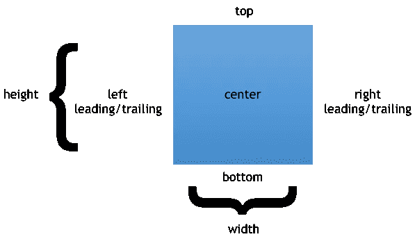
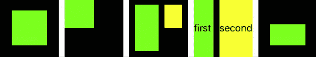

# 代码中的约束 SwiftUI 的不同布局选项

> 原文：<https://betterprogramming.pub/layout-aside-from-swiftui-92aaa542c6c4>

## **NSLayoutConstraints vs . snap kit vs . Visual Format Language**

[邓阳](https://unsplash.com/@palon?utm_source=unsplash&utm_medium=referral&utm_content=creditCopyText)在 [Unsplash](https://unsplash.com/s/photos/layout?utm_source=unsplash&utm_medium=referral&utm_content=creditCopyText) 上的照片

随着 iOS 13 的推出，开发者现在可以开始在他们的应用中使用 SwiftUI 了。但也许你不是那种可以在一片绿地上起步，需要支持比最新 iOS 版本更多的东西的幸运儿。

无论你是在开发一个已经开发了多年的大型应用程序，还是你的用户仍然主要在 iOS 12 上，都有很多很好的理由说明 UIKit 在未来一年左右仍然是相关的。

在故事板或 xib 中使用`NSLayoutConstraints`也是相当痛苦的，因为文件会变得很大很混乱，需要的约束也越多。如果您使用版本控制，您将会诅咒当前版本和新版本之间的每一个令人困惑的差异，并且讨厌合并冲突。

那么，如果 SwiftUI 还不是一个好的解决方案，故事板也不适合所有人，那么剩下的是什么呢？嗯，仍然可以选择在代码中使用`NSLayoutConstraints`,或者使用可视化格式语言 Apples DSL 来布局视图。

本教程将向您介绍这两者，并将它们与 [SnapKit](https://github.com/SnapKit/SnapKit) 进行比较，后者是一个可通过 [CocoaPods](https://cocoapods.org/) 获得的框架，使在代码中使用约束更具吸引力。

# 视图的结构

但是在我们深入例子之前，让我们首先探索视图的结构:

给定蓝色框作为视图，它有一个中心点、顶部和底部，以及左侧和右侧。

您也可以通过 leading 和 trailing 来引用后两者，但是有一个很小但很重要的区别:left 将始终是视图的左侧，而 leading 将是阅读方向的起始端。

类似地，右始终是右，尾随是视图在阅读方向上的结束。此外，视图有宽度和高度。

您可以通过使用`NSLayoutAnchors`来引用这些属性。x 轴有锚(所谓的`NSLayoutXAxisAnchors`)，包含`leadingAnchor`、`trailingAnchor`、`leftAnchor`、`rightAnchor`、`centerXAnchor`。

y 轴的锚点(`NSLayoutYAchsisAnchors`)，分别是`topAnchor`、`bottomAnchor`、`firstBaselineAnchor`、`lastBaselineAnchor`和`centerYAnchor`。

两个基线锚将用于`UITextViews`。此外，还有两个`NSLayoutDimensions`、`widthAnchor`和`heightAnchor`，以及`UILayoutGuides`、`layoutMarginsGuide`、`readableContentGuide`和`safeAreaLayoutGuide`，它们是在 iOS 11 中引入的，用于处理没有 home 键的 iPhones 上的 ui。

所有这些锚点、尺寸和引导允许我们在屏幕上完全指定视图的位置和大小。

# 例子

为了比较上面提到的在代码中创建约束的三个选项，我们将看五个用例，它们可以在下面的 GIF 中看到。

1.  在视图的超级视图中定位视图。
2.  更改视图的大小。
3.  相对于另一个视图定位视图。
4.  处理冲突和使用优先级。
5.  动画变化。

首先，我们将探索如何用 plain `NSLayoutConstraints`来做这些事情。在下一节中，我们将了解 SnapKit 如何帮助我们改进代码，最后，我们将了解如何使用可视化格式语言。

# 添加 NSLayoutConstraints

让我们从第一个例子开始:如何在其超级视图中定位一个视图。

但是在动手之前，我们需要创建并准备一个超级视图和一个子视图，并将其添加到超级视图中。对于我们要看的每个例子，这个设置都是一样的。

`// 1` —我们创建一个白色背景的简单二次视图。此视图将用作超级视图，它将包含所有其他视图。

`// 2` —我们创建一个新视图，这次用绿色来区分它和它的超级视图。我们还需要将它的`translatesAutoresizingMaskIntoConstraints`属性设置为`false`，表明我们将使用自动布局和约束。

为了添加一个约束，我们使用一个视图的锚属性，我们已经在前面讨论过了。每个锚点都有一个约束方法来创建一个新的`NSLayoutConstraints`。

这个方法被传递给与约束相关的另一个锚点，以及其他一些参数。确保将新创建的约束的`isActive`属性设置为`true`，否则该约束不会对您的视图产生任何视觉效果。

使用 NSLayoutConstraints 在视图的 superview 中定位视图

在本例中，我们添加了一些约束条件，以将视图置于其超级视图的中心，每边距离为 20。我们使用子视图`topAnchor`、`leadingAnchor`、`bottomAnchor`和`trailingAnchor`，并将它们放置在被查看者的相应锚点旁边的 20 个点处。

虽然这很简单，但是完成这样一个简单的任务需要很多代码。

接下来，让我们改变子视图的大小！

使用 NSLayoutConstraints 调整视图大小

这一次，我们没有相对于超级视图的锚点来放置视图的锚点，而是将常量赋值给`heightAnchor`和`widthAnchor`。由于该职位不再有任何限制，它将位于其超级视图的左上角。

但是在定位一个视图时，我们不需要只使用它的 superview 的锚，我们可以自由地使用任何我们想要的锚！这可以在下一个例子中看到，我们将一个视图放在另一个视图的旁边。

使用 NSLayoutConstraints 相对于另一个视图定位视图

`// 1` —首先，我们在容器中放置一个视图。这几乎与第一个例子相同，除了我们给了`trailingAnchor`和`bottomAnchor`一点点空间来放置另一个视图。

`// 2` —现在，我们可以在前一个视图旁边添加第二个视图。通过将其`topAnchor`分配给`firstView`的`topAnchor`，两者都从与它们的被监督对象相同的高度开始。我们也相对于另一个视图的`trailingAnchor`设置`leadingAnchor`，并给它一半的尺寸。

同样，构造约束很容易，但是非常冗长！

到目前为止，我们所看到的所有约束都是明确定义的，但是可能会出现约束冲突的情况。让我们看看如何使用优先级来解决这种冲突。

使用 NSLayoutConstraints 添加优先级

`// 1` —和往常一样，我们从简单的约束开始，将视图放入容器中。

但是，这一次，我们添加了相互冲突的尾部和宽度约束。视图不能在它的`trailingAnchor`和超级视图的`trailingAnchor`之间有 0 空间，同时仍然有它的一半宽度。

`// 3` —因此，我们需要分清主次。我们可以使用 0 到 1000 之间的任何值，但是我们可以使用三个缺省值。`UILayoutPriority.required`对应`1000`，最高可能值，`.defaultHigh`等于`750`，`.defaultLow`表示`250`。

还有两个值属于优先级:`ContentHuggingPriority`和`ContentCompressionResistancePriority`。

当两个视图彼此相邻时，它们的大小也由所谓的内在内容大小决定。该值是视图内容的大小，例如，对于`UILabel`来说，它显示的文本影响其大小，或者对于`UIImageView`来说，其图像的大小很重要。

`ContentHuggingPriority`描述了一个视图在多大程度上阻止了其内容大小的增长。如果视图有一个高的`ContentHuggingPriority`，它会强烈地抵制增长，但是如果它是一个低的值，如果环境所迫，它可能会变得更大。

`ContentCompressionResistancePriority`与此非常相似，除了它没有表达视图增长的可能性有多大，而是表达视图缩小到小于其内在内容大小的可能性有多大。

这里的是展示这两个优先事项之间差异的绝佳图片。

拥抱和抗压性能

改变这些值很容易。您只需要在视图上调用这些方法中的任何一个，并传递一个优先级和一个轴。

最后但同样重要的是，让我们制作`NSLayoutConstraints`变化的动画。

用 NSLayoutConstraints 制作约束更改的动画

`// 1` —就像之前一样，我们向视图添加约束。

`// 2` —但是，这一次，我们将在变量中保存一个约束。这是我们以后想要改变的。别忘了激活它！

因为我们将这个约束保存在一个变量中，所以我们可以在以后修改它。这里，我们将常量属性从 20 更改为 50，因此`topAnchor`将下移 30 点。

`// 4` —我们可以使用`UIView`的静态动画方法来制作这种变化的动画。在闭包里面，我们调用`layoutIfNeeded`，这将触发动画。

# 使用 SnapKit 改进约束

既然你已经看到了如何在你的代码中使用`NSLayoutConstraints`，你可能不喜欢使用它们，因为它们太冗长了。但是不要担心，其他人也有同样的担忧——并且创造了 SnapKit。

这个框架使得用更少的代码创建约束变得更加容易。

请看第一个例子，它和第一个例子`NSLayoutConstraints`做的一样:在它的超级视图中放置一个简单的视图，每边 20 点的距离。

使用 SnapKit 在视图的超级视图中定位视图

此外，我们不需要将视图的`translatesAutoresizingMaskIntoConstraints`设置为`false`，这意味着我们再也不能忘记它了！

用更少的代码就可以得到同样的结果:

使用 SnapKit 在视图的 superview 中定位视图

太神奇了！这看起来比使用普通的`NSLayoutConstraints`要干净漂亮得多。但是还有更多。这里，我们做第二个例子，给出一个高度和宽度为 100 的视图。

使用 SnapKit 调整视图大小

当我们想要将两个视图相邻放置时，我们也可以参考其他视图的 SNP 属性。

使用 SnapKit 相对于另一个视图定位一个视图

这个例子显示了另外两个有趣的点:

`// 1` —我们可以使用`UIEdgeInsets`来指定距离。`firstView`现在到其超级视图的顶部和左侧有 20 点的距离，到右侧和底部有 100 点的距离。

`// 2` —通过链接`dividedBy`或`multipliedBy`方法，我们可以引用其他锚点并同时操作它们。

接下来，让我们看看如何处理冲突和使用优先级。

使用 SnapKit 添加优先级

`// 1` —通过链接带标签的方法，我们可以给约束一个明确的名称。如果有任何涉及此约束的冲突，此名称将被打印到控制台。

`// 2` —我们也可以链接方法优先级。顾名思义，这将为生成的约束赋予优先级。

正如我们看到的`NSLayoutConstraints`的正常`UILayoutConstraints`，我们可以使用值`.required` (= 1000)、`.high` (= 750)和`.low` (= 250)。

另外，SnapKit 知道优先级`.medium`，macOS 是`501`，iOS 是`500`。

与`NSLayoutConstraints`相反，我们不能通过 SnapKit 访问视图的`ContentHuggingPriority`和`ContentCompressionResistancePriority`。

这不是一个真正的问题，因为我们可以自由地混合使用`NSLayoutConstraints`和 SnapKit，因此只使用前面介绍的两种方法。

作为对 SnapKit 的最后一次观察，让我们用动画演示对视图约束的更改。

使用 SnapKit 制作约束更改的动画

`// 1` —首先，我们添加我们想要用其初始约束制作动画的视图。

`// 2` —同样，我们可以使用`UIView`的静态方法 animate。通过调用动画闭包内的方法`updateConstraints`，我们可以给约束一个新的偏移量。

`// 3` —和之前一样，我们可以通过调用`layoutIfNeeded`来触发更新。

# 使用可视化格式语言

还有另一种在代码中定义约束的方法——可视化格式语言。也许你听说过这种奇怪的 DSL 来布局视图，但是如果你没有，让我们快速地看一下它是如何构造的。

VFL 有多个组成部分:

*   方位可以用`H`表示水平，用`V`表示垂直。
*   Superview 以`|`为代表。
*   默认距离可与符号`-`一起使用。
*   要使用任意距离 x，使用`-x-`。
*   数值可以与`==`、`>=`或`<=`进行比较。
*   优先级用`@`表示。
*   要引用一个视图，需要将其嵌入到`[]`中。

让我们看一些简单的例子来习惯这种符号。

字符串`“H:|-[button]-|”`定义了水平约束，其中一个名为`button`的视图具有到其超级视图的前导和尾随标准距离。

另一个有效的字符串是`„V: |-20-[image]-20-[button]-|“`。这个表达了一个名为`image`的视图和一个名为`button`的视图之间的垂直约束。

图像的顶部锚点比它的超级视图低 20 磅，图像的底部锚点和按钮的顶部锚点之间也是 20 磅。最后，按钮到它的超级视图有 8 个点的距离。

你可以查看雷·温德里希关于 VFL 的教程以获得关于 VFL 更详细的介绍。

在我们开始之前，使用 VFL 有一个明显的缺点，你应该知道。当您使用原始字符串创建约束时，错误将会进入这些定义。

也许您在视图的标识符中输入了错误，或者您忘记了定义一个您想要在约束中使用的常量值。如果出现这种情况，应用程序将会崩溃。

但是现在，让我们看看我们已经探索过的其他技术的用例，从简单地将一个视图定位在其 superview 中开始。

用 VFL 的观点来定位它的监督

`// 1` —为了在 VFL 字符串中使用我们的视图，我们需要创建一个包含我们的视图和标识符的字典。

该字典稍后将被赋予方法`constraints(withVisualFormat:metrics:views:)`，该方法创建给定 VFL 字符串的所有约束。参数 metrics 需要另一个字典，我们将在后面的示例中看到。

`**// 2**` —现在我们可以创建两个字符串了——一个用于水平约束，一个用于垂直约束。在这种情况下，这些字符串是很容易理解的，我们给 20 点的距离，每一边我们的看法。

`// 3` —最后，我们可以创建并激活约束。这可以用前面提到的方法`constraints(withVisualFormat:metrics:views:)`来完成，该方法返回一个数组`NSLayoutConstraints`。我们还需要激活这些约束，使它们处于活动状态。

现在我们可以看看如何给视图一个特定的大小。在下面的代码中，我们做了几乎和以前一样的事情，首先我们创建一个`views-dictionary`，然后我们在一个 VFL 字符串中指定约束，只是为了在最后一步创建和激活约束。

在接下来的示例中，您也将看到这个过程。这里的主要区别是两根弦。要给视图一个高度和宽度值，可以在括号中添加尺寸。

用 VFL 调整视图大小

将两个视图相邻放置会变得非常复杂。您可以从一开始就添加*描述两个视图*，但是在下面的例子中，我们将采用另一种方法。

首先，我们将为第一个视图定义、创建和激活所有约束，然后我们将添加第二个视图。

使用 VFL 相对于另一个视图定位一个视图

`// 1` —我们首先创建一个包含第一个视图的字典，定义字符串，将第一个视图放在它的超级视图中，并创建和激活这些约束。

`// 2` —要添加第二个视图，我们需要更新视图的字典来包含第二个视图。

`// 3` —这一次，我们还需要一个度量字典，存储我们想要在 VFL 字符串中使用的值。在这种情况下，我们希望第二个视图的高度是第一个视图的一半，因此我们可以在标识符`halfHeight`下访问这个值。

`// 4` —给定更新视图的字典和新的度量字典，我们可以指定第二个视图的位置和大小。

`// 5` —最后，我们可以为第二个视图创建并激活所有约束。这里，我们还将度量字典传递给方法。

这又是如此多的工作要做，只是显示两个视图相邻！它可能看起来比使用`NSLayoutConstraints`时要干净一点，但同样冗长。

用 VFL 调整视图大小

现在，我们来看看可视化格式语言中的优先级。正如在关于其组件的章节中所描述的，我们可以通过使用`@`加上一个数字来添加优先级。

和往常一样，我们可以使用 0 到 1000 之间的数字，但是这一次，没有我们可以使用的常量。

与 VFL 一起添加优先级

`// 1` —同样，我们创建了一个视图和一个指标字典。后一个值是容器宽度的一半，这将被用来引发冲突，我们需要优先级。

现在，我们可以创建 VFL 弦了。这里，我们告诉视图的左右两边和被观察对象的左右两边之间没有距离。同样，我们期望它是容器宽度的一半——当然，这是行不通的。因此，我们需要在冲突的价值观后面加上优先权。

`// 3` —作为最后一步，我们创建并激活这些约束。

最后但同样重要的是，让我们看看如何动画变化。

用 VFL 制作约束变化的动画

`// 1` —第一部分看起来很熟悉，但这一次，我们将两个约束数组存储在单独的变量中，以便以后再次访问它们。

与 VFL 一起改变约束是一项艰巨的任务。首先，我们需要解除旧的约束。

`// 3` —然后，我们需要创建并激活新的约束，我们不能重用旧的约束。

`// 4` —为了触发动画，我们在 animate 方法的闭包中使用`layoutIfNeeded`，就像往常一样。

# 结论

正如你在例子中看到的，使用纯粹的`NSLayoutConstraints`会变得像用故事板管理许多约束一样复杂和混乱。

VFL 允许对我们的用户界面进行更简洁的描述，但是由于使用了字符串，所以很容易出错。而且，也不比上一篇啰嗦。

SnapKit 结合了 VFL 的简洁描述和更容易使用的`NSLayoutConstraints`，因此，如果你想用代码构建你的视图，似乎是最好的选择。

此外，它可以与`NSLayoutConstraints`并行使用，因此可以只改进一大堆约束或逐步引入。

就是这样！现在你已经看到了用 pure `NSLayoutConstraints`、SnapKit 和可视化格式语言完成的多个用例。

如果您想在代码中创建约束，我希望您知道应该使用哪一个。

# 资源

*   snap kit:[http://snap kit . io](http://snapkit.io)
*   Raywenderlich 视觉格式语言教程:[https://www . raywenderlich . com/277-auto-layout-Visual-Format-Language-tutorial](https://www.raywenderlich.com/277-auto-layout-visual-format-language-tutorial)