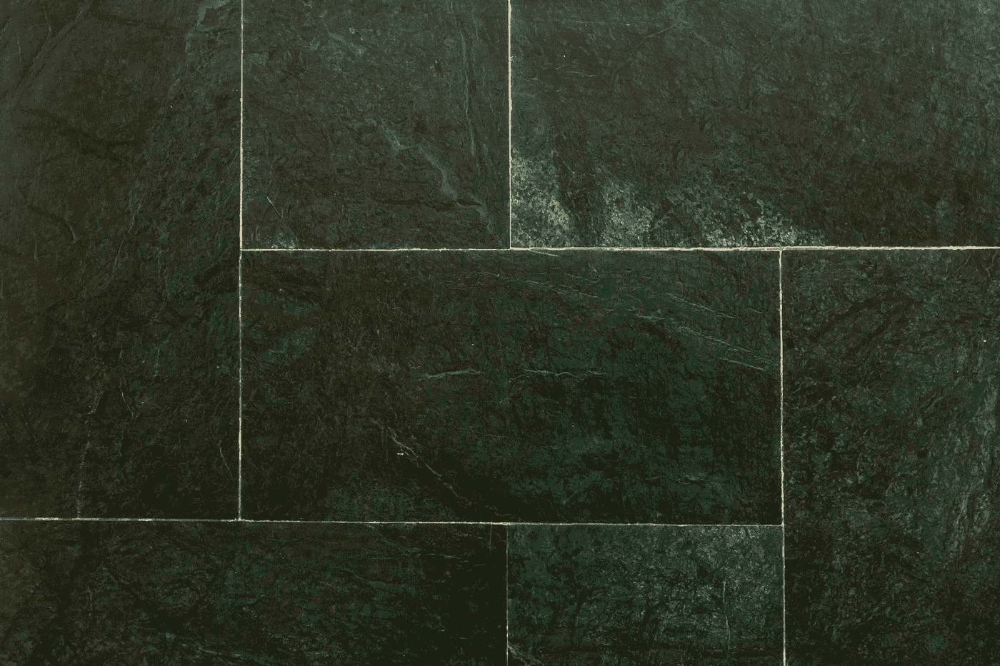
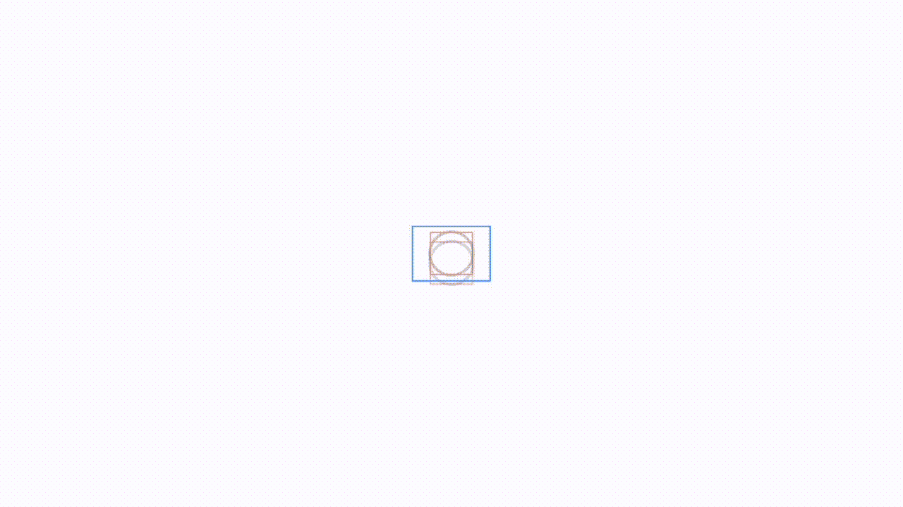
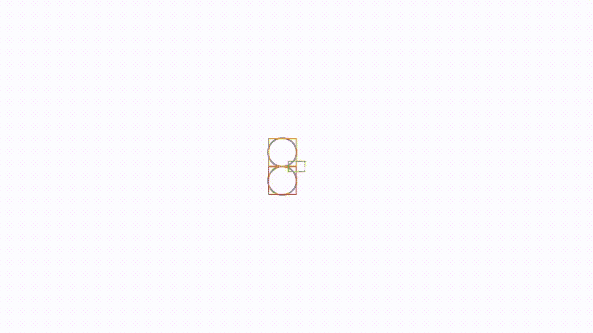
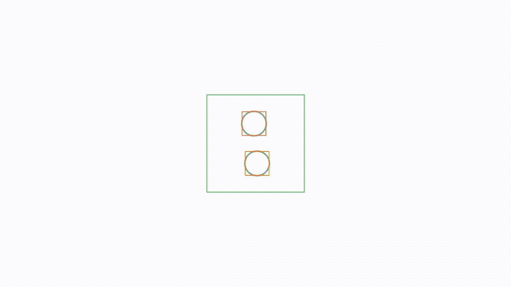

# SwiftUI 中带有对齐参考线的布局

> 原文：<https://betterprogramming.pub/layout-in-swiftui-with-alignment-guides-fef821e7e06e>

## 看看新的布局机制



在 [Unsplash](https://unsplash.com?utm_source=medium&utm_medium=referral) 上由 [Olga O](https://unsplash.com/@olga_o?utm_source=medium&utm_medium=referral) 拍摄的照片。

如果我必须说出 SwiftUI 开发中最初让我困惑的一个方面，那就是对齐指南。因此，我决定写这篇文章，试图揭开它们的神秘面纱，指出你如何与它们合作，并让它们为你工作。

SwiftUI 中的对齐参考线类似于 UIKit 中的约束。不，我收回那句话。它们是 SwiftUI 中的约束——只是它们不是微观管理你的屏幕，而是宏观管理它。如今，你需要对屏幕进行宏观管理，因为它们有各种形状和大小。然而，就像约束一样，对齐参考线并不总是那么容易使用。

首先，您需要理解 SwiftUI 中布局机制背后的语义。了解这一点的最好地方是[戴夫·亚伯拉罕和约翰·哈珀在 2019 年 WWDC 关于这一主题的演讲](https://developer.apple.com/videos/play/wwdc2019/237)。在书中，他们概述了布局的三条黄金法则:

*   家长为孩子建议一个尺码。
*   孩子用建议来决定自己的尺寸。
*   父母使用儿童选择尺寸来定位所述儿童。

"这和对齐参考线有什么关系？"你可能会问。绝对是一切。要在 SwiftUI 中布局/管理空间，可以使用容器(ZStack、VStack 和 HStack)。容器是上面语义中的父容器，容器将使用所述规则组织它们的兄弟容器。您可以使用对齐参考线来影响这些规则。但是等等，有一个障碍。通常，布局语义确保布局指南不起作用(至少对于框架来说是这样)。我知道这很疯狂，但这就是默认语义的工作方式。

让我们看一个例子。我在一个视图中添加了一个形状(一个圆)。代码如下:

太大了，不是吗？是那些布局语义在作怪。你看，你要了一个圆，没有给它一个尺寸，它尽可能的占了空间。不，我们需要一些规则。添加一个 ZStack 和一个框架。

更好，但你不想把它放在中间。您希望它位于顶部，所以您查看了文档，向框架添加了对齐参考线，然后重试。什么都没发生。

回到图片，看看红色的框架。圆点已经在它的顶端了。实际上，它也在底部，也在前沿和后沿。当然，你可以给它一个更大的框架，但这样你的圈子就会再次占据整个空间。这是一个第二十二条军规。

你需要的是两个框架。将第二个 ZStack 和一个框架添加到混音中，第二个框架上带有对齐参考线。

这是一个超级简单的原则，你可以应用它来让你选择的任何布局工作。你只需要开始考虑框架。苹果已经定义了九种你可能想要的最常见的布局。将您使用的对齐方式更改为状态变量，并查看您的选项。这里有一个动画 GIF 来说明这一点。当我们改变框架尺寸时，这个舞动的圆点围绕着框架对齐的所有选项。仔细观察，你会发现其中的规律。



SwiftUI 圆在变化的框架尺寸内对齐。

当我看着它变异时，感觉有点像那个著名的生命游戏。这是一个开始，但为项目中的每个对象定义框架和对齐参考线…不，我们需要更多。这是这个跳舞机器人背后的代码:

代码背后的跳舞点 GIF 显示。

# 自定义对齐

自定义对齐允许您相对于彼此布置视图。要定义它们，首先需要定义一些对齐 id。这是模板代码:

垂直对齐的代码如下所示:

这件作品最终将已经展示的两件作品联系在一起:

```
extension Alignment {
  static let theAlignment = Alignment(horizontal:   .theHorizontalAlignment, vertical: .theVerticalAlignment)
}
```

好了，现在我们将使用新的对齐 id 和`alignmentGuide`视图修改器来对齐帧内的两个视图。最终结果看起来像这样——几个跳舞的机器人:



围绕中心的两个视图的自定义对齐的 SwiftUI 动画。

我们在看什么？嗯，自定义对齐规定您需要从中心开始，然后添加相对于它和彼此的视图。因此，两个圆圈将保持居中，但随机围绕彼此的前缘/后缘、顶部/底部边缘跳舞。与另一个例子一样，我们正在改变它们所在的框架的大小，以帮助您理解正在发生的事情。注意，这里的对齐 ID 已经链接到堆栈`viewModifier`——而不是第一种情况中的框架。

创建这个夹具的代码如下所示:

舞动的双点背后的代码。

# 更多自定义视图

我们还没有完全完成。你看，还有第二个版本的`alignmentGroup`视图修改器，它不是基于如上所示的下标，而是基于计算值:

```
.alignmentGuide(.myHorizontalAlignment, computeValue: {d in viewW})
.alignmentGuide(.theVerticalAlignment, computeValue: {d in viewH})
```

所以你在上面一行看到的`viewW`的值是相对于它正在修改的视图的宽度的值，`viewH`的值是相对于正在修改的视图的高度的值。这里有一个动画 GIF，试图把这句话变成现实。在其中，我们改变了-64 和 96 之间的`viewW`和`viewH`对齐。在我们的例子中，圆的值的倍数是 32。



跳舞机器人在堆栈视图上使用 SwiftUI 对齐指南，而不是在帧上。

正如你所看到的，圆圈实际上在整个广场上随机地——疯狂地——移动。这里没有放置前导、尾随、顶部或底部。都是坐标。请注意，对齐修改器再次出现在堆栈和对齐视图修改器上。

自定义计算对齐方式背后的代码。

这让我想到了这篇文章的结尾。我希望在这个过程中，我成功地揭开了排列的神秘面纱。继续编码，保持冷静。