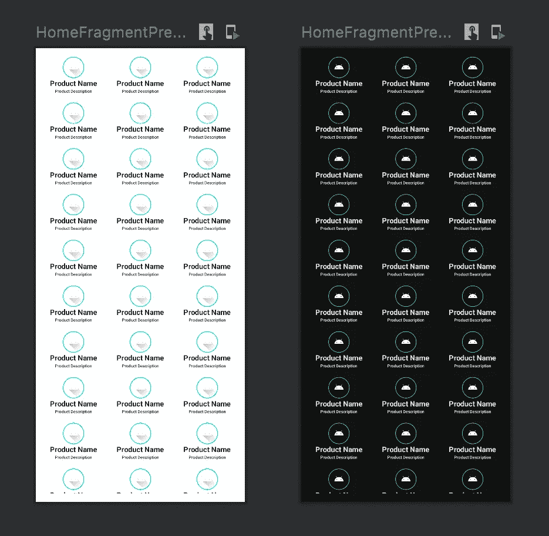
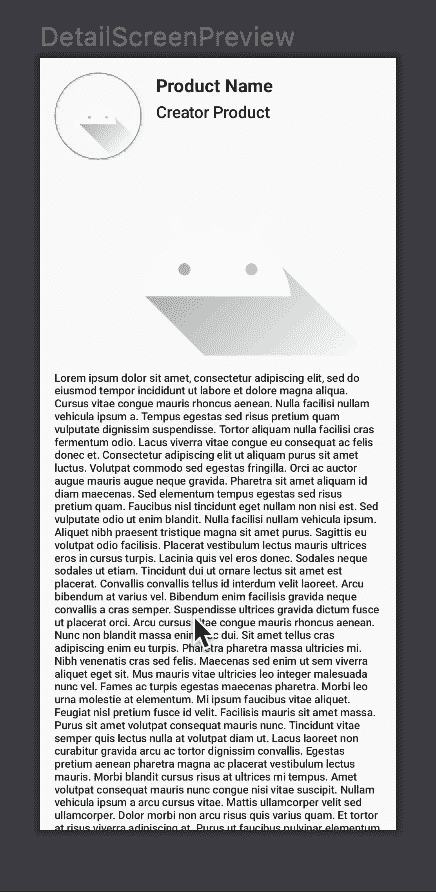
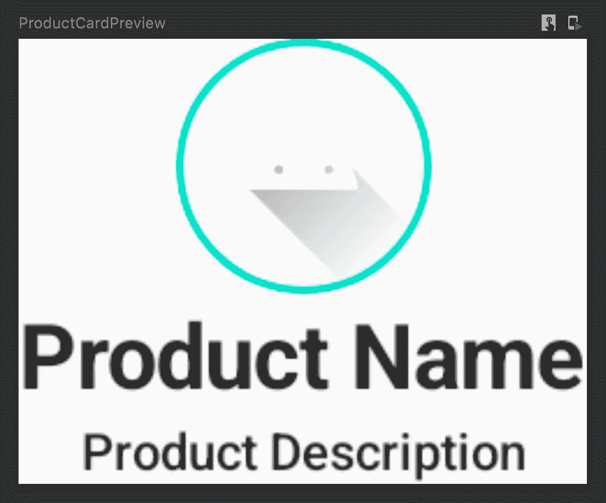
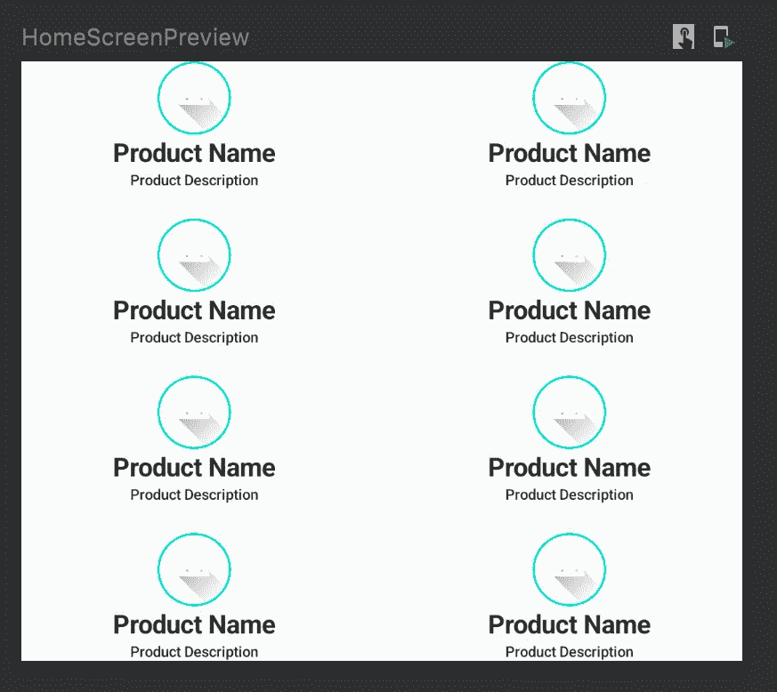
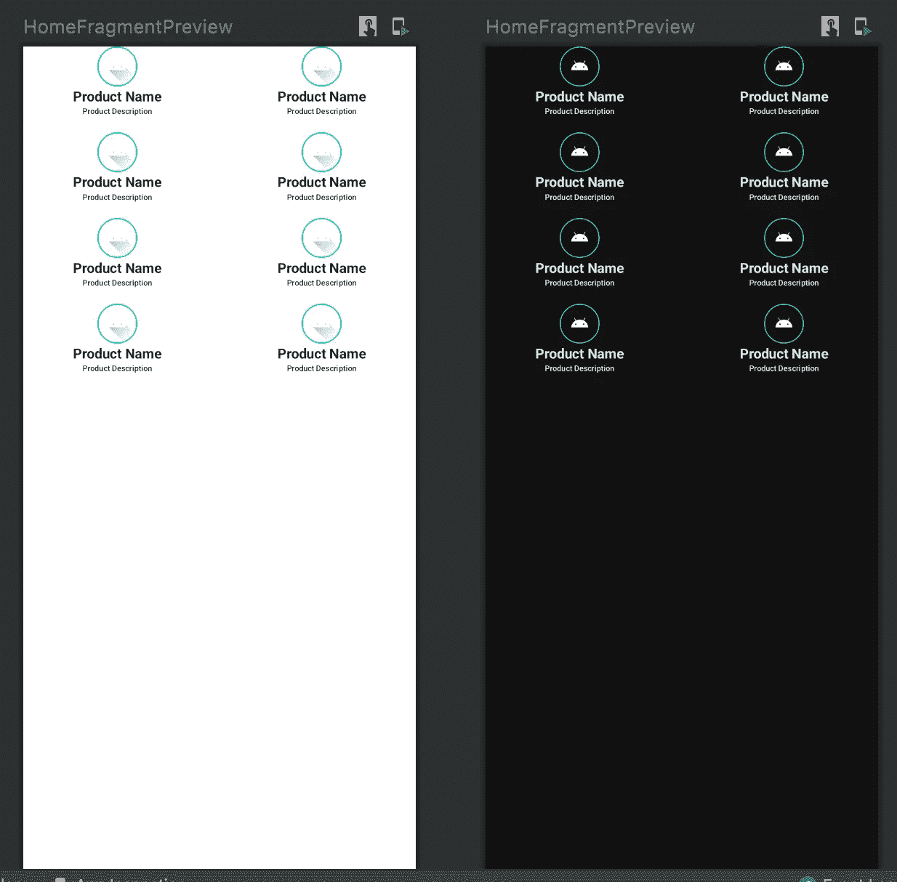
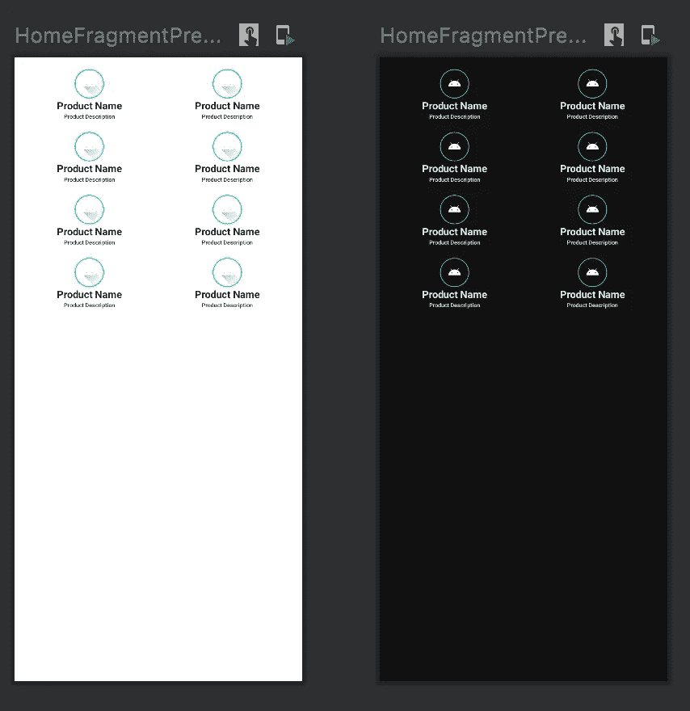
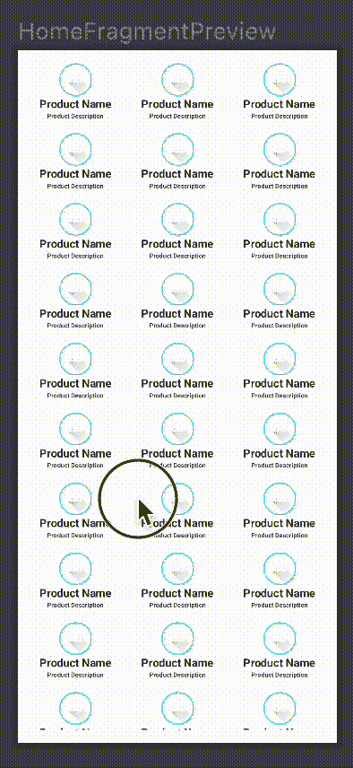
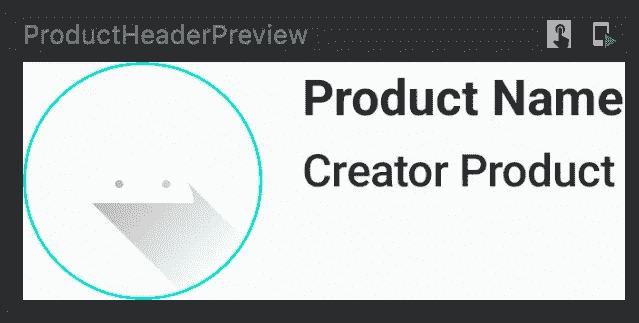
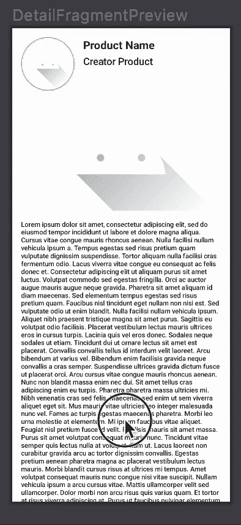

# Jetpack 撰写中的布局

> 原文：<https://betterprogramming.pub/layouting-in-jetpack-compose-8c16e687bfe5>

## 了解如何使用 Jetpack Compose 在 Android 中创建布局屏幕

照片由[川上正风](https://unsplash.com/@masakaze?utm_source=medium&utm_medium=referral)在 [Unsplash](https://unsplash.com?utm_source=medium&utm_medium=referral) 上拍摄

在 Jetpack Compose 出现之前，我们使用`LinearLayout`、`RelativeLayout`、`ConstraintLayout`在 XML 中定义我们的布局。那么我们如何在 Jetpack Compose 中应用呢？

从我的上一篇文章中，我们学习了 Jetpack Compose 的基础知识。在本文中，我们将学习如何使用 Jetpack Compose 创建布局。

# 我们开始吧

在本教程中，我们将尝试创建一个简单的应用程序。我们的应用程序将包括 2 页:

*   主页:一个页面包含可以无限滚动的产品列表。
*   详细页面:显示从主页点击的产品详细信息的页面。

我在我们的应用程序中的 UI 架构将是这样的。

现在，我们将忽略`ErrorScreen`和`LoadingScreen`，因为我们还没有解决如何为 Jetpack Compose 使用 API 的问题。以后我会报道的。

我们的主页看起来会像这样。

由此出发，我们可以将它们分成两个可组合的类:

*   `Product Card`，包含`Image`、`Text`为产品名称、`Text`为产品描述。
*   `Home Page`对于包含众多产品的卡片使用网格，这个类具有滚动能力来使布局滚动。

我们的详细页面看起来会像这样。

至于详细页面，我们可以将它们分成 3 个可组合的类:

*   `Product Header`，包含`Image`，`Text`为产品名称，`Text`为产品创建者。
*   `Product Image Carousel`，用于制作一个包含图像列表的旋转木马。
*   `Product Detail Page`，包含产品标题、产品图像转盘和使用`Text`的描述文本。

# 让我们从主页开始

现在让我们开始为`Product Card`创建一个类。我称之为`ProductCard.kt`。

将代码更改为:

在 Jetpack Compose 中，我们不使用`LinearLayout`，而是使用`Row`或`Column`来水平或垂直排列可组合的函数。

> Compose 可以有效地处理嵌套布局，这使它们成为设计复杂 UI 的一个好方法。这是对 Android 视图的改进，在 Android 视图中，出于性能原因，需要避免嵌套布局。

这样，我们可以很容易地在`ProductCard.kt`中安排可组合的功能。请记住，我们可以水平或垂直排列`Row`或`Column`的内容对齐方式。

在我的例子中，根据我的要求，我希望`Column`中的内容水平居中对齐。所以在`Column` *中我加了* `horizontalAlignment = Alignment.CenterHorizontally`。

现在，请记住在您创建的每个可组合函数中添加一个修饰符参数，以便让外部函数安排如何放置可组合函数。

这样，如果我调用这个函数，我可以修改`ProductCard.kt`中的`Column`修饰符。

现在，在`Column`中，我使用了两个可组合的函数。`Image`和`Text`。

该图像将调用可绘制资源中的`ic_launcher_foreground`。我们可以用边框的颜色、形状和粗细来修改大小、形状和边框。

对于`Text`，他们每个人都在使用文本，他们的最大行数，以及如果他们的文本行数达到最大值时如何处理他们的文本。我也修改他们的字体大小和字体粗细。

此外，我添加了`stringResource`以使它们引用资源文件中的`string.xml`。打开`string.xml`并添加这个。

结果应该是这样的。

现在`Product Card`准备实施了。

接下来，我们将实现主页。主页和屏幕在同一层。所以我们将为主页创建`HomeScreen.kt`。

打开`HomeScreen.kt`。像这样放置代码。

所以，在我解释我的代码之前，我必须提醒你，因为`HomeScreen.kt` 是一个可组合的函数，所以你必须在`HomeScreen.kt` *中添加一个参数修饰符。*

这将让引用`HomeScreen`的其他函数修改`HomeScreen`的修饰符。

在 Jetpack Compose 存在之前，我们使用`RecycleView`来启用滚动功能，并让`RecycleView`中的视图自行循环，这样即使视图很多，也能使我们的性能应用程序更快，使`RecycleView`适合在屏幕上包含列表视图。

在 Jetpack Compose 中，我们不使用`RecycleView`。我们用的是`LazyColumn`或者`LazyRow`。好处和`Recycleview`一样。区别在于`LazyColumn`和`LazyRow`是一个可组合函数，这使得它适合在其他可组合函数中实现。

对于需求，因为我想要一个可以垂直滚动的网格，所以我使用了`LazyVerticalGrid` *。*

在`LazyVerticalGrid`里面，我把网格做成了两列，纵向和横向都有一个空格。内容本身是我之前创建的 8 `ProductCard`。

结果应该是这样的。

现在基于我的架构，`HomeScreen.kt`被`HomeFragment.kt`调用。在`HomeFragment.kt`中，我声明了一个名为`Surface`的可组合函数。

有了这个功能，我可以在明暗模式下使用预览。

此外，我使用`modifier.fillMaxSize()`来表示它们的屏幕大小与设备大小的关系。`HomeFragment.kt` 中的结果应该是这样的。

也许我们可以给一点点的填充，我们将在`LazyVerticalGrid` 处`HomeScreen.kt`处添加填充:

在我们继续之前，让我们在`HomeFragment.kt`中添加一个参数修饰符，因为`HomeFragment`也是一个可组合的函数。

现在回到网格，记住我们总是可以通过改变单元格中的数字来修改我们有多少列网格。

事实上，我们在任何设备中都有不同的高度和重量。我们必须制作一个动态屏幕。由于现在列网格仍然是静态的，我们可以根据设备的重量大小将列网格的状态更改为动态。

这就是了。现在，如果我们增加或减少屏幕设备的重量大小，我们可以动态地调整列网格。

现在我只需增加`HomeScreen.kt`中的`ProductCard`计数项，比如说 60:

让我们来看看`HomeFragment.kt`中的预告:

让我们滚动它，点击交互模式或这个符号:

滚动时，我们的应用程序应该是这样的:

# 现在让我们继续详细页面

首先，我们将构建一个产品标题。创建`ProductHeader.kt` *，*并复制下面的代码。

现在你注意到有`ConstraintLayout`。它也是可组合函数的一部分。要使用`ContraintLayout`，只需将它添加到 composable 函数中即可。但是之后，你至少要把这些代码放在这里。

该功能作为用于`ContraintLayout` 目的的引用容器。将其视为可组合函数的 id。

我们只需创建一个名为`photoAvatar` *、*的引用，然后通过将它放置在修改器中将其应用到可组合函数，然后使用`linkTo` *来控制它。*

为了更好的解释`ConstraintLayout`，你可以参考[这里的](https://developer.android.com/jetpack/compose/layouts/constraintlayout)。

对于`R.string.product_creator_placeholder` *，*字符串内容为`Creator Product`。请随意在`string.xml`中添加此文本

现在预览应该是这样的。

接下来是`Product Image Carousel` *。*创建`ProductImageCarousel.kt`，复制下面的代码。

最终目标是制作图像轮播，所以我们利用这个优势，从`accompanist`库中放置`HorizontalPager` ，该库能够允许用户向左或向右翻转他们的内容。基本上，这是一个旋转木马能力。

关于传呼机和伴奏库的参考，可以参考下面。

 [## 向导伴奏者

### 为 Jetpack Compose 提供分页布局的库。如果你以前用过安卓的，它有类似的…

google.github.io](https://google.github.io/accompanist/pager/) 

`HorizontalPager` 目前还在实验中。也许在将来，会有一个稳定的 API。但是现在，我们将使用`@OptIn(ExperimentalPagerApi::class)`。

此外，将`HorizontalPager`中的状态放置为`val state = rememberPagerState()`，以记住`HorizontalPager`中跨组合的状态。

现在`Product Image Carousel`的预告应该是这样的。

现在，我们用`R.drawable.ic_launcher_foreground` 作为图像。

将来，这将改为图像的 url，而不是`painterResource`。关于*页面*和图片 URL 的更多信息，您可以参考[这里的](https://howtodoandroid.com/image-slider-jetpack-compose/)。

现在最后但并非最不重要的是，`Product Detail Page`。创建一个名为`DetailScreen.kt`的类。这将是`Product Detail Page`的页面。复制下面的代码。

我们使用`Column`来放置`ProductHeader`、`ProductImageCarousel`和`Text`包含相应的描述。由于我希望细节 pgae 具有滚动能力，我将使用`val scrollState = *rememberScrollState*()`并将其放在`Column`中，因为修改器中的垂直滚动功能只接收`scrollstate` 作为参数。

现在`string.xml` *，*中的`R.string.product_description_placeholder` 你可以随意使用长文或者短文。

现在我们要让`DetailFragment.kt`包含`DetailScreen.kt` 来完成*片段*的层次。

完成了。你应该在这里看到预览。

现在我们有了`Home Fragment`和`Detail Fragment`，每个都包含各自的屏幕。

# 结论

到目前为止，我们已经了解了很多关于 Jetpack Compose 中布局的知识。

你可以参考这个[链接](https://developer.android.com/jetpack/compose/layouts)来获得更多关于 Jetpack Compose 布局的信息。

你可以在我的 [GitHub 这里](https://github.com/SkyairOnline/Jetpack-Compose)查看我的代码的完整版本。

在下一篇文章中，我将讲述如何使用 Jetpack Compose 从`Home Fragment`导航到`Detail Fragment`。

你可以在这里看到我的下一篇文章。

 [## Jetpack 中的导航路线构成

### 如何在您的 Android 应用程序中找到目标片段

better 编程. pub](/navigation-routes-in-jetpack-compose-ce2e0337ed28)