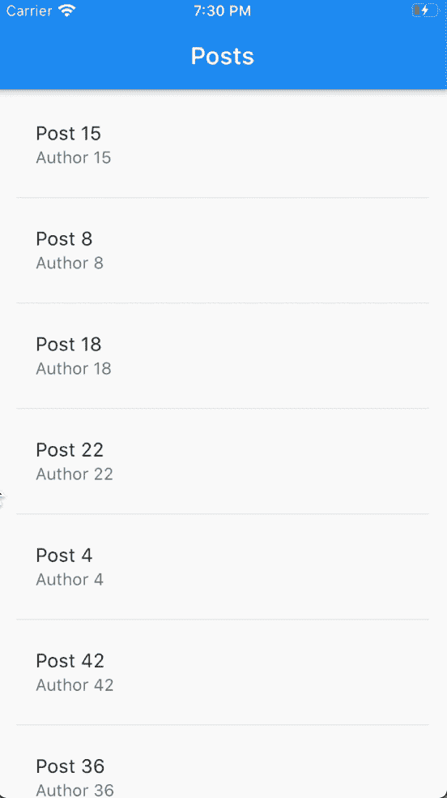

# 使用 Flutter 实时从 Firestore 惰性加载数据

> 原文：<https://betterprogramming.pub/lazy-loading-data-from-firestore-in-real-time-using-flutter-baa4157462fe>

## 通过 Firestore 分页，并实时接收更新


图片来源:作者

从数据库获取数据并显示在列表上是应用程序开发中非常常见的任务。在这样做的时候，一个经常被忽视的关键任务，尤其是新开发人员，是懒惰地加载数据以避免获取整个集合，使你的应用程序变慢并增加你的账单。

使用 Firestore 分页或延迟加载数据相对简单——前提是您只需一次获取文档。当您试图使用流来延迟加载数据以保持数据实时更新时，情况就完全不同了。

在本文中，我将教你一种使用 Bloc 模式实时从 Firestore 惰性加载数据的技术。如果你对 Bloc 模式一无所知，我建议你阅读他们的[文档](https://bloclibrary.dev/)来了解它是如何工作的。

# 我们正在建造的东西

我们将构建一个简单的应用程序，lazy 从 Firestore 集合中加载帖子，并在`ListView`上显示它们。



# 项目创建

首先创建一个新的颤振项目:

```
$ flutter create lazy_loading_demo$ cd lazy_loading_demo
```

将以下依赖项添加到您的`pubspec.yaml`:

```
firebase_core: ^0.5.0
cloud_firestore: ^0.14.0+2
flutter_bloc: ^6.0.5
equatable: ^1.2.5
```

接下来，转到 Firebase 控制台，创建一个新项目。创建项目后，启用 Firestore，并按照说明将其添加到您的应用程序中。

# 发布存储库

我们需要创建一个存储库，我们的 Bloc 可以用它从 Firestore 获取数据。创建一个名为`supplemental`的新文件夹，然后在里面创建`post_repository.dart`。添加以下代码:

清单 1

现在我们有了一个简单的存储库，可以用来获取数据。代码相对容易理解:`getPosts`返回包含`posts`集合的前 15 个文档的流。从集合中返回包含 15 个文档的流，从我们作为参数传递的文档之后开始。

我们创建了一个单独的存储库；然而，根据您的用例，您可能希望在您的应用程序中使用依赖注入或惰性单例。

# 发布模型

我们需要一个模型来表示从数据库中检索到的每个帖子。对于这个例子，下面的类将完成:

清单 2

创建一个名为`models/post.dart`的文件，并将其粘贴到前面的代码中。注意，我们扩展了`Equatable`，这样我们(和我们的块)可以比较`Post`的实例。

# 块实现

创建一个名为`data_bloc`的新目录。在那里，创建以下文件:

*   `data_bloc.dart`
*   `data_events.dart`
*   `data_state.dart`

让我们从为我们的块创建事件开始。在文件`data_events.dart`中，添加以下几行:

清单 3

这里，我们创建了一个扩展`Equatable`的基类，这样我们就可以比较我们的事件。现在我们有了事件所基于的类，让我们定义我们的块应该有哪些事件:

*   `DataEventStart`:用于配置我们的集团
*   `DataEventLoad`:用于通知 Bloc 新数据可用
*   `DataEventFetchMore`:用于在用完时获取更多数据

将以下几行添加到`data_events.dart`:

清单 3.1

现在，让我们定义我们的集团将发出的状态:

*   `DataStateLoading`:数据尚未加载时使用
*   `DataStateEmpty`:当我们提取的集合中没有文档时使用
*   `DataStateLoadSuccess`:成功拉取数据时使用，包含帖子列表

添加一个`DataLoadFailure`状态以在出错时发出可能是个好主意。试着自己去实现。

将以下代码添加到`data_state.dart`:

清单 4

这里，我们实现了之前定义的基类和状态。

现在是我们团结一致的时候了。将以下内容添加到`data_bloc.dart`:

清单 5

大部分代码非常简单。当块接收到`DataEventStart`时，它重置类变量并取消流订阅。然后，它通过从我们的`PostRepository`请求来创建第一个订阅，并让`handleStreamEvent`(我们接下来将实现这个方法)处理从流接收的事件。

当我们的块接收到一个`DataEventLoad`事件时，它首先展平帖子列表，然后检查它是否为空，并返回`DataStateLoadSuccess`或`DataStateEmpty`。

我们的最后一个事件`DataEventFetchMore`，从我们的`PostRepository`请求一个新的数据页面，并将流订阅添加到我们的订阅列表中。

现在我们已经完成了大部分的程序块，让我们来实现`handleStreamEvent`方法。将以下内容复制到您的块中:

方法比看起来简单。它有两个参数，一个是调用它的流(在`posts`列表中作为它的`index`传递)，另一个是从流接收的事件作为`QuerySnapshot`。

当被调用时，该方法首先检查收到的`QuerySnapshot`的长度。我们一次请求 15 个文档，所以如果我们得到的少于这个数量，这意味着我们已经到达集合的末尾。

然后检查它是否正在处理列表中最后一个订阅的事件，如果是这样，它将变量`lastDoc`设置为查询快照中的最后一个文档。

最后，它更新了`posts`列表并将`DataEventLoad`添加到我们的块中。

# 用户界面

既然我们有了一个延迟加载数据的机制，那么是时候创建一个 UI 来测试它了。用名为`lazy_list.dart`的文件为您的 UI 创建一个新目录。在那里，添加以下内容:

清单 6

UI 的实现非常简单。我们用一个`BlocBuilder`返回一个`Scaffold`，它处理 Bloc 可以发出的所有状态。

如果帖子加载成功，它返回一个`ListView`，如果`hasMoreItems`为`true`，它会有一个额外的条目。在列表生成器中，如果当前索引大于或等于后列表长度，它会将`DataEventFetchMore`添加到块中，同时显示一个`CircularProgressIndicator`。最后，我们关闭了`dispose()`方法上的程序块。

最后一件事，修改您的`main.dart`以包含下面的代码:

清单 7

在这里，我们只是初始化 Firebase 并将`LazyListScreen`设置为主屏幕。我们调用`WidgetsFlutterBinding.ensureInitialized()`，这样我们就可以在我们的主函数中调用 Firebase 核心插件。

# 结论

我们已经成功地实现了一个延迟加载列表。这是一个非常简单的实现，您可以在其上构建；在一个真实的应用程序中，您可能想使用`BlocProvider`将块注入到 UI 中，或者修改这个例子来满足您的需求。还可以采用不同的方法来实现这种行为——这里使用的方法是我能想到的最简单的方法。

# 资源

*   [扑火文件](https://firebase.flutter.dev/docs/overview)
*   [阻止库文档](https://bloclibrary.dev/#/gettingstarted)
*   [Firebase 文档](https://firebase.google.com/docs)
*   [该项目的源代码](https://github.com/sofferjacob/lazy-loading-demo)