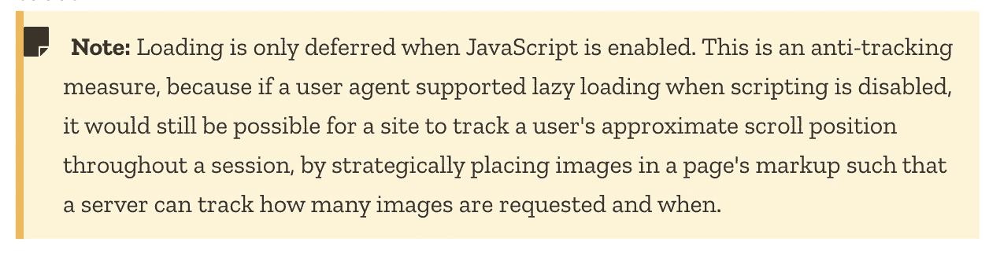
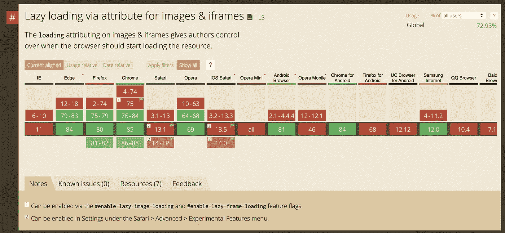
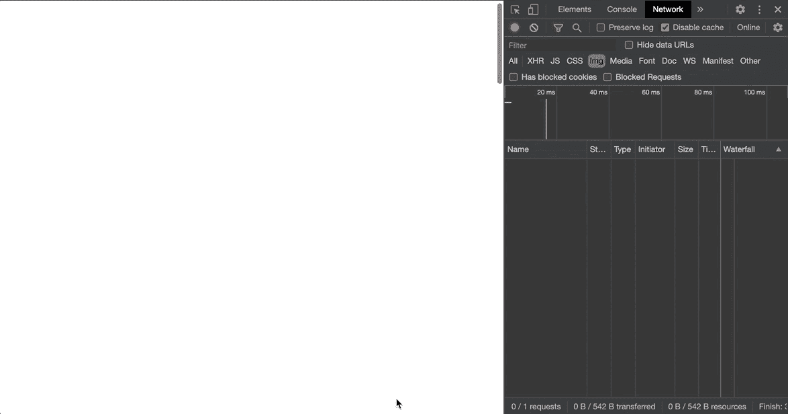

# JavaScript 使延迟加载图像变得容易

> 原文：<https://betterprogramming.pub/lazy-loading-images-made-easy-in-javascript-37b0ff91974c>

## 表演

## 用 3 行代码改进 Angular、React 或 Vue.js 应用程序中的图像加载

照片由 [Thong Vo](https://unsplash.com/@titi_wanderer?utm_source=medium&utm_medium=referral) 在 [Unsplash](https://unsplash.com?utm_source=medium&utm_medium=referral) 上拍摄

构建 web 应用程序时，我们总是在寻找最佳性能，以便不影响用户体验。

在所有提高网站性能的技术中，图像的延迟加载允许我们推迟图像检索。事实上，根据图像的尺寸、压缩和质量，它可能会影响用户设备下载的包的大小。因此，推迟这些下载有几个好处:

*   束尺寸减小
*   用户体验得到改善(捆绑包准备得更快)
*   受控的数据消耗(仅下载可见图像)

在本文中，我将引入一个 HTML 属性来延迟加载图像。为了更进一步，我将展示如何在具有三个主要 JavaScript 框架的更广泛的应用程序中使用该属性:Angular、React 和 Vue.js

# 的 HTML 属性

就这么简单:一个名为`loading`的单一属性。您可以在此处找到它的文档:

 [## 惰性装载

### 惰性加载是一种将资源识别为非阻塞(非关键)的策略，只在需要时加载这些资源。这是一个…

developer.mozilla.org](https://developer.mozilla.org/en-US/docs/Web/Performance/Lazy_loading#:~:text=The%20loading%20attribute%20on,element) 

`loading`属性接受三个值:

*   `eager`:立即加载图像
*   `lazy`:推迟图像的加载，直到滚动进度达到距视窗的[计算距离](https://web.dev/native-lazy-loading/#distance-from-viewport-thresholds)
*   `auto`:应用浏览器提供的默认行为

怎么用？就在下面:

## 警告

但是，使用该属性时要小心。事实上，文档解释说这个特性只有在启用 JavaScript 时才可用；否则，会导致跟踪问题:

[https://developer . Mozilla . org/en-US/docs/Web/HTML/Element/img # attr-loading](https://developer.mozilla.org/en-US/docs/Web/HTML/Element/img#attr-loading)

而且，这个特性标志并不是每个浏览器都启用的，甚至都不支持。幸运的是，[caniuse.com](https://caniuse.com/)非常得心应手:

[https://caniuse.com/#feat=loading-lazy-attr](https://caniuse.com/#feat=loading-lazy-attr)

由于特定或最早的浏览器不支持该属性，我们可以使用多填充:

 [## 制造商/加载-属性-聚合填充

### 快速、轻量级、无依赖性的普通 JavaScript polyfill，用于本地延迟加载/棒极了…

github.com](https://github.com/mfranzke/loading-attribute-polyfill) 

## 正在加载属性

来源:作者

# 在更大范围内使用加载属性

## 有角的

对于第一个版本，Angular 提供了一个强大的方法来处理解决方案中的每一个``行为:一个指令。

我不会抢

## [用 React 创建图像延迟加载组件](https://medium.com/u/b889ae02aa26#intersection-observer-for-the-win)

### [在网络世界中，我们经常有复杂的页面结构。起初，所有部件在用户视口中都不可见…](https://medium.com/u/b889ae02aa26#intersection-observer-for-the-win)

[slashgear.github.io](https://medium.com/u/b889ae02aa26#intersection-observer-for-the-win)

## vue . j

最后，Vue.js 也通过使用一个指令来遵循 Angular 的步骤。

尽管我在这里使用了 TypeScript，但这并不是强制性的。如您所见，我们只是检查`loading`属性是否可用(L6)。然后，如果支持，我们设置属性；否则，有必要使用[交叉点观察器 API](https://developer.mozilla.org/en-US/docs/Web/API/Intersection_Observer_API) 。

那么让我们全局注册该指令:

最后，我们可以使用带有`v-img-lazy`属性的指令`ImgLazyLoading`:

与 Angular 不同，我们不能在选择器上应用指令。因此，我们需要为每个``手动添加`v-img-lazy`。幸运的是，ide 具有“在整个解决方案中替换”的功能！

# 资源

 [## 惰性装载

### 惰性加载是一种将资源识别为非阻塞(非关键)的策略，只在需要时加载这些资源。这是一个…

developer.mozilla.org](https://developer.mozilla.org/en-US/docs/Web/Performance/Lazy_loading#:~:text=The%20loading%20attribute%20on,element)  [## 用两行代码惰性加载 Angular 中的图像

### 图像延迟加载延迟加载当前在视口中不可见的图像。这样的形象会…

netbasal.com](https://netbasal.com/lazy-load-images-in-angular-with-two-lines-of-code-beb13cd5a1c4)  [## 交叉点观察器 API

### 交叉点观察器 API 提供了一种异步观察目标元素交叉点变化的方法…

developer.mozilla.org](https://developer.mozilla.org/en-US/docs/Web/API/Intersection_Observer_API)  [## HTML 规范

### ← 2.4 常用 microsyntaxes 目录- 2.7 常用 DOM 接口→ 2.5.1 术语一个字符串是一个有效的…

html.spec.whatwg.org](https://html.spec.whatwg.org/multipage/urls-and-fetching.html#lazy-loading-attributes)