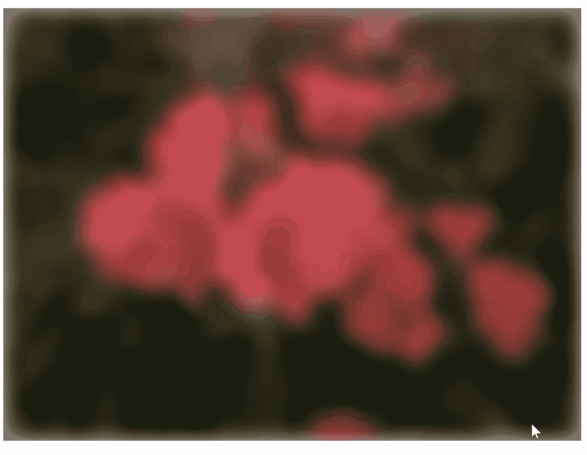
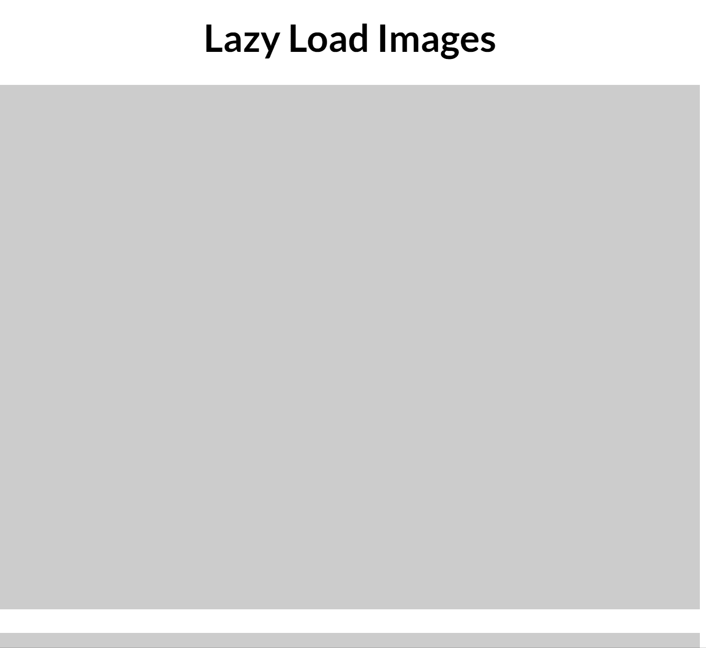
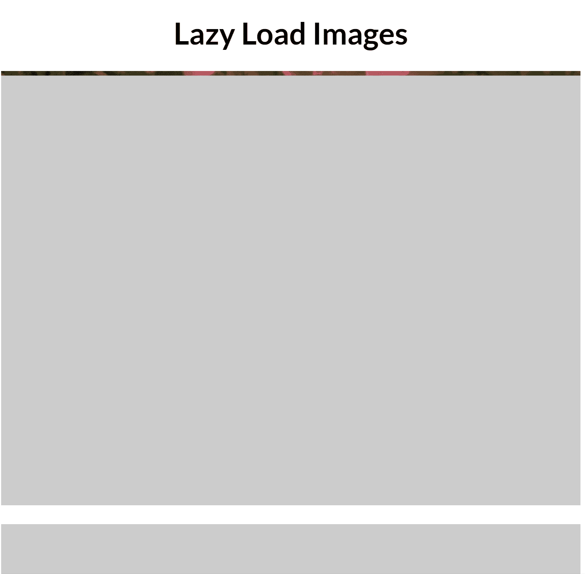
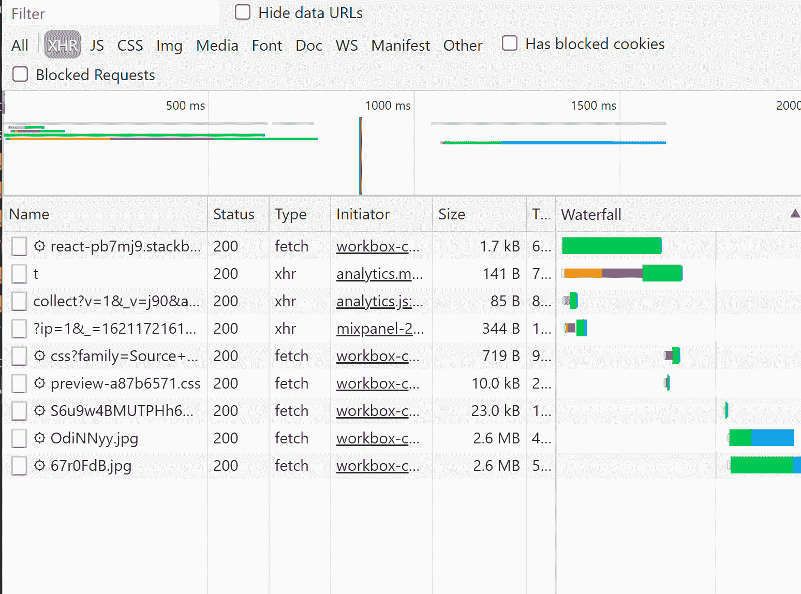
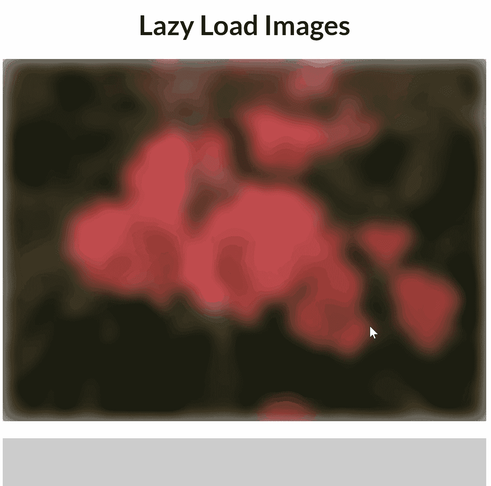

# React 中使用交叉点观察器延迟加载图像

> 原文：<https://betterprogramming.pub/lazy-loading-images-with-intersection-observer-in-react-ad6135f1ca59>

## 创建 Gatsby 图像样式自定义 React 组件

照片由 [Katarzyna Grabowska](https://unsplash.com/@kalljet?utm_source=medium&utm_medium=referral) 在 [Unsplash](https://unsplash.com?utm_source=medium&utm_medium=referral) 拍摄

惰性加载是一种常见的性能优化技术，几乎所有重资产网站都采用这种技术。我们经常会遇到这样的网页，加载一个模糊版本的图像，然后接着是一个高分辨率的图像。尽管加载内容的总时间很长，但这对用户体验有明显的影响。

整个互动过程分为三步:

*   在开始加载图像之前，等待内容进入视图。
*   一旦图像出现在视图中，就会加载一个带有模糊效果的轻量级缩略图，并发出对原始图像的资源获取请求。
*   一旦原始图像被完全加载，缩略图被隐藏，原始图像被显示。

如果您曾经使用过 Gatsby，那么您会遇到一个 **Gatsby Image** 组件，它为您做同样的事情。在本文中，我们将实现一个类似的组件，可以用作通用组件。尽管 Gatsby Image 不仅仅是模糊和加载图像，我们还是将重点放在简单的事情上:

# 让我们建造它。

构建整个系统的第一步是创建图像组件的布局。

这部分很简单。出于本文的目的，我们将动态迭代一组图像并呈现一个`ImageRenderer`组件。

下一步是在`ImageRenderer`组件中为我们的图像呈现占位符。

当我们使用指定的宽度渲染图像时，它们会根据长宽比(即原始图像的宽高比)调整图像的高度。

因为我们已经将原始图像的宽度和高度作为道具传递给了`ImageRenderer`组件，所以我们可以很容易地计算长宽比，并使用它来计算图像占位符的高度。这样做是为了当我们的图像最终加载时，我们的占位符不会再次更新它们的高度。

占位符的高度通过使用`padding-bottom` CSS 属性以百分比来设置。

当以百分比指定时，填充的大小按元素宽度的百分比计算。代码如下:

到目前为止，我们的应用程序如下所示:

图像占位符布局

# 利用路口观测器检测能见度

我们现在需要知道的是我们的图像容器何时进入视图。交叉点观察器是完成这项任务的完美工具。

> 交集观察器 API 提供了一种异步观察目标元素与祖先元素或顶层文档的[视口](https://developer.mozilla.org/en-US/docs/Glossary/Viewport)的交集变化的方法。
> 
> 交叉点观察器 API 允许您配置在发生以下任一情况时调用的回调:
> 
> **目标**元素与设备的视窗或指定元素相交。出于交叉点观察器 API 的目的，该指定元素被称为**根元素**或**根元素**。
> 
> 观察者第一次被要求观察一个目标元素。"

我们要做的是使用一个全局`IntersectionObserver`实例来观察我们所有的图像。我们还将保留一个侦听器回调映射，它将由单个图像组件添加，并将在图像进入视口时执行。

为了维护目标到监听器回调的映射，我们将使用 Javascript 中的`WeakMap` API。

> “`[WeakMap](https://developer.mozilla.org/en-US/docs/Web/JavaScript/Reference/Global_Objects/WeakMap)` 对象是键/值对的集合，其中键被弱引用。键必须是对象，值可以是任意值。

我们编写了一个定制的钩子来获取`IntersectionObserver`实例，将目标元素作为观察者添加到其中，并且还将一个监听器回调添加到映射中。

如果我们没有为 IntersectionObserver 指定任何根元素，则默认目标被认为是文档视口。

我们的`IntersectionObserver`回调从地图获取监听器回调，如果目标元素与视口相交，就执行它。然后它会移除观察点，因为我们只需要加载图像一次。

# 使用 intersect observer for image renderer 组件

在我们的`ImageRenderer`组件中，我们使用自定义钩子`useIntersection`并传递图像容器的 ref 和一个回调函数，该函数将为我们的图像设置可见性状态。代码如下:

一旦我们这样做了，我们的应用程序看起来像下面的例子:

当我们滚动图像时，网络请求看起来像下面的例子:

如你所见，我们的 IntersectionObserver 工作正常，我们的图像只有在进入视野时才被加载。此外，我们看到的是，当整个图像被加载时，会有一点延迟。

现在我们已经有了惰性加载特性，我们将进入最后一部分。

# 添加模糊效果

添加模糊效果是通过尝试加载除实际图像之外的低质量缩略图并向其添加`filter: blur(10px)`属性来实现的。当高质量图像完全加载后，我们隐藏缩略图并显示实际图像。代码如下:

HTML 中的`img`元素有一个`onLoad`属性，它接受一个在图像加载时触发的回调。我们利用这个属性为组件设置`isLoaded`状态，并隐藏缩略图，同时使用`opacity` CSS 属性显示实际图像。

具有模糊效果的最终惰性加载图像

懒人加载图片的游乐场

# 结论

所以我们有了它:我们的定制`ImageRenderer`组件，当图像进入视图时加载图像，并显示模糊效果以提供更好的用户体验。

我希望你喜欢这篇文章。你可以在我的 [GitHub 仓库找到完整的代码。](https://github.com/mayankshubham/react-lazy-loading-image)

请关注我的更多与 web 开发相关的小技巧和窍门。

## 感谢您的阅读！